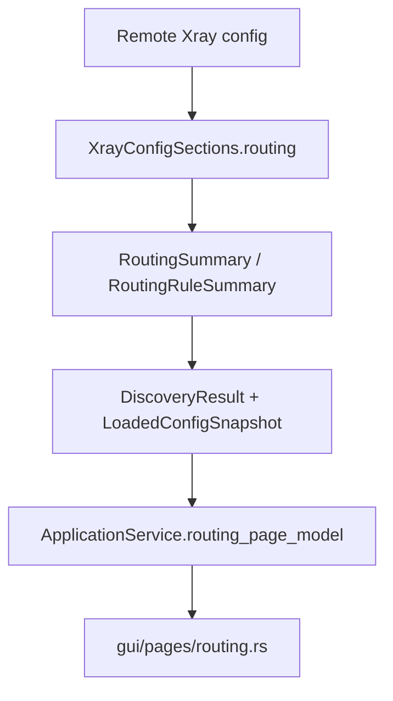
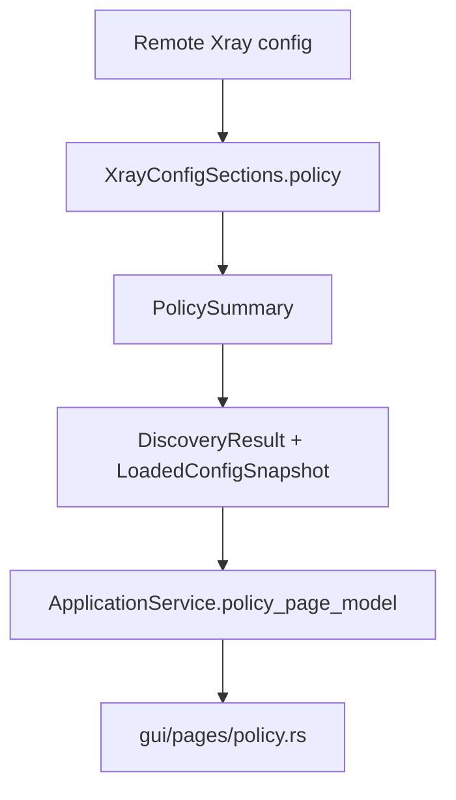
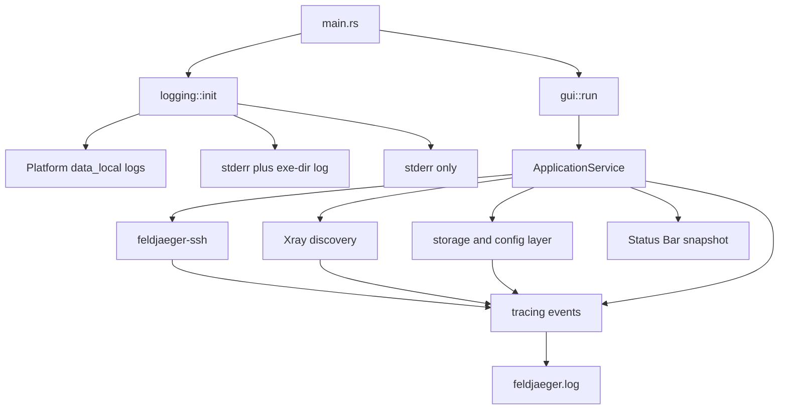
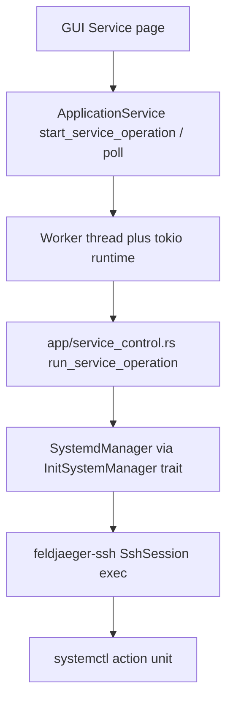
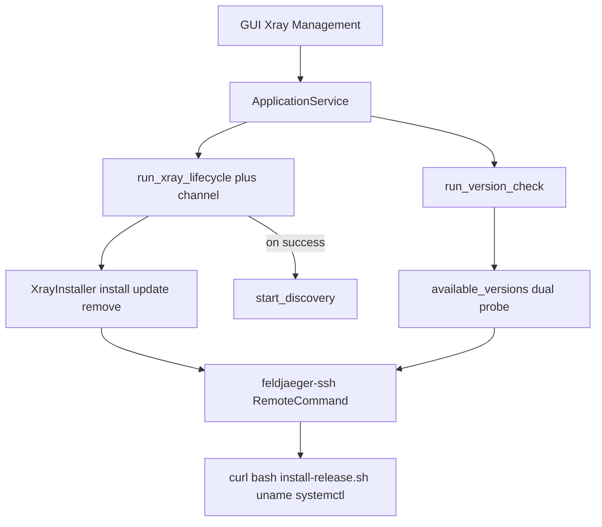

# 1	Manifest Feldjaeger

## 1.1	Архитектура Feldjaeger
| gui/                                     | Desktop UI                    | ← без raw SSH, без systemd       |
| :--------------------------------------- | :---------------------------- | :------------------------------- |
| <!-- obsidian --><p>&nbsp;app/&nbsp;</p> | ApplicationService            | ←  фасад для GUI                 |
| xray/                                    | remote                        | ← Xray-логика / файлы на сервере |
| ssh/                                     | SshBackend trait              | ← транспорт, без Xray-семантики  |
| init/                                    | InitSystemManager&nbsp;&nbsp; | ← управление сервисами           |
| domain/                                  | Общие типы                    |                                  |
| error/                                   | AppError / AppResult          |                                  |
Поток данных: GUI → ApplicationService → RemoteAdmin / XrayManager → SshBackend + InitSystemManager.

## 1.2	 Структура Feldjaeger
```
Feldjaeger/
├── Cargo.toml
├── rules.md
├── README.md
├── LICENSE
└── src/
    ├── main.rs <- точка входа desktop-приложения
    ├── lib.rs <- корень библиотеки, экспорт модулей
    ├── error.rs
    ├── domain/
    │   ├── mod.rs
    │   ├── connection.rs <- ConnectionProfile, AuthMethod
    │   └── path.rs <- RemotePath
    ├── ssh/
    │   ├── mod.rs
    │   ├── backend.rs <- trait SshBackend
    │   ├── session.rs <- SshSession
    │   └── russh.rs <- RusshBackend (заготовка MVP)
    ├── init/
    │   ├── mod.rs
    │   ├── manager.rs <- trait InitSystemManager, ServiceState
    │   └── systemd.rs <- SystemdManager (единственный MVP-бэкенд)
    ├── remote/
    │   ├── mod.rs
    │   ├── admin.rs <- RemoteAdmin
    │   └── backup.rs <- ConfigBackup
    ├──  <-/
    │   ├── mod.rs
    │   ├── config.rs <- XrayConfig
    │   ├── validator.rs <- trait ConfigValidator, DefaultConfigValidator
    │   └── manager.rs <- XrayManager
    ├──  <-/
    │   ├── mod.rs
    │   └── service.rs <- ApplicationService
    └── gui/
        ├── mod.rs
        └── application.rs <- GuiApplication
```

## 1.3	Назначение модулей
| Модуль               | Назначение                                                                              |
| -------------------- | --------------------------------------------------------------------------------------- |
| `main.rs`            | Минимальная точка входа; создаёт `GuiApplication`.                                      |
| `lib.rs`             | Корень crate, документирует слои и реэкспортирует модули.                               |
| `error`              | `AppError` и `AppResult<T>` — единый тип ошибок без panic для ожидаемых сбоев.          |
| `domain`             | Общие value-типы, не привязанные к конкретному слою.                                    |
| `domain::connection` | `ConnectionProfile`, `AuthMethod` — параметры SSH-подключения.                          |
| `domain::path`       | `RemotePath` — валидируемый абсолютный путь на удалённом сервере.                       |
| `ssh`                | Транспортный слой; не знает о Xray.                                                     |
| `ssh::backend`       | Trait `SshBackend` — connect, read/write файлов, exec с явными аргументами (без shell). |
| `ssh::session`       | `SshSession` — handle активной SSH-сессии.                                              |
| `ssh::russh`         | `RusshBackend` — заготовка MVP-реализации через Russh (без зависимости пока).           |
| `init`               | Абстракция init-систем; весь контроль сервисов идёт через неё.                          |
| `init::manager`      | Trait `InitSystemManager`, enum `ServiceState`.                                         |
| `init::systemd`      | `SystemdManager` — единственная реализация в MVP.                                       |
| `remote`             | Высокоуровневые удалённые операции (чтение/запись конфигов, бэкап).                     |
| `remote::admin`      | `RemoteAdmin` — фасад над SSH; GUI не вызывает SSH напрямую.                            |
| `remote::backup`     | `ConfigBackup` — метаданные бэкапа перед перезаписью конфига.                           |
| `xray`               | Xray-специфичная логика; использует `init` и `remote`, не russh API.                    |
| `xray::config`       | `XrayConfig` — in-memory представление; неизвестные секции сохраняются.                 |
| `xray::validator`    | `ConfigValidator` — валидация перед restart.                                            |
| `xray::manager`      | `XrayManager` — оркестрация: backup → validate → write → restart.                       |
| `app`                | Сборка всех подсистем в единый фасад.                                                   |
| `app::service`       | `ApplicationService` — единственная точка доступа для GUI.                              |
| `gui`                | Desktop UI; без systemd-логики и raw SSH.                                               |
| `gui::application`   | `GuiApplication` — владеет `ApplicationService`, место для UI-фреймворка.               |

## 1.4	Соответствие rules.md
> Соответствие rules.md
> SSH абстрагирован за SshBackend; Xray и GUI не зависят от russh API.
> Управление сервисами только через InitSystemManager; MVP — SystemdManager.
> GUI не выполняет raw SSH и не содержит systemd-логику.
> Заготовки для backup (ConfigBackup), validation (ConfigValidator) и сохранения неизвестных секций (XrayConfig).
> Все публичные struct/enum имеют rustdoc.
> Cargo.toml: edition 2024, GPL-3.0-or-later, без неиспользуемых зависимостей.


# 2	Реализация модуля SSH

## 2.1	Структура модуля SSH
```
Feldjaeger/
├── Cargo.toml <- workspace: feldjaeger + feldjaeger-ssh
├── feldjaeger-ssh/ <- независимая SSH-библиотека
│   ├── Cargo.toml
│   └── src/
│       ├── lib.rs
│       ├── error.rs
│       ├── connection.rs
│       ├── path.rs
│       ├── command.rs
│       ├── exec.rs
│       ├── session.rs
│       └── backend.rs
└── src/ <- основной crate (без src/ssh/, без domain/)
```

## 2.2	Модели данных
| Тип                            | Назначение                                           |
| ------------------------------ | ---------------------------------------------------- |
| `ConnectionProfile`            | Хост, порт, username — без секретов                  |
| `AuthCredentials`              | Пароль или путь к ключу; `Debug` редактирует секреты |
| `AuthMethod`                   | Тип аутентификации                                   |
| `ConnectRequest`               | Профиль + credentials для подключения                |
| `RemotePath`                   | Абсолютный путь с базовой валидацией                 |
| `RemoteCommand`                | Программа + явные аргументы (без shell)              |
| `ExecResult`                   | stdout, stderr, exit code                            |
| `SessionInfo` / `SessionState` | Метаданные сессии                                    |
| `SshError` / `SshResult<T>`    | Ошибки SSH-слоя                                      |

## 2.3	Интерфейсы
```rust
pub trait SshBackend: Send + Sync {
    type Session: SshSession;
    fn connect(&self, request: &ConnectRequest)
        -> impl Future<Output = SshResult<Self::Session>> + Send;
}

pub trait SshSession: Send {
    fn profile(&self) -> &ConnectionProfile;
    fn read_file(&self, path: &RemotePath) -> impl Future<...> + Send;
    fn write_file(&self, path: &RemotePath, contents: &[u8]) -> impl Future<...> + Send;
    fn exec(&self, command: &RemoteCommand) -> impl Future<...> + Send;
    fn disconnect(self) -> impl Future<...> + Send;
}
```

Трейты async-ready (под будущие `tokio` + `russh`), без внешних зависимостей.

## 2.4	Соответствие rules.md
> SSH не знает о Xray — отдельный crate без ссылок на остальной проект
> Абстракция за SshBackend / SshSession, не за russh API
> Секреты не попадают в логи через Debug у AuthCredentials
> Команды через RemoteCommand, без shell-интерполяции
> Валидация RemotePath перед операциями
> Заглушка RusshBackend удалена — реализация будет позже

## 2.5	Изменения
Изменения в основном crate
- Удалены `src/ssh/` и `src/domain/` (типы перенесены в `feldjaeger-ssh`)
- `feldjaeger` зависит от `feldjaeger-ssh` и реэкспортирует crate
- `remote/` использует `feldjaeger_ssh::RemotePath` и `SshSession`

Сборка workspace проходит успешно. Следующий шаг — реализация Russh-бэкенда в отдельном модуле `feldjaeger-ssh`.


# 3	Парсер конфигурации Xray

## 3.1	Добавлено
 `XrayConfigParser` (`src/xray/parser.rs`)
 
| Метод                   | Назначение           |
| ----------------------- | -------------------- |
| `parse_str(&str)`       | Парсинг UTF-8 JSON   |
| `parse_bytes(&[u8])`    | Парсинг байтов       |
| `to_json(&XrayConfig)`  | Сериализация в JSON  |
| `to_bytes(&XrayConfig)` | Сериализация в байты |
 `XrayConfig` (`src/xray/config.rs`)
- 14 известных top-level секций Xray (`log`, `inbounds`, `outbounds`, `burstObservatory`, …)
- `extra: BTreeMap<String, Value>` — неизвестные top-level ключи
- Секции хранятся как `serde_json::Value` — вложенные неизвестные поля сохраняются без потерь

## 3.2	Тестовые JSON (`tests/fixtures/xray/`)
| Файл                         | Сценарий                                   |
| ---------------------------- | ------------------------------------------ |
| `minimal.json`               | Базовый конфиг                             |
| `with_unknown_sections.json` | Неизвестные top-level секции               |
| `full_sample.json`           | Полный конфиг + вложенные неизвестные поля |
| `invalid.json`               | Битый JSON                                 |

## 3.3	Зависимости
```rust
serde = { version = "1", features = ["derive"] }
serde_json = "1"
```

## 3.4	Соответствие rules.md
> Unknown sections preserved — top-level → `extra`, nested → через `Value`
> Reading broader than writing — парсер принимает все секции; редактирование будет позже
> Result, no panic — ошибки через `AppResult` / `AppError`
> rustdoc — на всех публичных типах

## 3.5	Тесты (7/7)
- Парсинг минимального конфига
- Сохранение неизвестных top-level секций
- Сохранение вложенных полей (`unknownClientField` в `inbounds`)
- Round-trip без потери данных
- Отклонение невалидного JSON и корня-массива

Пример использования:

```rust
let parser = XrayConfigParser::new();
let config = parser.parse_str(&json)?;
let restored = parser.to_json(&config)?;
```


# 4	Модуль резервного копирования

## 4.1	Компоненты
`BackupManager` (`src/remote/backup_manager.rs`)

| Метод                                      | Назначение                                       |
| ------------------------------------------ | ------------------------------------------------ |
| `create_backup(session, original_path)`    | Читает оригинал, записывает копию по новому пути |
| `restore_backup(session, backup)`          | Восстанавливает оригинал из бэкапа               |
| `resolve_backup_path(original, timestamp)` | Вычисляет путь бэкапа без I/O                    |
  `BackupManagerOptions`
- `backup_dir: Option<RemotePath>` — опциональная директория для бэкапов
- По умолчанию бэкап создаётся рядом с оригиналом:
    `/etc/xray/config.json` → `/etc/xray/config.json.feldjaeger.bak.{unix_ts}`
- С `backup_dir` используется только basename:
    `/var/backups/feldjaeger/config.json.feldjaeger.bak.{unix_ts}`
`ConfigBackup` (расширен)

Добавлены поля `created_at_unix` и `size_bytes` для проверки при restore.

## 4.2	Алгоритм бэкапа
```rust
read_file(original) → write_file(backup_path, bytes)
```

Без `cp`, `ssh` CLI и shell-интерполяции — только прямое чтение/запись через `SshSession`.

## 4.3	Соответствие rules.md
> Always backup before overwriting — `create_backup` вызывается до записи
> Reversible changes — `restore_backup` откатывает конфиг
> Validate remote paths — через `RemotePath` и проверку basename
> Log SSH operations — `log::info!` / `log::warn!` (без содержимого файлов и секретов)
> Result, no panic — все ошибки через `AppResult`

## 4.4	Зависимости
```rust
log = "0.4"                              # runtime
tokio = { version = "1", features = ["rt", "macros"] }  # dev, для async-тестов
```

## 4.5	Тесты (6 новых, 13/13 всего)
- Разрешение пути (рядом с оригиналом / в `backup_dir`)
- Создание бэкапа через mock `SshSession`
- Restore после модификации
- Ошибка при отсутствии оригинала
- Ошибка при несовпадении размера бэкапа
Пример использования:

```rust
let manager = BackupManager::new();
let backup = manager.create_backup(&session, &config_path).await?;
// ... modify and write config ...
manager.restore_backup(&session, &backup).await?; // rollback
```


# 5	Взаимодействие с системой инициализации

## 5.1	Архитектура
```
GUI / XrayManager
       ↓
InitSystemManager (trait)
       ↓
SystemdManager → SSH session → systemctl <subcommand> <unit>
```

## 5.2	InitSystemManager (async)
| Метод                            | Действие              |
| -------------------------------- | --------------------- |
| `service_state(session, name)`   | `systemctl is-active` |
| `start_service(session, name)`   | `systemctl start`     |
| `stop_service(session, name)`    | `systemctl stop`      |
| `restart_service(session, name)` | `systemctl restart`   |
Все операции выполняются на удалённом хосте через `SshSession::exec` с явными аргументами — без shell.

## 5.3	`SystemdManager`
- Вызывает `systemctl` как отдельную программу с аргументами через `RemoteCommand`
- Парсит `is-active`: `active`/`activating` → `Running`, `inactive`/`deactivating` → `Stopped`
- При ненулевом exit code lifecycle-операций возвращает ошибку со stderr
- Логирует операции через `log` (хост, user, service — без секретов)

## 5.4	ServiceName — валидация
Имена сервисов проверяются до передачи в `systemctl`:
- только `[a-zA-Z0-9._@-]`
- без пробелов, `/`, `\`, shell-метасимволов

## 5.5	Соответствие rules.md
> Весь контроль сервисов через InitSystemManager
> MVP — только SystemdManager
> Без shell-интерполяции — прямая передача аргументов
> Result, без panic
> rustdoc на всех публичных типах

## 5.6	Тесты (8 новых, 21/21)
- `active` / `inactive` state
- Вызов `systemctl start` с корректными аргументами
- Ошибка при сбое `restart`
- Отклонение небезопасного имени сервиса
- Валидация имён в `service_name`
Пример:

```rust
let init = SystemdManager::new();
let state = init.service_state(&session, "xray").await?;
init.restart_service(&session, "xray").await?;
```


# 6	Russh-клиент

## 6.1	Структура
feldjaeger-ssh/src/russh/  
├── mod.rs  
├── client.rs <- RusshClient + RusshClientOptions (SshBackend)  
├── session.rs <- RusshSession (SshSession)  
├── handler.rs <- ClientHandler + проверка host key  
├── host_key.rs <- HostKeyPolicy  
├── exec.rs <- сборка и выполнение remote command  
└── sftp.rs <- read/write через SFTP  

## 6.2	API
| Тип                             | Назначение                                          |
| ------------------------------- | --------------------------------------------------- |
| `RusshClient`                   | Реализует `SshBackend::connect()`                   |
| `RusshSession`                  | Реализует `SshSession` (read/write/exec/disconnect) |
| `RusshClientOptions`            | Политика host key                                   |
| `HostKeyPolicy::KnownHostsFile` | Проверка по `~/.ssh/known_hosts` (по умолчанию)     |
| `HostKeyPolicy::AcceptAny`      | Только для dev/test                                 |

## 6.3	Операции
| Операция                   | Механизм                                                |
| -------------------------- | ------------------------------------------------------- |
| Подключение                | `russh::client::connect` + password / private key       |
| `read_file` / `write_file` | SFTP subsystem (`russh-sftp`)                           |
| `exec`                     | SSH exec channel, program + args без shell-метасимволов |
| `disconnect`               | `systemctl disconnect`                                  |

## 6.4	Соответствие rules.md
> SSH абстрагирован за SshBackend / SshSession — russh не экспортируется в Xray/GUI
> Пароли и ключи не пишутся в логи (Debug у credentials + логи без секретов)
> Каждая SSH-операция логируется через log
> Без shell-интерполяции: валидация аргументов exec
> Result, без panic
> Зависимости Apache-2.0 — совместимы с GPL-3.0
> russh с feature ring (без aws-lc-rs/NASM на Windows)

## 6.5	Зависимости (feldjaeger-ssh/Cargo.toml)
```rust
russh = { version = "0.62", default-features = false, features = ["ring", "flate2", "rsa"] }
russh-sftp = "2.3"
tokio = { version = "1", features = ["io-util", "net", "rt", "sync"] }
log = "0.4"
```

## 6.6	Пример
```rust
use feldjaeger_ssh::{
    ConnectRequest, ConnectionProfile, AuthCredentials,
    HostKeyPolicy, RusshClient, RusshClientOptions, SshBackend,
};

let client = RusshClient::with_options(RusshClientOptions {
    host_key_policy: HostKeyPolicy::AcceptAny, // dev only
    ..Default::default()
});

let request = ConnectRequest::new(
    ConnectionProfile::new("server.example", 22, "admin"),
    AuthCredentials::Password("secret".into()),
);

let session = client.connect(&request).await?;
let data = session.read_file(&path).await?;
```

## 6.7	Тесты
3 unit-теста в feldjaeger-ssh + 21 тест в workspace — все проходят.


# 7	Skeleton GUI

## 7.1	Итоговая структура GUI
```
src/gui/
    mod.rs              # публичный API: FeldjaegerApp, run()
    app.rs              # eframe::App, layout, владение ApplicationService
    navigation.rs       # enum Page, централизованный роутинг
    sidebar.rs          # постоянная левая панель навигации
    pages/
        mod.rs
        dashboard.rs
        connection.rs
        inbounds.rs     # General | Protocol | Stream | Security | Sniffing | Users (§34; users.rs — вкладка)
        users.rs
        outbounds.rs
        dns.rs
        fakedns.rs
        routing.rs
        policy.rs
        observatory.rs
        burst_observatory.rs
        log_settings.rs
        logs.rs
        service.rs
        xray_management.rs
        geodata.rs
        warp.rs
        settings.rs
```

`src/main.rs` вызывает `feldjaeger::gui::run()`.
> Актуально (sidebar): Users не пункт меню — см. §32–§34. Полный список страниц — `Page::ALL` в `navigation.rs`.

## 7.2	Архитектура навигации
Навигация сосредоточена в `Page` (`navigation.rs`):
- `Page::ALL` — порядок пунктов в sidebar
- `Page::label()` — подписи для меню
- `Page::show(ui)` — единственный match, делегирующий в модуль страницы
`FeldjaegerApp::update()` только компонует layout:

```rust
fn update(&mut self, ctx: &egui::Context, _frame: &mut eframe::Frame) {
    egui::SidePanel::left("sidebar")
        .resizable(true)
        .default_width(180.0)
        .show(ctx, |ui| sidebar::show(ui, &mut self.page));

    egui::CentralPanel::default().show(ctx, |ui| {
        self.page.show(ui);
    });
}
```

Каждая страница — отдельный модуль с `pub fn show(ui: &mut Ui)`. Общий текст-заглушка вынесен в `pages::placeholder()`, без дублирования.

## 7.3	Взаимодействие с `ApplicationService` в будущем
Сейчас `FeldjaegerApp` владеет `ApplicationService`, но не вызывает его методы — страницы показывают только placeholder.
На следующих этапах:
1. Действия пользователя (кнопки, формы) → методы `ApplicationService`, не SSH/Xray/systemd напрямую.
2. Отображение состояния — страницы получат `&ApplicationService` или узкий контекст (`GuiContext`) с данными для UI.
3. Асинхронные операции (SSH, restart) — результаты через канал/poll в `update()`, с индикатором прогресса по `ui.md`.
4. Граница слоёв — в `gui/` нет импортов `remote`, `xray`, `init`, `feldjaeger_ssh` (проверено).

## 7.4	Принятые архитектурные решения
| Решение                                      | Обоснование                                       |
| -------------------------------------------- | ------------------------------------------------- |
| egui + eframe 0.31                           | Требование ТЗ; GPL-совместимо                     |
| `FeldjaegerApp` владеет `ApplicationService` | Готовая точка интеграции с бизнес-слоем           |
| `Page` enum + `Page::show()`                 | Централизованная навигация без match в `update()` |
| Страница = модуль + `show()`                 | Независимое развитие экранов                      |
| Sidebar всегда слева, resizable              | `ui.md`: always visible, один уровень             |
| Placeholder без фейковой логики              | Соответствие этапу «только архитектура»           |
| Минималистичный стиль, без иконок/анимаций   | Требование этапа                                  |
| `run()` возвращает `eframe::Result`          | Без `unwrap()` на путях запуска                   |
| rustdoc на публичных типах                   | `rules.md`                                        |

## 7.5	Добавленные зависимости Cargo
| Зависимость | Версия | Назначение                                                                       |
| ----------- | ------ | -------------------------------------------------------------------------------- |
| eframe      | 0.31   | Окно, event loop, `NativeOptions`, trait `App`, backend (winit + glow/wgpu)      |
| egui        | 0.31   | Виджеты, `Ui`, `SidePanel`/`CentralPanel` — явный импорт в модулях pages/sidebar |
Остальные зависимости (winit, glow, accesskit и т.д.) подтягиваются транзитивно через eframe.


# 8	Добавление Status Bar
Status Bar добавлен. Сборка и clippy проходят.

## 8.1	Что сделано
Модель состояния (`src/app/status.rs`) — владеет `ApplicationService`, GUI только читает снимок:
- `CurrentOperation` — Ready / Connecting / UploadingConfig / RestartingXray / CreatingBackup
- `SshStatus` — Disconnected, Connecting, Connected, Authentication failed, …
- `XrayStatus` — произвольное сообщение + severity (`Xray: Running`, `Xray: Inactive`, …)
- `OperationProgress` — None / Determinate(f32) / Indeterminate
- `StatusSnapshot` — то, что отдаёт `service.status_snapshot()`
API сервиса для будущих операций:
- `set_current_operation` / `clear_current_operation`
- `set_operation_progress`
- `set_ssh_status` / `set_xray_status`
GUI (`src/gui/status_bar.rs`):
- фиксированная высота 28px, всегда видна `TopBottomPanel::bottom`
- слева: Current Operation (+ progress bar % или spinner)
- справа: Xray Status | SSH Status
- цвета по `ui.md`: green / yellow / red / gray
- Status Bar не обращается к SSH — только к `ApplicationService`
Стартовое состояние: `Ready` | `Xray: Unknown` | `SSH: Disconnected`.


# 9	Хранение настроек
Конфигурация подключена. Тесты и clippy проходят.

## 9.1	Структура
```
src/storage/
    mod.rs
    app_config.rs      # AppConfig, UiConfig, ThemeMode, WindowSize/Position
    config_manager.rs  # load / save / defaults / malformed backup
```

## 9.2	Расположение `config.json`
Через `directories::ProjectDirs`:

| OS      | Путь                                                   |
| ------- | ------------------------------------------------------ |
| Windows | `%APPDATA%\Feldjaeger\config\config.json`              |
| Linux   | `~/.config/feldjaeger/config.json`                     |
| macOS   | `~/Library/Application Support/Feldjaeger/config.json` |
На Windows у `ProjectDirs` стандартный подкаталог `config\` — это поведение crate, не ручной путь.

## 9.3	Поведение
- Нет файла → создаётся default и сохраняется
- Нет полей → заполняются через `#[serde(default)]`
- Битый JSON → `config.json.bak` (+ `.bak.N` при конфликте), новый default, `log::warn!`
- GUI не трогает файл — только `ApplicationService` → `ConfigManager`
- Автосохранение: sidebar width, last page, window size/position при изменении
- `theme`: `System` | `Light` | `Dark` (сейчас всегда System в UI)

## 9.4	Зависимости
| Crate       | Зачем                             |
| ----------- | --------------------------------- |
| directories | Кроссплатформенный config-каталог |
| env_logger  | Логирование проблем с конфигом    |
Секреты в `config.json` не хранятся.


# 10	Окно подключения по SSH

## 10.1	Созданные и изменённые модули
| Модуль                              | Изменение                                                       |
| ----------------------------------- | --------------------------------------------------------------- |
| `src/storage/connection_profile.rs` | новый — `StoredConnectionProfile`, `ConnectionDraft`, валидация |
| `src/app/connection_secrets.rs`     | новый — пароль/passphrase только в памяти, Debug redacted       |
| `src/storage/app_config.rs`         | поле `connection`                                               |
| `src/app/service.rs`                | draft/secrets/save/reset + Status Bar message                   |
| `src/app/status.rs`                 | `CurrentOperation::Message`                                     |
| `src/gui/pages/connection.rs`       | форма профиля                                                   |
| `src/gui/navigation.rs`             | `Page::show(ui, service)`                                       |
| `feldjaeger-ssh`                    | `serde` для `AuthMethod`                                        |

## 10.2	Поток данных
```
Connection page (GUI)
    ↓  читает/пишет draft + secrets
ApplicationService
    ↓  validate → save_config()
ConfigManager → config.json
```

GUI не трогает файлы и SSH. `StoredConnectionProfile::to_ssh_profile()` готов для будущего SSH-слоя.

## 10.3	Сохраняемые поля
`profile_name`, `host`, `port`, `username`, `auth_method`, `private_key_path`

## 10.4	Секреты не сериализуются
`password` и `passphrase` живут только в `ConnectionSecrets` (память процесса). В JSON их нет; `Debug` показывает `[REDACTED]`; в Status Bar и ошибках валидации не попадают.

## 10.5	Тесты
- валидный профиль (Password / Private key)
- пустые name / host / username
- port `0` и `65536`
- нет private key path при Private key
- save/reload несекретных полей через `ApplicationService`
- отсутствие password/passphrase в JSON
- Debug redacts secrets
- reset восстанавливает сохранённый профиль

## 10.6	Новые зависимости
| Зависимость | Где              | Зачем                                                           |
| ----------- | ---------------- | --------------------------------------------------------------- |
| serde       | `feldjaeger-ssh` | сериализация `AuthMethod` в `config.json` без дублирования enum |

Других новых зависимостей в корневом crate нет.


# 11	Подключение по SSH
Реализована реальная проверка SSH-подключения. 51 тест и clippy проходят.

## 11.1	Модули
| Модуль                          | Изменение                                                                         |
| ------------------------------- | --------------------------------------------------------------------------------- |
| `src/app/connection_test.rs`    | новый — state machine, validate, `run_connection_test`, error mapping, mock-тесты |
| `src/app/service.rs`            | async start/poll, Status Bar, `RusshClient`                                       |
| `src/app/status.rs`             | расширен `SshStatus`                                                              |
| `src/gui/pages/connection.rs`   | активна кнопка Test connection                                                    |
| `src/gui/app.rs`                | repaint во время Connecting                                                       |
| `feldjaeger-ssh/.../client.rs`  | `connect_timeout` (10s), классификация ошибок                                     |
| `storage/connection_profile.rs` | поле ошибки `password`                                                            |

## 11.2	Async-поток
```rust
ConnectionPage → ApplicationService::start_connection_test()
  → snapshot профиля + секретов → ConnectRequest
  → thread + tokio current-thread runtime
  → RusshClient::connect() (таймаут 10s, known_hosts)
  → session.disconnect()
  → mpsc → poll_connection_test() в tick_status()
```

GUI не вызывает RusshClient / SshBackend напрямую. UI thread не использует block_on.

## 11.3	Состояние операции
```
Idle → Connecting → Succeeded | Failed { summary, detail }
```

Пока `Connecting`: кнопка `Connecting...` отключена, повторный запуск невозможен.

## 11.4	Mapping ошибок → Status Bar
| Резюме                           | Источник                     |
| -------------------------------- | ---------------------------- |
| Connection refused               | refused / ECONNREFUSED       |
| Authentication failed            | auth fail / decrypt key      |
| Too many authentication failures | too many authentication      |
| Connection timed out             | timeout                      |
| Host key verification failed     | host key unknown/mismatch    |
| Host not found                   | DNS / lookup                 |
| Connection closed                | reset / closed / broken pipe |
| Unknown SSH error                | остальное                    |

## 11.5	Подтверждения
- UI thread не блокируется (фон + `try_recv`)
- `HostKeyPolicy::AcceptAny` не используется (только `KnownHostsFile`)
- после успеха вызывается `disconnect()`, Status Bar: `SSH: Disconnected`

## 11.6	Unit-тесты
- отказ при невалидном профиле / пустом password
- нельзя стартовать повторно в `Connecting`
- success/failure → Status Bar
- mock: `disconnect()` после успеха, не вызывается при fail
- классификация ошибок, redaction секретов
- production client ≠ `AcceptAny`

## 11.7	Новые зависимости
| Crate                       | Зачем                                             |
| --------------------------- | ------------------------------------------------- |
| tokio (root, `rt`+`time`)   | фоновый runtime для SSH-теста без блокировки egui |
| tokio time (feldjaeger-ssh) | `connect_timeout` в `RusshClientOptions`          |

## 11.8	Изменение размера шрифта ошибок
Размер шрифта сообщения об ошибке подключения увеличен до 14 pt (вместо `.small()`).

## 11.9	Изменение размера шрифта контекстуальных ошибок
Контекстные ошибки полей на странице Connection теперь тоже 14 pt, как в `ui.md`.


# 12	Обнаружение установки xray
Реализовано read-only обнаружение Xray. Все 69 unit-тестов проходят. Новых Cargo-зависимостей нет.

## 12.1	Модули
| Модуль                      | Назначение                                                                              |
| --------------------------- | --------------------------------------------------------------------------------------- |
| `src/xray/installation.rs`  | `XrayInstallation`, `ConfigSource`, `InitSystemKind`, `DiscoveryState`, warnings/errors |
| `src/xray/discovery.rs`     | `XrayDiscoveryService` — read-only probe через `SshSession`                             |
| `src/init/systemd_probe.rs` | `systemctl show` / ExecStart / unit probe (с учётом drop-ins)                           |
| `src/app/discovery.rs`      | async connect → discover → disconnect для UI                                            |
| Изменены                    | `ApplicationService`, `CurrentOperation`, Connection page, `xray`/`init`/`app` exports  |

## 12.2	Алгоритм discovery
1. OS (`/etc/os-release`) → arch (`uname -m`) → init (runtime markers)
2. Binary: `which xray` → fallback paths → `xray version`
3. Если systemd: probe unit → `ExecStart` → `InitSystemManager::service_state`
4. Config из ExecStart (`-c`/`-config`/`-confdir`) или fallback paths
5. Чтение + `XrayConfigParser` (ошибки → warnings, не abort)

## 12.3	Порядок поиска binary
1. `which xray`
2. `/usr/local/bin/xray`
3. `/usr/bin/xray`
4. `/opt/xray/xray`

## 12.4	Порядок поиска config
1. ExecStart (`-c` / `-config` / `-confdir`)
2. `/usr/local/etc/xray/config.json`
3. `/etc/xray/config.json`
4. `/usr/local/etc/xray/` и `/etc/xray/` — только если есть `.json`

## 12.5	systemd / unsupported init
- systemd: `systemctl show` (не только файл unit), `xray.service` → `xray@*` → `xray@.service`, state через `InitSystemManager`
- OpenRC / runit: детект по маркерам, warning «unsupported for service control», binary/config продолжают искаться

## 12.6	Read-only
Разрешены: `read_file`, `ls`, `test`, `which`, `uname`, `systemctl show|list-units|is-active`, `xray version`.  
Запрещены: write, install, restart/enable/disable. Тест `discovery_does_not_write` это проверяет.

## 12.7	Тесты (mock SSH)
PATH / fallback / not found · version ok / unavailable · systemd found / absent · ExecStart `-c` / `-confdir` · fallback configs · unreadable / invalid JSON · OpenRC unsupported · SSH lost · no writes · ApplicationService gating

## 12.8	Зависимости
Новых нет — только существующие `feldjaeger-ssh`, `serde_json`, `tokio`, `log`.

## 12.9	UI
После успешного Test connection (`SSH: Connected`) доступна Discover Xray. Во время операции: слева `Discovering Xray installation...`, справа `SSH: Connected`. Итог — read-only summary на странице Connection.
Ручной прогон на Debian/Ubuntu и Alpine VM нужно сделать у себя (в репозиторий секреты не добавлялись).


# 13	Модель конфигурации XRAY
Реализована внутренняя lossless-модель конфигурации Xray в `src/xray/config/`. Все 88 тестов проходят.

## 13.1	Модель конфигурации
`XrayConfigSections` хранит известные верхнеуровневые секции (`log`…`metrics`, `inbounds`, `outbounds`) и неизвестные в `extra_sections`. Содержимое секций — `serde_json::Value` (без глубокой типизации). `inbounds`/`outbounds` — упорядоченные списки с сохранением порядка.

## 13.2	Почему такая архитектура
- Эволюция старого `XrayConfig`, без дублирующих моделей (`XrayConfig` = alias).
- `SourcedSection<T>` готовит будущую запись по файлам.
- `ConfigParseOutcome` поддерживает частичный разбор без panic.
- Summary отдельно от полного JSON — для будущего GUI.

## 13.3	Источник секций
Каждая секция/элемент обёрнут в `SourcedSection { source_file, value }`. Для single file — один путь; для directory — путь конкретного `.json` (файлы сортируются по имени, как у Xray confdir).

## 13.4	Неизвестные секции
Не теряются: попадают в `extra_sections` (в т.ч. `transport`, `fakedns`).

## 13.5	Неизвестные protocol
Не ошибка: строка сохраняется в JSON и в `InboundSummary`/`OutboundSummary`.  
Распознавание Tier‑2 / shell: `InboundClientProtocol::from_wire` — vless | trojan | hysteria | tunnel; legacy `dokodemo-door` и прочие exotic — read-only в GUI (Edit disabled).

## 13.6	Созданные структуры
| Структура                            | Назначение                            |
| ------------------------------------ | ------------------------------------- |
| `XrayConfigSections`                 | Внутренняя модель секций              |
| `XrayConfig`                         | Alias на `XrayConfigSections`         |
| `SourcedSection<T>`                  | Значение + `source_file`              |
| `InboundSummary` / `OutboundSummary` | Read-only summary                     |
| `ConfigError` / `ConfigErrorKind`    | Типизированные ошибки                 |
| `ConfigParseOutcome`                 | Результат (секции + ошибки + partial) |
| `XrayConfigParser`                   | Парсер single file / directory        |

## 13.7	Тесты (20)
single config · config directory · unknown top-level · unknown inbound/outbound protocol · empty config · missing optional sections · 2 inbounds · 3 outbounds · order preservation · source_file · corrupted DNS · corrupted routing · invalid JSON · duplicate inbound/outbound tags · (+ non-object root, full sample, transport/fakedns in extra)

## 13.8	Новые зависимости
Нет. Использованы уже существующие serde / serde_json.


# 14	Чтение Inbounds конфигурации
Страница Inbounds показывает реальные данные из модели конфигурации в режиме только чтения. Все 102 теста проходят.
> Актуально: после выбора inbound — вкладки General | Protocol | Stream | Security | Sniffing | Users (§34 Complete Inbounds; исторические слои §32–§33). Таблица и read-only summary ниже остаются базой списка. Add Inbound — отдельный режим редактора.

## 14.1	Изменения GUI
- Страница Inbounds вместо placeholder: таблица Tag / Protocol / Listen / Port / Clients / Source file
- Сортировка по клику на Tag, Protocol, Port
- Состояния с понятными сообщениями (нет SSH, нет Xray, discovery не завершён, конфиг не загружен, нет inbounds, загружено, с warnings)
- Контекстное меню: Copy tag/port/protocol; Edit / Duplicate — shell-editable (VLESS/Trojan/Hysteria/Tunnel, §34); Delete — любой protocol (unsupported confirm + routing `inboundTag` hard-block); legacy `dokodemo-door` — Edit/Duplicate disabled, Delete allowed if unreferenced
- Пустые поля → `—`; неизвестный protocol отображается как есть
- Source file — только имя файла (`config.json` / `03-inbounds.json`)

## 14.2	Поток данных
Discovery (SSH read)
  → XrayConfigParser → XrayConfigSections → InboundSummary
  → DiscoveryOutcome / LoadedConfigSnapshot
  → ApplicationService
  → InboundsPageModel
  → GUI table

## 14.3	Структуры
`LoadedConfigSnapshot`, `InboundsPageState`, `InboundsPageModel`, `InboundsSort` / `InboundsSortColumn`, `InboundRowDisplay`, плюс существующий `InboundSummary`

## 14.4	Подтверждения
- GUI не трогает JSON — только `ApplicationService` / `InboundSummary` (и editor session через сервис, §34)
- Таблица Inbounds остаётся read-only; мутации — через вкладки редактора / Users

## 14.5	Тесты `app::inbounds`
пустой список · один / несколько inbound · unknown protocol · missing listen/tag/port · sort Tag/Port · source file basename · No SSH · Configuration not loaded · (+ discovery not completed, no Xray, warnings)

## 14.6	Новые зависимости
Нет — использованы egui clipboard API и уже существующие crate-зависимости.


# 15	Механизм чтения пользователей
> Актуально: см. §32 / §34 — Users вкладка под выбранным inbound. Ниже — исторический MVP read-only.

Страница Users показывает VLESS-клиентов в режиме только чтения. 115 тестов проходят.

## 15.1	Поток
XrayConfigSections
  → extract_vless_clients()
  → VlessClientSummary / SupportedUserInbound
  → LoadedConfigSnapshot (при Discovery)
  → ApplicationService.users_page_model()
  → Users GUI
GUI не читает `settings["clients"]` напрямую.

## 15.2	UI
- Селектор: `Inbound: [ tag · VLESS · :443 ▼ ]` — только `protocol = vless`
- Таблица: Email · ID · Flow · Inbound tag · Source file  
    (без Enabled — в официальном VLESS client его нет)
- Контекстное меню: Copy email/ID/flow; Edit/Delete отключены; Copy VLESS link не показывается

## 15.3	Клиенты
Поддержаны оба массива: `settings.clients` (типичные конфиги) и `settings.users` (текущая док. Xray). Исходный JSON не меняется. `source_file` — `String` (как у `InboundSummary`), не `RemotePath`: так проще для `<memory>` и basename-отображения.

## 15.4	Состояния
No SSH · Xray not discovered · Configuration not loaded · No supported inbounds · Selected inbound has no clients · Clients loaded · Configuration contains warnings

## 15.5	Новые зависимости
Нет.


# 16	Отображение настроек пользователей
> Актуально: см. §32 / §34 (Inbounds → 6 вкладок, без sidebar Users).

Страница Users доведена до read-only MVP. 117 тестов проходят.

## 16.1	Изменённые GUI-модули
- `src/gui/pages/users.rs` — селектор inbound, таблица, сортировка, контекстное меню
- `src/gui/navigation.rs` — уже передаёт `ApplicationService` в Users

## 16.2	Поток данных
XrayConfigSections
  → extract_vless_clients() → UserSummary (= VlessClientSummary)
  → LoadedConfigSnapshot (Discovery)
  → ApplicationService.users_page_model()
  → Users page
  GUI не читает JSON и не трогает `XrayConfigSections`.

## 16.3	Состояния
| Состояние                        | Сообщение                           |
| -------------------------------- | ----------------------------------- |
| No SSH connection                | Connect on Connection page…         |
| Xray installation not discovered | Run Discover Xray…                  |
| Configuration not loaded         | Discover again when readable…       |
| No supported inbound selected    | VLESS only…                         |
| Selected inbound has no users    | Selected inbound has no users.      |
| Users loaded                     | Таблица                             |
| Configuration contains warnings  | Warning + таблица при наличии строк |

## 16.4	Ограничения
Только чтение; только VLESS; нет create/edit/delete/VLESS link/записи/рестарта. Edit / Delete / Generate VLESS link — disabled.

## 16.5	Тесты `app::users`
нет пользователей · один · несколько · переключение inbound · missing fields + unknown flow · sort Email/UUID · source file · configuration not loaded · no SSH · Xray not discovered · no supported inbound


# 17	Изменение пользователей (MVP)
> Актуально: см. §32 — typed write (`inbound_clients`), fingerprint, `level`, inbound-scoped UI. Ниже — первый MVP (Value-patch update).

## 17.1	Архитектура изменения конфигурации
- `EditableXrayConfig` — merged `XrayConfigSections` + `file_roots` (исходный JSON каждого файла)
- Операции в `xray/config/modify.rs`: `add_user` / `update_user` / `delete_user`
- Запись через `RemoteAdmin::write_config_safe`: backup → atomic upload
- GUI вызывает только `ApplicationService::{start_add_user,start_update_user,start_delete_user}`

## 17.2	Поток данных
```
Users Page → ApplicationService (AddUser/UpdateUser/DeleteUser)
  → modify layer (EditableXrayConfig)
  → serialize affected source file
  → validate JSON
  → BackupManager
  → SFTP atomic write (temp → replace)
  → refresh summaries in LoadedConfigSnapshot
```

## 17.3	Backup
Перед любой записью: `*.feldjaeger.bak.<unix_ts>`. Если backup не создан — запись отменяется, рабочий файл не трогается.

## 17.4	Unknown fields
Update меняет только `email`/`flow` в существующем client object. Остальные ключи (например `futureField`) сохраняются. Пустой `flow` удаляется из JSON.

## 17.5	Поддерживаемые операции
| Action     | Поля                                 |
| ---------- | ------------------------------------ |
| AddUser    | email, UUID (auto v4), optional flow |
| UpdateUser | email, flow (UUID read-only)         |
| DeleteUser | confirmation `Delete user <email>?`  |
Только inbound с `protocol = vless`. Иначе: `Unsupported inbound type`.

## 17.6	Ограничения MVP
Нет (на момент MVP Users): Reality/streamSettings/routing/DNS editing, auto-restart Xray, dry-run preview.  
Актуально: Complete Inbounds §34 (Shell Save, Stream/Reality, Preview, `-test`, Share URI). Outbound mutate — WARP / modify outbound APIs.  
После успеха Users: User updated. Configuration updated. Xray restart required.

## 17.7	Тесты `src/xray/config/modify_tests.rs`
Add (UUID, optional flow),
Update (email/flow, UUID fixed, unknown fields), Delete (selected only / missing),
Safety (backup before write, backup abort, invalid JSON rejected, confdir only one file).

## 17.8	Новые зависимости
- `uuid` `1.23.4` с feature `v4`
Ключевые файлы: `editable.rs`, `modify.rs`, `serialize.rs`, `user_ops.rs`, обновлённые `RemoteAdmin`, SFTP atomic write, Users GUI.


# 18	Чтение Outbounds
Реализована read-only страница Outbounds по той же схеме, что Inbounds/Users. Все 144 теста проходят.

## 18.1	Модифицированные модули GUI
- `src/gui/pages/outbounds.rs` — таблица Tag / Protocol / Send Through / Summary / Source file, сортировка, контекстное меню
- `src/gui/navigation.rs` — страница получает `ApplicationService`

## 18.2	Поток данных
```
Remote config → XrayConfigSections → OutboundSummary
  → LoadedConfigSnapshot.outbounds
  → ApplicationService.outbounds_page_model()
  → Outbounds page
```

GUI не парсит JSON, не трогает SSH и не пишет конфигурацию.

## 18.3	Структура OutboundSummary
Поля: `index`, `tag`, `protocol`, `send_through`, `description`, `source_file`.  
`OutboundKind` классифицирует протокол (включая `Unknown`); вид не дублируется в структуре — через `summary.kind()`.

## 18.4	Генерация сводки
| Протокол             | Summary                 |
| -------------------- | ----------------------- |
| freedom              | Direct connection       |
| blackhole            | Response: none / http   |
| wireguard            | Peers: N                |
| socks                | Proxy server configured |
| прочие / неизвестные | Summary unavailable     |

## 18.5	Состояния GUI
`NoSshConnection` · `XrayNotDiscovered` · `ConfigurationNotLoaded` · `NoOutbounds` · `ConfigurationLoaded` · `ConfigurationContainsWarnings`
Строка состояния на странице: `Loading outbounds...` → `Loaded N outbound(s)` → `Ready`.

## 18.6	Тесты
- `src/app/outbounds.rs` — пустой/один/несколько, unknown protocol, missing tag/sendThrough, source file, sort by tag/protocol, configuration not loaded
- `src/xray/config/tests.rs` — описания протоколов, `sendThrough`, missing tag

## 18.7	Новые зависимости
Нет.


# 19	Чтение настроек DNS

## 19.1	Реализовано
Реализована read-only DNS-страница.
1. GUI: `src/gui/pages/dns.rs`, навигация обновлена.
2. Добавлены `DnsSummary`, `DnsServerSummary`, `DnsHostSummary`.
3. Поток: Xray model → discovery → snapshot → ApplicationService → GUI.
4. Поддержаны общие поля, серверы, DoH/localhost/FakeDNS, IPv4/IPv6/aliases и source file.
5. Реализованы все состояния, warnings, контекстные меню и status lifecycle.
6. Добавлено 15 DNS-тестов; все 169 workspace-тестов проходят.
7. Новых зависимостей нет.

## 19.2	Проверки:
- `cargo fmt --check` — успешно
- `cargo check --workspace` — успешно
- IDE diagnostics — чисто
- строгий Clippy блокируется существующими repository-wide предупреждениями, включая `collapsible_if`, `manual_async_fn` и ранее крупные enum-варианты.


> Этот раздел (§19) описывает исторический read-only слой. §50 добавил поверх него полноценный
> редактор (`dns` edit, Roadmap §2.1:46) — `DnsSummary`/`dns_summary()` из этого раздела остались
> без изменений (используются в других местах через `LoadedConfigSnapshot`), но сама страница
> `gui/pages/dns.rs` теперь читает и пишет через отдельную, более полную типизированную модель
> `DnsSettings` — см. §50.

# 20	Чтение маршрутизации

## 20.1	План

### 20.1.1	Read-only Routing page

#### 20.1.1.1	Current gap
- Секция `routing` уже парсится lossless в `[src/xray/config/sections.rs](src/xray/config/sections.rs)` как `Option<SourcedSection<Value>>` с `source_file`.
- GUI сейчас — placeholder: `[src/gui/pages/routing.rs](src/gui/pages/routing.rs)`, навигация вызывает `pages::routing::show(ui)` без `ApplicationService`.
- Нет `RoutingSummary`, нет прокидывания через discovery/`LoadedConfigSnapshot`.

#### 20.1.1.2	Data flow


GUI never touches JSON, `XrayConfigSections`, SSH, serialization, backup, or restart.

### 20.1.2	Internal summary model
Extend `[src/xray/config/summary.rs](src/xray/config/summary.rs)` (and re-exports in `[config/mod.rs](src/xray/config/mod.rs)`, `[xray/mod.rs](src/xray/mod.rs)`, `[sections.rs](src/xray/config/sections.rs)`, `[editable.rs](src/xray/config/editable.rs)`):

```rust
RoutingSummary {
  domain_strategy: Option<String>,
  domain_matcher: Option<String>,
  rule_count: usize,
  rules: Vec<RoutingRuleSummary>,
  source_file: String,
}

RoutingRuleSummary {
  index: usize,                 // 0-based internally; UI shows # = index + 1
  target: Option<String>,       // outboundTag preferred over balancerTag
  criteria: Vec<String>,        // labels like Domain, IP, Protocol, Inbound...
  summary: String,              // single condition text or "N совпадающих условия"
  source_file: String,
  // detail fields for selection panel (supported subset only)
  rule_tag, type_, domain, ip, port, source_port, local_port,
  network, source_ip, local_ip, user, vless_route, inbound_tag,
  protocol, attrs_summary, process, outbound_tag, balancer_tag
}
```

`routing_summary(sections) -> Option<RoutingSummary>`:
- absent section → `None` (not an error);
- extract only supported fields; unknown keys ignored for display, remain in lossless model;
- `port`/`sourcePort`/`localPort`/`vlessRoute` accept number or string;
- `source` treated as alias of `sourceIP`;
- if both tags present, target/detail prefer `outboundTag` (Xray docs);
- balancers out of this page scope unless already trivial; do not invent UI for them unless needed for rule target display.

#### 20.1.2.1	Summary / criteria generation
Supported match labels (examples from task): Domain, IP, Port, Network, Protocol, Inbound, User, Source IP, Attribute (+ Source Port / Local Port / Local IP / Process / VLESS Route when present).
- 0 conditions → summary `—` (or empty criteria + dash);
- 1 condition → e.g. `domain: google.com`, `ip: geoip:private`, `protocol: bittorrent`, `inbound: socks-in`;
- multiple → Russian plural text: `N совпадающих условия` / correct pluralization for 1/2-4/5+ if already used elsewhere; otherwise keep task wording and cover in tests.

### 20.1.3	Discovery and snapshot plumbing
Thread `Option<RoutingSummary>` through:
- `[src/xray/discovery.rs](src/xray/discovery.rs)`: `DiscoveredConfig`, `DiscoveryResult::Found`, both single-file and directory parse paths;
- `[src/app/inbounds.rs](src/app/inbounds.rs)`: `LoadedConfigSnapshot::Loaded { routing, ... }` + `routing()` accessor;
- `[src/app/discovery.rs](src/app/discovery.rs)`: `map_discovery_result`;
- user-mutation refresh in `[src/app/service.rs](src/app/service.rs)` that rebuilds `LoadedConfigSnapshot` (keep routing from editable via `editable.routing_summary()`);
- all existing `Loaded { ... }` test helpers (`dns`, `outbounds`, `users`, `service` tests).

### 20.1.4	3. Application page model
Add `[src/app/routing.rs](src/app/routing.rs)`, mirror DNS + Outbounds:

|   |   |
|---|---|
|Piece|Behavior|
|`RoutingPageState`|`NoSshConnection`, `XrayNotDiscovered`, `ConfigurationNotLoaded`, `RoutingSectionMissing`, `NoRoutingRules`, `ConfigurationLoaded`, `ConfigurationContainsWarnings`|
|Messages|Missing section: `Routing section is not configured.` (not an error). Empty rules: `No routing rules.`|
|Sort|`Index`, `Target` (default index asc)|
|Display helpers|`routing_general_display`, `routing_rule_row_display`, reuse `MISSING_FIELD` / `display_source_file`|
|Selection|local egui temp data by `rule.index` (same approach as Users); not required in `ApplicationService`|
Wire in `[src/app/service.rs](src/app/service.rs)` / `[src/app/mod.rs](src/app/mod.rs)`:
- `routing_page_model()`, `routing_sort()`, `set_routing_sort_column()`;
- `tick_routing_page_status()`: `Loading routing...` while discovering; once after load `Loaded N routing rule(s).` then Ready (same announce-once pattern as outbounds/dns)
- reset announce flag on rediscovery.

### 20.1.5	GUI page
Replace placeholder in `[src/gui/pages/routing.rs](src/gui/pages/routing.rs)`; pass service from `[src/gui/navigation.rs](src/gui/navigation.rs)`.
Layout (egui, like DNS):
1. Heading `Routing` + state/warnings.
2. General information: Domain strategy, Domain matcher, Rule count (`—` when absent).
3. Routing rules table: `#`, `Target`, `Criteria`, `Summary`, `Source file`; sortable Index/Target only (not Type/Inbound); row click selects (mark selected row); no empty table without explanation.
4. Rule details below table when selected — new UI pattern (existing pages lack detail panels): groups General / Matching Conditions / Target; only supported fields; missing → `—`.
5. Context menu: `Copy outbound tag`, `Copy summary`; disabled `Edit`, `Delete`, `Duplicate`, `Move up`, `Move down` with hover `Not implemented yet`.
6. Strict read-only: no save/upload/backup/restart/edit APIs.
Status colors: red unavailable, yellow warnings, gray missing/empty — same as DNS. Sidebar/`pages/mod.rs` already list Routing; no Cargo dependency changes.

### 20.1.6	Tests
No egui GUI tests exist today; keep tests colocated with view-model/summary like DNS/Outbounds. Primary coverage in `src/app/routing.rs` (+ focused summary extraction tests in `summary.rs` or nearby; optional service tick/sort test in `service.rs`):
- missing routing section;
- empty rules;
- one rule / several rules;
- geoip / geosite / protocol / inboundTag;
- outboundTag / balancerTag targets;
- unknown match condition preserved in model, not shown as supported criteria;
- missing optional fields → `—`;
- source file basename (`config.json` vs `04-routing.json`);
- configuration not loaded (+ SSH / not discovered / warnings / no rules states);
- summary generation for single vs multi criteria;
- sort by Index/Target.
No new Cargo dependencies expected; reuse `serde_json` already present.

### 20.1.7	Out of scope
- Editing, reordering, balancers editor, filtering (not on existing Outbounds/DNS pages), config write-back.
- Showing unknown JSON keys in the detail panel.

## 20.2	Реализация
Реализована read-only страница Routing. Краткий отчёт:

### 20.2.1	GUI-модули
- [`src/gui/pages/routing.rs`](vscode-file://vscode-app/c:/prg/Cursor/resources/app/out/vs/code/electron-sandbox/workbench/src/gui/pages/routing.rs) — general info, таблица правил, detail panel, context menu, состояния
- [`src/gui/navigation.rs`](vscode-file://vscode-app/c:/prg/Cursor/resources/app/out/vs/code/electron-sandbox/workbench/src/gui/navigation.rs) — `show(ui, service)`

### 20.2.2	`RoutingSummary`
`domain_strategy`, `domain_matcher`, `rule_count`, `rules`, `source_file`

### 20.2.3	`RoutingRuleSummary`
Таблица: `index`, `target`, `criteria`, `summary`, `source_file`  
Detail: `rule_tag`, `rule_type`, domain/ip/port/…, `outbound_tag`, `balancer_tag`, …

### 20.2.4	Генерация summary
- 0 условий → `—`
- 1 → `domain: …` / `ip: …` / `protocol: …` / …
- несколько → `N совпадающих условия`  
    `outboundTag` приоритетнее `balancerTag`; неизвестные match-ключи игнорируются в UI.

### 20.2.5	Поток данных
Remote config → XrayConfigSections.routing → routing_summary()
→ DiscoveryResult / LoadedConfigSnapshot → ApplicationService.routing_page_model()
→ Routing page

### 20.2.6	Состояния GUI
`NoSshConnection`, `XrayNotDiscovered`, `ConfigurationNotLoaded`, `RoutingSectionMissing`, `NoRoutingRules`, `ConfigurationLoaded`, `ConfigurationContainsWarnings`  
Status bar: `Loading routing...` → `Loaded N routing rule(s).` → `Ready`

### 20.2.7	Тесты
14 тестов в `app/routing.rs` + 2 status-теста в `service.rs` (missing/empty/geoip/geosite/protocol/inbound/balancer/outbound/unknown/source file/states/sort).  
175 lib-тестов — ok.

### 20.2.8	Зависимости
Новых нет.
Страница только для чтения: без JSON/SSH, без save/backup/restart.


# 21	Чтение политик

## 21.1	План

### 21.1.1	Архитектура


`PolicySummary` сейчас в проекте отсутствует, хотя секция `policy` уже lossless хранится как `SourcedSection<Value>` в `[src/xray/config/sections.rs](src/xray/config/sections.rs)`. Реализация добавит только read-only проекцию; исходный JSON со всеми неизвестными полями останется источником истины.

### 21.1.2	Сводки внутренней модели
Расширить `[src/xray/config/summary.rs](src/xray/config/summary.rs)`, экспорты в `[src/xray/config/mod.rs](src/xray/config/mod.rs)` и `[src/xray/mod.rs](src/xray/mod.rs)`, accessors в `[src/xray/config/sections.rs](src/xray/config/sections.rs)` и `[src/xray/config/editable.rs](src/xray/config/editable.rs)`:
- `PolicySummary`
    - `user_policy_count: Option<usize>` — `None`, если `levels` отсутствует; `Some(0)` для пустого объекта;    
    - `user_levels: Vec<UserPolicySummary>`;    
    - `system_policy: Option<SystemPolicySummary>`;    
    - `source_file: String`.    
- `UserPolicySummary`
    - `level: String`;    
    - `handshake`, `conn_idle`, `uplink_only`, `downlink_only`, `buffer_size`: `Option<i64>`;    
    - `stats_user_uplink`, `stats_user_downlink`, `stats_user_online`: `Option<bool>`;    
    - `source_file: String`.    
- `SystemPolicySummary`
    - `stats_inbound_uplink`, `stats_inbound_downlink`, `stats_outbound_uplink`, `stats_outbound_downlink`: `Option<bool>`.    
`policy_summary()` будет shallow/tolerant: читать только `levels`, `system` и официальные поля Xray; неизвестные ключи и неподдерживаемые типы не вызывают panic/ошибку и остаются в lossless `Value`. Уровни сохраняют исходный ключ; сортировка сравнивает числовые ключи численно и использует строковый fallback.

### 21.1.3	Discovery и application snapshot
Прокинуть `Option<PolicySummary>` через:
- `[src/xray/discovery.rs](src/xray/discovery.rs)`: `DiscoveryResult::Found`, `DiscoveredConfig`, single-file/confdir extraction и все empty/error constructors;
- `[src/app/inbounds.rs](src/app/inbounds.rs)`: поле `policy` в `LoadedConfigSnapshot::Loaded` и accessor `policy()`;
- `[src/app/discovery.rs](src/app/discovery.rs)`: mapping discovery result;
- `[src/app/service.rs](src/app/service.rs)`: пересчёт policy после user mutation, чтобы сводка не исчезала при обновлении snapshot;
- существующие test helpers, создающие `LoadedConfigSnapshot::Loaded`.

### 21.1.4	Policy page model и ApplicationService
Добавить `[src/app/policy.rs](src/app/policy.rs)`, подключить в `[src/app/mod.rs](src/app/mod.rs)`:
- `PolicyPageState`: `NoSshConnection`, `XrayNotDiscovered`, `ConfigurationNotLoaded`, `PolicySectionMissing`, `NoUserPolicies`, `ConfigurationLoaded`, `ConfigurationContainsWarnings`;
- `PolicySort` / `PolicySortColumn::Level`, переключение asc/desc;
- `PolicyPageModel` с `summary`, отсортированными rows, warnings и sort;
- display helpers:
    - отсутствующее значение → `—`;    
    - system booleans → `Enabled` / `Disabled` / `—`;    
    - table `Stats` → явная компактная строка по Uplink/Downlink/Online, а при полном отсутствии → `—`;    
    - source file → basename.    
Расширить `[src/app/service.rs](src/app/service.rs)`:
- `policy_summary()`, `policy_page_model()`, `policy_sort()`, `set_policy_sort_column()`;
- `policy_status_announced` и `tick_policy_page_status()`:
    - discovery: `Loading policy...`;    
    - после загрузки: `Loaded N policy level(s).`;    
    - затем существующий transient status возвращает `Ready`;    
- сбрасывать announce-флаг при новом discovery.

### 21.1.5	GUI и навигация
Добавить `[src/gui/pages/policy.rs](src/gui/pages/policy.rs)`, экспортировать в `[src/gui/pages/mod.rs](src/gui/pages/mod.rs)`, добавить `Page::Policy` после Routing в `[src/gui/navigation.rs](src/gui/navigation.rs)`.
Страница:
1. Heading `Policy`, сообщения состояний и warnings по паттерну Routing.
2. General information: `User policy count`, `System policy configured` (`Configured` либо `—`).
3. User policies table: `Level`, `Handshake`, `Connection Idle`, `Uplink Only`, `Downlink Only`, `Stats`; сортируемый Level, selection через egui temp data.
4. При отсутствии levels — пояснение `No user policies.` вместо пустой таблицы; system-only конфигурация всё равно показывает общую и системную панели.
5. Details выбранного уровня:
    - General: level, source file;    
    - Timeouts: handshake/connIdle/uplinkOnly/downlinkOnly (seconds);    
    - Buffer: bufferSize (KB);        
    - Statistics: user uplink/downlink/online (`Enabled`/`Disabled`/`—`).      
6. System policy panel с четырьмя требуемыми флагами; если `system` отсутствует — явное `System policy is not configured.`
7. Context menu: `Copy level`, `Copy timeout values`; disabled `Edit`, `Delete`, `Duplicate` с `Not implemented yet`.
GUI получает только app/xray summary types через `ApplicationService`; никаких JSON, SSH, serialization, upload/backup/restart API.

### 21.1.6	Тесты и проверка
Добавить colocated unit tests в `[src/app/policy.rs](src/app/policy.rs)` и extraction/status tests рядом с существующими:
- policy section missing и пустая секция;
- один и несколько user levels;
- только system / только levels;
- все timeout, buffer и user stats поля;
- четыре system stats поля;
- отсутствующие optional values → `—`;
- неизвестные поля не попадают в сводку и сохраняются в исходной секции;
- правильный source file для `config.json` и confdir owner;
- configuration not loaded, SSH/discovery/warnings/no-user-policies states;
- numeric asc/desc sorting по level;
- loading/loaded/Ready status sequence.
Запустить форматирование, `cargo check` и полный `cargo test --lib`. Новых зависимостей не требуется.

## 21.2	Реализация
Реализована read-only страница Policy. Краткий отчёт:

### 21.2.1	GUI-модули
- [`src/gui/pages/policy.rs`](vscode-file://vscode-app/c:/prg/Cursor/resources/app/out/vs/code/electron-sandbox/workbench/src/gui/pages/policy.rs) — general info, system panel, таблица levels, details, context menu
- [`src/gui/pages/mod.rs`](vscode-file://vscode-app/c:/prg/Cursor/resources/app/out/vs/code/electron-sandbox/workbench/src/gui/pages/mod.rs), [`src/gui/navigation.rs`](vscode-file://vscode-app/c:/prg/Cursor/resources/app/out/vs/code/electron-sandbox/workbench/src/gui/navigation.rs) — пункт Policy после Routing

### 21.2.2	`PolicySummary`
`user_policy_count`, `user_levels`, `system_policy`, `source_file` (+ `has_system_policy()`)

### 21.2.3	`UserPolicySummary`
`level`, `handshake`, `conn_idle`, `uplink_only`, `downlink_only`, `buffer_size`, `stats_user_uplink/downlink/online`, `source_file`

### 21.2.4	`SystemPolicySummary`
`stats_inbound_uplink/downlink`, `stats_outbound_uplink/downlink`

### 21.2.5	Поток данных
Remote config → XrayConfigSections.policy → policy_summary()
→ DiscoveryResult / LoadedConfigSnapshot → ApplicationService.policy_page_model()
→ Policy page

### 21.2.6	Поддерживаемые поля
Level timeouts (s), `bufferSize` (KB), user stats flags, four system stats flags. Неизвестные ключи сохраняются в lossless `Value`, в UI не показываются.

### 21.2.7	Состояния GUI
`NoSshConnection`, `XrayNotDiscovered`, `ConfigurationNotLoaded`, `PolicySectionMissing`, `NoUserPolicies`, `ConfigurationLoaded`, `ConfigurationContainsWarnings`  
Status bar: `Loading policy...` → `Loaded N policy level(s).` → `Ready`

### 21.2.8	Тесты
Покрытие в `app/policy.rs`, status в `service.rs`, extraction в `xray/config/tests.rs`.  
192 lib-теста — ok.

### 21.2.9	Зависимости
Новых нет.


# 22	Чтение FakeDNS

## 22.1	План

### 22.1.1	Расширить lossless-модель и сводку Xray
- В [src/xray/config/sections.rs](E:/prj/rust/Feldjaeger/src/xray/config/sections.rs) сделать `fakedns` известным sourced-разделом с accessor/setter, сохранив исходный `serde_json::Value` без преобразования; обновить `KNOWN_SECTION_NAMES`, `is_empty()` и parser dispatch в [src/xray/config/parser.rs](E:/prj/rust/Feldjaeger/src/xray/config/parser.rs). Это заменит текущее хранение `fakedns` в `extra_sections`, не меняя lossless write-back.
- В [src/xray/config/summary.rs](E:/prj/rust/Feldjaeger/src/xray/config/summary.rs) добавить:
    - `FakeDnsAddressFamily::{Ipv4, Ipv6, Unknown}`;    
    - `FakeDnsPoolSummary { ip_pool, pool_size, address_family }`;    
    - `FakeDnsSummary { pools, source_file, warnings }`.     
- Нормализовать официальный одиночный объект и массив объектов в `pools`; некорректные элементы не должны паниковать. Формировать локальные предупреждения для отсутствующих/неверно типизированных `ipPool` и `poolSize`, некорректного CIDR, неподдерживаемого адреса, пустого/неподдерживаемого контейнера и неизвестных ключей. Неизвестные значения остаются только в исходном lossless `Value`.
- Добавить `fakedns_summary()` в `XrayConfigSections` и `EditableXrayConfig`, а также re-export через [src/xray/config/mod.rs](E:/prj/rust/Feldjaeger/src/xray/config/mod.rs) и [src/xray/mod.rs](E:/prj/rust/Feldjaeger/src/xray/mod.rs).

### 22.1.2	Прокинуть сводку через discovery и snapshot
- В [src/xray/discovery.rs](E:/prj/rust/Feldjaeger/src/xray/discovery.rs) добавить `FakeDnsSummary` в `DiscoveryResult::Found`/`DiscoveredConfig` и обе ветки чтения конфигурации.
- В [src/app/inbounds.rs](E:/prj/rust/Feldjaeger/src/app/inbounds.rs) расширить `LoadedConfigSnapshot::Loaded` полем `fakedns: Option<FakeDnsSummary>` и accessor `fakedns()`.
- В [src/app/discovery.rs](E:/prj/rust/Feldjaeger/src/app/discovery.rs) перенести summary в snapshot; в [src/app/service.rs](E:/prj/rust/Feldjaeger/src/app/service.rs) сохранить его и при refresh после user mutation через `EditableXrayConfig::fakedns_summary()`.

### 22.1.3	Добавить app-level модель и безопасные производные значения
- Создать [src/app/fakedns.rs](E:/prj/rust/Feldjaeger/src/app/fakedns.rs) по шаблону DNS/Policy: `FakeDnsPageState`, `FakeDnsPageModel`, display-модель одного пула и чистые функции построения состояния/представления.
- Состояния: no SSH, Xray not discovered, config not loaded, section missing, loaded, loaded with warnings. Отсутствующий раздел возвращает ровно `FakeDNS section is not configured.` и не считается ошибкой.
- Вычислять для представления без зависимости CIDR:
    - family — из IP-части через `std::net::IpAddr`;    
    - prefix — только если число допустимо для IPv4/IPv6;    
    - total capacity — через checked-арифметику, иначе `—`;    
    - configured pool size — исходное `poolSize` либо `—`. Несоответствие capacity и `poolSize` не валидировать как ошибку.
- Подключить модуль/re-export в [src/app/mod.rs](E:/prj/rust/Feldjaeger/src/app/mod.rs); добавить в `ApplicationService` summary/page-model API, `fakedns_status_announced` и lifecycle: `Loading FakeDNS...` → `FakeDNS configuration loaded.` либо `FakeDNS is not configured.` → `Ready`, со сбросом флага при новом discovery.

### 22.1.4	Реализовать GUI и навигацию
- Создать [src/gui/pages/fakedns.rs](E:/prj/rust/Feldjaeger/src/gui/pages/fakedns.rs), используя только `ApplicationService` и app-level display model.
- Показывать каждый нормализованный пул отдельным блоком (`Pool 1`, `Pool 2` для массива) с `IP pool`, `Pool size`, `Address family`, `Source file`, затем `CIDR prefix`, `Total address capacity`, `Configured pool size`; отсутствующие/небезопасные значения — `—`.
- Всегда показывать информационное примечание `FakeDNS requires corresponding DNS and routing configuration.` при наличии раздела, не делая выводов об активности.
- Показать локальные некритические warnings без блокировки поддерживаемых значений; для пустого массива/неподдерживаемой структуры дать пояснение вместо пустого UI.
- На блоке/значениях добавить context menu `Copy IP pool`, `Copy pool size`, `Copy source file`; `Edit` и `Delete` disabled с hover-текстом `Not implemented yet`.
- Зарегистрировать модуль в [src/gui/pages/mod.rs](E:/prj/rust/Feldjaeger/src/gui/pages/mod.rs), а `Page::FakeDns` — после DNS в enum, `ALL`, `label()` и `show()` в [src/gui/navigation.rs](E:/prj/rust/Feldjaeger/src/gui/navigation.rs).

### 22.1.5	Покрыть тестами и проверить
- В [src/xray/config/tests.rs](E:/prj/rust/Feldjaeger/src/xray/config/tests.rs) заменить старое ожидание `fakedns` в extras тестами summary для missing, default/custom IPv4, IPv6, object+array, missing fields, invalid CIDR/address, unknown-field preservation и config-directory source ownership.
- В [src/app/fakedns.rs](E:/prj/rust/Feldjaeger/src/app/fakedns.rs) протестировать все page states, family/prefix/capacity formatting, warnings и `—`; в [src/app/service.rs](E:/prj/rust/Feldjaeger/src/app/service.rs) — loading/loaded/missing/Ready status lifecycle.
- Обновить все test constructors/patterns `LoadedConfigSnapshot::Loaded` и `DiscoveryResult::Found` новым полем.
- Выполнить `cargo fmt --check`, `cargo check`, `cargo test --lib` и проверить lints изменённых файлов.

## 22.2	Реализация
FakeDNS read-only page is implemented. All 209 lib tests pass.

### 22.2.1	Modified GUI modules
- `src/gui/pages/fakedns.rs` — new page
- `src/gui/pages/mod.rs`] — module registration
- `src/gui/navigation.rs` — `Page::FakeDns` after DNS

### 22.2.2	`FakeDnsSummary` structure
FakeDnsSummary

```
pools: Vec<FakeDnsPoolSummary>
source_file: String
warnings: Vec<String>
```

FakeDnsPoolSummary

```
ip_pool: Option<String>
pool_size: Option<u64>
address_family: FakeDnsAddressFamily { Ipv4 | Ipv6 | Unknown }
```

### 22.2.3	Supported FakeDNS fields
- `ipPool`
- `poolSize`
- Object and array forms of `fakedns`
- Unknown nested keys preserved in lossless JSON (warnings only)

### 22.2.4	Derived view values
- Address family from `ipPool`
- CIDR prefix
- Total address capacity (checked math, no new deps)
- Configured pool size  
    Missing/unsafe values show `—`. Capacity vs `poolSize` mismatch is not an error.

### 22.2.5	Data flow
Remote config
→ XrayConfigSections (known `fakedns` sourced Value)
→ FakeDnsSummary
→ LoadedConfigSnapshot / ApplicationService
→ FakeDNS page
Status bar: `Loading FakeDNS...` → `FakeDNS configuration loaded.` / `FakeDNS is not configured.` → `Ready`.


> Этот раздел (§22) описывает исторический read-only слой. §51 добавил поверх него полноценный
> редактор (`fakedns` edit, Roadmap §2.1:47) — `FakeDnsSummary`/`fakedns_summary()` из этого
> раздела остались без изменений (используются в других местах через `LoadedConfigSnapshot`), но
> сама страница `gui/pages/fakedns.rs` теперь читает и пишет через отдельную типизированную модель
> `FakeDnsSettings` — см. §51.

# 23	Чтение Observatory

## 23.1	План

### 23.1.1	Добавить ObservatorySummary поверх lossless-модели
- В [src/xray/config/summary.rs](E:/prj/rust/Feldjaeger/src/xray/config/summary.rs) создать отсутствующую сейчас `ObservatorySummary { probe_url, probe_interval, subject_selectors, source_file, warnings }` и tolerant extraction из существующего sourced `observatory`.
- Поддержать официальный subset `probeUrl`, `probeInterval`, `subjectSelector`; неверные типы не должны паниковать. Сохранять порядок строковых selectors, пропуская некорректные элементы с предупреждением.
- Формировать локальные warnings для отсутствующих `probeUrl`/`probeInterval`, отсутствующего или пустого `subjectSelector`, а также ключей вне поддерживаемого subset. Исходный `Value` не изменять, поэтому `enableConcurrency` и будущие поля сохраняются losslessly.
- Добавить `observatory_summary()` в [src/xray/config/sections.rs](E:/prj/rust/Feldjaeger/src/xray/config/sections.rs) и [src/xray/config/editable.rs](E:/prj/rust/Feldjaeger/src/xray/config/editable.rs), затем re-export через [src/xray/config/mod.rs](E:/prj/rust/Feldjaeger/src/xray/config/mod.rs) и [src/xray/mod.rs](E:/prj/rust/Feldjaeger/src/xray/mod.rs). Parser менять не нужно: `observatory` уже является известным sourced-разделом с ownership; `burstObservatory` остаётся отдельным неподдерживаемым разделом.

### 23.1.2	Прокинуть сводку до ApplicationService
- В [src/xray/discovery.rs](E:/prj/rust/Feldjaeger/src/xray/discovery.rs) добавить `observatory_summary` в `DiscoveredConfig` и `DiscoveryResult::Found` для single-file, config-directory, empty/error веток.
- В [src/app/inbounds.rs](E:/prj/rust/Feldjaeger/src/app/inbounds.rs) расширить `LoadedConfigSnapshot::Loaded` полем `observatory: Option<ObservatorySummary>` и accessor `observatory()`.
- В [src/app/discovery.rs](E:/prj/rust/Feldjaeger/src/app/discovery.rs) перенести summary в snapshot; в [src/app/service.rs](E:/prj/rust/Feldjaeger/src/app/service.rs) сохранить его при refresh после user mutation через `EditableXrayConfig::observatory_summary()`.

### 23.1.3	Создать app-level состояния и display model
- Добавить [src/app/observatory.rs](E:/prj/rust/Feldjaeger/src/app/observatory.rs) по шаблону DNS/FakeDNS: `ObservatoryPageState`, `ObservatoryPageModel`, `ObservatoryGeneralDisplay` и чистые builders/formatters.
- Реализовать состояния: no SSH, Xray not discovered, configuration not loaded, section missing, no subject selectors, loaded, loaded with warnings. Для отсутствующего раздела использовать `Observatory section is not configured.` и не считать его ошибкой.
- Для пустого/отсутствующего списка первичным состоянием сделать `NoSubjectSelectors`, при этом локальные warnings всё равно показывать; это не даст состоянию исчезнуть из-за обязательного warning о пустом списке.
- Форматировать отсутствующие `probeUrl`/`probeInterval` как `—`, selector count как `0`, source file через существующий basename helper. Объединять global config warnings и summary warnings только при существующем Observatory-разделе.
- Зарегистрировать модуль/re-exports в [src/app/mod.rs](E:/prj/rust/Feldjaeger/src/app/mod.rs). В `ApplicationService` добавить summary/page-model API, `observatory_status_announced`, reset при discovery и lifecycle `Loading Observatory...` → `Observatory configuration loaded.` → `Ready`.

### 23.1.4	Реализовать GUI
- Создать [src/gui/pages/observatory.rs](E:/prj/rust/Feldjaeger/src/gui/pages/observatory.rs), используя только `ApplicationService`/app display model.
- Показать:
    - блок `General`: Probe URL, Probe Interval, Subject Selector count, Source file;
    - блок `Subjects`: таблицу `# | Selector` в source order либо пояснение `No subject selectors configured.`;
    - постоянное информационное сообщение о недоступности runtime latency/availability и Tier 3 Xray API.
- Показать warnings жёлтым, не блокируя доступные значения. На Probe URL добавить `Copy Probe URL`; на selector row — `Copy Selector`; в обоих меню disabled `Edit`, `Delete`, `Duplicate` с `Not implemented yet`.
- Зарегистрировать страницу в [src/gui/pages/mod.rs](E:/prj/rust/Feldjaeger/src/gui/pages/mod.rs) и добавить `Page::Observatory` после Policy и перед Logs во все exhaustive места [src/gui/navigation.rs](E:/prj/rust/Feldjaeger/src/gui/navigation.rs).

### 23.1.5	Тесты и проверка
- В [src/xray/config/tests.rs](E:/prj/rust/Feldjaeger/src/xray/config/tests.rs) покрыть missing/empty section, one/multiple selectors, missing probe URL/interval, empty selectors, malformed selector entries, unknown-field preservation и config-directory source owner. Не опираться на `full_sample.json`: там есть только `burstObservatory`, поэтому использовать inline JSON.
- В [src/app/observatory.rs](E:/prj/rust/Feldjaeger/src/app/observatory.rs) покрыть все page states, `—`, selector count/order, warning visibility и source basename; в [src/app/service.rs](E:/prj/rust/Feldjaeger/src/app/service.rs) — loading/loaded/Ready status lifecycle.
- Обновить `LoadedConfigSnapshot::Loaded` в helper/test literals: discovery map, `poll_user_mutation`, и тестовые helpers в `inbounds`/`outbounds`/`dns`/`fakedns`/`routing`/`policy`/`users`/`service`.
- Запустить `cargo fmt --check`, `cargo check`, `cargo test --lib` и lints изменённых файлов; ожидается отсутствие новых Cargo dependencies.

## 23.2	Реализация
Read-only Observatory page is implemented per the plan. All todos are complete.

### 23.2.1	What landed
- `ObservatorySummary` — tolerant extraction of `probeUrl` / `probeInterval` / `subjectSelector`, local warnings, lossless preservation of unknown fields (e.g. `enableConcurrency`)
- Pipeline — summary through discovery → `LoadedConfigSnapshot` → mutation refresh
- App model — `src/app/observatory.rs` with states (including `NoSubjectSelectors` as primary when the list is empty, warnings still shown)
- GUI — `src/gui/pages/observatory.rs` with General grid, Subjects `# | Selector` table, Tier-3 API note, yellow warnings, Copy menus + disabled Edit/Delete/Duplicate
- Navigation — `Page::Observatory` after Policy, before Logs
- Status lifecycle — `Loading Observatory...` → `Observatory configuration loaded.` → `Ready`

### 23.2.2	Verification
- `cargo fmt --check` — clean
- `cargo check` — clean (no new deps)
- `cargo test --lib` — 225 passed

## 23.3	Реализация
Read-only Observatory page is implemented per the plan. All todos are complete.

### 23.3.1	What landed
- `ObservatorySummary` — tolerant extraction of `probeUrl` / `probeInterval` / `subjectSelector`, local warnings, lossless preservation of unknown fields (e.g. `enableConcurrency`)
- Pipeline — summary through discovery → `LoadedConfigSnapshot` → mutation refresh
- App model — `src/app/observatory.rs` with states (including `NoSubjectSelectors` as primary when the list is empty, warnings still shown)
- GUI — `src/gui/pages/observatory.rs` with General grid, Subjects `# | Selector` table, Tier-3 API note, yellow warnings, Copy menus + disabled Edit/Delete/Duplicate
- Navigation — `Page::Observatory` after Policy, before Logs
- Status lifecycle — `Loading Observatory...` → `Observatory configuration loaded.` → `Ready`

### 23.3.2	Verification
- `cargo fmt --check` — clean
- `cargo check` — clean (no new deps)
- `cargo test --lib` — 225 passed


# 24	Чтение BurstObservatory
Реализована read-only страница BurstObservatory.
1. GUI: новая страница `burst_observatory.rs`, навигация после Observatory.
2. `BurstObservatorySummary`: selectors, singular `ping_config`, source, warnings.
3. `BurstPingConfigSummary`: destination, connectivity, interval, timeout, sampling, HTTP method, summary.
4. Поддержаны официальные поля Xray; `pingConfig` — один объект по спецификации, поэтому таблица содержит 0/1 строку.
5. Данные проходят через config model → discovery → snapshot → `ApplicationService` → GUI.
6. Реализованы все состояния, выбор ping-конфигурации и подробности.
7. Некорректные и неизвестные поля дают предупреждения и сохраняются losslessly.
8. Добавлены тесты модели, состояний, форматирования, source ownership и status lifecycle.
9. Новых зависимостей нет.

Проверки:
- `cargo fmt --check` — успешно
- `cargo check` — успешно
- `cargo test --lib` — 237 тестов успешно
- IDE lints — ошибок нет
- Clippy изменённого кода — успешно
Файл плана не изменялся.


# 25	Логирование

## 25.1	План

### 25.1.1	Создать подсистему логирования и безопасный запуск
- Добавить зависимости `tracing`, `tracing-subscriber` и `tracing-appender` в [Cargo.toml](Cargo.toml), `tracing` в [feldjaeger-ssh/Cargo.toml](feldjaeger-ssh/Cargo.toml); удалить заменённые `log`/`env_logger`.
- Добавить [src/logging.rs](src/logging.rs) с:
    - вычислением пути `Feldjaeger/logs/feldjaeger.log` через platform data directory (`%LOCALAPPDATA%`, XDG data directory, `~/Library/Application Support`);
    - созданием каталога и append-only writer без ротации;
    - локальным timestamp, level, module target и message без ANSI;    
    - фильтром уровня `INFO` по умолчанию с переопределением через `RUST_LOG`;        
    - guard для гарантированного сброса неблокирующего writer;
    - каскадом отказоустойчивости: основной файл → stderr + файл у executable → stderr.
- Экспортировать модуль из [src/lib.rs](src/lib.rs), а в [src/main.rs](src/main.rs) инициализировать subscriber до GUI/ApplicationService и записать startup-событие с версией приложения и фактическим назначением журнала.

### 25.1.2	Перевести существующие события на структурированный `tracing`
- Мигрировать текущие макросы во всех существующих точках (`app`, `storage`, `remote`, `init`, `xray`, `feldjaeger-ssh`) на поля `host`, `port`, `operation`, `path`, `error_kind`, `count` вместо интерполяции строк.
- В [src/app/service.rs](src/app/service.rs) использовать границу ApplicationService для событий действий GUI: запуск/результат connection test, discovery, сохранение профиля и user mutations; GUI-страницы не получают собственной реализации логгера.
- В [feldjaeger-ssh/src/russh/client.rs](feldjaeger-ssh/src/russh/client.rs), [feldjaeger-ssh/src/russh/session.rs](feldjaeger-ssh/src/russh/session.rs) и handler логировать connect/disconnect на `INFO`, операции exec/SFTP на `DEBUG`, исправимые ситуации на `WARN`; содержимое команд, файлов, ключей и credentials не выводить.
- В [src/app/discovery.rs](src/app/discovery.rs) и [src/xray/discovery.rs](src/xray/discovery.rs) добавить start/result/error/warning события и убрать вывод stdout/stderr удалённых команд; писать только безопасные метаданные и классифицированные причины.
- В [src/storage/config_manager.rs](src/storage/config_manager.rs), конфигурационном parser/modify flow, remote backup и systemd слоях логировать успешные этапы, частичное восстановление (`WARN`) и неустранимые ошибки (`ERROR`) без JSON payload, UUID, токенов и пользовательских значений конфигурации.

### 25.1.3	Разделить пользовательские сообщения, Status Bar и диагностику
- Сохранить текущий Status Bar как независимое краткое состояние в [src/app/service.rs](src/app/service.rs) и [src/gui/status_bar.rs](src/gui/status_bar.rs); события журнала не будут менять его жизненный цикл.
- Для connection/discovery/config mutation ошибок писать технический безопасный контекст в журнал, а в моделях, которые читает [src/gui/pages/connection.rs](src/gui/pages/connection.rs), возвращать короткое понятное сообщение с указанием `See application log for details.`.
- Не реализовывать и не подключать существующую placeholder-страницу [src/gui/pages/logs.rs](src/gui/pages/logs.rs).

### 25.1.4	Закрепить защиту секретов
- Сохранить redacted `Debug` для `ConnectionSecrets` и `AuthCredentials`, централизовать очистку диагностических строк от маркеров password/passphrase/token/private-key и ограничить длину внешних error strings до передачи в журнал/UI.
- Ввести правило безопасных полей: разрешены endpoint, username, auth method, operation, validated path, byte/count/status; запрещены credentials, private-key contents, command/file payloads, Xray JSON, VLESS UUID и произвольные remote stdout/stderr.
- Проверить и исправить существующие события, которые сейчас печатают stdout/stderr discovery/systemd, поскольку эти данные не имеют гарантии отсутствия пользовательских секретов.

### 25.1.5	Добавить тесты и документацию
- В тестах [src/logging.rs](src/logging.rs) проверить platform path helper, инициализацию на явном temp path, создание `feldjaeger.log`, append/flush и наличие timestamp/level/module/message для `ERROR/WARN/INFO/DEBUG`.
- Добавить тесты redaction: password, passphrase, auth token, private-key marker/content и VLESS UUID не попадают в сформированный журнал; redacted credential types также не раскрывают значения.
- Проверить startup event через тестируемую функцию и fallback выбора destination без запуска окна; обновить ApplicationService tests для пользовательских ошибок и независимости Status Bar.
- Обновить [docs/rules.md](docs/rules.md) и при необходимости README: архитектура, выбор библиотек, пути Windows/Linux/macOS, формат, уровни и модули интеграции, fallback, безопасность и перечень тестов.
- Проверка: `cargo fmt`, `cargo test --workspace`, `cargo clippy --workspace --all-targets -- -D warnings`, IDE diagnostics.



## 25.2	Реализация
Реализация логирования завершена. Краткий отчёт:

### 25.2.1	Архитектура логирования
```
main.rs
→ logging::init()
→ GUI → ApplicationService → SSH / Discovery / Config / Remote / Init
↓
tracing events
↓
feldjaeger.log (+ fallback)
```

- Инициализация в `main` до GUI.
- GUI не реализует собственный логгер; события идут из ApplicationService и нижних слоёв.
- Status Bar остаётся отдельным UI-состоянием.

### 25.2.2	Библиотеки
| Crate                | Зачем                          |
| -------------------- | ------------------------------ |
| `tracing`            | структурированные события      |
| `tracing-subscriber` | фильтр (`RUST_LOG`), форматтер |
| `tracing-appender`   | неблокирующая запись в файл    |
| `chrono`             | локальный timestamp            |
Заменены `log` / `env_logger`.

### 25.2.3	Расположение логов
- Windows: `%LOCALAPPDATA%\Feldjaeger\logs\feldjaeger.log`
- Linux: `~/.local/share/feldjaeger/logs/feldjaeger.log`
- macOS: `~/Library/Application Support/Feldjaeger/logs/feldjaeger.log`
Fallback: stderr + файл рядом с exe → только stderr.

### 25.2.4	Формат
2026-01-01 12:00:00 INFO ssh Connected to server
Timestamp · Level · Module · Message

### 25.2.5	Интегрированные модули
`app` (ApplicationService, connection test, discovery, user ops), `feldjaeger-ssh`, `xray/discovery`, `storage`, `remote`, `init/systemd`.

### 25.2.6	Безопасность
- Центральный `logging::redact::sanitize_detail`
- Убраны raw stdout/stderr из discovery/systemd логов
- UI-ошибки: `Unable to connect... See application log for details.`
- Не логируются пароли, ключи, passphrase, токены, VLESS UUID, JSON config

### 25.2.7	Тесты
Пути, формат, уровни, создание файла, redaction, AuthCredentials Debug, fallback destination. Документация: `docs/rules.md`, `README.md`.
Проверки: `cargo fmt`, `cargo test --workspace` (265 тестов), `cargo clippy --workspace --all-targets -- -D warnings` — успешно.


# 26	Управление сервисом

## 26.1	План

### 26.1.1	Контекст
Значительная часть фундамента уже существует и будет использована повторно, а не скопирована:
- [src/init/manager.rs](src/init/manager.rs) — Трейт `InitSystemManager` с `service_state`, `start_service`, `stop_service`, `restart_service`; `ServiceState { Running, Stopped, Unknown }`.
- [src/init/systemd.rs](src/init/systemd.rs) — `SystemdManager` выполняет `systemctl` через `SshSession::exec` с проверенными аргументами (без оболочки), а также тестовый стенд `MockSession`.
- [src/init/service_name.rs](src/init/service_name.rs) — Проверка `ServiceName` (уже отклоняет внедрение).
- [src/xray/discovery.rs](src/xray/discovery.rs) / [src/xray/installation.rs](src/xray/installation.rs) — обнаружение выдает `XrayInstallation { init_system: InitSystemKind, service_name: Option<String>, service_state, ... }`. Имя юнита берется из `systemd_probe.rs` (обрабатывает `xray.service`, `xray@*.service`), никогда не задается жестко в коде.
- [src/app/service.rs](src/app/service.rs) — установленный асинхронный шаблон: `start_*()` запускает поток + среду выполнения Tokio текущего потока, результат возвращается через канал `mpsc`, опрашивается в `tick_status()`.
- [src/gui/pages/service.rs](src/gui/pages/service.rs) — в настоящее время это страница-заглушка, уже находящаяся в навигации.
- API строки состояния: `set_current_operation`, `show_status_message` ([src/app/status.rs](src/app/status.rs)); логирование с маскировкой ([src/logging/redact.rs](src/logging/redact.rs)).

### 26.1.2	Поток данных


### 26.1.3	Изменения

### 26.1.4	Расширение начального слоя (`src/init/`)
- `ServiceState`: добавить варианты `Failed` и `Inactive` (метки `failed`, `inactive`). Обновить `parse_service_state` в `systemd.rs`: `active/activating/reloading -> Running`, `deactivating -> Stopped`, `inactive -> Inactive`, `failed -> Failed`, в противном случае использовать код завершения / `Unknown`. Обновить единственное место, где `ServiceState` сопоставляется с `XrayStatus`/discovery display.
- Трейт `InitSystemManager`: добавить `reload_service`, `enable_service`, `disable_service` (те же сигнатуры, что и у существующих методов жизненного цикла).
- `SystemdManager`: реализовать их через существующий `run_lifecycle_action` с действиями `reload`, `enable`, `disable`.
- Ввести типизированный тип ошибки, чтобы сбои можно было различать (в настоящее время все сводится к строковым сообщениям `AppError`). Добавить перечисление `ServiceOperationErrorKind` в слой инициализации (или `src/app`): `SshConnectionFailed`, `PermissionDenied`, `ServiceNotFound`, `CommandFailed`, `UnsupportedInitSystem`, `StateUnknown`. В `systemd.rs` классифицировать сбои `systemctl` по коду завершения + stderr (например, stderr, содержащий `Access denied` / `Permission denied` / `Interactive authentication required` -> PermissionDenied; `not found` / `could not be found` / exit 5 on status -> ServiceNotFound), сохраняя очищенную строку с подробной информацией вместе с типом ошибки.

### 26.1.5	Новый рабочий процесс на уровне приложений.: `src/app/service_control.rs`
Зеркала [src/app/discovery.rs](src/app/discovery.rs):
- `ServiceOperation` enum: `Start, Stop, Restart, Reload, Enable, Disable` with labels for status bar ("Starting Xray...", "Stopping Xray...", "Restarting Xray...", "Reloading Xray...", "Enabling Xray service...", "Disabling Xray service...").
- `run_service_operation(backend, profile, secrets, init, service_name, operation) -> ServiceOperationOutcome`:
    1. Подключение осуществляется через SSH-бэкэнд (с использованием сохраненного профиля и секретов в оперативной памяти, как при обнаружении).
    2. Выполните операцию через `InitSystemManager`.
    3. После этого всегда повторно запрашивайте `service_state` (успех не означает запуск).
    4. Отключиться; вернуть результат `{ result: Result<(), (kind, safe_detail)>, refreshed_state: Option<ServiceState> }`.
- Перед запуском `ApplicationService` применяются следующие ограничения: обнаружение должно пройти успешно, `init_system == Systemd` (в противном случае — отказ, графический интерфейс покажет «Не пытаться управлять службой»), `service_name` должен присутствовать (в противном случае — `ServiceNotFound`), и имя должно быть повторно проверено с помощью `ServiceName::new`. Имя службы всегда берется из `XrayInstallation.service_name`; никогда не из пользовательского ввода, никогда не задается жестко.

### 26.1.6	Связывание `ApplicationService` ([src/app/service.rs](src/app/service.rs))
- Новые поля: `service_control: ServiceControlState` (Idle / Busy(operation) / last error), `service_control_rx: Option<Receiver<ServiceOperationOutcome>>`, а также текущее известное `ServiceState`.
- `service_page_model()` — модель только для чтения для графического интерфейса пользователя: имя службы, метка инициализации системы, текущее состояние, разрешено ли управление, выполняется ли операция.
- `start_service_operation(op: ServiceOperation) -> Result<(), String>` — проверяет условия, устанавливает сообщение об операции в строке состояния, запускает рабочий процесс (та же схема потока и среды выполнения, что и `start_discovery`).
- Функция `poll_service_operation()` вызывается из `tick_status()`: при успешном выполнении отображается сообщение «Xray service updated.» (временно, затем возвращается в состояние «Ready»), обновляется сохраненное `ServiceState`, синхронизируется `XrayStatus` для строки состояния; при сбое отображается отдельное, безопасное сообщение для каждого типа ошибки и регистрируется через `tracing` (`target: "init"` / `"app"`, очищенные данные; INFO при запуске/успехе, например, "Starting Xray service xray.service" / Xray service restarted successfully", ERROR, например, "Failed to restart Xray service"). В логах отсутствуют учетные данные/ключи/секреты (закрытие уже обработано функцией `sanitize_detail`).
- Добавьте необходимые варианты `CurrentOperation` (или повторно используйте `Message`) в файле [src/app/status.rs](src/app/status.rs) для шести текстов, отображающих текущую операцию.

### 26.1.7	Страница графического интерфейса пользователя (GUI) ([src/gui/pages/service.rs](src/gui/pages/service.rs))
Замените заполнитель, следуя шаблонам страницы "Connection/Users":
- Если обнаружение не удалось: поясняющее пустое состояние («Сначала выполните обнаружение на странице подключения»).
- Если система инициализации не systemd: отобразить систему инициализации и текст "Do not attempt service management."; кнопки действий не отображаются.
- Если сервисный блок не найден: отобразить это состояние; никаких действий не требуется.
- В противном случае — сетка:
    - `Service: xray.service` (со страницы Discovery)
    - `Init: systemd`
    - `State: running / stopped / failed / inactive / unknown` (цветовая кодировка согласно docs/ui.md: зеленый/серый/красный)
- Кнопки: Start, Stop, Restart, Reload, Enable, Disable; отключены во время выполнения операции.
- Подтверждение через модальное окно `egui::Window` (тот же шаблон, что и в диалоговом окне удаления пользователя в [src/gui/pages/users.rs](src/gui/pages/users.rs)) для остановки ("Stop Xray?"), перезапуска ("Restart Xray?"), отключения ("Disable Xray startup?"). Запуск и перезагрузка выполняются без подтверждения.
- Страница только вызывает методы `ApplicationService` и отображает модель — без SSH, без systemctl, без анализа выходных данных в графическом интерфейсе.

### 26.1.8	Тесты
Следуя существующим шаблонам (test-local `MockSession`/`MockBackend`, `#[tokio::test]`):
- `src/init/systemd.rs`: перезагрузка/включение/отключение корректных аргументов `systemctl`; разбор состояния для `failed` -> `Failed`, `inactive` -> `Inactive`; stderr с сообщением об ошибке "отказано в доступе" классифицирован как `PermissionDenied`; "не найдено" классифицировано как `ServiceNotFound`; существующие тесты запуска/остановки/перезапуска/небезопасного имени сохранены.
- `src/app/service_control.rs`: полный рабочий процесс с имитацией бэкенда — при успешном выполнении состояние обновляется; при сбое SSH-подключения -> `SshConnectionFailed`; состояние обновляется даже после успешного выполнения действия, но служба не запущена; отклонена неподдерживаемая система инициализации; отклонено отсутствующее имя службы.
- Тесты на странице Discovery уже охватывают обнаружение systemd; add/verify тесты для пути предупреждения unsupported-init, если он отсутствует.

### 26.1.9	Выход за рамки темы / примечания
- Новых зависимостей не ожидается — всё использует существующие `feldjaeger-ssh`, `tokio`, `egui`, `tracing`.
- Create/Edit unit: при отсутствии права записи в `/etc/systemd/system` GUI запрашивает пароль sudo; пароль передаётся только через `sudo -S` на stdin (`exec_with_stdin`), никогда не попадает в argv и логи.
- Реализована только система systemd; трейт `InitSystemManager` оставляет возможность для использования других систем инициализации. Unit Create/Edit — systemd-only (`src/init/unit.rs`), не на трейте.

## 26.2	Реализация
Реализовано удалённое управление сервисом Xray через SSH для systemd. Все 271 теста и clippy проходят.

### 26.2.1	Архитектура ServiceManager
Управление идёт через существующий слой `InitSystemManager` / `SystemdManager`, плюс app-workflow:

```
GUI (Service page)
→ ApplicationService::start_service_operation
→ worker thread + Tokio
→ run_service_operation (app/service_control.rs)
→ SystemdManager (InitSystemManager)
→ SshSession::exec(RemoteCommand)
→ systemctl <action> <unit>
```

Новые типы: `ServiceControlError`, `ServiceOperationErrorKind`, `ServiceOperation`, `ServiceControlState`, `ServicePageModel`.

### 26.2.2	Поддерживаемые системы инициализации
Только systemd. Для OpenRC / runit / unknown GUI показывает:
`Do not attempt service management.`
и кнопки не активны.

### 26.2.3	Поток данных GUI → systemctl
1. Discovery сохраняет `service_name` и `init_system` в `XrayInstallation`.
2. Service page читает `service_page_model()`.
3. Кнопка вызывает `start_service_operation(op)` — имя юнита берётся только из discovery.
4. Worker: connect → systemctl action → `is-active` → disconnect.
5. `poll_service_operation` обновляет state / Status Bar / логи.

### 26.2.4	Поддерживаемые операции
|Операция|Confirm|
|---|---|
|Start|нет|
|Stop|Stop Xray?|
|Restart|Restart Xray?|
|Reload|нет|
|Enable|нет|
|Disable|Disable Xray startup?|
После каждой операции состояние перечитывается (`running` / `stopped` / `failed` / `inactive` / `unknown`).

### 26.2.5	Ограничения безопасности
- GUI не строит и не выполняет SSH/systemctl-команды.
- Имя сервиса не из пользовательского ввода; валидация через `ServiceName`.
- Команды — `RemoteCommand` с отдельными аргументами (без shell).
- Логи: без паролей, ключей, секретов (`sanitize_detail`).

### 26.2.6	Обработка ошибок
Отдельные виды: `SSH connection failed`, `Permission denied`, `Service not found`, `systemctl command failed`, `Unsupported init system`, `Service state unknown`.

### 26.2.7	Добавленные тесты
- systemd: start/stop/reload/enable/disable, parse `failed`/`inactive`, permission denied, not found, unsafe name
- workflow: success + refresh, SSH fail, permission, not found
- page model: unsupported init, systemd allowed, discovery required
- confirmation prompts

### 26.2.8	Новые зависимости
Нет. Используются уже существующие `feldjaeger-ssh`, `tokio`, `egui`, `tracing`.

### 26.2.9	Ключевые файлы
- [`src/init/error.rs`](src/init/error.rs) — typed errors (`ServiceControlError`, `UnitFileError`)
- [`src/init/manager.rs`](src/init/manager.rs) / [`systemd.rs`](src/init/systemd.rs) — lifecycle
- [`src/init/unit.rs`](src/init/unit.rs) — Create/Edit unit (render, preflight, install, sudo -S)
- [`src/app/service_control.rs`](src/app/service_control.rs) — lifecycle + unit Apply workflow
- [`src/app/service.rs`](src/app/service.rs) — wiring + polling
- [`src/gui/pages/service.rs`](src/gui/pages/service.rs) — UI

## 26.3	Create / Edit unit (реализовано)

Guided authoring of `/etc/systemd/system/{ServiceName}.service` (Lean Approach B).

### 26.3.1	Формат unit
Совпадает с официальным `install-release.sh` (не DynamicUser):
- `User=nobody` (или `root` — caps закомментированы)
- `CapabilityBoundingSet` / `AmbientCapabilities` / `NoNewPrivileges`
- `ExecStart=… run -config …` или `-confdir …`
- `Restart=on-failure`, `LimitNPROC=10000`, `WantedBy=multi-user.target`
- Один полный файл (без `.service.d` в v1)

### 26.3.2	Create vs Edit
Авторитетный gate — наличие файла в `/etc/systemd/system/{name}` (probe). Create / override, если файла нет (в т.ч. маскирует vendor unit из `/lib`). Edit — если файл есть. Имена с `@` — Create/Edit запрещены. Lifecycle по-прежнему требует discovered `service_name`.

### 26.3.3	Apply
Prefight mode bits (o+r / o+x) → backup → atomic write (или `sudo -S -- install`) → `daemon-reload` → restore при сбое. Опционально Enable+Start. Если сервис был Running — GUI предлагает Restart (default No).

### 26.3.4	Слои
GUI → ApplicationService → `install_or_replace_unit` / probes → SSH. Не на `InitSystemManager`.


# 27	Управление установкой

## 27.1	План

### 27.1.1	Область применения
Операции жизненного цикла бинарника Xray: Install, Update, Remove, плюс Check versions.
Каналы установки (session-only, не в `AppConfig`):
- Stable — официальный `install-release.sh install` (без `--beta`); probe через GitHub `releases/latest`.
- Beta — официальный `install --beta` (`PRE_RELEASE_LATEST` в скрипте); probe зеркалит алгоритм скрипта (не флаг GitHub `prerelease`).

В v1 нет `--version` pin и нет `--force` (downgrade / принудительный reinstall — вне scope).
«Available versions» получаются удалённым `curl` к GitHub API по SSH (локальной HTTP-зависимости нет).

### 27.1.2	Повторное использование исходных данных
- [feldjaeger-ssh/src/command.rs](feldjaeger-ssh/src/command.rs) — `RemoteCommand` (программа + явные аргументы, без строк оболочки).
- [src/remote/backup_manager.rs](src/remote/backup_manager.rs) — `BackupManager::create_backup` (SFTP-копия); сбой → `BackupFailed`.
- [src/xray/discovery.rs](src/xray/discovery.rs) — `XrayInstallation` как источник путей, текущей версии и init system.
- [src/app/service_control.rs](src/app/service_control.rs) — схема worker/channel/outcome.
- [src/init/](src/init/) — `SystemdManager` для проверки состояния после install/update.
- [src/logging/redact.rs](src/logging/redact.rs) — `sanitize_detail`, `user_message_see_log`.

### 27.1.3	Поток данных


### 27.1.4	Официальный механизм без shell composition
Вместо `bash -c "$(curl -L URL)" @ install` установщик выполняет discrete `RemoteCommand`:
1. `curl -L -f -o /tmp/feldjaeger-xray-install-<uuid>.sh …/install-release.sh` → иначе `DownloadFailed`.
2. SFTP read: непустой файл + shebang `#!` → иначе `VerificationFailed`.
3. `bash <script> install` | `bash <script> install --beta` | `bash <script> remove`.
4. Удаление temp-скрипта (best effort).

Имя temp-файла — UUID v4 (не wall-clock), чтобы исключить предсказуемые `/tmp` races.
URL, путь и argv — внутренние константы, не user input.

## 27.2	Изменения

### 27.2.1	`src/xray/installer.rs` — `XrayInstaller`
- `InstallerErrorKind`: `SshConnectionFailed`, `DownloadFailed`, `VerificationFailed`, `PermissionDenied`, `ServiceCreationFailed`, `ServiceStartFailed`, `BackupFailed`, `AlreadyInstalled`, `UnsupportedSystem`, `CommandFailed`.
- `InstallChannel { Stable, Beta }`.
- `AvailableVersions { stable, beta, stable_error, beta_error }` — partial success по каналам.
- Guards: только systemd; install отказывается при уже установленном (`AlreadyInstalled`).
- `install(session, init, already_installed, channel)` / `update(session, installation, channel)` — argv из канала; после скрипта `SystemdManager::service_state` → Running.
- `remove(session, installation)` — канал игнорируется; config не удаляется.
- `available_versions(session)` — всегда оба канала, последовательно на одной SSH-сессии:
  1. Stable: `GET …/releases/latest` → `tag_name` (без ведущего `v`).
  2. `uname -m` → map в script `MACHINE` (полная таблица install-release.sh + side-checks: Features/vfp для armv6/7, `lscpu` Little Endian для mips64). Неизвестная arch → `beta: None` + `beta_error`.
  3. Beta: `GET …/releases` (первая страница) → первый `tag_name`, для которого в JSON есть URL  
     `https://github.com/XTLS/Xray-core/releases/download/v{tag}/Xray-linux-{MACHINE}.zip`  
     (как `PRE_RELEASE_LATEST` в скрипте; это не фильтр `prerelease==true`).
- `version_gt(candidate, current)` — pure Rust, numeric segments ≈ `sort -V` для Xray-тегов; без crate `semver` и без remote `sort -V`.
- Unit path: `systemctl show -p FragmentPath` из discovery, не hardcode.

### 27.2.2	Резервные копии
`BackupManager` (SFTP):
- Update: binary, unit (FragmentPath), каждый `config_files`.
- Remove: unit + config files.
- Любой сбой backup → `BackupFailed`, скрипт не запускается.

### 27.2.3	`src/app/xray_management.rs`
- `XrayLifecycleOperation { Install, Update, Remove }`.
- Confirms с каналом и `{to}`:
  - Install Stable: `Install Xray (stable) version {to}?`
  - Install Beta: `Install Xray (beta) version {to}? Warning: pre-release may be unstable.`
  - Update Stable/Beta — аналогично с `{from}` → `{to}`.
  - Remove: config preserved (без канала).
- `run_xray_lifecycle(..., channel)` / `run_version_check` → `VersionCheckOutcome { result: Result<AvailableVersions, InstallerError> }` (SSH fail до probe → Err; иначе Ok с per-channel errors).
- `XrayManagementPageModel`: dual tags, `channel`, `channel_hint`, gating:
  - Install/Update требуют успешный tag выбранного канала.
  - Update дополнительно: `version_gt(target, current)`; иначе hint «Already on latest/newer for this channel.»
  - Beta без кандидата: «No install candidate from GitHub releases list.»
  - Stable без check / с ошибкой: hint про Check versions / retry.
  - Downgrade / `--force` — не в v1 (скрипт без force при не-newer делает no-op `exit 0`).

### 27.2.4	`ApplicationService` ([src/app/service.rs](src/app/service.rs))
- Session fields: `install_channel: InstallChannel`, `available_versions: AvailableVersions`, lifecycle + version-check receivers/busy.
- `set_install_channel` / `install_channel()` — preference только на сессию (сброс при disconnect).
- `start_xray_lifecycle(op)` передаёт текущий channel в worker.
- `poll_version_check`: merge partial success — при ошибке канала сохраняется last-known tag; успешный beta без кандидата очищает stale beta.
- После успешного lifecycle → `start_discovery()`.

### 27.2.5	GUI ([src/gui/pages/xray_management.rs](src/gui/pages/xray_management.rs))
- Радио Stable | Beta; для Beta — предупреждение про официальный `install --beta` (newest listed release with matching host download; may be pre-release).
- Сетка: status, installed version, Available (stable) и Available (beta), paths, init.
- Кнопка Check versions; per-channel error lines при необходимости.
- Install / Update / Remove + confirm dialogs; enablement из page model.
- GUI не делает SSH, download, path management, parse output.

### 27.2.6	Тесты
- installer: sequence curl→verify→bash; `--beta` argv; dual `available_versions` + partial fail; `parse_beta_tag` + MACHINE zip; `version_gt`; MACHINE map; backups; remove preserves config.
- app: page-model gating (installed / not installed / empty beta / not-newer / discovery required); confirm templates.

### 27.2.7	Примечания / ограничения
- Нет новых crate-зависимостей: remote `curl`/`bash`/`uname`; JSON через существующий `serde_json`.
- Root: официальный скрипт требует root; иначе `PermissionDenied` (без sudo).
- Lifecycle бинарника отделён от config editing (docs/rules.md).
- Скриптовый Update без `--force` ставит только если target новее current (`version_gt`); Feldjaeger зеркалит это в enablement кнопки.

### 27.2.8	Manual acceptance oracle (Beta)
На тестовом VPS тем же discrete flow, что Feldjaeger:
1. `curl -L -f -o /tmp/fj-xray-install.sh https://github.com/XTLS/Xray-install/raw/main/install-release.sh`
2. Проверка shebang / что это официальный installer
3. `bash /tmp/fj-xray-install.sh install --beta`

Установленный tag должен совпасть с beta-probe Feldjaeger («Check versions» → Available (beta)) на том же хосте.

## 27.3	Реализация
Реализовано: Stable/Beta channels, dual probe, `version_gt` gating, GUI radio, session-only channel, тесты (см. §27.2 / §27.11).

## 27.4	Архитектура XrayInstaller
GUI (Xray Management)
→ ApplicationService (`install_channel`, `available_versions`)
→ app/xray_management.rs (workers)
→ xray/installer.rs (`XrayInstaller`)
→ feldjaeger-ssh (`RemoteCommand`)
→ curl / bash install-release.sh / uname / systemctl

`XrayInstaller` скачивает официальный `install-release.sh` discrete-командами (без `bash -c "$(curl …)"`), проверяет shebang, запускает `bash <script> install|install --beta|remove`, проверяет сервис через `SystemdManager`. Check versions — dual GitHub probe + MACHINE map.

## 27.5	Workflow установки
1. Guards: systemd; Xray ещё не установлен; выбранный канал имеет успешный tag (после Check versions).
2. Confirm с каналом + `{to}`.
3. Download + verify official script.
4. `bash <script> install` или `install --beta`.
5. `systemctl is-active` → Running.
6. Cleanup temp script; rediscovery.

## 27.6	Workflow обновления
1. Guards: установлен; tag канала есть; `version_gt(target, current)`.
2. Backup: binary, unit, configs.
3. Тот же официальный `install` / `install --beta` (in-place).
4. Verify service; rediscovery.
   Config / routing / DNS / inbounds не трогаются.
   Если скрипт всё же сделает no-op (`exit 0`, «No new version») — soft success + Status Bar (edge case; UI обычно не даёт нажать Update).

## 27.7	Workflow удаления
1. Backup unit + configs.
2. `bash <script> remove` (официально сохраняет json и logs).
3. Config-пути никогда не удаляются приложением.
4. Rediscovery. Канал на Remove не влияет.

## 27.8	Workflow Check versions
1. Connect SSH.
2. Stable curl `/releases/latest` → parse `tag_name`.
3. `uname -m` (+ side-checks) → `MACHINE`.
4. Beta curl `/releases` → first tag with matching `Xray-linux-{MACHINE}.zip` URL in JSON.
5. Disconnect; merge в session `available_versions` (partial success).

## 27.9	Стратегия backup
`BackupManager` (SFTP, суффикс `.feldjaeger.bak`). Сбой → `BackupFailed`, операция до скрипта отменяется.

## 27.10	Ограничения безопасности
- GUI не выполняет shell, не качает файлы, не парсит вывод
- URL/аргументы — внутренние константы
- `RemoteCommand` без shell-интерполяции
- Имя юнита из discovery + `ServiceName` validation
- Логи без credentials / keys / tokens (`sanitize_detail`)

## 27.11	Поддерживаемые платформы
- OS: Linux
- Init: systemd only
- Способ: официальный Xray-install script (Stable + `--beta`)
- Arch: полная MACHINE-таблица скрипта (x86_64, aarch64, arm*, mips*, ppc*, riscv64, s390x, …)
- Нет: package managers, Docker, Windows, custom builds, config generation, `--version` / `--force`

## 27.12	Добавленные тесты
- Already installed / unsupported init
- Download / verification / service start / permission failures
- Install/Update с `InstallChannel::Beta` → argv содержит `--beta`
- Dual `available_versions` + partial beta fail
- `parse_beta_tag` (first matching zip) / empty list
- `version_gt` numeric segments
- MACHINE map (common arches + unsupported)
- Update backups + abort on backup fail
- Remove preserves config
- Page model: gating install/update/remove, empty beta, not-newer, discovery required
- Confirm templates per channel

## 27.13	Новые зависимости
Нет. Используются существующие `serde_json`, `feldjaeger-ssh`, `tokio`, `egui`, `tracing`, `uuid` (temp script name). Available tags — remote `curl` к GitHub API.

## 27.14	Ключевые файлы
- [`src/xray/installer.rs`](src/xray/installer.rs) — channels, dual probe, MACHINE, `version_gt`, script argv
- [`src/app/xray_management.rs`](src/app/xray_management.rs) — page model, gating, confirms, workers
- [`src/app/service.rs`](src/app/service.rs) — session channel + dual tags + poll/merge
- [`src/gui/pages/xray_management.rs`](src/gui/pages/xray_management.rs) — radio Stable/Beta, UI


# 28	Обновление GeoData

## 28.1	Архитектура GeoDataManager
`src/xray/geodata.rs` → `GeoDataManager`  
Поток: GUI → `ApplicationService` → `GeoDataManager` → SSH (`RemoteCommand` / SFTP) → remote.  
GUI не трогает shell, download, remote files.

## 28.2	Базы
Только `geoip.dat`, `geosite.dat`.

## 28.3	Discovery
Resolve asset dir: systemd `XRAY_LOCATION_ASSET` / `xray.location.asset` → каталог с уже лежащими `.dat` → parent бинаря → `/usr/local/share/xray`.  
Probe каждого файла: `test -f`, size, mtime. Missing = `Not installed` + WARN, не fatal.  
Модель: `GeoDataSummary` / `GeoDataDatabaseSummary`.

## 28.4	Update workflow
Refresh / Update через `start_geodata_refresh` / `start_geodata_update`.  
Download (hardcoded URL) → verify size>0 → backup `.feldjaeger.prev` (fail = abort) → `write_file_atomic` → re-discover.  
Xray не restart. UI: «Restart Xray recommended…».

## 28.5	Backup
Перед replace: `name.feldjaeger.prev`. Одна предыдущая версия. Backup fail → весь update отменяется. Partial fail → rollback из `.prev`.

## 28.6	Security
URL только официальный источник Xray-core CI (Loyalsoldier `v2ray-rules-dat`).  
Нет user URL. Нет shell из GUI. Лог без credentials/keys.

## 28.7	GUI states
Страница GeoData в sidebar.  
Таблица: Database / Status / Version / Modified / Size.  
Кнопки: Refresh information, Update GeoData.  
Состояния: SSH failed, Download failed, Verification failed, Permission denied, Backup failed, Database missing, Unsupported installation.  
Status Bar: `Updating GeoData...` → `GeoData updated successfully.` → `Ready`.

## 28.8	Тесты
~18 в `xray::geodata` (neither/only-geoip/only-geosite/both, update, backup fail, verify fail, permission, SSH, refresh).
- page model / service guards (`geodata_requires_*`, `geodata_blocked_while_busy`).

## 28.9	Новые зависимости
Нет. `uuid` / `chrono` уже в проекте.
Файлы: `src/xray/geodata.rs`, `src/app/geodata.rs`, `src/gui/pages/geodata.rs` + wiring в `service` / `navigation` / `status` / `mod`.


# 29	Доступ с access log

## 29.1	Архитектура `XrayLogService`
`GUI → ApplicationService → XrayLogService → SSH (tail / journalctl)`  
Код: `src/xray/logs/`, оркестрация: `src/app/xray_logs.rs`. Логика не в ServiceManager / Discovery / GUI.

## 29.2	Источники
- Access Log (`log.access`)
- Error Log (`log.error`)
- System Journal (unit из Discovery)

## 29.3	Обнаружение
Из загруженного `log` (официальная семантика Xray): путь / `none` / пусто→stdout / `stderr` / неизвестное.  
`loglevel: none` гасит оба потока. Journal — только systemd + `service_name` Discovery. Пути `/var/log/xray/*` не зашиты.

## 29.4	Чтение файлов
`tail -n N -- path` через `RemoteCommand` (argv, quoting). Сначала `test -e/-f/-r`. Целый файл не тянем.

## 29.5	Journal
`journalctl -u <Discovery unit> -n N --no-pager -o short-iso --show-cursor`. Не эквивалент access/error.

## 29.6	Follow
Один SSH-сеанс, poll ~750 ms: файл по byte offset (`stat` + `tail -c +N`), journal по cursor. Смена источника / SSH disconnect / уход со страницы / stop — сессия гаснет. Generation отсекает stale.

## 29.7	GUI-состояния
No SSH / Xray not discovered / Source unavailable|disabled / Loading / Loaded / Empty log / Following / Follow interrupted / Error. Privacy notice на странице.

## 29.8	Параллелизм
Worker-thread + Tokio current-thread, `mpsc` события, busy-флаги, generation reject. GUI не блокируется; follow держит repaint.

## 29.9	Безопасность / privacy
Только read. Пути и unit только из config/Discovery. Нет shell от пользователя, chmod/chown/truncate/delete. Тела Xray-логов не пишутся в app logs.

## 29.10	Тесты
28 unit-тестов (моки SSH): destination, disabled/stdout, missing/perm, journal unit, limits, empty, unknown line, stale reject, search, no IP в app error detail.

## 29.11	Документация
`docs/rules.md`, `docs/ui.md` — разделение Application vs Xray logs, источники, limits, privacy, deferred.

## 29.12	Зависимости
Новых crate нет. Follow через poll существующего `exec`, не streaming API.

Страница sidebar: Xray Logs. Refresh / Follow / локальный search / Copy.


# 30	Настройки журнала Xray (Log Settings)

## 30.1	Архитектура
`GUI (Log Settings) → ApplicationService → LogSettings / update_log_settings → Backup → Validation → Remote write`  
Код: `src/xray/config/log_settings.rs`, `modify.rs` (`UpdateLogSettingsRequest`), оркестрация `src/app/log_settings_ops.rs`, страница `src/gui/pages/log_settings.rs`.  
GUI не разбирает raw JSON, не пишет файлы и не вызывает SSH напрямую. Используется общий pipeline изменения конфигурации (как Users), без отдельного write-path только для логов.

## 30.2	Поддерживаемые поля Xray
Только объект верхнего уровня `log` по официальной спецификации LogObject:
- `access`, `error` — stdout (пусто/отсутствует), файл (абсолютный путь), `none`
- `loglevel` — `debug` | `info` | `warning` | `error` | `none` (по умолчанию `warning`; управляет только error log)
- `dnsLog` — bool
- `maskAddress` — пусто / `quarter` / `half` / `full` / custom `/v4+/v6`
Неизвестные ключи внутри `log` сохраняются. Редактор не считает, что `loglevel: none` отключает access (в отличие от viewer D021).

## 30.3	Внутренняя модель
`LogSettings { access: LogOutput, error: LogOutput, log_level: LogLevel, dns_log, mask_address: MaskAddress, … }`  
Варианты `Unknown(String)` для неподдерживаемых существующих значений. При отсутствии объекта `log` показываются defaults; объект создаётся только при Save.

## 30.4	Сохранение неизвестных полей
`apply_log_settings_to_value` обновляет только известные ключи на существующем JSON-объекте. Confdir: переписывается только файл-владелец секции `log`.

## 30.5	Проверка
Пути File: не пустые, без NUL/newline, абсолютные Linux (`/…`). Custom mask: `/N+/M`, N∈0..=32 и кратно 8, M∈0..=128. Unknown mask сохраняется, пока пользователь явно не сменит режим. Без remote chmod/mkdir/touch.

## 30.6	Save / backup
Validate draft → mutate model → change summary → conflict check (семантическое сравнение JSON) → `write_config_safe` (backup + atomic write) → refresh snapshot. Автоперезапуск Xray не выполняется; UI показывает требование restart/reload.

## 30.7	Взаимодействие с D021 (Xray Logs)
После успешного Save: `seed_xray_log_sources()`, сброс probe/entries/generation, stop follow. Устаревшие пути не остаются в кэше источников.

## 30.8	Безопасность и privacy
Предупреждения: access/DNS могут раскрывать адреса и домены; отключение mask — полные IP. Допустимые настройки не блокируются. App logs: start/updated/validation failed без тел Xray-логов и секретов.

## 30.9	Тесты
Unit: missing log, defaults, access/error modes, levels, dnsLog, masks, custom/invalid mask, unknown preservation, paths, change summary, confdir ownership, backup fail, remote conflict, log-source refresh. Моки SSH, без реального Xray.

## 30.10	Документация
Этот раздел; `docs/rules.md` (разделение тел логов vs редактирование `log`); `docs/ui.md` (страница Log Settings).

## 30.11	Зависимости
Новых crate нет.

## 30.12	Вне области
Ротация, journald/syslog, права на файлы, mkdir, truncate/delete, scheduled cleanup, auto-restart, auto-diagnostics, настройки логов приложения Feldjäger.


# 31	Cloudflare WARP (Xray WireGuard outbound)

## 31.1	Что значит Cloudflare WARP в Feldjäger
В этом этапе Cloudflare WARP — соединение Cloudflare WARP, используемое через встроенный в Xray исходящий WireGuard outbound.  
Это не:
- управление организацией Cloudflare Zero Trust;
- установка настольного Cloudflare One Client;
- общесистемный туннель WARP на Linux;
- произвольное управление пирами WireGuard.

В GUI имя: Cloudflare WARP. Базовый объект конфигурации Xray: WireGuard outbound.

Creating a WARP outbound does not route traffic through it automatically.

## 31.2	Архитектура
```
GUI (Cloudflare WARP)
  → ApplicationService (src/app/warp.rs, warp_ops.rs)
    → WarpManager
      ├── WarpHelperManager      (wgcf-cli install/verify/remove)
      ├── WarpRegistrationService (register + backup/restore)
      ├── WarpConfigurationService (generate --xray, ownership.json)
      └── WarpConnectivityService (outbound-scoped probe; сейчас unavailable)
    → config-modify pipeline (add/replace/remove outbound)
    → SSH layer
    → remote Linux host
```

Код домена: `src/xray/warp/`. GUI не собирает shell-команды, не вызывает SSH и не вставляет ключи в JSON.

## 31.3	Вспомогательный модуль (wgcf-cli)
- Утверждённый helper: wgcf-cli (pinned release, сейчас `v0.3.6`).
- Установка только в managed path: `/usr/local/lib/feldjaeger/tools/wgcf-cli`.
- Перед запуском: имя, ELF magic, архитектура, checksum (`.dgst`), `version`.
- Не берём произвольный `wgcf`/`wgcf-cli` из `PATH`.
- Удаление helper — отдельное действие; не трогает system WireGuard / Cloudflare One / чужие установки.

## 31.4	Хранение учётных данных и ownership
- Регистрация: `/usr/local/lib/feldjaeger/warp/wgcf.json` (dir `700`, file `600`).
- Сгенерированный outbound: `wgcf.xray.json` (парсится во внутреннюю модель, не вставляется как opaque JSON).
- Ownership marker (не секрет): `ownership.json` — `outbound_tag`, `managed`, optional `helper_version`.
- Метаданные владения не внедряются в удалённый `config.json` Xray.
- Секреты: `SecretString` (`src/xray/secret.rs`, общий с inbound clients), redaction в Debug/логах; private key никогда не показывается в GUI.

## 31.5	Владение outbound
Классификация: Managed / External / Possible WARP / Invalid / Unknown.  
Теги вроде `warp` / `cloudflare` — подсказки, не доказательство.  
Внешний WireGuard не становится managed только из‑за endpoint Cloudflare.  
Adoption — только после явного подтверждения; credentials не перегенерируются.

## 31.6	Изменение конфигурации
`add_outbound` / `replace_outbound` / `remove_outbound` в `src/xray/config/modify.rs` через общий backup → conflict check → atomic write.  
Маршрутизация, DNS, inbounds не меняются автоматически.  
После add: сообщение «WARP outbound was added successfully. No routing rules were changed.»  
Restart Xray — только с подтверждением через ServiceManager.

## 31.7	Проверка подключения
Безопасный outbound-specific тест без мутации production routing в текущей архитектуре недоступен:  
`Outbound-specific connectivity test is unavailable.`  
Дополнительно — read-only DNS resolve `engage.cloudflareclient.com` (не доказательство WARP path).  
IPv6 unavailable ≠ полный failure при рабочем IPv4 (когда/если probe станет available).

## 31.8	Regenerate / Remove / Rollback
- Regenerate: backup registration → new identity → replace только managed outbound settings → validate/commit; при сбое — restore registration; tag/routing/DNS не трогаем.
- Remove integration: блокируется при routing references; иначе remove managed outbound, ownership `managed=false`, registration files сохраняются.
- Remove helper — отдельно.
- Сбой backup отменяет операцию; partial write не оставляем.

## 31.9	Безопасность
Запрещено: user shell, произвольные download URL/paths из GUI, ключи в argv где возможно, отключение firewall, system routing, Cloudflare One client, авто-маршрут SSH через WARP.  
Приоритет: сохранить SSH администратора.

## 31.10	Неподдерживаемое / отложено
WARP+ license keys, Zero Trust org tokens/MDM, MASQUE, system WARP client, auto routing/firewall, произвольный WireGuard editor, multi-account, scheduled regen, bandwidth analytics.

## 31.11	Тесты
Моки SSH/helper/config writes; без реальной регистрации WARP и без Internet.  
Покрыты: helper install/verify/fail, register, parse IPv4/IPv6/reserved, tag uniqueness/conflict, detect Possible/External, adopt, remove blocked/allowed, regenerate rollback, connectivity unavailable, secret redaction, page model.

## 31.12	Зависимости
Новых crate нет. Используется существующий SSH + config-modify + ServiceManager.


# 32	Inbound-scoped Users (Tier‑2)

Расширение MVP §15–§17: клиенты редактируются в контексте выбранного inbound, а не через глобальную страницу sidebar. Typed-модель клиентов, единый parse/write, fingerprint conflict detection.

> Статус: Lake 1 (VLESS) + Lake 2 (Trojan) + Wave A Hysteria shipped; Tunnel shell (без Users) — Roadmap §2.2:70 (2026-08-02). Актуальное shell/Stream/Security/Share/matrix — §34.

## 32.1	Цель и границы
- В scope (shipped): VLESS, Trojan, Hysteria CRUD; GUI Inbounds → Users с dispatch (`UsersProtocolUi`: Vless / Trojan / Hysteria).
- Shell без Users (shipped): Tunnel — General + Protocol + Sniffing; wire только `protocol: "tunnel"`; legacy `dokodemo-door` read-only.
- Вне scope / backlog: VMess/HTTP/SOCKS; Shadowsocks inbound editor (G11 predicate only); subscription/limits/expiry; schema engine.

Capability gate (клиенты): `InboundClientProtocol::mutate_enabled()` — Vless | Trojan | Hysteria.  
Отдельно: `shell_edit_enabled()` — VLESS | Trojan | Hysteria | Tunnel (Tunnel: Stream/Security/Users tab disabled; matrix tcp×none; Shell Save не перезаписывает `streamSettings`/`security` на диске).

## 32.2	Архитектура
```
GUI (Inbounds → select → … | Users)
  → selected_users_protocol() → UsersProtocolUi dispatch
  → ApplicationService (ClientDialogDraft + fingerprint at edit/delete intent)
    → start_add/update/delete_* (VLESS | Trojan | Hysteria)
      → add_user / update_user / delete_user
      или add_inbound_client / update_inbound_client (VLESS | Trojan | Hysteria enum APIs)
      → require_tier2_mutate_inbound (protocol + AmbiguousClientsArray)
      → fingerprint verify (update/delete)
      → parse_inbound_client → typed + extras
      → write_inbound_client → Value
      → with_clients_mut → sync clients/users array into file_roots
      → check_inbound_compatibility (G3 Vision×transport на VLESS add/update; rollback при fail)
      → write_config_validated (backup → atomic write → optional xray run -test) → reload
      → refresh_editor_fingerprint() / `vision_active` если открыт Shell-редактор (§34)
```

Код: `src/xray/config/inbound_clients/`, `editable.rs`, `modify.rs` (`add_hysteria_client`, `update_hysteria_client`, `generate_client_auth`), `users.rs` (`HysteriaClientSummary`), `src/xray/secret.rs`, `src/app/user_ops.rs`, `src/app/users.rs` (`UsersProtocolUi`, `hysteria_row_display`), GUI `inbounds.rs` + `users.rs`, `docs/ui.md`.

## 32.3	Модель клиентов (Approach B)
| Тип | Назначение |
| --- | ---------- |
| `InboundClient` | enum Vless / Trojan / Hysteria (Tunnel — без клиентов / без variant) |
| `InboundClientProtocol` | wire: vless / trojan / hysteria / tunnel; `mutate_enabled` — первые три; `shell_edit_enabled` — все четыре |
| `VlessClient` | `id`, `email`, `flow`, `level`, `extras` |
| `TrojanClient` | `password: SecretString`, `email`, `level`, `extras` (без `flow`) |
| `HysteriaClient` | `auth: SecretString`, `email`, `level`, `extras` |
| `ClientRef` | `location: InboundLocation`, `client_index`, `protocol`, `expected_fingerprint` |
| `SecretFieldDraft` | `Preserve` \| `Replace(SecretString)` (Trojan password / Hysteria auth edit) |

Неизвестные ключи клиента живут в `extras` и мержатся при write-back.

## 32.4	Ключ массива `clients` / `users`
- Есть только `clients` или только `users` → используем существующий ключ.
- Есть оба → `AmbiguousClientsArray` (mutate запрещён).
- Нет ни одного при add → VLESS/Trojan → `clients`; Hysteria → `users`.

## 32.5	Fingerprint
- `json_value_fingerprint` → `client_fingerprint` / `inbound_fingerprint`.
- Clients: снимается при Edit/Delete; mismatch → `FingerprintMismatch`, запись не выполняется.
- В логах — только hex.

## 32.6	Операции modify
| Action | Поля |
| ------ | ---- |
| Add / Update / Delete VLESS | email, id/flow/level + fingerprint на update/delete |
| Add / Update / Delete Trojan | email, password (`Preserve`/`Replace`), level + fingerprint |
| Add / Update / Delete Hysteria | email (required + unique), auth (`Preserve`/`Replace`; Add pre-filled via `generate_client_auth()`), level + fingerprint |

## 32.7	GUI
- Sidebar: Users удалён. Legacy `last_page = "Users"` → `Page::Inbounds`.
- Users tab: protocol dispatch по выбранному inbound (`UsersProtocolUi`); таблицы VLESS / Trojan / Hysteria с protocol-specific колонками; dirty shell drafts блокируют Users (§34).
- Диалоги: `ClientDialogDraft` — VLESS + Trojan + Hysteria variants (`AddHysteria` auth generate-by-default + Regenerate).
- Context menu: Copy share URI (`vless://` / `trojan://` / `hy2://`) — §34.7.

## 32.8	Состояния Users tab
| Состояние | Когда |
| --------- | ----- |
| NoInboundSelected | inbound не выбран |
| NoSupportedInboundSelected | не VLESS/Trojan/Hysteria для mutate |
| SelectedInboundHasNoUsers | пустой массив клиентов |
| UsersLoaded / warnings | как раньше |

## 32.9	SecretString
`src/xray/secret.rs`. WARP + typed inbound clients. `Debug` → `[REDACTED]`.

## 32.10	Тесты
VLESS + Trojan + Hysteria mutate matrix (`add/update/delete`, empty auth, duplicate email, `Preserve`/`Replace` auth); AmbiguousClientsArray; fingerprint; preserve `users` key; Hysteria extract summary; Vision + xhttp на Users mutate → G3 (`modify_tests`). View model: `selected_users_protocol`, `hysteria_row_display` (`app/users.rs`).

## 32.11	Зависимости
`sha2`, `uuid`, `serde_json`, config-modify / backup / IB-L6 `-test`.

## 32.12	Документация
Этот раздел; §34; `docs/ui.md`; `docs/qa-inbound-users-lake1.md`.


# 33	Inbound shell edit (General + Sniffing, D027 Lake 1) — исторический слой

Первый shell-lake: tag / listen / port и sniffing без Transport/Security.  
> Актуально: единый Shell Save + вкладки Protocol/Stream/Security/Add — §34 (`InboundEditorSession`). Ниже — исходный D027 Lake 1 (два независимых Save, `InboundShellDrafts`); код legacy-path сохранён, GUI ведёт через §34.

## 33.1	Цель и границы (D027)
- Было в scope: General + Sniffing; VLESS/Trojan/Hysteria shell; preserve-unknown; whole-inbound fingerprint; два Save; duplicate tags hard-block; scalar port.
- Было вне scope (часть закрыта в §34 / Wave A / TLS advanced / multi-cert): Reality/Stream, `-test`, visual diff, Trojan client mutate, TLS (paths → полный TLSObject → multi-entry `certificates[]`), Hysteria shell + Users CRUD, remote cert path SFTP check.  
  По-прежнему вне scope: смена protocol; ACME; full `hy2` query (см. Roadmap §2.2–2.5, §3). Non-scalar port (range/array/mixed list) закрыт (Roadmap §3:118) — preserve-only, см. §34.4. Routing `inboundTag` на rename закрыт (Roadmap §3:119) — warn+list, v1, не блокирует; см. §34.4.

Gates: `require_shell_editable_inbound` ≠ `require_tier2_mutate_inbound`. AmbiguousClientsArray не блокирует shell path.

## 33.2	Архитектура (legacy)
```
GUI → ApplicationService (InboundShellDrafts + InboundRef)
  → update_inbound_general / update_inbound_sniffing
  → with_inbound_mut → finish_modification → backup → remote write
```

Код: `src/xray/config/inbound_edit/`, `inbound_ops.rs` (legacy workers).

## 33.3–33.9	Модель и правила (кратко)
См. реализацию: `InboundRef`, `InboundGeneral`, `SniffingSettings`, sniffing NoWrite/create, scalar port, duplicate tag hard-block, `with_inbound_mut` sync полного inbound Value. Routing refs на rename — warn/TODO. Тесты shell matrix в `modify_tests`.

## 33.10	Документация
Исторический слой; актуальный продукт — §34; Wave A Users CRUD shipped (2026-08-01); backlog: Waves B–D (Roadmap). Non-scalar port shipped 2026-08-14 (Roadmap §3:118); routing `inboundTag` rename warn+list shipped 2026-08-14 (Roadmap §3:119).


# 34	Complete Inbounds (IB-L1…L6 + Share URI + Wave 0/A/C1/C2/C3 matrix)

Продуктовый слой поверх §32–§33: один Edit/Add window, Stream + Security, post-write `-test`, redacted JSON preview, share links. Design/eng: gstack Complete Inbounds (2026-07-26/27). Wave 0 (2026-07-28): CompatibilityMatrix + GUI filter API + Users G3. Wave A (2026-07-29…2026-08-01): TLS + Hysteria shell + gates G9/G10/G12 + minimal `hy2://` / TLS share + Hysteria Users CRUD (design `anubarak-master-design-20260728-205339.md`). Tunnel shell (Roadmap §2.2:70, 2026-08-02): dokodemo-door successor без Users/Share. Wave C1 WebSocket (Roadmap §2.3:80, 2026-08-06): `StreamMethod::Ws` + `wsSettings` editor; Reality greyed; TLS-only share. Wave C1 mKCP (Roadmap §2.3:81, 2026-08-07): `StreamMethod::Mkcp` + full `kcpSettings` editor; Reality greyed; TLS-only share; FinalMask tip (без editor). Wave C2 fallbacks (Roadmap §2.3:83, 2026-08-07): shared `settings.fallbacks` editor для VLESS/Trojan (TCP+TLS/Reality); auto-strip на Shell Save. Wave C3 XHTTP (Roadmap §2.3:82, 2026-08-07): full `xhttpSettings` allowlist (padding/SSE/sc*/placement/XMUX/`downloadSettings`) + Share `extra=`. TLS advanced (Roadmap §2.3:84, 2026-08-07): полный `TLSObject` + CertificateObject editor; ALPN tag multi-select; при fallbacks — обязательный non-empty Security ALPN (без auto-patch). Multi-entry `certificates[]` + remote SFTP path check (Roadmap §2.3:85 / §2.5:104, 2026-08-07): typed `Vec<CertificateDraft>`; G12 per-entry file-or-PEM; post-G12 `SshSession::path_is_file` before write. REALITY advanced + FinalMask editor (Roadmap §2.3:86, 2026-08-08): `RealitySettingsDraft` gains `show`/`xver` GUI widgets + `minClientVer`/`maxClientVer`/`maxTimeDiff`/`limitFallbackUpload`/`limitFallbackDownload`; new `streamSettings.finalmask.tcp[]`/`.udp[]` layer editor for VLESS/Trojan (not Hysteria); G4 path bug fixed (was reading `realitySettings.finalmask.tcp` instead of the top-level sibling key, so it never fired). Sockopt editor (Roadmap §2.3:87, 2026-08-09): new `inbound_stream/sockopt.rs` submodule — typed `SockoptDraft` for `streamSettings.sockopt` (method-independent; VLESS/Trojan/Hysteria), replacing the previous opaque clone-through; GUI editor on the Stream tab for inbound-applicable fields (`tproxy`, `tcpFastOpen`, `acceptProxyProtocol`, `V6Only`, keep-alive/timeout/window fields, `trustedXForwardedFor`, raw-JSON `customSockopt`); outbound-only fields (`mark`, `domainStrategy`, `dialerProxy`, `tcpcongestion`, `interface`, `tcpMptcp`, `addressPortStrategy`, `happyEyeballs`) modeled typed for future outbound reuse but not yet exposed in GUI, since no Outbound Shell exists yet (§2.4/Tier 4 backlog). Tunnel transparent-proxy follow-up (Roadmap §2.3:88, 2026-08-09): Tunnel Protocol tab gains a narrow `sockopt.tproxy` field (combo + free text, shared widget with the Stream-tab Sockopt editor) next to `followRedirect`; Shell Save gained `apply_tunnel_sockopt` — writes only `streamSettings.sockopt` (empty ⇒ key removed), still leaving every other `streamSettings`/`security` key byte-for-byte untouched.

## 34.1	Цель и границы
- В scope (shipped, Wave 0 + A core + Tunnel + C1 WS + C1 mKCP + C2 fallbacks + C3 XHTTP + TLS advanced + multi-cert + REALITY advanced/FinalMask + Sockopt + Tunnel tproxy follow-up):
  - VLESS + Trojan + Hysteria Add/Edit shell; вкладки General | Protocol | Stream | Security | Sniffing | Users
  - Tunnel Add/Edit shell: вкладки General | Protocol | Sniffing (Stream / Security / Users disabled); wire `protocol: "tunnel"`; legacy `dokodemo-door` — строка в таблице, shell edit disabled
  - unified Shell Save; IB-L5 Preview; IB-L6 `xray run -test`
  - remote `x25519` / `vlessenc` / `mldsa65`
  - CompatibilityMatrix + dual filter/Save API; Vision Stream filter + G3 на VLESS client mutate
  - TLS (`InboundSecurityMode::Tls`, полный `TlsSettingsDraft`: TLSObject + `certificates: Vec<CertificateDraft>`; unknown TLS keys → `extras`; per-cert unknown → `CertificateDraft.extras`; editor всегда ≥1 entry)
  - G12 (local): каждый `certificates[]` — file-пара или PEM-пара; `usage=verify` → key/keyFile optional; пустой массив → fail
  - Remote TLS paths (после G12, до write): `verify_remote_tls_cert_paths` → `SshSession::path_is_file` (SFTP metadata) для non-empty `certificateFile`/`keyFile` на Shell Save / Add
  - Security modes: VLESS `none|tls|reality`; Trojan `tls|reality` (Add default Reality); Hysteria `tls` only; Tunnel — security `none` only (matrix), без Security tab; WebSocket / mKCP ⇒ Reality недоступен (matrix `websocket×reality` / `mkcp×reality` = false)
  - Symmetric strip `tlsSettings` ↔ `realitySettings` на смене mode; unknown `security` → read-only open + Save `ValidationFailed`
  - Hysteria transport (`StreamMethod::Hysteria`, `hysteriaSettings`, typed `finalmask.quicParams`); Tunnel — transport tcp locked (matrix), Shell Save по-прежнему не мутирует `streamSettings`/`security` в целом, кроме узкого `sockopt.tproxy` (Roadmap §2.3:88, `apply_tunnel_sockopt`) — всё остальное (network/tlsSettings/прочие sockopt-поля) preserve on disk
  - WebSocket transport (`StreamMethod::Ws`, `wsSettings`: `path` / `host` / `acceptProxyProtocol` / Early Data `ed`; extras preserve incl. client-only `headers`); wire write всегда `websocket` (read `ws`|`websocket`); не для Hysteria
  - mKCP transport (`StreamMethod::Mkcp`, `kcpSettings`: `mtu` / `tti` / `uplinkCapacity` / `downlinkCapacity` / `congestion` / `readBufferSize` / `writeBufferSize`; documented defaults на выборе метода; hard-validate ranges Save; extras preserve incl. legacy `header`/`seed`); wire write всегда `mkcp` (read `kcp`|`mkcp`); не для Hysteria
  - XHTTP transport (`StreamMethod::Xhttp`, `xhttpSettings` Wave C3): `host`/`path`/`mode` + `headers` + ranges (`xPaddingBytes`, `scMaxEachPostBytes`, `scMinPostsIntervalMs`, `scStreamUpServerSecs`, …) + bools (`noSSEHeader`/`noGRPCHeader`) + placement/obfs + nested `xmux` + one-level `downloadSettings` (nested xhttp без рекурсивного download); documented defaults на выборе метода; Save пишет typed surface; hard-validate mode/placement/xmux conflict/ranges; extras preserve; не для Hysteria
  - Shared fallbacks (Wave C2 + TLS advanced): `settings.fallbacks[]` для VLESS / Trojan на вкладке Protocol; полный `FallbackObject` (`name` / `alpn` / `path` / typed `dest` / `xver`); только TCP|raw + tls|reality; Hysteria/Tunnel — без секции; на Save: auto-strip при несовместимом Stream/Security; иначе `require_alpn_for_fallbacks` — non-empty `tlsSettings.alpn` / `realitySettings.alpn` (GUI tag multi-select; без auto-patch); extras preserve; empty list → omit key
  - При выборе WS / mKCP / XHTTP в GUI: auto-coerce security — Trojan → `tls` (WS/mKCP); VLESS Reality→WS/mKCP → `none` (TLS сохраняется) — `coerce_security_mode_for_transport`; выбор mKCP / XHTTP сбрасывает draft на documented defaults
  - Protocol Hysteria `settings.version = 2`; Add defaults TLS + hysteria network
  - Tunnel Protocol tab: `allowedNetwork`, `rewriteAddress`, `rewritePort`, `followRedirect`, `sockopt.tproxy` (combo + free text; Roadmap §2.3:88), `userLevel`, `portMap` editor (target forms `host:port` / `:port` / `host:`); Add defaults `tcp` / `localhost` / empty map
  - Gates: G7 retired; Save order G9→G10→G6→G5→G1→G2→G8→G12→G4→G3; G11 predicate+tests (Shadowsocks tcp-only; SS editor deferred Tier 4)
  - Share: Reality + TLS для VLESS/Trojan; WS / mKCP — только TLS (`type=ws` path/host; `type=kcp`; `security=none` / Reality → отказ); XHTTP — `type=xhttp` path + optional host/mode + URL-encoded `extra=` (JSON всех advanced кроме host/path/mode); minimal `hy2://auth@host:port` (+ optional `sni`/`insecure`); Tunnel — без Share URI
  - Hysteria Users CRUD + protocol dispatch в Users tab (2026-08-01); Hysteria shell edit GUI разблокирован (G7 retired)
  - Delete inbound для любого protocol (unsupported incl.); Edit/Duplicate — только `shell_edit_enabled` (incl. Tunnel); hard-block если tag в `routing.rules[].inboundTag`; Delete-диалог показывает список ссылающихся routing-правил заранее и блокирует кнопку, пока они не убраны (Roadmap §3:117)
  - Inbound tag rename (через General-таб composed Shell Save, отдельного Rename-действия нет) — warn+list на routing `inboundTag` refs, не блокирует: проактивное предупреждение в форме, пока draft-тег отличается от текущего и ссылки ещё есть; после Save, если тег реально сменился, статус-бар повторяет оставшиеся ссылки (Roadmap §3:119, `inbound_tag_reference_preview` / `inbound_stale_tag_references`)
  - Outbound Delete UI (любой protocol) + hard-block по `outboundTag` / `balancers[].selector` (prefix); Edit/Duplicate outbound — backlog
  - Delete / Duplicate inbound shell protocols (VLESS/Trojan/Hysteria/Tunnel) — Duplicate по-прежнему shell-only
  - REALITY advanced (`show`, `xver`, `minClientVer`, `maxClientVer`, `maxTimeDiff`, `limitFallbackUpload`/`limitFallbackDownload` с `afterBytes`/`bytesPerSec`/`burstBytesPerSec`) — GUI на Security tab; FinalMask editor (`inbound_stream/finalmask.rs`): typed `FinalMaskLayerDraft` (`type` + raw JSON `settings`) для `streamSettings.finalmask.tcp[]`/`.udp[]`; presets `TCP_FINALMASK_TYPES` (`header-custom`/`fragment`/`sudoku`) и `UDP_FINALMASK_TYPES` (`header-custom`/`mkcp-legacy`/`noise`/`salamander`/`sudoku`/`xdns`/`xicmp`/`realm`) + free-text fallback; Add/Remove/Move up-down; VLESS/Trojan, не Hysteria (Hysteria уже владеет `finalmask.quicParams`); G4 предупреждение inline при Reality + non-empty `finalmask.tcp`
  - Sockopt editor (Roadmap §2.3:87) — typed `streamSettings.sockopt` для VLESS/Trojan/Hysteria (method-independent); GUI-редактируемые поля: `tproxy`/`tcpFastOpen`/`acceptProxyProtocol`/`V6Only`/`tcpMaxSeg`/`tcpKeepAliveIdle`/`tcpKeepAliveInterval`/`tcpUserTimeout`/`tcpWindowClamp`/`trustedXForwardedFor`/`customSockopt` (raw JSON); read-only summary на Stream tab в view-режиме; outbound-only поля (`mark`/`domainStrategy`/`dialerProxy`/`tcpcongestion`/`interface`/`tcpMptcp`/`addressPortStrategy`/`happyEyeballs`) типизированы в `SockoptDraft`, но без GUI-виджетов и без нового CompatibilityGate — нет ни одного пересечения с G1–G12
- Вне scope / backlog:
  - Outbound sockopt GUI — `SockoptDraft`/`parse_sockopt`/`sockopt_to_value` уже общие для inbound/outbound streamSettings; Freedom Outbound Shell теперь существует (§35) но не редактирует `streamSettings` вовсе (только `settings.fragment`/`noises` — вне scope §2.4:94); GUI-редактор для outbound sockopt по-прежнему backlog
  - Wave B: VMess + G11 live для Shadowsocks inbound editor (Tier 4)
  - Wave C1 remainder: httpupgrade; multi-level nested `downloadSettings` recursion
  - Wave D remainder: outbound Delete остаётся чистый hard-block без проактивного предупреждения (routing `outboundTag`/`balancer.selector`); inbound Delete уже показывает список ссылающихся routing-правил заранее и блокирует кнопку, пока они не убраны (Roadmap §3:117, `inbound_tag_reference_preview` в Delete-диалоге)
  - Также: смена `protocol`; ACME; миграция `dokodemo-door` → `tunnel`; structured `echSockopt` editor (сейчас raw JSON per-field, но теперь также доступен через whole-object Raw JSON tab — §3:125) (Roadmap §2–3). Users-tab JSON Preview закрыт (Roadmap §3:120) — см. §34.8. Full Share URI query parity закрыт (Roadmap §3:121) — см. §34.9. Share URI QR code UI закрыт (Roadmap §3:122) — см. §34.9. Pop-up help / field documentation overlays закрыт для Inbound Shell editor (Roadmap §3:124) — см. §34.10; остальные страницы приложения не покрыты. Raw JSON editor (whole inbound/outbound) закрыт (Roadmap §3:125) — см. §34.11 / §35.4.

## 34.2	Архитектура
```
GUI (inbounds.rs + users.rs)
  → ApplicationService
      InboundEditorSession (dirty, vision_active, ephemeral PublicKey / vlessenc / mldsa65)
      ShareMaterialStore (retained PublicKey/encryption после Save)
      selectable_stream_methods (protocol×Vision) + allowed_security_modes (matrix ∩ security)
      coerce_security_mode_for_transport (на смене Stream, напр. Reality→WS/mKCP)
    → update_inbound_shell / add_inbound / user mutate
      → apply_inbound_protocol (incl. settings.fallbacks)
      → apply_inbound_stream + apply_inbound_security
      → reconcile_inbound_fallbacks (strip | require ALPN)
      → check_inbound_compatibility / first_failing_gate(&Value)   # G12 local file-or-PEM
      → finish_modification snapshots
    → run_update_inbound_shell / run_add_inbound (SSH)
      → connect
      → verify_remote_tls_cert_paths (SFTP path_is_file; non-empty cert/key paths)
      → write_config_validated:
            backup → atomic write
            → xray run -c|-confdir … -test (IB-L6)
            → on fail: restore backup → XrayValidationFailed
```

Ключевые модули:
| Область | Путь |
| ------- | ---- |
| Shell / Add | `modify.rs` (`update_inbound_shell`, `add_inbound`), `inbound_ops.rs` (remote TLS path probe) |
| Protocol | `inbound_protocol/` (VLESS `decryption` + fallbacks; Trojan fallbacks; Hysteria `version`; Tunnel `allowedNetwork` / rewrite / `portMap` / `followRedirect` / `userLevel`) |
| Fallbacks | `inbound_fallbacks/` (`FallbackObject`, typed `FallbackDest` Port\|TcpAddr\|UnixSocket; `parse`/`apply`/`validate`; `fallbacks_transport_compatible`; `reconcile_inbound_fallbacks`; `require_alpn_for_fallbacks`) |
| Stream | `inbound_stream/` (tcp/raw\|xhttp\|grpc\|websocket\|mkcp\|hysteria; `XhttpStreamSettings`/`XhttpCoreSettings`/`XmuxDraft`/`XhttpDownloadDraft` + `validate_xhttp_settings` / `xhttp_extra_json`; `WsStreamSettings` + `join/split_ws_path_and_ed`; `KcpStreamSettings` + `validate_kcp_settings`; `hysteriaSettings`; `QuicParamsDraft`; `finalmask/` submodule: `FinalMaskLayerDraft` + `TCP_FINALMASK_TYPES`/`UDP_FINALMASK_TYPES` + `parse_finalmask_layers`/`finalmask_layers_to_value`/`validate_finalmask_layers` (VLESS/Trojan `finalmask.tcp`/`.udp`; not Hysteria); `sockopt` submodule: `SockoptDraft`/`TcpFastOpenDraft`/`HappyEyeballsDraft` + `parse_sockopt`/`sockopt_to_value`/`validate_sockopt` (method-independent; VLESS/Trojan/Hysteria; `write_sockopt` dirty-flag gates typed-write vs raw clone-through, same pattern as `write_finalmask_tcp`/`.udp`); `other_method` preserve) |
| Security | `inbound_security/` (none\|tls\|reality; `TlsSettingsDraft` + `CertificateDraft` vec; Reality `alpn` + advanced `show`/`xver`/`minClientVer`/`maxClientVer`/`maxTimeDiff`/`RealityLimitFallbackDraft` (`limitFallbackUpload`/`limitFallbackDownload`); presets в `alpn.rs`; unknown → `security_unknown`) |
| Gates / matrix | `compatibility/` (`mod.rs` Save order Wave A + G12 per-entry; `matrix.rs` wire table + `allowed_*` / `selectable_stream_methods` / `coerce_security_mode_for_transport`; tunnel ⇒ tcp + none; ws×reality / mkcp×reality запрещены; fallbacks используют `normalized_method` + `effective_security` без отдельного Gx) |
| SSH / SFTP | `feldjaeger-ssh` (`SshSession::path_is_file` via SFTP metadata) |
| Remote CLI | `remote_cli/` (`x25519`, `vlessenc`, `mldsa65`, `config_test`) |
| Diff IB-L5 | `json_diff.rs` + shared render `gui::pages::json_diff_preview()` — used by Inbound Shell Preview (`inbounds.rs`) and Users tab Add/Edit dialogs (`users.rs`, Roadmap §3:120: `preview_add_user_diff` / `preview_update_user_diff`) |
| Write+test | `app/config_write.rs` |
| Share URI | `share_uri.rs` (`ShareTransport::Ws` / `Kcp`, `ShareSecurity::Tls` + `alpn`, `ShareProtocol::Hysteria` / hy2 + `port_hop`/`obfs_salamander_password`/`pin_sha256`), `app/share_material.rs`; local `pbk` fallback — `x25519_local::public_key_from_private_key` (no SSH round-trip) derives Reality `pbk` from `realitySettings.privateKey` when neither the session nor `ShareMaterialStore` has a stored public key; `xray/cert_pin.rs` — local SHA-256 DER hash for hy2 `pinSHA256` (Roadmap §3:121), fetched via `ApplicationService::start_fetch_cert_pin` (SFTP `certificateFile` read) |
| Tag refs / Delete | `tag_refs.rs` (`inbound_tag_references` / `outbound_tag_references`); `delete_inbound` (any protocol); `delete_outbound` + Outbounds GUI Delete |

## 34.3	`InboundEditorSession`
Единая session вместо dual General/Sniffing Save:
- Edit: fingerprint `InboundRef`; dirty shell блокирует Users.
- Add: `is_add`; protocol picker VLESS | Trojan | Hysteria | Tunnel; Trojan Add default Reality (+ remote `x25519` для share); Hysteria Add → TLS + `network/method=hysteria` + `version=2`; Tunnel Add → `protocol: "tunnel"`, defaults tcp/`localhost`, stream tcp/none, без Security draft / без `clients`.
- Guided presets (Roadmap §3:123): ряд «Presets:» над протокол-пикером в Add-форме (`inbounds.rs::apply_inbound_preset`) — «VLESS + Reality» / «Trojan + Reality» / «Hysteria2 (TLS)». Не отдельный wizard-диалог (осознанный выбор дизайна после уточнения с пользователем) — просто вызывает `begin_add_inbound`, для VLESS переключает `session.security.mode` на `Reality` (у `begin_add_inbound` дефолт для VLESS — `none`; Trojan/Hysteria и так корректны), и для VLESS/Trojan сразу запускает `start_generate_x25519()` тем же путём, что и ручная кнопка Generate на Security-табе. Результат — обычная Add-сессия, ничего не блокирует; протокол-пикер и Security-таб доступны как раньше для полностью ручного пути.
- Ephemeral: PublicKey, mldsa65 verify, client encryption — никогда не пишутся в inbound JSON (`publicKey` outbound-only).
- После Generate / перед clear session — retain в `ShareMaterialStore` (ключ `tag:…` / `idx:N`).
- Remote sidecar (не Xray config): рядом с конфигом — `{config}.feldjaeger-share.json` (single file) или `{dir}/feldjaeger-share.json` (directory). Load при Discover; write после Generate / Shell Save / Add Save. Поля: `publicKey`, `encryption`, `mldsa65Verify` per inbound key.
- `vision_active` из loaded clients при open; refresh после успешного Users mutate (не из unsaved Users form).

## 34.4	Вкладки
| Tab | Поведение |
| --- | --------- |
| General | tag / listen / scalar port; non-scalar `port` (range string / array / mixed list) shown read-only with its raw shape and preserved byte-for-byte on Save — never coerced to scalar (Roadmap §3:118, `raw_port_display`); duplicate tag hard-block; tag rename shows a proactive warning (`inbound_tag_reference_preview`) when the draft tag still has routing `inboundTag` refs, and the post-Save status message repeats the stale refs if the tag actually changed (`inbound_stale_tag_references`) — v1 warn+list, never blocks (Roadmap §3:119) |
| Protocol | VLESS decryption + Generate `vlessenc` + shared fallbacks editor; Trojan shared fallbacks (clients → Users); Hysteria `version=2` (fixed); Tunnel — network combo, rewrite address/port, `followRedirect`, `sockopt.tproxy` (combo + free text, shared widget with Stream-tab Sockopt; Roadmap §2.3:88), `userLevel`, portMap table (add/edit/delete + target validation) |
| Stream | tcp/raw \| xhttp \| grpc \| websocket \| mkcp \| hysteria; combo через `selectable_stream_methods` (protocol×Vision; security coerce отдельно); Hy protocol locks hysteria; XHTTP: full allowlist + headers From/To ranges + XMUX + one-level download; WS: path/host/acceptProxyProtocol/`ed`; mKCP: full `kcpSettings` + congestion ComboBox + range hard-validate; quicParams congestion/brutalUp/Down; Sockopt (VLESS/Trojan/Hysteria, method-independent): `tproxy`/`tcpFastOpen`/`acceptProxyProtocol`/`V6Only`/keep-alive+timeout+window fields/`trustedXForwardedFor`/`customSockopt` (raw JSON); outbound-only sockopt поля preserve-only; `other_method` preserve; coerce display без dirty-on-open; Tunnel — tab disabled (tcp/none fixed; on-disk `streamSettings` preserved on Shell Save except the narrow `sockopt.tproxy` field exposed on the Protocol tab) |
| Security | VLESS none\|tls\|reality; Trojan tls\|reality; Hysteria tls; WS / mKCP ⇒ none\|tls (Reality greyed); TLS (полный TLSObject + multi-entry certificates cards; ALPN/curves tags; ECH collapse); Reality keygen + ALPN tags; unknown security read-only + Apply mode; Tunnel — tab disabled |
| Sniffing | как §33 (NoWrite / create / preserve unknown) |
| Users | §32; protocol dispatch VLESS/Trojan/Hysteria; blocked while shell dirty; Vision на xhttp → G3 ValidationFailed; Tunnel — tab disabled (`mutate_enabled` false) |

## 34.5	TLS advanced + multi-entry certificates (Roadmap §2.3:84–85, §2.5:104)

Полный inbound editor для [`tlsSettings`](https://xtls.github.io/ru/config/transports/tls.html) (VLESS / Trojan / Hysteria): TLSObject + массив CertificateObject + remote existence probe для file-путей.

### Модель (`TlsSettingsDraft` / `CertificateDraft`)
- TLSObject (typed): `serverName`, `verifyPeerCertByName`, `rejectUnknownSni`, `allowInsecure`, `alpn[]`, `minVersion` / `maxVersion`, `cipherSuites`, `disableSystemRoot`, `enableSessionResumption`, `fingerprint`, `pinnedPeerCertSha256`, `curvePreferences[]`, `masterKeyLog`, `echServerKeys`, `echConfigList`, `echSockopt` (`Option<Value>` — raw JSON object).
- `certificates: Vec<CertificateDraft>` (всегда ≥1 в default / parse-empty / write ensure):
  - `certificateFile` / `keyFile`, inline `certificate` / `key` (PEM lines), `ocspStapling`, `oneTimeLoading`, `usage` (`encipherment`\|`verify`\|`issue`), `buildChain` (только при `usage=issue`), `extras` (unknown per-cert keys).
- Unknown keys на уровне `tlsSettings` → `TlsSettingsDraft.extras` (исключая `certificates` и typed keys).
- UI-флаг `enable_ech` (parse: true если любой ECH-поле непусто) — секция ECH скрыта, пока `false`.
- Reality: typed `realitySettings.alpn` в `RealitySettingsDraft` (тот же tag-виджет; нужен для fallbacks gate).

### GUI
- Certificates: карточки как у fallbacks (`ui.group`); Add / Remove; Remove disabled при `len == 1`; без reorder (MVP).
- Readonly Security: summary `certificate[i]` — `usage` + paths или `PEM`.
- ALPN / `curvePreferences`: multi-select из пресетов → теги с remove; unknown on-disk значения сохраняются как теги.
- Пресеты: `ALPN_PRESETS` (IANA ALPN Protocol IDs без reserved/`h2c` + Xray `FromMitM`), `CURVE_PRESETS`, `TLS_VERSION_PRESETS`, `FINGERPRINT_PRESETS`, `CERT_USAGE_PRESETS` (`inbound_security/alpn.rs`).
- Длинные значения (PEM, cipherSuites, masterKeyLog, ECH strings / sockopt JSON) — multiline + ScrollArea.
- При непустых fallbacks: жёлтый notify на Security; Save disabled, пока active ALPN пуст.

### G12 (local) + remote probe
- G12 (`compatibility/`): security=`tls` ⇒ массив non-empty; каждый entry — полный file-mode или PEM-mode; `usage=verify` → key/keyFile optional. Не трогает remote FS.
- Remote (`inbound_ops::verify_remote_tls_cert_paths`): после connect на Shell Save / Add, до `write_modified_file`; только non-empty `certificateFile`/`keyFile`; `SshSession::path_is_file` (SFTP `stat` / regular file); miss → `ValidationFailed` (paths only, без PEM/body в логах). Preview остаётся local-only.

### Apply / Share
- Write: сериализует весь `certificates[]` из typed vec; non-default / non-empty TLSObject keys; bools только при `true`; ECH-поля только если `enable_ech`.
- Share TLS URI: `sni` из typed `tls.server_name` (не из `extras`).

## 34.6	Shared fallbacks (Wave C2)

Официальная функция Xray [`fallbacks`](https://xtls.github.io/ru/config/features/fallback.html): TCP-переадресация после TLS/Reality (anti-probe + path split). В Feldjäger — shared editor на Protocol tab для VLESS и Trojan.

### Модель
- Draft: `InboundProtocolDraft::Vless { decryption, fallbacks }` / `Trojan { fallbacks }` (`Vec<FallbackObject>`).
- Поля `FallbackObject`: `name` (SNI), `alpn`, `path` (пусто или `/…`), typed `dest`, `xver` ∈ {0,1,2}, `extras` preserve.
- `FallbackDest`: Port (число → localhost), TcpAddr (`host:port`), UnixSocket (абсолютный путь / `@` / `@@` abstract).
- Write: empty optional strings omit; `xver=0` omit; empty list → remove `settings.fallbacks`; clients/users не трогаем.

### Совместимость и Save
- Допустимо только при `protocol ∈ {vless,trojan}` ∧ transport `tcp|raw` ∧ security `tls|reality` (`fallbacks_transport_compatible` / `fallbacks_compatible_on_inbound`).
- Порядок Shell Save / Add: protocol → stream → security → `reconcile_inbound_fallbacks` → sniffing → gates.
  - Несовместимый Stream/Security → auto-strip `settings.fallbacks` (без отдельного CompatibilityGate).
  - Совместимый + непустой список → `require_alpn_for_fallbacks`: non-empty `tlsSettings.alpn` или `realitySettings.alpn` (иначе `ValidationFailed`); auto-patch удалён — пользователь задаёт ALPN на Security tab (tags).
- GUI: hint «будут сняты при Save», если draft непустой, а текущий Stream/Security несовместим; редактор не блокируется; отдельно — notify/Save-block при пустом Security ALPN.
- Hysteria / Tunnel: секция fallbacks не показывается.

### Код
`src/xray/config/inbound_fallbacks/`; wiring в `inbound_protocol/`, `modify.rs` (`update_inbound_shell` / `build_add_inbound_value`); GUI `src/gui/pages/inbounds.rs` (Protocol View/Edit + Security ALPN).

## 34.7	Compatibility gates (Wave A)
Save / Add / VLESS client mutate — hard-block через `first_failing_gate`.

Порядок Wave A: G9→G10→G6→G5→G1→G2→G8→G12→G4→G3  
(G7 удалён из Save; G11 не в Save до Wave B — SS+exotic configs не ломаем.)

| ID | Правило | Статус |
| -- | ------- | ------ |
| G1 | Reality ⇒ raw\|tcp\|xhttp\|grpc | Save + filter |
| G2 | Reality dest host:port | Save |
| G3 | Vision flow ⇒ raw\|tcp | Save + Users mutate + Stream filter |
| G4 | Reality + non-empty `streamSettings.finalmask.tcp` (top-level, sibling of `realitySettings`; path fixed §2.3:86 — was incorrectly reading `realitySettings.finalmask.tcp`, which never fires on real configs) | Save |
| G5 | VLESS decryption non-empty | Save |
| G6 | Trojan ⇒ security ≠ none | Save + filter |
| G7 | *(retired)* Hysteria shell/users gate | message id retained; не в `first_failing_gate`; GUI IB-L7 block removed |
| G8 | Reality privateKey / serverNames / shortIds | Save |
| G9 | Hysteria protocol ⇒ transport hysteria | Save |
| G10 | Hysteria protocol/transport ⇒ security tls | Save |
| G11 | Shadowsocks ⇒ tcp/raw only | predicate + tests; SS inbound editor Tier 4 / Wave B |
| G12 | TLS ⇒ каждый `certificates[]` entry: file-пути или PEM (`usage=verify` → key optional); массив non-empty | Save (local); remote SFTP existence — отдельный post-G12 probe |

Dual API: wire-string matrix в `compatibility/matrix.rs` (`ws` → `websocket`, `kcp` → `mkcp`); typed helpers:
- `selectable_stream_methods(protocol, vision)` — GUI Stream picker (без фильтра по текущему security; Wave C1: Reality→WS/mKCP возможен с auto-coerce);
- `allowed_stream_methods(protocol, security, vision)` — matrix ∩ editable (security-aware; Reality скрывает WS/mKCP);
- `allowed_security_modes(protocol, method_wire)` — Security combo (WS/mKCP ⇒ без Reality);
- `coerce_security_mode_for_transport` — при смене Stream (Trojan→tls; VLESS→none, если не tls).

Wave A/C1: Tls в candidates; Hy stream только для protocol hysteria; Tunnel ⇒ только Tcp + None; WS / mKCP для VLESS/Trojan (не Hysteria). Exotic `other_method` не coerce — preserve + Save hard-block. Unknown `security` не coerce в `none`. Fallbacks (C2) не добавляют отдельный Gx — strip + require ALPN через `reconcile_inbound_fallbacks` после stream/security.

## 34.8	IB-L5 / IB-L6
- Preview changes: structural path diff `original_serialized` vs `serialized`; secrets (`password`, `privateKey`, `id`, `auth`, …) → `[REDACTED]`. Preview идёт тем же Shell/Add pipeline (incl. fallbacks reconcile), поэтому strip / ALPN ValidationFailed видны до Save.
- `-test`: после успешного write; confdir install → `-confdir`; fail → restore backup; Status Bar / `XrayValidationFailed`. Skip если binary path неизвестен. G12 = local material check (file or PEM); remote file existence для non-empty paths — `verify_remote_tls_cert_paths` перед write (Shell Save / Add).
- Users tab Preview (Roadmap §3:120, IB-L5 follow-up): `add_inbound_client` / `update_inbound_client` (уже общие VLESS/Trojan/Hysteria диспетчеры, `modify.rs`) возвращают `ModifyUserOutcome = ModifyConfigOutcome`, поэтому `ApplicationService::preview_add_user_diff` / `preview_update_user_diff` клонируют `editable`, дёргают ту же dry-run мутацию (без сети, без изменения `loaded_config`) и прогоняют байты через `redacted_json_diff_bytes`. Рендер diff вынесен из `inbounds.rs` в общую `gui::pages::json_diff_preview()` (переиспользуется Inbound Shell Preview и Users tab). Кнопка «Preview changes» — во всех 6 Add/Edit диалогах `users.rs` (VLESS/Trojan/Hysteria); Delete-диалоги без diff (только confirm-текст, как у inbound Delete). Diff не обновляется реактивно при последующем изменении полей — повторный клик пересчитывает.

## 34.9	Share URI
- Users context menu Copy share URI:
  - `vless://…` / `trojan://…` — Reality и TLS (`ShareSecurity::Tls`: optional `sni` из typed `serverName`, `allowInsecure`, `alpn` из `TlsSettingsDraft.alpn`, Roadmap §3:121)
  - WebSocket (`ShareTransport::Ws`): `type=ws` + `path` (+ optional `host`); path может включать `?ed=N`; только с TLS — `security=none` / Reality → отказ (`build_share_uri` + `ApplicationService::build_client_share_uri`)
  - mKCP (`ShareTransport::Kcp`): `type=kcp` (без seed/header query); только с TLS — `security=none` / Reality → отказ
  - XHTTP (`ShareTransport::Xhttp`): `type=xhttp` path + optional host/mode + `extra=` (URL-encoded JSON advanced allowlist)
  - `hy2://auth@host:port` — full query parity (Roadmap §3:121): optional `sni` / `insecure`; hop — host:port заменяется на Hysteria2 "port hopping" синтаксис (`443,5000-6000`) через `port_hop_syntax()`/`first_hop_port()` (`inbound_edit/general.rs`), если `port` не скаляр (переиспользует §3:118); obfs — read-only детект `finalmask.udp[]` слоя `type: "salamander"` (`hysteria_salamander_obfs_password()`, `inbound_stream/finalmask.rs`) → `obfs=salamander&obfs-password=`; FinalMask UDP editor для Hysteria по-прежнему не реализован (Wave A ограничила это VLESS/Trojan) — только чтение уже существующего на диске; pin — `pinSHA256`: SHA-256 DER-хеш реального сертификата, вычисляется async через `ApplicationService::start_fetch_cert_pin` (SFTP-чтение `certificateFile`, зеркалит паттерн Generate x25519/mldsa65; `src/xray/cert_pin.rs::cert_pin_sha256` — PEM или raw DER, hex lowercase, тот же формат что апстрим hysteria `sha256.Sum256(rawCert)`), кнопка "Fetch cert pin" на Security tab (Hysteria + TLS + certificateFile only); результат кэшируется в `ShareMaterialStore` (`merge_cert_pin`, новое поле `InboundShareMaterial.cert_pin_sha256` / sidecar `certPinSha256`) — не блокирует Copy share URI, pin просто отсутствует пока не выбран Fetch
- Host = Connection host; port = inbound port (или `port_hop` для hy2); Reality: `pbk`/`sid`/`sni`/`fp=chrome`/`spx=/`.
- `pbk`: session Generate → `ShareMaterialStore` → local fallback (`x25519_local::public_key_from_private_key`, derives `pbk` from `realitySettings.privateKey`, no SSH round-trip; result cached back into `ShareMaterialStore`). Client `encryption` — только из Generate / `ShareMaterialStore` (нет local fallback).
- QR code (Roadmap §3:122): «Show QR code» рядом с «Copy share URI» во всех 3 Users context menus (VLESS/Trojan/Hysteria) — открывает независимое от Add/Edit/Delete окно (своя temp-data запись, `qr_dialog_id`) с QR + read-only полем URI + Copy. Рендер — `gui::pages::qr_code(ui, data)`: `qrcode::QrCode::new` (crate `qrcode = "0.14.1"`, `default-features = false` — без `image`/`svg`/`pic`) → модули рисуются painter'ом напрямую как залитые прямоугольники (без текстур), с обязательной 4-модульной quiet-zone по краям (требование стандарта QR); при encode-ошибке (теоретически возможно для очень длинных `extra=`/hy2 URI) возвращает `Err` вместо паники, диалог показывает текст ошибки вместо QR.
- Fallbacks не входят в share URI (server-side only). grpc `authority` и plain-TLS `fp` сознательно не входят: `authority` не смоделирован в `GrpcStreamSettings` (новый редактор — вне scope §3:121); `fp` для TLS не имеет серверного источника и функционально не нужен вне Reality.

## 34.10	Field help overlays (Roadmap §3:124)
Круглая кнопка «h» слева от подписи поля → `egui::Window` с текстом + явной кнопкой Close (плюс штатный крестик окна). Общие виджеты в `gui::pages::mod.rs`, не завязаны на конкретную страницу:
- `help_button(ui, title, help_text)` — сама кнопка; клик кладёт `(title, help_text)` в `egui::Id`-temp-data (`field_help_dialog`).
- `field_label(ui, text, help_text)` — `help_button` + `ui.label(text)` в одном `ui.horizontal`; drop-in замена голого `ui.label(...)` в Grid-формах (одна ячейка Grid = один `horizontal`, как и в остальном коде).
- `show_help_dialog(ui)` — рендерит текущее (последнее нажатое) окно помощи; вызывается один раз в конце `inbounds.rs::show()`, поэтому работает из любой вкладки/диалога. Единое состояние на страницу — второй клик по другой кнопке заменяет предыдущее окно, а не открывает второе.

Объём (сознательно ограничен после уточнения с пользователем): только Inbound Shell editor — General / Protocol (VLESS decryption+vlessenc, fallbacks, Hysteria version, Tunnel incl. portMap/sockopt.tproxy) / Stream (method + tcp + XHTTP + gRPC + WS + mKCP + Hysteria quicParams + FinalMask + Sockopt) / Security (mode + TLS + certificates[] + Reality + limitFallback) / Sniffing — суммарно ~90 полей/групп в `inbounds.rs`. Read-only-представления (view-режим, таблицы) кнопок не получили — только формы редактирования. Остальные страницы приложения (Outbounds/DNS/Routing/Policy/FakeDNS/Observatory/…) — задел на будущее, не покрыты.

Источник текста: https://xtls.github.io/config/ — прямые WebFetch-запросы к живым страницам (`inbound.html`, `sniffing`-раздел, `inbounds/vless.html`, `inbounds/tunnel.html`, `features/fallback.html`, `transports/{hysteria,tls,reality,sockopt,websocket,mkcp}.html`), процитировано и сжато до 1–3 предложений на поле. Исключение — `transports/xhttp.html`: страница отдаёт клиентский JS-рендер, статический fetch не содержит таблиц полей (только заголовок). Текст для XHTTP написан по собственным знаниям + doc-комментариям уже реализованной типизированной модели (`inbound_stream/xhttp.rs`) — не дословная цитата сайта. Для самых сложных XHTTP-групп (Padding/SSE/gRPC, packet/stream-тюнинг, Placement/obfuscation, XMUX, downloadSettings) справка дана на уровне collapsing-заголовка секции (`xhttp_spoiler_header` получил параметр `help_text`), а не на уровне каждого из ~20 отдельных под-полей; Basic (host/path/mode) и Headers покрыты индивидуально.

## 34.11	Raw JSON escape hatch (Roadmap §3:125)
Формулировка бэклога не задавала объём — уточнено с пользователем: редактор целого inbound/outbound объекта как raw JSON, а не только "extras"-полей и не всего config-файла.

- `editable.rs::replace_inbound_value(inbound_index, new_value)` — новый метод, гейт `locate_inbound` (не `require_shell_editable_inbound`) → работает для любого протокола, включая Shadowsocks/VMess/HTTP/Socks/WireGuard/TUN/legacy `dokodemo-door`, у которых иначе нет вообще никакого редактора (только Delete). Валидирует `is_object`, синхронизирует и `sections`, и `file_roots`, по образцу уже существующего `with_tier2_inbound_mut`. Для outbound переиспользован уже существующий `replace_outbound_value` (сам валидирует object + уникальность tag) — нового метода в editable.rs не потребовалось.
- `modify.rs::replace_inbound_raw_json`/`replace_outbound_raw_json` — оркестрация: locate → (опционально) fingerprint-сверка через `inbound_object_fingerprint`/`outbound_object_fingerprint` → для inbound `validate_no_duplicate_inbound_tag` (уже существовавшая private-функция, переиспользована) → `replace_*_value` → `finish_modification`/`finish_outbound_modification`. Тот же pipeline, что у `delete_inbound`/`rename_outbound_tag`.
- Async workers — `inbound_ops.rs::run_replace_inbound_raw_json` (мутация → connect → `verify_remote_tls_cert_paths` — как в `run_add_inbound`, raw JSON может содержать любой `tlsSettings.certificates` путь → write → disconnect) и `outbound_ops.rs::run_replace_outbound_raw_json` (без TLS-шага — outbound-протоколы не обслуживают TLS-сертификаты со стороны сервера, тот же паттерн, что `run_rename_outbound_tag`).
- `ApplicationService`: `inbound_raw_json_view`/`outbound_raw_json_view` (pretty-printed JSON + fingerprint для текущего объекта) и `start_replace_inbound_raw_json`/`start_replace_outbound_raw_json` (парсинг текста → `serde_json::Value`, ранняя ошибка на невалидный JSON/не-объект до какой-либо сетевой активности → spawn thread, тот же async-паттерн, что у остальных мутаций). Новые `CurrentOperation::ReplacingInboundRawJson`/`ReplacingOutboundRawJson`.
- GUI, Inbounds (`inbounds.rs`): новая вкладка «Raw JSON» в detail pane (`InboundDetailTab::RawJson`) — единственная вкладка помимо General/Sniffing, доступная без гейта `shell_ok` (Stream/Security/Users по-прежнему гейтятся). Локальное состояние `RawJsonEditState` намеренно не встроено в типизированный `InboundEditorSession` — это самостоятельное действие, не Shell Save.
- GUI, Outbounds (`outbounds.rs`): у страницы нет вкладок/detail pane (только Add/Edit-сессия для Freedom/Blackhole/DNS) — вместо вкладки пункт «Raw JSON» в контекстном меню строки (доступен всегда, не только когда `row.kind()` — Freedom/Blackhole/DNS), открывающий отдельное modal-окно `show_raw_json_outbound_dialog` (тот же `PendingOutboundRename`-паттерн: state в `egui::Id`-temp-data, `closed`-флаг, Save/Cancel).
- Save в обоих случаях оптимистично закрывает форму при `Ok(())` от `start_replace_*` (тот же UX, что у Rename Outbound) — реальный успех/провал приходит асинхронно через статус-бар (`poll_inbound_mutation`/`poll_outbound_mutation`, новые match-ветки на `InboundMutationSuccess::RawJson`/`OutboundMutationSuccess::RawJson`).
- Тесты: `modify_tests` (`replace_inbound_raw_json_replaces_whole_object`, `replace_inbound_raw_json_works_for_unsupported_protocol`, `replace_inbound_raw_json_fingerprint_mismatch`, `replace_inbound_raw_json_rejects_non_object`, `replace_inbound_raw_json_rejects_duplicate_tag`, `replace_outbound_raw_json_replaces_whole_object`, `replace_outbound_raw_json_fingerprint_mismatch`).

## 34.12	Тесты и QA
- Unit: `modify_tests` (Vision+xhttp G3, Reality round-trip, Trojan Add Reality, Hysteria user add/update/delete, Tunnel add/shell save/`from_wire`/`dokodemo-door` None, `wave_c2_*` fallbacks require ALPN + WS strip, `finalmask_tcp_ok_with_tls_security` / `finalmask_tcp_blocked_by_g4_with_reality_security`); `inbound_fallbacks` (dest variants, extras round-trip, strip, TLS/Reality require ALPN, path validate, transport matrix); `inbound_protocol` (Tunnel parse/apply round-trip, `portMap` target forms); `inbound_security` (полный TLS parse/apply/round-trip/strip, multi-entry certificates, Reality alpn, Reality advanced fields round-trip (`parse_reality_reads_advanced_fields` / `apply_reality_roundtrip_advanced_fields`), unknown hard-fail); `compatibility` + `matrix` (G9/G10/G12 multi-entry + PEM + verify-without-key Save, G11, G4 top-level `finalmask.tcp` path (+ nested-shape no-false-positive + empty/absent pass), `tunnel` tcp×none, `allowed_*` / `selectable_*` / WS/mKCP coerce, `websocket×reality` / `mkcp×reality`); `share_uri` (hy2 + TLS + WS/mKCP TLS / reject none + XHTTP extra=); `inbound_stream` (ws alias→websocket, kcp alias→mkcp, full `kcpSettings` defaults/write, xhttp defaults/write/validate/download/extra, range validate, path↔ed, drop old `*Settings`, `finalmask` submodule: parse/apply/validate `tcp[]`/`udp[]` layers + malformed-shape fallback + quicParams-sibling preservation, `sockopt` submodule: known-fields+extras parse, `tcpFastOpen` bool/backlog/unset/unrecognized-shape, `customSockopt`/`happyEyeballs` valid/invalid-shape, full round-trip, default→`{}`; `inbound_stream` parse/apply: write-flag set on valid object / stays false + raw preserve on malformed shape / unknown future field survives edit-unrelated-field cycle) / protocol; `app/users` (`selected_users_protocol`, `hysteria_row_display`); `modify_tests` (`sockopt_shell_save_edits_field_and_preserves_unknown_field`, `tunnel_shell_save_edits_tproxy_and_preserves_other_stream_fields` — full `update_inbound_shell` round-trip via `apply_tunnel_sockopt`; existing `tunnel_shell_save_preserves_stream_and_unknown_settings` re-verified unaffected for the untouched/`write_sockopt=false` case); `inbound_stream` (`apply_tunnel_sockopt_noop_when_not_edited` / `apply_tunnel_sockopt_writes_only_sockopt_key` / `apply_tunnel_sockopt_creates_stream_settings_when_absent`); `x25519_local` (`derives_fixture_public_key`, `rejects_empty_and_bad_length`); `app/service` (`vless_share_uri_derives_pbk_from_private_key_without_ephemeral`, `preview_add_user_diff_redacts_and_does_not_mutate`, `preview_update_user_diff_shows_email_change_without_mutating`); `xray/cert_pin` (PEM/DER hashing, first-cert-of-chain, empty-input reject, Roadmap §3:121); `inbound_edit/general` (`port_hop_syntax_*`, `first_hop_port_*`); `inbound_stream/finalmask` (`salamander_obfs_password_*`); `share_uri` (`builds_hy2_with_port_hop` / `_with_salamander_obfs` / `_with_pin_sha256` / `_ignores_blank_optional_fields`, `builds_vless_tls_ws` alpn assertion); `app/share_material` (`merge_cert_pin_stores_and_ignores_blank`, `roundtrip_json` extended for `certPinSha256`); `app/inbound_ops` (`stale_tag_references_*`).
- Ручной QA: eng-review test plan `~/.gstack/projects/Feldjaeger/*eng-review-test-plan*`; `docs/ui.md`; Hysteria shell + Users CRUD — enabled (Wave A complete для §2.2:69); Tunnel shell — Roadmap §2.2:70; WebSocket Stream — Roadmap §2.3:80; mKCP Stream — Roadmap §2.3:81; XHTTP advanced — Roadmap §2.3:82; Shared fallbacks — Roadmap §2.3:83; TLS advanced — Roadmap §2.3:84; Multi-entry certificates + remote path check — Roadmap §2.3:85 / §2.5:104; REALITY advanced + FinalMask editor — Roadmap §2.3:86; Sockopt editor — Roadmap §2.3:87; Tunnel tproxy follow-up — Roadmap §2.3:88.

## 34.13	Документация
- Этот раздел; §32–§33 (слои); `docs/ui.md`; `docs/Feldjaeger Roadmap.md` — Wave 0 + Wave A (incl. Hysteria Users) + Tunnel shell + Wave C1 WebSocket + mKCP + Wave C2 fallbacks + Wave C3 XHTTP + TLS advanced + multi-entry certificates / remote SFTP probe + REALITY advanced fields + FinalMask `tcp[]`/`udp[]` editor (§2.3:86) + Sockopt editor (§2.3:87) + Tunnel tproxy follow-up (§2.3:88) shipped; C1 remainder (httpupgrade) + Waves B–D backlog; outbound `sockopt` GUI (typed, but no widget yet — §34.1 backlog) остаётся вне scope §35 (Freedom не трогает `streamSettings`).

# 35	Outbounds Shell: Freedom + Blackhole (Roadmap §2.4:94, §2.4:95)

## 35.1	Цель и границы

Первый Outbound Shell в Feldjäger — до этого outbounds были read-only таблицей + Delete UI (§2.4:97) + внутренний mutate API, используемый только Cloudflare WARP (§31) для собственного managed WireGuard outbound. §2.4:94 добавил Add / Edit General + Protocol для Freedom (`protocol: "freedom"`); §2.4:95 расширил тот же механизм на Blackhole (`protocol: "blackhole"`) — второй, структурно куда более простой shell-editable outbound-протокол.

- В scope (shipped):
  - Add / Edit Freedom outbound: `tag` (rename запрещён на Edit — см. §35.4), `sendThrough`, Protocol: `domainStrategy` (reuse `DOMAIN_STRATEGIES` пресетов из `streamSettings.sockopt.domainStrategy` — тот же список значений, другое расположение в JSON), `redirect`, `userLevel`, `fragment` (`packets`/`length`/`interval`, toggle-able блок), `noises[]` (`type`/`packet`/`delay`, add/edit/delete таблица; пресеты `rand`/`str`/`hex`/`base64`) — §2.4:94
  - Add / Edit Blackhole outbound: `tag`/`sendThrough` (то же General, что и Freedom), Protocol: `response.type` (`none`|`http`, combo+free-text; пусто = ключ `response` отсутствует целиком = Xray default `none`) — §2.4:95
  - Общий General слой (`OutboundGeneral`/`OutboundRef`/`outbound_edit`) и общий Add/Edit/Save GUI-каркас (`OutboundEditorSession`) переиспользуются между протоколами без дублирования — только `OutboundSettingsDraft` ветвится по протоколу (`Freedom { .. }` / `Blackhole { .. }`)
  - Fingerprint-checked Shell Save (мирроринг inbound `InboundRef`/`with_inbound_mut`, но через clone-mutate-`replace_outbound_value` вместо отдельного `with_outbound_mut` — см. §35.3), общий для обоих протоколов
  - Delete (уже было, §2.4:97) — без изменений
- Вне scope / backlog на момент реализации:
  - DNS outbound Shell (§2.4:96, реализован — см. §36)
  - Outbound Duplicate UI (§2.4:98, реализован — см. §37)
  - Outbound tag rename + routing/`balancerselector` ref-check (§2.4:99, реализован — см. §37) — Shell Save по-прежнему жёстко запрещает смену tag (переиспользует `replace_outbound`'s "replacement outbound tag must match the target tag" guard); rename живёт как отдельное действие
  - `streamSettings.sockopt` / `mux` / `proxySettings` editors для Freedom/Blackhole — не в scope этих пунктов (roadmap явно называет только fragment/noises для Freedom и ничего сверх response для Blackhole); поля сохраняются как есть при Shell Save (см. §35.3 preserve-invariant)
  - IB-L5-style JSON Preview для outbound Shell

## 35.2	Модель

Два модуля под `src/xray/config/`, следуя ровно тому же threading-паттерну, что и `inbound_edit`/`inbound_protocol` (General отдельно от Protocol), расширенные под §2.4:95 без структурных изменений — Blackhole лёг в тот же `enum`/dispatch, что и Freedom:

| Область | Путь |
| ------- | ---- |
| General | `outbound_edit/mod.rs` — `OutboundGeneral { tag, send_through }`, `OutboundRef { outbound_index, expected_fingerprint }` (мирроринг `InboundRef`, без typed protocol-поля — протокол не влияет на General); `parse_outbound_general` / `apply_outbound_general`. Общий для Freedom и Blackhole без изменений с §2.4:94 |
| Protocol | `outbound_protocol/mod.rs` — `OutboundSettingsDraft::Freedom { domain_strategy, redirect, user_level, fragment: Option<FragmentDraft>, noises: Vec<NoiseDraft> }` и `OutboundSettingsDraft::Blackhole { response_type: String, response_extras: Map<String, Value> }`; `FragmentDraft`/`NoiseDraft` — typed + `extras: Map<String, Value>` каждый (per-entry unknown-key preserve, тот же паттерн что `FallbackObject`); Blackhole хранит extras флэт (`response_extras`) вместо отдельного draft-struct — `response` содержит только `type` по документации, отдельная struct была бы избыточной; `is_shell_editable_protocol(protocol: &str) -> bool` — единый источник истины для списка shell-editable протоколов (`freedom`, `blackhole`), используется и в `validate_outbound_object`, и в `ApplicationService::build_outbound_ref`; `ensure_settings_object` — private twin инбаундового хелпера (settings живёт в отдельном JSON location у outbound, поэтому не шарится) |
| Mutate API | `modify.rs`: `AddOutboundShellRequest` / `add_outbound_shell` (строит skeleton `{"protocol": <из draft>, "settings":{}}` — protocol строка выводится из `OutboundSettingsDraft`-варианта через `outbound_settings_protocol_name`, применяет General+Protocol, делегирует в существующий `add_outbound`); `UpdateOutboundShellRequest` / `update_outbound_shell` (fingerprint-check по индексу через `outbound_object_fingerprint`, clone текущего outbound `Value`, apply General+Protocol in place на клоне — preserve любых нетронутых ключей типа `mux`/`streamSettings`/`proxySettings`/неизвестных `settings`-полей — затем делегирует в существующий `replace_outbound` по исходному tag, что и даёт rename-guard бесплатно). Обе функции протокол-агностичны — Blackhole не потребовал изменений сигнатур |
| Validation gate | `validate_outbound_object` (`modify.rs`) ослаблен: принимает `protocol` `"wireguard"` или `is_shell_editable_protocol(...)` (`"freedom"`/`"blackhole"`) |

`apply_outbound_settings`/`apply_outbound_general` не пересобирают весь `settings`/outbound объект с нуля — трогают только известные top-level ключи (как `apply_tunnel_protocol`), поэтому preserve-unknown работает структурно. Вложенные `fragment`/`noises[]`/`response` пересобираются из typed-полей на каждый Save — отсюда per-entry `extras` у `FragmentDraft`/`NoiseDraft`/Blackhole `response_extras`, чтобы не терять будущие поля Xray. Для Blackhole: если `response_type` пусто и `response_extras` пусто — ключ `response` целиком удаляется (Xray default `none`); если extras непусты, но `type` не задан — `response` всё равно пишется (без `type`), чтобы не терять неизвестные поля.

Ссылки: <https://xtls.github.io/en/config/outbounds/freedom.html>, <https://xtls.github.io/en/config/outbounds/blackhole.html>. `noises[].type`: `rand` | `str` | `hex` | `base64`; `response.type`: `none` | `http` (документированные значения; свободный текст тоже принимается для обоих).

## 35.3	Concurrency safety (fingerprint) — без нового `with_outbound_mut`

В отличие от inbound Shell Save (`EditableXrayConfig::with_inbound_mut`), для outbound не заведён отдельный closure-based in-place mutate primitive. Вместо этого `update_outbound_shell` (общий для Freedom и Blackhole):
1. `locate_outbound` + `outbound_object_fingerprint` → hard fail `FingerprintMismatch` при несовпадении (тот же `ConfigModifyErrorKind`, что и `delete_outbound`, который уже поддерживал опциональный fingerprint-check по индексу).
2. Клонирует полный outbound `Value`, мутирует клон через `apply_outbound_general`/`apply_outbound_settings`.
3. Делегирует запись в уже существующий `replace_outbound` (tag-based lookup + `validate_outbound_object` + `replace_outbound_value`) — `replace_outbound_value` уже корректно исключает сам себя из tag-conflict проверки (`index == location.outbound_index`), так что редактирование без смены tag не ловит ложный `OutboundTagConflict`.

Итог: тот же уровень defence-in-depth, что у inbound Shell Save, без дублирования `with_inbound_mut`-подобной инфраструктуры под outbound.

## 35.4	GUI (`src/gui/pages/outbounds.rs`)

- "Add Outbound" — теперь `ui.menu_button` с двумя пунктами, Freedom и Blackhole (было: единственная кнопка под Freedom в §2.4:94), каждый вызывает свой `ApplicationService::begin_add_outbound_freedom()`/`begin_add_outbound_blackhole()` (оба тонкие обёртки над общим приватным `begin_add_outbound(settings)`).
- Контекстное меню строки: Edit активен, когда `row.kind()` — `OutboundKind::Freedom` или `OutboundKind::Blackhole` (иначе disabled hint "Shell editing is available for Freedom and Blackhole outbounds only"); Delete — без изменений (§2.4:97); Duplicate — по-прежнему disabled (§2.4:98, backlog).
- Единая панель редактора (без вкладок — ни Freedom, ни Blackhole не используют Stream/Security/Sniffing/Users), заголовок и подпись Protocol-секции подставляют имя протокола динамически (`outbound_protocol_label`, выведено из активного варианта `OutboundSettingsDraft`): General grid (`tag` — editable только на Add, на Edit — read-only label с hover-подсказкой про §2.4:99; `sendThrough`) → Protocol-секция диспетчеризуется по варианту:
  - Freedom: `domainStrategy` combo+free-text, `redirect`, `userLevel` DragValue, `fragment` toggle + 3-поле grid, `noises` add/edit/delete таблица (combo `type` из `FREEDOM_NOISE_TYPES` + `packet`/`delay` text fields)
  - Blackhole: `response.type` combo (`BLACKHOLE_RESPONSE_TYPES` = `none`/`http`) + free-text
  → Save/Cancel.
- `ApplicationService`: `outbound_editor_session()`/`_mut()`, `begin_add_outbound_freedom()`, `begin_add_outbound_blackhole()`, `begin_edit_outbound_shell(index)` (протокол-агностичен — гейтится через `is_shell_editable_protocol`), `cancel_outbound_editor_session()`, `start_add_outbound_shell()`, `start_save_outbound_shell()`; `is_outbound_mutation_busy()` расширен на `CurrentOperation::AddingOutbound`/`UpdatingOutboundShell`; `poll_outbound_mutation()` получил match-ветки на `OutboundMutationSuccess::Add`/`Update` (очищают `outbound_editor_session`, вызывают `replace_loaded_editable`) — ни один из этих методов не потребовал изменений под §2.4:95, кроме нового `begin_add_outbound_blackhole()`.
- Worker-слой: `src/app/outbound_ops.rs` — `OutboundEditorSession` (мирроринг `InboundEditorSession`, но без Stream/Security/Sniffing/keygen-полей), `run_add_outbound_shell`/`run_update_outbound_shell` (тот же connect → write → disconnect паттерн, что `run_delete_outbound`, но без TLS remote-path probe шага — ни у Freedom, ни у Blackhole нет сертификатов); протокол-агностичны, без изменений под §2.4:95.
- Raw JSON escape hatch (Roadmap §3:125, детали — §34.11): контекстное меню строки получило пункт «Raw JSON» — доступен для любого протокола (не только Freedom/Blackhole/DNS), открывает modal-окно с полным JSON outbound-объекта; Save заменяет объект целиком через `replace_outbound_raw_json`.

## 35.5	Тесты
- `outbound_edit` (parse/apply roundtrip, empty-fields omit, sibling preserve) — общий для обоих протоколов.
- `outbound_protocol`: Freedom — `freedom_parse_apply_roundtrip_preserves_unknown` (top-level + `fragment` + `noises[]` unknown-field preserve), `apply_omits_default_fields`, `apply_rejects_noise_with_empty_type`, `non_freedom_protocol_is_not_parsed`; Blackhole — `blackhole_parse_apply_roundtrip_preserves_unknown` (top-level + `response` unknown-field preserve), `blackhole_apply_omits_default_response`, `blackhole_apply_keeps_extras_only_response` (extras без `type` всё равно пишутся).
- `modify_tests`: Freedom — `add_freedom_outbound_shell_writes_settings`; `update_freedom_outbound_shell_edits_settings_and_preserves_unrelated_fields` (`mux` + unknown `settings` field survive Shell Save); `update_freedom_outbound_shell_fingerprint_mismatch_rejected`; `update_freedom_outbound_shell_rejects_tag_rename`. Blackhole — `add_blackhole_outbound_shell_writes_settings`; `update_blackhole_outbound_shell_edits_settings_and_preserves_unrelated_fields` (fingerprint/tag-rename тесты не дублированы — эта логика протокол-агностична и уже покрыта Freedom-тестами).
- Ручной QA: `docs/ui.md`; Roadmap §2.4:94, §2.4:95.


# 36	Outbounds Shell: DNS (Roadmap §2.4:96)

## 36.1	Цель и границы

Третий и последний Outbound Shell из «рекомендованного» набора §2.4 (после Freedom/Blackhole, §35) — `protocol: "dns"`. В отличие от Freedom/Blackhole это не proxy-протокол, а rule-based DNS query rewriting/forwarding outbound: принимает DNS-трафик, направленный на него из routing (TUN / transparent proxy / tunnel inbound сценарии), и опционально переписывает транспорт/адрес/порт цели и/или фильтрует запросы по упорядоченным правилам. Поддерживает только классический UDP/TCP DNS — без DoH/DoT/DoQ.

Источник истины (см. `docs/rules.md`) — официальная документация Xray, проверена через Context7 (`/websites/xtls_github_io_ru`) и WebFetch <https://xtls.github.io/ru/config/outbounds/dns.html> на момент реализации: актуальная схема — `rewriteNetwork`/`rewriteAddress`/`rewritePort`/`userLevel`/`rules[]` (не более старая гипотетическая `network`/`address`/`port`/`nonIPQuery`/`blockTypes` схема, которой в текущей Xray-core документации нет).

- В scope (shipped):
  - Add / Edit DNS outbound: General — то же `tag`/`sendThrough`, что у Freedom/Blackhole (rename запрещён на Edit, как и у остальных, см. §35.3/§35.4); Protocol — `rewriteNetwork` (`tcp`|`udp`, combo+free-text), `rewriteAddress`, `rewritePort` (1-65535, валидируется), `userLevel`, `rules[]` — упорядоченный список (порядок значим — первое совпадение побеждает): `action` (`direct`|`hijack`|`drop`|`return`, combo+free-text, обязателен), `qType` (свободный текст: целое число, диапазон или comma-list вида `"11,13,15-17"`), `rCode` (0-65535, актуален для `action=return`), `domain` (список доменных матчеров routing-синтаксиса, одна строка на GUI-запись)
  - Add/Remove/Move up/down для `rules[]` (порядок значим — тот же UX-паттерн, что и у FinalMask layer-list editor, §34)
  - DNS добавлен в `is_shell_editable_protocol` → Edit разблокирован в контекстном меню строки outbound; General/Save/fingerprint/tag-rename-guard/routing-tag-ref delete-block переиспользованы без изменений (протокол-агностичны, см. §35.2-§35.3)
  - Read-only Summary колонка для `OutboundKind::Dns` (была `"Summary unavailable"`) — теперь `"Rewrite: {address}[:{port}]"`, либо `"N rule(s)"`, либо `"Default (A/AAAA → internal DNS)"`
- Вне scope / backlog на момент реализации:
  - Outbound Duplicate UI (§2.4:98, реализован — см. §37) — на момент §36 по-прежнему disabled для всех протоколов
  - Outbound tag rename + routing/`balancer.selector` ref-check (§2.4:99, реализован — см. §37) — на момент §36 DNS наследовал тот же жёсткий запрет смены tag, что Freedom/Blackhole

## 36.2	Модель

Расширение тех же модулей, без новых файлов:

| Область | Изменение |
| ------- | --------- |
| Protocol draft | `outbound_protocol/mod.rs` — `OutboundSettingsDraft::Dns { rewrite_network, rewrite_address, rewrite_port: String, user_level: u64, rules: Vec<DnsRuleDraft> }`; `DnsRuleDraft { action, q_type: String, r_code: u32, domain: Vec<String>, extras: Map<String, Value> }` (per-entry unknown-key preserve, тот же паттерн что `NoiseDraft`); `dns_default()`; константы `DNS_RULE_ACTIONS` (`direct`/`hijack`/`drop`/`return`), `DNS_REWRITE_NETWORKS` (`tcp`/`udp`) |
| Parse/apply | `parse_dns_settings`/`parse_dns_rule` — верхнеуровневые ключи читаются без отдельного extras-поля (как у Freedom: `apply_dns_settings` мутирует существующий `settings`-объект на месте, трогая только известные ключи, поэтому непойманные поля переживают Save структурно, без явного round-trip хранилища); `rules[]` пересобирается с нуля на каждый Save (как `noises[]`) — отсюда `extras` именно на уровне `DnsRuleDraft` |
| Числовые поля со смешанным wire-типом | `rewritePort`/`qType` документированы Xray как «число ИЛИ строка» (диапазоны/comma-list у `qType`). Чтение — `numeric_or_string_field` (JSON Number → `to_string()`, JSON String → как есть) в единое текстовое draft-поле. Запись: `rewritePort` — `apply_optional_port` парсит как `1..=65535`, пишет `Value::Number`, иначе `ValidationFailed`; `qType` — `apply_qtype` пишет `Value::Number`, если текст — «чистое» целое без разделителей, иначе `Value::String` (диапазоны/списки/будущий синтаксис не теряются) |
| Validation | `validate_dns_rules` — Save блокируется, если у любого правила пуст `action` (обязателен по документации Xray) либо `rCode > 65535` (то же место, что `validate_freedom_noises`) |
| Wire protocol name | `outbound_settings_protocol_name` (`modify.rs`) — новая ветка `Dns { .. } => "dns"` |
| Validation gate | `is_shell_editable_protocol` (`outbound_protocol/mod.rs`) — добавлено `"dns"`; `validate_outbound_object`-сообщение об ошибке обновлено (перечисляет `wireguard`/`freedom`/`blackhole`/`dns`) |
| Read summary | `outbound_description` (`summary.rs`) — `OutboundKind::Dns` вынесен из catch-all в собственную ветку |

Ссылка: <https://xtls.github.io/en/config/outbounds/dns.html> (см. также ru-версию, использованную как основной источник в момент реализации). `rules[].action`: `direct` | `hijack` | `drop` | `return` (документированные значения; свободный текст тоже принимается — совместимость с будущими Xray-версиями).

## 36.3	GUI (`src/gui/pages/outbounds.rs`)

- "Add Outbound" — третий пункт меню, DNS, вызывает `ApplicationService::begin_add_outbound_dns()` (тонкая обёртка над общим `begin_add_outbound`, как у Freedom/Blackhole).
- Контекстное меню строки: Edit активен для `OutboundKind::Freedom` | `Blackhole` | `Dns` (disabled-hint обновлён).
- `outbound_protocol_label` / settings-edit dispatch — новая ветка `Dns { .. } => "DNS"` / `show_dns_settings_edit`.
- `show_dns_settings_edit`: grid `rewriteNetwork` (combo+free-text) / `rewriteAddress` / `rewritePort` / `userLevel` (DragValue) → `show_dns_rules_edit` — на каждое правило: `ui.group` с заголовком `rule[i]` + Up/Down/Remove, grid `action` (combo+free-text) / `qType` (free-text с hover-подсказкой про формат) / `rCode` (DragValue 0..=65535), затем multiline `domain` (`egui::TextEdit::multiline`, одна строка = один матчер, тот же UX, что `trustedXForwardedFor` в Sockopt editor, §2.3:87) → "Add rule" в конце списка.
- `ApplicationService::begin_add_outbound_dns()` — единственный новый публичный метод; `begin_edit_outbound_shell`/`build_outbound_ref`/`start_add_outbound_shell`/`start_save_outbound_shell`/worker-слой (`src/app/outbound_ops.rs`) не потребовали изменений — все протокол-агностичны с §35.

## 36.4	Тесты
- `outbound_protocol`: `dns_parse_apply_roundtrip_preserves_unknown` (top-level `settings` + per-rule unknown-field preserve), `dns_apply_omits_default_fields`, `dns_apply_rejects_rule_with_empty_action`, `dns_qtype_numeric_vs_string_round_trip` (число vs диапазон/список пишутся как Number/String соответственно), `dns_apply_rejects_invalid_rewrite_port`, `dns_protocol_is_parsed`.
- `modify_tests`: `add_dns_outbound_shell_writes_settings`; `update_dns_outbound_shell_edits_settings_and_preserves_unrelated_fields` (`mux` + unknown `settings` field survive Shell Save); `update_dns_outbound_shell_fingerprint_mismatch_rejected`; `update_dns_outbound_shell_rejects_tag_rename` (fingerprint/tag-rename логика протокол-агностична — уже покрыта Freedom-тестами в §35.5, DNS-тесты подтверждают, что новый протокол корректно через неё проходит).
- Ручная сборка: `cargo build --workspace`, `cargo test --workspace` (654/663 pass; 9 pre-existing fixture-path failures на этой машине не связаны с изменением — воспроизводятся и на чистом `main`), `cargo clippy --workspace --all-targets` (0 новых warning в затронутых файлах).
- Ручной QA: `docs/ui.md`; Roadmap §2.4:96.


# 37	Outbound Duplicate + Rename (Roadmap §2.4:98, §2.4:99)

## 37.1	Цель и границы

Последние два пункта §2.4 Outbounds после трёх Shell-протоколов (§35, §36) и Delete (§2.4:97, до §35). Оба действия — прямые аналоги уже существующих inbound-фич (`duplicate_inbound`, backlog inbound tag rename), но с продуктовыми развилками, специфичными для outbound: Duplicate гейтится так же строго, как inbound-версия (только shell-editable протоколы), а Rename — наоборот, шире Delete и Duplicate: доступен для любого протокола и никогда не блокируется routing/`balancer.selector`-ссылками, только предупреждает.

- В scope (shipped):
  - Duplicate (§2.4:98) — deep-copy outbound-объекта с уникальным `{tag}-copy[-N]` тегом в тот же source file; доступен только для `OutboundKind::Freedom`/`Blackhole`/`Dns` (тех же протоколов, что `is_shell_editable_protocol`) — по аналогии с `duplicate_inbound`, который тоже гейтится через `require_shell_editable_inbound`, хотя сам по себе дублирование не требует протокол-специфичной логики. Срабатывает сразу по клику в контекстном меню, без confirm-диалога — тот же UX, что у Inbound Duplicate (§34)
  - Rename (§2.4:99) — отдельное действие в контекстном меню строки outbound, доступное для любого протокола (не только shell-editable — переименование тега не завязано на понимание protocol-specific `settings`). Диалог показывает текущий тег, поле для нового тега и preview затронутых routing rules/`balancer.selector` записей, вычисленный локально (без похода на сервер) ещё до отправки формы. Rename никогда не блокируется этими ссылками — только предупреждает и после успешного переименования, и заранее в preview (v1-scope, то же решение, что уже описано как план для inbound tag rename в Roadmap — «warn + list, hard-block позже»)
  - Shell Save (`update_outbound_shell`, §35/§36) не получил возможность менять tag — guard `replace_outbound`'а («replacement outbound tag must match the target tag») сохранён намеренно; переименование теперь всегда идёт через отдельное Rename-действие, а не через Edit-форму
- Вне scope:
  - Автоматическое переписывание найденных routing rule `outboundTag` / `balancer.selector` записей на новый tag — Rename оставляет их as-is, пользователь правит routing вручную (см. текст предупреждения)
  - Hard-block переименования при наличии ссылок — сознательно не реализован в v1 (см. выше)

## 37.2	Модель (`src/xray/config/modify.rs`)

| Функция / тип | Назначение |
| -------------- | ---------- |
| `DuplicateOutboundRequest { outbound_index }` | Запрос на дублирование по merged-индексу |
| `duplicate_outbound(config, request)` | `locate_outbound` → протокол-гейт через `is_shell_editable_protocol` (`ValidationFailed`, если протокол не Freedom/Blackhole/DNS) → deep-clone `Value` → `unique_outbound_copy_tag` → `validate_outbound_object` → `config.add_outbound_value(clone, Some(&source_file))` в тот же файл — структурно один в один `duplicate_inbound` (§34), с той разницей, что уникальность тега проверяется через уже существующий `config.outbound_tag_taken()` (case-insensitive), а не ручным сканированием, как у `unique_inbound_copy_tag` |
| `unique_outbound_copy_tag(config, base)` | `{base}-copy` → `{base}-copy-2` → … → UUID-fallback, тот же алгоритм, что `unique_inbound_copy_tag`, но на `outbound_tag_taken` |
| `RenameOutboundTagRequest { outbound_index, expected_fingerprint: Option<String>, new_tag }` | Форма запроса — намеренно повторяет `DeleteOutboundRequest` (прямое действие по индексу), а не `OutboundRef` (Shell Save-сессия), потому что Rename не привязан к `is_shell_editable_protocol`-гейту, который использует `build_outbound_ref` |
| `RenameOutboundOutcome { outcome, old_tag, new_tag, stale_references }` | Помимо стандартного `ModifyConfigOutcome` — старый/новый тег и список ссылок, которые останутся указывать на старый тег после переименования |
| `rename_outbound_tag(config, request)` | `locate_outbound` → опциональный fingerprint-check (как `delete_outbound`) → читает текущий `tag` (`ValidationFailed`, если пуст — переименовывать нечего) → `normalize_outbound_tag(new_tag)` (существующий приватный helper, уже использовался `replace_outbound`/`remove_outbound`) → до мутации считает `stale_references = tag_refs::outbound_tag_references(sections, &old_tag)` → клонирует outbound `Value`, подставляет новый tag → вызывает `config.replace_outbound_value(index, updated)` напрямую, в обход wrapper-функции `replace_outbound()` — именно её guard («tag должен совпадать») блокирует rename у Shell Save; `replace_outbound_value` уже содержит self-excluding tag-conflict проверку (`OutboundTagConflict`, если другой outbound уже носит новый тег), так что отдельной проверки уникальности здесь не потребовалось |

`tag_refs::outbound_tag_references` (уже существовал для Delete hard-block, §2.4:97) переиспользован без изменений — как для serverside `stale_references` в успешном outcome, так и для клиентской preview-функции (см. §37.3).

## 37.3	App-слой (`src/app/outbound_ops.rs`, `src/app/service.rs`, `src/app/status.rs`)

- `OutboundMutationKind` — новые варианты `Duplicate`, `Rename`; `OutboundMutationSuccess` — `Duplicate { editable, new_index }` (индекс новой копии считается как `editable.sections().outbounds().len() - 1`, тот же приём, что `run_duplicate_inbound`) и `Rename { editable, old_tag, new_tag, stale_references }`.
- `run_duplicate_outbound` / `run_rename_outbound_tag` — тот же connect → write → disconnect паттерн, что `run_delete_outbound`: чистая model-функция вызывается до похода на SSH, поэтому отклонённый протокол-гейт (Duplicate) или fingerprint-mismatch (Rename) не тратят сетевой round-trip.
- `CurrentOperation::DuplicatingOutbound` / `RenamingOutboundTag` — добавлены во все три exhaustive-match места, где уже перечислялись outbound-операции (`label()`, `progress()` busy-список, и отдельный match в `service.rs` рядом с `tick_status`).
- `ApplicationService::start_duplicate_outbound(index)` — почти дословная копия `start_delete_outbound` (те же guard'ы: SSH connected, `is_any_remote_busy`, `locate_outbound`), без протокол-проверки на этом уровне — она уже стоит внутри чистой `duplicate_outbound()` и всплывает как обычная async-ошибка, если пользователь всё же дотянется до недоступной по UI кнопки.
- `ApplicationService::start_rename_outbound_tag(index, new_tag)` — та же структура, но намеренно не использует `build_outbound_ref()` (тот метод жёстко гейтит `is_shell_editable_protocol`, что здесь неверно — Rename должен работать для любого протокола); fingerprint берётся напрямую через `editable.outbound_object_fingerprint(index)`, как у Delete.
- `ApplicationService::outbound_tag_reference_preview(index) -> Vec<String>` — синхронный read-only метод без похода на SSH: читает текущий tag из уже загруженного `loaded_config` и вызывает `tag_refs::outbound_tag_references` напрямую. Используется GUI, чтобы показать список затронутых routing rules/balancer'ов в момент открытия диалога Rename, а не только после завершения операции — бесплатная UX-улучшение, так как конфиг и так уже в памяти.
- `poll_outbound_mutation()` — новые match-ветки `Duplicate` (просто `replace_loaded_editable` + статус-сообщение) и `Rename` (тоже `replace_loaded_editable`, но текст сообщения ветвится: если `stale_references` пуст — просто подтверждение переименования, иначе список незакрытых ссылок дописывается в то же сообщение статус-бара).

## 37.4	GUI (`src/gui/pages/outbounds.rs`)

- Контекстное меню строки: плейсхолдер `"Duplicate"` (`add_enabled(false, ...)`, "Not implemented yet" — стоял с §2.4:97) заменён на рабочую кнопку с тем же протокол-гейтом, что у Edit (`OutboundKind::Freedom`/`Blackhole`/`Dns`); клик сразу вызывает `start_duplicate_outbound`, без confirm-диалога.
- Новый пункт "Rename", доступный для любого протокола при простое соединения; открывает `PendingOutboundRename` (тот же паттерн ephemeral-состояния через `ui.ctx().data_mut()`/`egui::Id`, что `PendingOutboundDelete`, §2.4:97) с уже вычисленным `references: Vec<String>` через `outbound_tag_reference_preview`.
- `show_rename_outbound_dialog` — `egui::Window`, однострочный `TextEdit` для нового тега, амбер-предупреждение со списком `references` (если непуст, тот же `Color32::from_rgb(210, 170, 40)`, что и warning-состояния страницы), кнопки Rename/Cancel; ошибка от `start_rename_outbound_tag` показывается инлайн в диалоге (как у Delete), а не только в статус-баре.
- Doc-комментарии `OutboundGeneral.tag` (`outbound_edit/mod.rs`) и `update_outbound_shell` (`modify.rs`) обновлены: раньше оба ссылались на «§2.4:99 ещё не реализован», теперь явно указывают, что запрет смены tag на Shell Save — намеренное архитектурное решение, а не временный пробел; переименование живёт в отдельном `rename_outbound_tag`.

## 37.5	Тесты

- `modify_tests.rs`: `duplicate_outbound_appends_unique_tag_copy` (второй Duplicate даёт `-copy-2`, остальные поля сохраняются), `duplicate_outbound_rejects_non_shell_protocol` (VLESS outbound → `ValidationFailed`, ничего не добавлено); `rename_outbound_tag_updates_tag_and_warns_on_refs` (outbound, referenced и routing rule, и balancer prefix-selector'ом — обе ссылки попадают в `stale_references`, тег при этом обновляется), `rename_outbound_tag_rejects_conflicting_tag` (`OutboundTagConflict`, оригинальный тег не тронут), `rename_outbound_tag_fingerprint_mismatch` (мирроринг `delete_inbound_fingerprint_mismatch`).
- Ручная сборка: `cargo build` / `cargo build --workspace`, `cargo clippy --lib --all-targets` (0 новых warning в затронутых файлах — все существующие warning'и в других, не тронутых этой задачей местах), `cargo test --lib outbound` (66/66, включая 5 новых); полный `cargo test --lib` воспроизводит те же 9 pre-existing fixture-path failures, что и в §36.4 (`tests/fixtures/xray/` отсутствует на этой машине, не связано с изменением).
- Не проверено вручную (нет доступа к живому SSH-подключённому Xray-серверу в этой среде): визуальный проход Duplicate/Rename в реальном GUI.
- Ручной QA (частично): `docs/ui.md` обновлён (описание Duplicate/Rename в разделе Outbounds page); Roadmap §2.4:98/§2.4:99 отмечены выполненными.


# 38	XTLS Vision — gate G13 + flow ComboBox cleanup (Roadmap §2.5:105)

## 38.1	Цель и границы

Roadmap-пункт §2.5:105 звучал как «XTLS Vision deep-edit helpers (flow / seed fields beyond current VLESS flow gate)» — но при разборе выяснилось, что обе названные в нём фичи уже полностью реализованы под более ранними пунктами:
- Flow-редактор клиента (`VlessFlowChoice` ComboBox в Add/Edit-диалогах Users tab, `src/gui/pages/users.rs`) — доставлен под «VLESS + Trojan Users CRUD» (§2.2, ✅ 2026-07-29).
- REALITY `mldsa65Seed` — редактируемое маскированное текстовое поле + кнопка "Generate mldsa65" (`src/gui/pages/inbounds.rs`, `src/app/inbound_ops.rs`, `src/xray/remote_cli/mldsa65.rs`) — доставлено под «Security REALITY editor + remote x25519 / mldsa65» (§2.3, ✅ 2026-07-28). Единственное, что не поспевало за кодом — комментарий `RealitySettingsDraft.mldsa65_seed` (`inbound_security/mod.rs:62`), всё ещё гласивший «preserved if present, editable later»; исправлен в рамках этого пункта.

Пункт закрыт как дубликат более ранней работы, но при перепроверке через официальную документацию Xray (Context7 `/websites/xtls_github_io_ru`, дата сверки 2026-08-13) нашлись два реальных, узких пробела, которые и составили фактическую работу этого пункта:

- G13 — Vision splices на уровне TLS record layer; без внешнего security-слоя (`tls`/`reality`) сплайсить нечего. До этого пункта `first_failing_gate` проверял для Vision-flow только транспорт (G3: raw/tcp), но не security — конфиг с `flow: "xtls-rprx-vision"` + `streamSettings.security: "none"` (или отсутствующим `streamSettings` вовсе) проходил все гейты без единого замечания.
- Устаревший flow-выбор — текущая официальная inbound-документация VLESS (`config/inbounds/vless.html`) описывает для `flow` только `xtls-rprx-vision` (пустая строка = default). `xtls-rprx-vision-udp443` в текущей схеме не упоминается вовсе — исторически он был отдельным вариантом до слияния его поведения в обычный `xtls-rprx-vision` (см. `about/news.html`, запись 2022.10.3, про переработку XTLS-механизма и UDP443-сплайсинг). ComboBox в Feldjäger предлагал его как полноценный выбор для новых записей наравне с обычным Vision — не деприкейченным legacy-значением.

- В scope (shipped):
  - Новый гейт G13: `xtls-rprx-vision requires security tls or reality (not none)`, срабатывает только когда Vision активен (`inbound_has_vision_flow`) и транспорт уже прошёл G3 (raw/tcp), но `effective_security(inbound) == "none"`
  - `VlessFlowChoice` ComboBox (`users.rs`) сокращён до `None` | `xtls-rprx-vision` — `xtls-rprx-vision-udp443` удалён как выбираемый вариант
  - Legacy-конфиги с `flow: "xtls-rprx-vision-udp443"` (или любым другим нераспознанным значением) на диске по-прежнему открываются в Edit без потери данных — просто теперь через уже существующий generic-путь «unsupported flow» (тот же, что для любого будущего/неизвестного значения), а не через выделенную ветку матчинга
  - Обновлён устаревший doc-комментарий `RealitySettingsDraft.mldsa65_seed`
- Вне scope: автоматическая миграция существующих inbound-конфигов с `flow: vision` + `security: none` на диске — G13 лишь блокирует новые Save/Add через тот же путь, что и остальные G-гейты (Shell Save/Add/Users mutate); уже сохранённые невалидные конфиги не переписываются автоматически при простом чтении/отображении.

## 38.2	G13 (`src/xray/config/compatibility/mod.rs`)

`CompatibilityGateId::G13` добавлен в конец списка (doc-комментарий типа `Stable gate identifiers (design G1–G12)` обновлён на G1–G12 + G13; Wave A order в обоих doc-комментариях файла (`mod.rs:3-4`, `first_failing_gate` doc на 82-83) расширен до `…→G3→G13`). Реализация — не отдельная проверка в конце функции, а расширение уже существующего Vision-блока:

```rust
if inbound_has_vision_flow(inbound) {
    if !matches!(method.as_str(), "raw" | "tcp") {
        return Some(CompatibilityGateId::G3);
    }
    // Vision splices at the TLS record layer — it has nothing to splice without an
    // external transport security layer (Xray docs: VLESS `security: none` warning).
    if security == "none" {
        return Some(CompatibilityGateId::G13);
    }
}
```

Порядок внутри блока намеренно сохраняет G3 первым: несовместимый транспорт — более фундаментальная ошибка, чем отсутствие security-слоя, и должна репортиться раньше (см. тест `g3_takes_priority_over_g13_when_both_would_fail`, §38.4). Блок стоит в функции после уже пройденных G1/G2/G8 (reality-ветка) и G12 (tls-ветка) — то есть к моменту проверки G13 либо `security == "reality"` с уже подтверждёнными обязательными полями, либо `security == "tls"` с уже подтверждёнными сертификатами, либо ровно `security == "none"`, что и ловит G13 без риска ложных срабатываний на неполном (но не «none») security-объекте.

`inbound_has_vision_flow` (не изменён) уже был достаточно широким (`eq_ignore_ascii_case("xtls-rprx-vision") || contains("vision")`), поэтому продолжает ловить и легаси `xtls-rprx-vision-udp443` тоже — гейт защищает такие конфиги наравне с современным именем.

## 38.3	Flow ComboBox cleanup (`src/gui/pages/users.rs`)

`VlessFlowChoice` — вариант `XtlsRprxVisionUdp443` и все три его match-ветки (`label`, `to_request`, `ALL`) удалены; doc-комментарий на самом enum объясняет причину и ссылается на §2.5:105. В `open_edit_dialog` убран отдельный `Some("xtls-rprx-vision-udp443") => (...)` match-arm — строка теперь просто проваливается в уже существующий catch-all `Some(other) => (VlessFlowChoice::None, Some(other.to_owned()))`, тот же путь, что для любого прежде неизвестного flow-значения (баннер "Config had unsupported flow `{value}`. Choose an allowed value or None.", уже реализованный ранее — см. §38.1). Изменение чисто структурное: убрана одна ветка матчинга, вся инфраструктура preserve/warn уже существовала и не потребовала правок.

## 38.4	Тесты

- `compatibility::tests`: `g13_rejects_vision_with_security_none`, `g13_passes_vision_with_tls`, `g13_passes_vision_with_reality`, `g3_takes_priority_over_g13_when_both_would_fail` (несовместимый transport ловится как G3 раньше G13, даже если security тоже `none`).
- Побочные регрессии от нового гейта в уже существующих тестах: `modify_tests::add_user_preserves_optional_flow_when_set` и `update_user_changes_email_and_flow_keeps_uuid_and_unknown_fields` — оба использовали фикстуры с `flow: "xtls-rprx-vision"` без `streamSettings` вовсе (⇒ `effective_security` = `"none"`), что раньше проходило все гейты. Фикстуры обновлены — добавлен `streamSettings.security: "tls"` + валидный `tlsSettings.certificates[]`, чтобы тесты по-прежнему проверяли то, для чего написаны (write-through поля `flow`), не путаясь с G13.
- Ручная сборка: `cargo build` / `cargo build --workspace`, `cargo clippy --lib --all-targets` (0 новых warning — единственные два кандидата на `users.rs`/`compatibility/mod.rs` при точечной проверке оказались уже существовавшими предупреждениями в не тронутом этим изменением коде, просто сдвинувшимися по номеру строки), `cargo test --lib` — 654 passed, те же 9 pre-existing fixture-path failures, что и в §36.4/§37.5 (`tests/fixtures/xray/` отсутствует на этой машине).
- Не проверено вручную: визуальный проход Add/Edit User с новым укороченным flow ComboBox и G13-блоком в реальном GUI (нет доступа к живому SSH-подключённому Xray-серверу в этой среде).
- Ручной QA: `docs/ui.md` обновлён (G13 в списке гейтов Shell Save; заметка про сокращённый flow ComboBox и unsupported-value поведение в Users tab); Roadmap §2.5:105 отмечен выполненным со ссылкой на §2.2/§2.3, где основная функциональность была доставлена изначально.


# 39	Stats ↔ Metrics ↔ Policy wiring consistency checks (Roadmap §2.5:106)

## 39.1	Цель и границы

Ни `stats`, ни `api`, ни `metrics` не имеют структурных редакторов в Feldjäger — все три секции только lossless-сохраняются как `SourcedSection<Value>` (`src/xray/config/sections.rs`), это вне scope этого пункта. Roadmap-формулировка «wiring consistency checks» — про то, что три (плюс `api` как связующее звено) секции документированно зависимы друг от друга, и рассинхрон между ними даёт валидный JSON, который либо ничего не делает, либо не стартует так, как ожидает пользователь — а Feldjäger об этом молчал. Источник истины — официальная документация Xray, сверена через Context7 (`/websites/xtls_github_io_ru`, дата сверки 2026-08-13): `config/stats.html`, `config/policy.html`, `config/api.html`, `config/metrics.html`.

Задокументированные зависимости, положенные в основу проверок:
- `stats` ↔ `policy`: `stats: {}` лишь включает модуль сбора статистики; что именно собирается, определяют флаги `policy.system.stats*`/`policy.levels[N].statsUser*` — без хотя бы одного `true`-флага включённый `stats` ничего не пишет, и наоборот, `true`-флаги без `stats` ничего не делают («specific parameters must then be enabled in the Policies section to begin data gathering»).
- `stats` ↔ `api`: `api.services` может включать `StatsService` — без `stats`-секции этот сервис будет отдавать пустую статистику.
- `api`/`metrics` reachability: оба — это, по сути, виртуальный outbound с `tag` (у `metrics` дефолт `"Metrics"`, если `tag` пуст; у `api` документированного дефолта нет), либо (современный путь) прямой `listen: "host:port"`. Без `listen` официальная документация `api.html` прямо требует «manual configuration of inbound and routing sections is required to handle API traffic» — то есть должен существовать routing rule с `outboundTag`, равным этому `tag`. Без этого секция присутствует в конфиге, но полностью недостижима.

- В scope (shipped):
  - Pure-функция `stats_wiring_warnings(sections: &XrayConfigSections) -> Vec<String>` (`src/xray/config/wiring.rs`, новый модуль) — пять проверок:
    1. `policy` хочет stats, `stats` отсутствует
    2. `stats` включён, ни один `policy`-флаг ничего не собирает
    3. `api.services` содержит `StatsService`, `stats` отсутствует
    4. `api` недостижим (нет `listen`, нет routing rule на `outboundTag == api.tag`, либо нет `tag` вовсе)
    5. `metrics` недостижим (та же логика, `tag` по умолчанию `"Metrics"`)
  - Surfaced на Policy page (единственная из четырёх секций с готовым GUI) как отдельный amber-блок «Wiring consistency (stats ↔ policy ↔ api ↔ metrics)», показывается до основного state-machine page (`show_wiring_warnings` вызывается сразу после построения `model`, перед `match model.state`) — принципиально важно, потому что, например, «`stats` включён без `policy`» актуален и когда секции `policy` вообще нет (`PolicySectionMissing` иначе делал бы `return` раньше, чем warning успел бы отрисоваться)
- Вне scope:
  - Редакторы `stats`/`api`/`metrics` — по-прежнему только lossless preserve
  - Автоматическое исправление wiring (добавление `stats: {}`, дописывание routing rule и т.п.) — только предупреждение, ничего не блокирует и не переписывает конфиг
  - Проверка остальных `api.services` (`HandlerService`/`RoutingService`/`LoggerService`/`ReflectionService`) на предмет собственных зависимостей — не задокументировано настолько же чётко, оставлено вне scope

## 39.2	Модель (`src/xray/config/wiring.rs`)

Новый модуль, структурно рядом с `tag_refs.rs` (тоже «сканирует несколько секций и возвращает `Vec<String>`», тоже не мутирует конфиг):

| Функция | Логика |
| ------- | ------ |
| `stats_wiring_warnings(sections)` | Собирает все пять предупреждений (см. §39.1) в один `Vec<String>`, порядок фиксирован: stats↔policy (оба направления) → api/StatsService → api reachability → metrics reachability |
| `policy_wants_stats(sections)` | Переиспользует уже существующий `sections.policy_summary()` (не парсит JSON заново) — `true`, если `system_policy` или любой `user_levels[i]` имеет хотя бы один `stats*` флаг `Some(true)` |
| `api_services_include(value, service)` | Case-insensitive поиск строки в `api.services[]` |
| `unreachable_endpoint_warning(kind, value, sections, default_tag)` | Общая для `api` и `metrics`: `listen` непустой ⇒ `None` (всё ок); иначе `tag` (из JSON, или `default_tag`, если задан); `tag` отсутствует у обоих ⇒ отдельное сообщение «нет ни listen, ни tag»; `tag` есть, но ни один routing rule не форвардит на него ⇒ «unreachable» с конкретным именем tag в тексте |
| `routing_forwards_to_outbound_tag(sections, tag)` | Сканирует `routing.rules[].outboundTag` (case-insensitive exact match — не prefix, как у `balancer.selector` в `tag_refs.rs`: `outboundTag` там — точное значение, не префикс) |

`default_tag: Option<&str>` — единственный параметр, различающий вызовы для `api` (`None`, т.к. в документации `api.tag` не имеет дефолта) и `metrics` (`Some("Metrics")`, задокументированный дефолт).

## 39.3	Поток данных

```
EditableXrayConfig.sections() (уже загружен в ApplicationService.loaded_config)
  → stats_wiring_warnings(sections)                              [xray/config/wiring.rs]
  → PolicyPageModel.wiring_warnings: Vec<String>                  [app/policy.rs]
  → gui/pages/policy.rs::show_wiring_warnings()
```

Ключевое архитектурное решение: не повторять §21-паттерн (threading нового поля через `DiscoveryResult` → `LoadedConfigSnapshot` → `ApplicationService`) — вместо этого `build_policy_page_model` (`app/policy.rs`) читает `config.editable()` (уже существующий accessor `LoadedConfigSnapshot::editable() -> Option<&EditableXrayConfig>`, который и так хранится в снапшоте для будущего write-back) и вызывает `stats_wiring_warnings(editable.sections())` прямо на месте, без похода на discovery/SSH. Это радикально дешевле §21 по объёму правок — ни `discovery.rs`, ни `app/discovery.rs`, ни `app/inbounds.rs` не тронуты; единственное новое поле — `PolicyPageModel.wiring_warnings: Vec<String>`, независимое от уже существующего `PolicyPageModel.warnings` (то — parse/load warnings из discovery, общие для всех страниц; это — вычисляется заново при каждом построении модели).

## 39.4	GUI (`src/gui/pages/policy.rs`)

`show_wiring_warnings(ui, &model.wiring_warnings)` — ранний no-op при пустом списке; иначе строка-заголовок + amber `RichText` (`Color32::from_rgb(210, 170, 40)`, тот же оттенок, что и везде для non-fatal warnings) на каждое предупреждение. Вызывается в `show()` сразу после `let model = service.policy_page_model();`, до `match model.state { ... }` — так что блок появляется даже в ветках, которые иначе делают ранний `return` (`PolicySectionMissing`, `XrayNotDiscovered` и т.д.; на практике в тех состояниях `wiring_warnings` и так пуст, потому что `editable()` недоступен без загруженного конфига, но код не полагается на это молча — блок рисуется независимо от состояния).

## 39.5	Тесты

- `xray::config::wiring::tests` (15 тестов) — по одному на каждую заявленную комбинацию: `no_sections_no_warnings`, `policy_wants_stats_but_stats_missing`, `system_policy_stats_flag_alone_triggers_warning`, `stats_enabled_but_policy_never_collects`, `stats_enabled_no_policy_section_at_all`, `stats_and_policy_aligned_no_warning`, `api_stats_service_without_stats_object`, `api_with_listen_is_always_reachable`, `api_without_listen_or_tag_is_unreachable`, `api_without_listen_but_routed_is_reachable`, `api_without_listen_and_not_routed_is_unreachable`, `metrics_without_listen_or_tag_uses_default_tag_and_is_unreachable`, `metrics_with_listen_is_reachable`, `metrics_routed_via_default_tag_is_reachable`, `unknown_fields_do_not_affect_detection` (неизвестные ключи в `policy`/`api` не создают ложных срабатываний).
- `app::policy::tests`: `wiring_warnings_empty_without_editable_config` (снапшот без `editable` — пусто, не паника), `wiring_warnings_surface_stats_policy_mismatch`, `wiring_warnings_empty_when_aligned` — через полноценный `build_policy_page_model` с реальным `EditableXrayConfig`, не только через прямой вызов `stats_wiring_warnings`.
- Ручная сборка: `cargo build` / `cargo build --workspace`, `cargo clippy --lib --all-targets` (одно новое предупреждение, `collapsible_if` в первой версии `wiring.rs` — исправлено let-chain'ом `if let Some(metrics) = … && let Some(warning) = …`; после этого 0 новых warning в затронутых файлах), `cargo test --lib` — 672 passed (было 654 в §38.4, +18 новых тестов), те же 9 pre-existing fixture-path failures.
- Не проверено вручную: визуальный проход блока Wiring consistency на живой Policy page (нет доступа к SSH-подключённому Xray-серверу в этой среде).
- Ручной QA: `docs/ui.md` дополнен новым разделом «Policy page» (страница ранее не была задокументирована в этом файле вообще — добавлено краткое описание существующего read-only UI плюс новый Wiring consistency блок); Roadmap §2.5:106 отмечен выполненным.


# 40	Config Files page — confdir add/remove (Roadmap §2.5:107)

## 40.1	Цель и границы

Roadmap-пункт §2.5:107 — «Hot-reload / confdir file add-remove UX (multi-file config management beyond current load)». До этого пункта read/write-модель для multi-file (`confdir`) конфигов уже была полной на уровне in-memory-модели (`SourcedSection<T>` с `source_file` у каждой секции, `EditableXrayConfig.file_roots: BTreeMap<String, Value>`), но:
- Создать новый файл внутри уже существующего confdir было нечем — write-пайплайн (`BackupManager::create_backup` → `RemoteAdmin::write_config_safe`) безусловно читает целевой файл перед записью (снимок для отката), поэтому структурно не может писать файл, которого ещё нет на диске.
- Удалить файл из confdir было нечем вовсе — ни модельного примитива, ни SSH-операции, ни GUI.

Пользователь изначально предложил также реализовать в этом пункте разбиение единого `config.json` на несколько файлов по разделам. Это было проработано и сознательно отклонено: разбиение JSON бессмысленно, пока systemd-юнит не укажет Xray на `-confdir <dir>` вместо `-c config.json` — а редактирование `ExecStart`/systemd-юнита это отдельная, гораздо более рискованная функциональность (правка service-файлов, `daemon-reload`), которую приложение сегодня нигде не трогает. Итоговый scope согласован с пользователем:

- В scope (shipped):
  - Add — добавление нового, пустого (`{}`) файла в уже существующий confdir
  - Remove — удаление файла из confdir, только если он пуст (не содержит ни одной секции) — безопасный дефолт, подтверждённый пользователем явно (альтернатива — разрешить удаление непустых файлов с каскадным удалением их секций — была предложена и отклонена как принципиально более рискованная и требующая отдельного per-section impact-summary UI)
  - «Hot-reload» из заголовка пункта не порождает новую функциональность — маппится на уже существующий `ServiceOperation::Reload` (`systemctl reload`, §26); после Add/Remove показывается то же сообщение статус-бара, что и после любой другой мутации конфига («Configuration updated. Xray restart/reload required.») — без автоматического запуска reload/restart
- Вне scope:
  - Разбиение/миграция единого `config.json` в confdir (см. выше)
  - Удаление непустых файлов
  - Перемещение секций между уже существующими файлами
  - Редактирование systemd unit / `ExecStart`

## 40.2	Модель

Три новых слоя, каждый — минимальное расширение существующей инфраструктуры, без новых транспортных примитивов (`feldjaeger-ssh`'s `SshSession` уже имел `write_file`/`remove_file`/`path_is_file` — ни одного нужного метода не пришлось добавлять в `feldjaeger-ssh`):

| Слой | Файл | Добавлено |
| ---- | ---- | --------- |
| Read-only «что в этом файле» | `src/xray/config/sections.rs` | `XrayConfigSections::sections_in_file(path) -> Vec<String>` — сканирует все известные scalar-секции + `inbounds`/`outbounds` (счётом, `"N inbound(s)"`) + `extra_sections` (`` "unknown section `x`" ``) на совпадение `source_file() == path`; `is_file_empty(path)` — `sections_in_file(path).is_empty()`. Переиспользуется и remove-гейтом, и GUI-колонкой Contents |
| `file_roots` mutation | `src/xray/config/editable.rs` | `EditableXrayConfig::insert_empty_file_root(path)` (ошибка при дубликате), `remove_file_root(path)` (ошибка при отсутствии; не проверяет пустоту — это забота `modify.rs`, та же граница ответственности, что у `remove_outbound_at` vs. `remove_outbound`) |
| Orchestration | `src/xray/config/modify.rs` | `AddConfdirFileRequest { filename }` / `add_confdir_file()` — валидирует имя (непусто, без `/`\`\`, обязательно `.json` — тот же фильтр, что использует Discovery для собственного поиска confdir-файлов), директория берётся из любого существующего `file_roots`-пути (`rsplit_once('/')`), сериализация через уже существующий `config.serialize_source_file()` (тот же канонический форматтер, что у всех остальных мутаций); `RemoveConfdirFileRequest { path }` / `remove_confdir_file()` — хард-блок через `sections_in_file()`, сообщение перечисляет, что именно ещё в файле (`"cannot remove \`path\`: still contains policy, 2 inbound(s). Move or remove those sections first."`) |

`ModifyConfigOutcome` (уже существующий тип, `{ source_file, serialized, original_serialized }`) переиспользован для Add без изменений — `original_serialized` просто пустой `Vec::new()`, поскольку «оригинала» не существует; downstream-потребители (worker-слой) его для этого пути не читают.

## 40.3	Remote-транспорт: create/remove без backup-read-first

`RemoteAdmin` (`src/remote/admin.rs`) получил два новых метода рядом с уже существующим `write_config_safe`:
- `create_config_file` — `session.path_is_file(path)` guard (ошибка, если файл уже существует — защита от гонки), затем `session.write_file(path, contents)`. Backup не делается — терять нечего.
- `remove_config_file` — переиспользует существующий `BackupManager::create_backup(session, path)` (даёт точку восстановления) перед `session.remove_file(path)`, возвращает `ConfigBackup` — соответствует правилу `rules.md` «Always backup before overwriting» (удаление трактуется как форма модификации).

`src/app/config_write.rs` получил `create_confdir_file_validated` / `remove_confdir_file_validated` — по структуре почти дословные копии уже существующего `write_config_validated` (тот же опциональный `xray run -test` шаг, тот же timeout), но с create/remove-специфичным recovery: неудачный create → best-effort `session.remove_file` (новый `remove_after_failed_test`, зеркало уже существующего `restore_after_failed_test`); неудачный remove → `backup_manager().restore_backup(...)` (переиспользован без изменений). Дублирование между тремя `*_validated`-функциями оставлено как есть, без выделения общего хелпера — тот же уровень дублирования, что уже существует между `run_add_outbound_shell`/`run_update_outbound_shell`/`run_delete_outbound` в `outbound_ops.rs` (§35/§37); это установленный в проекте стиль, а не то, что стоило рефакторить именно в этом пункте.

## 40.4	App-слой и GUI

Новая пара модулей, по образцу `app/policy.rs` + `app/outbound_ops.rs`:
- `src/app/confdir_files.rs` — `ConfdirFilesPageState` (`NoSshConnection`/`XrayNotDiscovered`/`ConfigurationNotLoaded`/`NotAConfdir` — когда `installation.config_source` не `ConfigDirectory` (см. `ConfigSource`, §12)/`ConfigurationLoaded`/`ConfigurationContainsWarnings`), `ConfdirFileRow { path, display_name, is_empty, contents_summary }`, `build_confdir_files_page_model()`. Ключевое архитектурное решение — то же, что в §39.3: не заводить новое поле в `DiscoveryResult`/`LoadedConfigSnapshot`, а читать уже сохранённый `LoadedConfigSnapshot::editable()` прямо на месте построения модели (`editable.file_roots().keys()` + `editable.sections().sections_in_file(path)` на каждую строку) — конфиг уже в памяти, поход к discovery не нужен.
- `src/app/confdir_ops.rs` — `ConfdirFileMutationKind::Add | Remove`, `ConfdirFileMutationSuccess::Add { editable } | Remove { editable, removed_path }`, `run_add_confdir_file` / `run_remove_confdir_file` — тот же connect → write → disconnect паттерн, что везде в `*_ops.rs` этой сессии, вызывающий новые `config_write.rs`-функции вместо `write_config_validated`.
- `ApplicationService` (`src/app/service.rs`): новое поле `confdir_file_mutation_rx`, `confdir_files_page_model()`, `start_add_confdir_file(filename)`, `start_remove_confdir_file(path)`, `poll_confdir_file_mutation()` (подключено в общий `tick_status()` рядом с `poll_outbound_mutation()` — общий тик уже вызывается каждый кадр из `gui/app.rs`, отдельного «page tick» не потребовалось), `is_confdir_file_mutation_busy()` — добавлен и в `is_any_remote_busy()`. `CurrentOperation::AddingConfdirFile` / `RemovingConfdirFile` — те же три места правки (`label()`, busy-match в `progress()`, exhaustive match в `set_operation_progress`), что при каждом прошлом добавлении операции в этой сессии.
- `src/gui/pages/confdir_files.rs` (новая страница) + `Page::ConfigFiles` в `navigation.rs`, вставлена сразу после `Page::Connection` — про *где* хранится конфиг, логичный шаг сразу после Discovery, а не про конкретный раздел Xray-конфига (в отличие от Inbounds/Outbounds/DNS/…). `NotAConfdir` рисует только пояснение и ничего больше. Иначе — таблица (File/Empty/Contents), кнопка Add file (диалог с полем имени, подсказка про `.json`-расширение и лексикографический порядок мёржа Xray), контекстное меню Remove (enabled только когда `is_empty`, иначе disabled-hover с contents_summary) с confirm-диалогом того же вида, что Outbound Delete (§2.4:97).

## 40.5	Тесты

- `xray::config::sections::tests` (5): `sections_in_file`/`is_file_empty` — пустой файл, известная scalar-секция, inbounds/outbounds счётом, unknown top-level ключ, чужой путь.
- `xray::config::modify_tests` (6): `add_confdir_file_creates_empty_file_alongside_existing`, `add_confdir_file_rejects_duplicate_name`, `add_confdir_file_rejects_invalid_filenames` (пусто / вложенный путь / без `.json` / обратный слэш), `remove_confdir_file_succeeds_when_empty`, `remove_confdir_file_blocked_when_non_empty` (сообщение перечисляет `policy`), `remove_confdir_file_errors_when_missing`.
- `app::confdir_files::tests` (5): `single_file_config_is_not_a_confdir`, `confdir_lists_files_with_contents_summary`, `empty_confdir_file_reports_missing_field`, состояния `NoSshConnection`/`XrayNotDiscovered`/`ConfigurationNotLoaded`.
- Ручная сборка: `cargo build` / `cargo build --workspace`, `cargo clippy --lib --all-targets` — обнаружился и исправлен один реальный новый warning (`items after a test module` в `sections.rs`: тестовый модуль был вставлен перед уже существовавшим trailing `pub type XrayConfig = XrayConfigSections;` алиасом — алиас перемещён перед тестами); после исправления 0 новых warning в затронутых файлах. `cargo test --lib` — 688 passed (было 672 в §39.5, +16 новых тестов), те же 9 pre-existing fixture-path failures.
- Не проверено вручную: визуальный проход Add/Remove на живой confdir-инсталляции (нет доступа к SSH-подключённому Xray-серверу в этой среде).
- Ручной QA: `docs/ui.md` дополнен новым разделом «Config Files page»; Roadmap §2.5:107 отмечен выполненным с явной пометкой, что разбиение `config.json` было рассмотрено и отклонено.

# 41	Configuration Diff за пределами Inbound Preview (Roadmap §3:126)

## 41.1	Цель и границы

IB-L5 (§34.8) дал «Preview changes» только для Inbound Shell Save/Add и (§3:120) Users Add/Edit — везде через один и тот же движок, `json_diff.rs::redacted_json_diff` + общий рендер `gui::pages::json_diff_preview()`. Roadmap-пункт §3:126 расширяет это на остальные editable-секции. Формулировка не задавала точный список секций — уточнено с пользователем (спорный момент): ядро было предложено безусловно (Outbound Shell Add/Edit + оба Raw JSON escape hatch, §3:125), к нему добавлен список спорных кандидатов на выбор — пользователь выбрал все:

- Outbound Shell Add/Edit (Freedom/Blackhole/DNS, §35/§36) — тот же паттерн, что Inbound Shell Preview.
- Raw JSON escape hatch, inbound и outbound (§34.11) — до этого пункта единственным способом проверить правку raw-JSON перед Save было визуально сравнить текст в редакторе с памятью; теперь дью-ран считает структурный diff.
- Log Settings (§30) — уже имел собственный typed field-level «Change summary» (`log_settings_change_summary`, читаемый список «что изменится» по типизированным полям). Общий JSON-diff виджет добавлен poверх, не взамен — оба показываются одновременно в режиме редактирования; typed summary остаётся источником читаемых формулировок, JSON-diff даёт структурный path-level вид, идентичный остальным страницам.
- Rename outbound tag (§37) — однополевой диалог; JSON-diff добавляет немного (одна строка `tag`), но даёт единообразие с остальными действиями и явный «Preview» перед подтверждением.
- Duplicate inbound/outbound (§2.2:70 / §2.4:98) — было мгновенным одноклик-действием без какого-либо диалога подтверждения. Чтобы дать место для Preview, добавлен новый confirm-диалог (`PendingInboundDuplicate` / `PendingOutboundDuplicate`, по образцу уже существующих Delete-диалогов) — это единственный кандидат, потребовавший нового UI-потока, а не только новой кнопки в уже существующем диалоге.
- Unit file edit (systemd unit, §26) — единственный кандидат, который не является Xray JSON config; Edit unit уже показывал текстовый «ExecStart preview», но не before/after всего файла, хотя Edit полностью заменяет unit-файл (с явным предупреждением «unmodeled keys will be dropped»). Реализован отдельный path (§41.4) — новое remote-чтение текущего unit-файла + построчный diff.

Осознанно вне scope (не предлагалось пользователю как кандидат — не «editable section» Xray-конфига в смысле этого пункта): Delete (inbound/outbound/user) — уже имеет собственный, более уместный для необратимого действия UX (confirm-текст + предупреждение, без diff, тот же паттерн, что и раньше); WARP outbound install/register (§31) — многошаговая remote-провизия с генерацией материала на самом сервере, не чистый локальный dry-run; confdir Add/Remove (§40) — файловая операция (весь файл целиком), а не изменение содержимого существующей секции.

## 41.2	Общий паттерн: dry-run + `ModifyConfigOutcome`

Все JSON-мутации в `modify.rs` (`add_outbound_shell`, `update_outbound_shell`, `replace_inbound_raw_json`, `replace_outbound_raw_json`, `rename_outbound_tag`, `duplicate_inbound`, `duplicate_outbound`, `update_log_settings`, …) уже возвращали единый `ModifyConfigOutcome { source_file, serialized, original_serialized }` (или оборачивающий его тип, напр. `RenameOutboundOutcome { outcome, .. }`) — тот самый факт, который сделал IB-L5 и §3:120 такими дешёвыми в реализации, теперь распространён на все new preview-методы: клонировать `editable`, вызвать ту же мутирующую функцию на клоне (без сети, без изменения `self.loaded_config`), прогнать `original_serialized`/`serialized` через `redacted_json_diff_bytes`. Ни один из новых `preview_*_diff` методов не требует SSH-соединения (`&self`, не `&mut self`, кроме сессионных вариантов — см. ниже) — тот же контракт, что `preview_add_user_diff`/`preview_update_user_diff`.

Новые методы `ApplicationService` (`src/app/service.rs`):
| Метод | Мутация под капотом | Хранение результата |
| ----- | -------------------- | -------------------- |
| `preview_outbound_shell_diff(&mut self)` | `add_outbound_shell` / `update_outbound_shell` | `OutboundEditorSession.diff_preview` (сессионное поле, как у `InboundEditorSession.diff_preview`, §34.3) |
| `preview_replace_inbound_raw_json_diff(&self, …) -> Result<Vec<JsonDiffEntry>, String>` | `replace_inbound_raw_json` | GUI-local `RawJsonEditState.diff_preview` (`inbounds.rs`) |
| `preview_replace_outbound_raw_json_diff(&self, …)` | `replace_outbound_raw_json` | GUI-local `RawJsonOutboundEditState.diff_preview` (`outbounds.rs`) |
| `preview_rename_outbound_tag_diff(&self, …)` | `rename_outbound_tag` (через `.outcome`, т.к. возвращает `RenameOutboundOutcome`) | GUI-local `PendingOutboundRename.diff_preview` |
| `preview_duplicate_inbound_diff(&self, …)` | `duplicate_inbound` | GUI-local `PendingInboundDuplicate.diff_preview` (новый confirm-диалог) |
| `preview_duplicate_outbound_diff(&self, …)` | `duplicate_outbound` | GUI-local `PendingOutboundDuplicate.diff_preview` (новый confirm-диалог) |
| `preview_log_settings_diff(&mut self)` | `update_log_settings` | `ApplicationService.log_settings_diff_preview` (не сессионное — Log Settings не использует editor-session паттерн; очищается в `begin_edit_log_settings`/`cancel_edit_log_settings`/после успешного save) |

Везде — та же «stale until re-clicked» семантика, что и у IB-L5: diff не пересчитывается реактивно при дальнейшем редактировании полей, повторный клик «Preview changes» пересчитывает. Рендер — без исключений тот же `gui::pages::json_diff_preview()`, ни одного нового GUI-виджета для JSON-кейсов не потребовалось.

## 41.3	GUI-точки

- Outbounds (`outbounds.rs`): кнопка «Preview changes» рядом с Save/Add в `show_outbound_editor_pane`; в Raw JSON диалоге, в Rename-диалоге, и в новом Duplicate-диалоге.
- Inbounds (`inbounds.rs`): кнопка «Preview changes» в Raw JSON вкладке (`show_inbound_raw_json_tab`); новый Duplicate-диалог (`show_duplicate_inbound_dialog`), заменивший прежний мгновенный клик в контекстном меню.
- Log Settings (`log_settings.rs`): кнопка «Preview changes» в `show_actions`; рендер — сразу под уже существующим «Change summary» блоком в `show()`.
- Duplicate confirm-диалоги — единственная новая UI-структура в этом пункте; оба (`PendingInboundDuplicate` / `PendingOutboundDuplicate`) построены по образцу уже существующих `PendingInboundDelete` / `PendingOutboundDelete` (тот же `egui::Id`-temp-data паттерн, тот же `closed`-флаг вместо мутации `open` напрямую).

## 41.4	Unit file diff — отдельный путь (не Xray JSON)

Systemd unit — не Xray-конфиг (preserve-unknown/JSON-diff инфраструктура на него не рассчитана), а Edit unit к тому же не был read-first: `UnitSpec` для Edit восстанавливался из полей Discovery (`systemctl show --property=ExecStart …`), а не из литерального текста файла на диске — то есть до этого пункта в Feldjäger не было пути, читающего сырое тело unit-файла вообще (только его наличие, `probe_unit_file_exists`, и права на директорию, `probe_can_write_unit_dir`).

- `init/unit.rs::read_unit_file` — новое read-only remote-чтение: `probe_unit_file_exists` → если файла нет, `Ok(None)` (Create-флоу — сравнивать не с чем); если есть — `session.read_file(&path)` (тот же SFTP-примитив, что уже используют TLS-cert-probe/`cert_pin.rs`) → `String::from_utf8_lossy`. Никогда не вызывается с write-пути (`install_or_replace_unit` его не использует).
- `json_diff.rs::redacted_json_diff_lines(before: &str, after: &str)` — переиспользует тот же позиционный diff-движок, что `redacted_json_diff`, но на входе — `Value::Array` из строк текста вместо произвольного JSON-дерева. Для unit-файла (маленький, фиксированной формы шаблон — `[Unit]`/`[Service]`/`[Install]`, различия — только значения конкретных строк типа `User=`, `ExecStart=`, при Nobody↔Root — те же самые строки, что комментируются/раскомментируются) позиционное сравнение по индексу строки корректно отражает реальные изменения без необходимости в настоящем LCS-алгоритме.
- `ApplicationService`: `start_fetch_unit_file(&mut self, unit_name: &str)` — новый background-worker, зеркалящий уже существующий `start_unit_host_probe` (тот же connect → `read_unit_file` → disconnect паттерн, свой канал `unit_file_diff_rx`, опрос подключён в уже существующий `poll_unit_operations`). `unit_file_diff_result(&self) -> Option<&Result<Option<String>, String>>` — `None` = «ещё не приходил ответ» (первичный или повторный fetch в процессе), `Some(Ok(None))` = «файла раньше не было», `Some(Ok(Some(text)))` = «есть с чем сравнить», `Some(Err(_))` = ошибка чтения (не блокирует Apply — только диагностика недоступна).
- GUI (`gui/pages/service.rs`): `open_unit_form` при `!create` (Edit unit) запускает `start_fetch_unit_file` заранее — к моменту, когда пользователь долистает форму до diff-блока, ответ обычно уже пришёл. `show_unit_body_diff` — новая функция, рендерит один из четырёх случаев (fetch идёт / ошибка чтения / файла не было / есть diff) под уже существующим «ExecStart preview»; при наличии старого текста считает `render_unit(&spec)` от текущего состояния формы реактивно каждый кадр (в отличие от JSON-preview-кейсов выше — здесь нет отдельной кнопки «Preview», т.к. вычисление дешёвое — те же несколько строк, что и уже существующий ExecStart preview, который также пересчитывается каждый кадр) и пропускает обе строки через `redacted_json_diff_lines` → `json_diff_preview()`.
- Не покрыто unit-тестами (сознательно, по объёму): `read_unit_file` и `start_fetch_unit_file` требуют полного mock `SshSession` (11 методов трейта) — в `init/unit.rs` такого мока нет (в отличие от `init/systemd.rs`, где он уже существует для service-control тестов); заводить его специально ради одной тонкой read-only функции, целиком состоящей из уже протестированных примитивов (`probe_unit_file_exists`, `read_file`), сочтено непропорциональным. `redacted_json_diff_lines` — покрыта unit-тестами (`json_diff.rs`, positional line diff). Ручной QA: живой Edit unit на SSH-подключённом хосте не проверялся (нет доступа к такому серверу в этой среде) — see general caveat, §40.5.

## 41.5	Тесты

- `xray::config::json_diff::tests`: `line_diff_detects_changed_and_added_lines`, `line_diff_identical_yields_empty`.
- `app::service::tests`: `preview_outbound_shell_diff_add_does_not_mutate_loaded_config`, `preview_rename_outbound_tag_diff_shows_tag_change_without_mutating`, `preview_duplicate_outbound_diff_adds_a_copy_without_mutating`, `preview_replace_outbound_raw_json_diff_shows_change_without_mutating`, `preview_duplicate_inbound_diff_adds_a_copy_without_mutating`, `preview_replace_inbound_raw_json_diff_shows_change_without_mutating` — единый инвариант во всех: `preview_*` возвращает непустой ожидаемый diff и `service.loaded_config` остаётся байт-в-байт нетронутым (dry-run, не Save).
- `cargo build` / `cargo build --workspace`, `cargo clippy --lib --all-targets` — 0 новых warning в затронутых файлах (полный список pre-existing warning в проекте не тронут). `cargo test --lib` — 743 passed (было 737 до этого пункта, +6 новых тестов JSON diff/preview-методов), те же 9 pre-existing fixture-path failures (не связаны с этим пунктом — падают на файловых fixtures в `xray::config::tests` / `xray::remote_cli::{mldsa65,vlessenc,x25519}`, ни один из затронутых этим пунктом файлов).
- Не проверено вручную: визуальный проход всех новых «Preview changes» кнопок и Unit-diff на живом SSH-подключении (нет доступа к такому серверу в этой среде) — тот же caveat, что и в §40.5.

# 42	Backups / Rollback UI (Roadmap §3:127)

## 42.1	Цель и границы

Каждая запись конфигурации в Feldjäger уже создаёт timestamped backup рядом с оригиналом перед перезаписью (`BackupManager::create_backup`, `{filename}.feldjaeger.bak.{unix_ts}`, `rules.md`: «Always backup configuration before overwriting») — но до этого пункта backups нигде не перечислялись и не восстанавливались вручную: единственный существующий путь — автоматический restore при провале `xray run -test` сразу после записи (внутренний, не под управлением пользователя). §3:127 добавляет ручной UI поверх уже существующей инфраструктуры.

Формулировка бэклога не задавала объём — уточнено с пользователем (спорный момент): backups создаются одним и тем же механизмом (`RemoteAdmin::write_config_safe` / `remove_config_file`, оба — `BackupManager::new()` без `backup_dir`, т.е. всегда рядом с оригиналом) как для Xray-конфигурации, так и для systemd unit-файла (`install_or_replace_unit`, §26). Выбран рекомендованный вариант — только Xray config (single-file или каждый confdir-член отдельно); unit-файл вне scope:
- Unit-файл уже получил before/after diff при Edit (§41.4, Roadmap §3:126) — предварительный просмотр там уже есть.
- Restore unit-файла осмысленен только вместе с `daemon-reload` (без него systemd продолжит использовать старый unit до перезапуска демона) — это отдельный, более рискованный поток (уже есть отдельная кнопка Apply → daemon-reload → опциональный Restart, §26/§service.rs), смешивать его с общим Rollback UI признано лишним усложнением.

В scope (shipped):
- Новая страница Backups — список файлов текущей загруженной конфигурации (единственный файл для single-file layout; каждый член для confdir — те же строки, что уже показывает Config Files page, §40, но эта страница не гейтится `NotAConfdir`, работает для обоих layout).
- «List backups» на файл → таблица найденных backup (Created / Size / Restore).
- «Restore» на конкретный backup → confirm-диалог с redacted JSON diff (backup vs текущий загруженный) и подтверждением.

Вне scope: unit-файл (см. выше); удаление старых backup вручную (Feldjäger никогда не удаляет backups автоматически — `rules.md`: «Feldjäger must never remove user configuration by default» распространён и на backups по духу этого правила); настройка `BackupManagerOptions.backup_dir` через GUI (сейчас всегда `None` = рядом с оригиналом — ни один код-путь в приложении не задаёт `backup_dir`, значит все backups заведомо в тех же директориях, что и сама конфигурация).

## 42.2	Listing: `BackupManager::list_backups`

`src/remote/backup_manager.rs` — новый read-only метод рядом с уже существующими `create_backup`/`restore_backup`. Один remote round-trip вместо N+1 (по одному `stat` на файл): `find <dir> -maxdepth 1 -type f -name "<file_name>.feldjaeger.bak.*" -printf "%s\t%f\n"` — та же директория, что вычисляет уже существующий `resolve_backup_path` (либо `backup_dir`, либо `remote_parent_dir(original)`), тот же GNU-findutils допущение, что уже есть в `init/unit.rs` (`stat -c %a`, MVP таргетит Linux/systemd с обычным coreutils/findutils стеком). Парсинг устойчив к постороннему выводу: строки без `\t`, нечисловым размером, не начинающиеся с ожидаемого `{file_name}.feldjaeger.bak.` префикса или с нечисловым timestamp-суффиксом — молча пропускаются (не паникуют, `rules.md`: «Never panic for expected runtime errors»). Возвращает `Vec<ConfigBackup>` (уже существующий тип — `original_path`/`backup_path`/`created_at_unix`/`size_bytes`, ни одного нового публичного типа не потребовалось), отсортированный по убыванию `created_at_unix`.

## 42.3	Restore: тот же pipeline, что у любой другой мутации

`src/app/backup_ops.rs::run_restore_backup` не вызывает `BackupManager::restore_backup` напрямую (тот делает голый atomic write без `xray run -test`) — вместо этого читает содержимое выбранного backup (`session.read_file`) и прогоняет его через уже существующий `write_config_validated` (тот же backup → atomic write → опциональный `xray run -test` → restore-on-failure путь, что использует каждая другая мутация конфигурации в приложении). Следствие: сам rollback обратим — перед восстановлением автоматически берётся ещё один backup текущего (пред-откатного) состояния, и проваленный post-restore `-test` откатывает именно к нему, а не к выбранному историческому backup.

Conflict check (`restore_with_conflict_check`, зеркалит уже существующий `log_settings_ops::write_with_conflict_check`): перед записью читает live remote файл и сравнивает (JSON-эквивалентность, не байт-в-байт) с `expected_current_bytes` — тем, что Feldjäger сейчас показывает как загруженную версию (`ApplicationService::current_source_file_bytes`, локальный `EditableXrayConfig::serialize_source_file`, без remote-чтения). Расхождение → `ConfigurationChangedRemotely`, restore отклонён — защита от того, что кто-то другой поменял файл на сервере между Discover и Restore.

После успешного restore — полная перезагрузка (`ApplicationService::start_discovery()`), а не point-патч in-memory `EditableXrayConfig`. Это осознанное отличие от Add/Remove/Shell-Save (§2.5:107 и везде), которые применяют свою мутацию локально на клоне и после успешной записи считают локальный результат источником истины (`replace_loaded_editable`) без re-read: там локальная мутация и то, что реально записано на диск, — байт-в-байт одно и то же по построению. Восстановленный backup — произвольная историческая структура (сколько угодно старая, с другим набором inbounds/outbounds/routing/…), и для confdir-層 корректный ре-мерж секций из всех файлов заново без полного re-parse потребовал бы отдельного примитива «заменить вклад одного файла в объединённую модель», которого в кодовой базе нет и создавать который под один этот путь сочтено непропорциональным (то же рассуждение, что уже отклонило разбиение `config.json` в §40.1). Full reload — тот же путь, что уже использует `start_unit_apply` после успешного unit Apply (`let _ = self.start_discovery();`).

## 42.4	Diff preview: fetch по клику на конкретный backup, не на «List backups»

Листинг backup (Created/Size) не требует чтения содержимого — только `find`. Diff требует байты самого backup-файла, и это ЕДИНСТВЕННОЕ место в проекте, где «Preview»-подобная функциональность не может быть чистым локальным dry-run (в отличие от всех diff-кейсов §41): содержимое исторического backup нигде не хранится в памяти, только на удалённом хосте. Поэтому fetch (`start_fetch_backup_content`) запускается не при открытии страницы (что означало бы читать содержимое каждого перечисленного backup — N файлов, N remote-чтений, большинство из которых пользователь никогда не откроет), а в момент клика «Restore» на конкретной строке (`open_restore_dialog`) — тот же принцип «fetch ровно того, что сейчас нужно», что уже применялся к unit-file diff (§41.4), но триггер там был «открыл форму Edit», а здесь — «открыл диалог именно этого backup».

Два read-only background-fetch (`backup_list_rx` — листинг, `backup_content_rx` — содержимое конкретного backup) намеренно не заводят `CurrentOperation` и не входят в `is_any_remote_busy()` — зеркалят уже существующий прецедент §41.4 (`unit_probe_rx`/`unit_file_diff_rx`): read-only, best-effort, могут идти параллельно с чем угодно ещё. Restore, наоборот, — настоящая мутация: свой `CurrentOperation::RestoringBackup`, участвует в `is_any_remote_busy()`, как любая другая запись конфигурации.

## 42.5	Код

| Область | Путь |
| ------- | ---- |
| Listing (remote) | `remote/backup_manager.rs::list_backups` |
| Orchestration (async workers) | `app/backup_ops.rs` — `run_list_backups` / `run_fetch_backup_content` / `run_restore_backup` (+ `restore_with_conflict_check`) |
| Page model | `app/backups.rs` — `BackupsPageState`/`BackupFileRow`/`BackupsPageModel`, `format_backup_timestamp` |
| Service | `app/service.rs` — `backups_page_model`, `start_list_backups`/`poll_backup_list`/`backup_list_result`/`is_listing_backups`, `start_fetch_backup_content`/`poll_backup_content`/`backup_content_result`/`is_fetching_backup_content`, `current_source_file_bytes`, `start_restore_backup`/`poll_backup_restore`/`is_restoring_backup`; новый `CurrentOperation::RestoringBackup` (те же три места правки, что при каждом прошлом добавлении операции — variant, `label()`, `progress()`/`set_operation_progress` exhaustive match) |
| GUI | `gui/pages/backups.rs` (новая страница) + `Page::Backups` в `navigation.rs`, вставлена сразу после `Page::ConfigFiles` — та же логика места, что у Config Files (§40.4): про то, где живёт и что можно откатить в конфигурации, а не про конкретный Xray-раздел |

## 42.6	Тесты

- `remote::backup_manager::tests`: `list_backups_parses_and_sorts_newest_first` (устойчивость к постороннему файлу того же naming-паттерна для другого оригинала + нечисловому timestamp), `list_backups_empty_when_none_found`; новый `MockSession::with_exec_stdout` (canned `exec` response — до этого пункта `exec` в этом моке был не реализован).
- `app::backups::tests`: `single_file_config_lists_one_row`, `confdir_lists_every_member_file`, `not_connected_and_not_discovered_states`, `configuration_not_loaded_state` (тот же набор состояний, что `app::confdir_files::tests`, но без `NotAConfdir` — эта страница не гейтится layout'ом).
- `app::service::tests`: `current_source_file_bytes_serializes_the_loaded_file`, `current_source_file_bytes_none_when_config_not_loaded`, `backup_list_result_ignores_a_different_files_cached_result` (изоляция кэша между файлами).
- Не покрыто unit-тестами (сознательно, по объёму — тот же прецедент, что §41.4 для `read_unit_file`/`start_fetch_unit_file`): `backup_ops.rs`'s `run_list_backups`/`run_fetch_backup_content`/`run_restore_backup` требуют полного mock `SshBackend` (`connect()` → `Session`), а не только `SshSession` — ни один из `*_ops.rs`-модулей в проекте (`confdir_ops.rs`, `log_settings_ops.rs`, `outbound_ops.rs`) не имеет собственных unit-тестов на этом уровне; вся SSH-оркестрация (connect → операция → disconnect) везде оставлена на ручной QA, только «чистая» локальная логика мутаций (`xray::config::modify`) и page-модели тестируются напрямую. `restore_with_conflict_check`'s JSON-эквивалентность переиспользует уже протестированный (`log_settings_ops`) паттерн, отдельно не задублирована.
- `cargo build` / `cargo build --workspace`, `cargo clippy --lib --all-targets` — 0 новых warning в затронутых файлах после одной правки (`sort_by` → `sort_by_key` в `list_backups`, по подсказке clippy); `run_restore_backup`'s «8/7 arguments» — тот же уже принятый в проекте уровень (`warp.rs`/`xray_logs.rs` содержат функции с 9–10 аргументами), решено не выделять отдельный request-struct ради этого одного места. `cargo test --lib` — 752 passed (было 743 после §41, +9 новых тестов), те же 9 pre-existing fixture-path failures (не связаны с этим пунктом).
- Не проверено вручную: живой List/Restore на SSH-подключённом хосте, включая сценарий `ConfigurationChangedRemotely` (кто-то поменял файл между Discover и Restore) и confdir с несколькими файлами backup одновременно — нет доступа к такому серверу в этой среде, тот же caveat, что в §40.5/§41.4.

# 43	API Console — Xray gRPC/API live operations panel (Roadmap §3:128)

## 43.1	Цель и границы

Формулировка бэклога («runtime calls beyond static `api` config edit») не задавала объём — уточнено с пользователем (спорный момент) выбором из трёх вариантов: (a) только чтение + safe-действия (`lsi`/`lso`/`bi`/`restartlogger`), (b) вариант (a) + эфемерные control-действия (`sib`/`bo` — по замыслу самого Xray временные/аварийные, поэтому не расходятся с философией «конфиг = истина» так же сильно), (c) полная консоль `HandlerService`/`RoutingService`, включая live add/remove inbound/outbound/inbound-users/routing-rules без записи в файл конфигурации. Выбран вариант (c).

Предусловие, не новая фича: секция `api` (`api.listen`/`api.tag`/`api.services`) хранится как непрозрачный JSON (`XrayConfigSections::api`, как и все ещё не типизированные Tier‑2 секции) — структурированного редактора у неё нет (отдельный незакрытый пункт §2.1:54). Эта страница не дублирует его: она трактует настроенный `api.listen` как предусловие и, если он отсутствует, показывает объяснение с примером JSON и указанием использовать существующий Raw JSON escape hatch (§3:125, `EditableXrayConfig::replace_inbound_value`/`replace_outbound_value`) или confdir-файл, а не строит собственный редактор секции.

Ключевое архитектурное отличие от абсолютно любой другой мутации в проекте: live-вызовы `xray api` меняют только состояние уже запущенного процесса Xray через его gRPC API — ничего не пишется в файл конфигурации, ничего не бэкапится, `xray run -test` не запускается. Live add/remove не переживает следующий restart/reload. Это осознанный компромисс, на который пользователь согласился, выбирая вариант (c) — и единственное место в приложении, где заголовок страницы и диалог подтверждения обязаны прямо повторять это предупреждение, а не полагаться на общий «Configuration updated. Restart required.» паттерн остальных страниц.

## 43.2	Транспорт: SSH-exec `xray api`, не gRPC-клиент

`xray api <subcommand>` в апстриме (`main/commands/all/api/` в XTLS/Xray-core) — тонкая CLI-обёртка над gRPC (`dialAPIServer()` в `shared.go`, insecure localhost по умолчанию). Рассматривались два пути:
- Полноценный gRPC-клиент (tonic/prost, `.proto`-схемы Xray-core) с SSH port-forward до `api.listen` на удалённом хосте.
- SSH-exec самого `xray api` на удалённом хосте — команда обращается к `api.listen` по loopback там же, где выполняется.

Выбран второй — он не добавляет новых зависимостей (`rules.md`: «Only GPL-3.0 compatible dependencies», tonic/prost под вопросом), не требует SSH port-forwarding (которого сейчас нет ни в `feldjaeger-ssh`, ни где-либо ещё в проекте) и не создаёт нового класса инфраструктуры — вместо этого один раз используется уже существующий паттерн `SshSession::exec`/`exec_with_stdin` + `RemoteCommand`, ровно тот же, что и `xray x25519`/`xray mldsa65`/`xray vlessenc`/`xray run -test` (`src/xray/remote_cli/`). Соответствует `rules.md`: «SSH is the primary management channel», «The application should not require additional daemons on the server unless absolutely necessary» — `xray api` не демон, а однократный вызов уже установленного бинаря.

## 43.3	Generic executor (`src/xray/remote_cli/api.rs`)

Все ~17 подкоманд имеют одинаковую форму: `xray api <subcommand> -s <api.listen> [флаги] [позиционные аргументы]`, а четыре из них (`adi`/`ado`/`adu`/`adrules`) принимают JSON-тело через литеральный позиционный аргумент `stdin:`, который апстримный `loadArg()` распознаёт как «читать из stdin» — что укладывается в уже существующий `SshSession::exec_with_stdin` (тот же механизм, что уже используется для `sudo -S` в `init/unit.rs`). Поэтому вместо 17 похожих обёрток — один `run_xray_api(session, binary_path, server_addr, subcommand, extra_args, stdin_body) -> RemoteCliResult<String>`, возвращающий сырой (не типизированный) trimmed stdout.

В отличие от `x25519.rs`/`mldsa65.rs`/`vlessenc.rs` вывод сознательно не парсится в структуру: формат неоднороден между подкомандами, а `-json` для части из них (`bi`) до сих пор помечен TODO в апстриме. Вывод показывается в GUI как read-only монотекст — тот же подход, что уже применяется к телам Xray runtime-логов (`docs/rules.md`: «Xray runtime logs (read-only bodies)»). Ошибки классифицируются через уже существующий `RemoteCliError`/`RemoteCliErrorKind` (без нового типа ошибки); `stdin`-тело и stdout/stderr никогда не логируются целиком — только длина и код подкоманды (`rules.md`: «Passwords, private keys, passphrases, tokens, VLESS UUIDs, and raw remote command output must never be written to logs», вывод `inbounduser` может содержать client-идентификаторы).

Покрытые подкоманды (`stats*` сознательно вне scope — закреплены за отдельным будущим пунктом §3:129):

| Категория | Подкоманды | Требует `api.services` |
| --- | --- | --- |
| Inbounds (live) | `lsi`, `adi`, `rmi` | `HandlerService` |
| Outbounds (live) | `lso`, `ado`, `rmo` | `HandlerService` |
| Inbound users (live) | `inbounduser`, `inboundusercount`, `adu`, `rmu` | `HandlerService` |
| Routing rules (live) | `lsrules`, `adrules`, `rmrules` | `RoutingService` |
| Balancer | `bi`, `bo` | `RoutingService` |
| Source IP block | `sib` | `RoutingService` |
| Logger | `restartlogger` | `LoggerService` |

## 43.4	Оркестрация (`src/app/api_ops.rs`, `src/app/service.rs`)

`api_ops.rs` — 17 чистых pure-функций `*_request() -> ApiCallRequest` (subcommand + args + опциональное stdin-тело + человекочитаемый label), плюс один `run_api_call` (connect → `run_xray_api` → disconnect), зеркалящий стандартный `*_ops.rs`-паттерн (`outbound_ops.rs`/`backup_ops.rs`). GUI никогда не строит argv сам (`rules.md`: «GUI must not execute raw SSH commands directly» — конструирование аргументов отнесено к той же категории).

В `ApplicationService` — два независимых канала, а не 17 (по одному на каждую операцию, как могло бы быть при копировании паттерна Backups):
- Read-канал (`api_read_rx`/`api_read_key`/`api_read_result`) — для `lsi`/`lso`/`lsrules`/`bi`/`inbounduser`/`inboundusercount`. Read-only, без `CurrentOperation`, не входит в `is_any_remote_busy()` — тот же контракт, что у `backup_list_rx`/`unit_probe_rx` (§42.4). Кэш ключуется не по display-label (у двух разных вызовов `inbound users` для разных тегов один и тот же label), а по `subcommand + args` (`api_call_key`) — иначе результат для одного тега мог бы молча показаться под другим.
- Mutation-канал (`api_mutation_rx`/`api_mutation_result`) — для всех остальных 11 (Add/Remove ×4, `bo`, `sib`, `restartlogger`). Настоящая операция: один новый `CurrentOperation::ManagingLiveApi { text }` (тот же `{ text: String }`-паттерн, что у `ManagingXrayService`/`ManagingWarp`/…, §26 — вместо 11 отдельных вариантов), участвует в `is_any_remote_busy()`. После завершения мутации кэш read-канала сбрасывается (`api_read_result = None`) — live-изменение могло сделать закэшированный список устаревшим.

`api.listen`/binary path резолвятся заново на каждый вызов из уже загруженной конфигурации/discovery (`resolve_api_server_addr`/`resolve_binary_path_for_live_api`) — не кэшируются в состоянии страницы, чтобы не разойтись с тем, что реально загружено после очередного Discover.

## 43.5	Страница API Console (`src/gui/pages/api_console.rs`)

В сайдбаре — сразу после Service (§26): обе про операционное управление уже запущенным Xray, а не про его файл конфигурации. Наверху — постоянный предупреждающий баннер («changes are NOT written to the configuration file») и статус (`api.listen`, `api.services`, info-warning при отсутствии `HandlerService`/`RoutingService`/`LoggerService` — предупреждает, не блокирует, тот же принцип warn-don't-block, что у wiring-проверок Policy-страницы, §39/Roadmap §2.5:106; Xray сам отклонит вызов, если сервис действительно не включён).

Секции (`CollapsingHeader`, все закрыты по умолчанию): Logger, Inbounds, Outbounds, Inbound users, Routing rules, Balancer, Source IP block. Черновики полей формы (JSON-тела, теги, IP-списки) живут в GUI-локальном `ApiConsoleForm` через `egui::Id` + `ctx().data_mut()` temp storage — тот же паттерн, что у `RawJsonEditState` (§3:125) и `PendingBackupRestore` (§42.5), не в `ApplicationService` (черновик до отправки — забота презентационного слоя).

Remove-действия (inbound/outbound/user/rule) — единый confirm-диалог (`PendingLiveRemoval`, зеркалит `PendingBackupRestore`) с явным повтором предупреждения о невозвратности через Feldjäger (`rules.md`: «Confirmation dialogs must only be used for destructive actions»). Add/Override/Source IP block/Restart Logger — без confirm, сразу по клику: тот же уровень, что у Add Inbound/Outbound Shell (не про удаление существующего объекта), а `bo`/`sib` по замыслу самого Xray — временные/обратимые (`-r`/`-reset`).

## 43.6	Код

| Область | Путь |
| ------- | ---- |
| Generic CLI executor | `xray/remote_cli/api.rs::run_xray_api` |
| Request builders + orchestration | `app/api_ops.rs` — 17 `*_request()` + `run_api_call` |
| Page model / `api.listen` resolution | `app/api_console.rs` — `ApiConsolePageState`/`ApiConsolePageModel`, `resolve_api_listen`/`resolve_api_services` |
| Service | `app/service.rs` — `api_console_page_model`; read: `start_api_read`/`poll_api_read`/`is_running_api_read`/`api_read_result`; mutation: `start_api_mutation`/`poll_api_mutation`/`is_running_api_mutation`/`api_mutation_result`; новый `CurrentOperation::ManagingLiveApi` (те же три места правки, что при каждом прошлом добавлении операции — variant, `label()`, `progress()`/`set_operation_progress` exhaustive match) |
| GUI | `gui/pages/api_console.rs` (новая страница) + `Page::ApiConsole` в `navigation.rs`, сразу после `Page::Service` |

## 43.7	Тесты

- `xray::remote_cli::api::tests` — только чистая логика (`truncate`); сам `run_xray_api` не покрыт mock-тестом, тот же прецедент, что у `run_config_test`/`run_x25519` (ни один `remote_cli`-wrapper в проекте не мокает SSH-транспорт напрямую).
- `app::api_ops::tests` — 7 тестов на чистые `*_request()`-билдеры (порядок аргументов, `stdin:`-сентинел, `-append`/`-r`/`-reset` перед позиционными).
- `app::api_console::tests` — 6 тестов: `resolve_api_listen`/`resolve_api_services` (включая пустую/бланковую `listen`), `missing_services_warning`, состояние страницы (`NoSshConnection`/`XrayNotDiscovered`/`Ready`/`ApiNotConfigured`).
- Не покрыто unit-тестами (тот же прецедент, что §41.4/§42.6): `api_ops.rs::run_api_call` требует полного mock `SshBackend`, которого ни один `*_ops.rs`-модуль в проекте не мокает — оркестрация оставлена на ручную QA.
- `cargo build` / `cargo build --all-targets`, `cargo clippy --lib --all-targets` — 0 новых warning в затронутых файлах (один найденный — `assert_eq!(..., true)` → `assert!` в `api_console.rs`, исправлено). `cargo test --lib` — 767 passed (было 752 после §42, +15 новых тестов), те же 9 pre-existing fixture-path failures (не связаны с этим пунктом).
- Не проверено вручную: живой вызов на SSH-подключённом хосте с настоящим `api.listen` — нет доступа к такому серверу в этой среде, тот же caveat, что в §40.5/§41.4/§42.6.

# 44	API Settings — редактор секции `api` (Roadmap §2.1:54)

## 44.1	Цель и границы

Пункт закрывает последний пробел, оставленный §43 (API Console, §3:128): та страница трактовала `api.listen`/`api.services` как предусловие и указывала на Raw JSON escape hatch (§3:125) как единственный способ их задать — структурированного редактора у секции `api` не было (`XrayConfigSections::api` хранит её как непрозрачный `SourcedSection<Value>`, как и все ещё не типизированные Tier‑2 секции). §2.1:54 добавляет именно этот редактор: `api.tag` / `api.listen` / `api.services`, и ничего больше.

Разграничение с §43 явное и однонаправленное: эта страница не знает о live-вызовах `xray api`, не проверяет достижимость `api.listen`, не запускает `xray api lsi`/`restartlogger`/etc. — она только читает/пишет три поля JSON-объекта в конфиг-файл, тем же pipeline (backup → conflict-check → atomic write → `xray run -test`), что и любая другая мутация конфигурации. API Console (§43), в свою очередь, как читал `api.listen` напрямую из `XrayConfigSections::api` (`resolve_api_listen`), так и продолжает — ему всё равно, откуда взялось значение: из этой страницы или из Raw JSON. Никакой связи в коде между двумя страницами нет и не требуется.

Enable = Save, не отдельное действие: по аналогии с Log Settings (§30) — открытие страницы не создаёт объект `api` в конфигурации; он появляется только при Save, если ещё отсутствовал. Слово «enable» в формулировке бэклога (`api enable / services / listen`) реализовано именно так, а не отдельной кнопкой «Enable API» — второе добавило бы состояние, не соответствующее ничему в самом Xray (там нет отдельного «enable»-флага, есть только наличие/отсутствие объекта `api`).

## 44.2	Типизированная модель (`src/xray/config/api_settings.rs`)

Зеркалит `log_settings.rs` почти один в один (структура модуля, `*_from_section`/`apply_*_to_value`/`*_to_new_value`/`*_change_summary`/`validate_*`), но существенно проще: `tag`/`listen` — обычные `Option<String>` (пусто = ключ отсутствует), без специальной семантики, какая есть у `LogOutput` (stdout/file/disabled). `services` — `Vec<String>`, сохраняет порядок и любые значения, включая нераспознанные (`KNOWN_API_SERVICES` — только 5 задокументированных: `HandlerService`/`LoggerService`/`StatsService`/`RoutingService`/`ReflectionService` — используется исключительно как список для UI-чекбоксов, не как allowlist для валидации).

Валидация (`validate_api_settings`) намеренно нестрогая — `rules.md`: «prefer compatibility over convenience». Точная грамматика `api.listen` у Xray не задокументирована настолько жёстко, чтобы её стоило переизобретать (bare `host:port` vs IPv6 `[::1]:port` vs возможные будущие формы) — отклоняются только управляющие символы (`\n`/`\r`/`\0`), которые сломали бы либо сам JSON, либо (позже) аргумент `-s` при вызове `xray api` из API Console (§43) — единственная причина, по которой `listen` вообще что-то валидирует, а не принимает как есть.

Ошибка «malformed api object» переиспользует существующий `ConfigModifyErrorKind::ValidationFailed` вместо нового варианта `MalformedApiObject` — в отличие от `log_settings.rs`, у которого есть отдельный `MalformedLogObject` (используется viewer-специфичными правилами, которых у `api` нет); заводить параллельный вариант ради одного сообщения признано лишним.

## 44.3	`EditableXrayConfig::with_api_mut` (`editable.rs`)

Дословно зеркалит `with_log_mut`: создаёт `api: {}` при отсутствии (выбор целевого файла для confdir — `resolve_api_target_file`, тот же алгоритм, что `resolve_log_target_file`, с эвристикой «имя файла содержит `api`» вместо «содержит `log`»), применяет мутацию, синхронизирует объединённую секцию обратно в `file_roots`. Потребовал одного нового метода в `sections.rs` — `api_mut()` (симметрично уже существовавшим `api()`/`set_api()`; `log_mut()` уже был, `api_mut()` нет — единственный пробел, который пришлось закрыть).

## 44.4	Мутация (`modify.rs::update_api_settings`) и оркестрация (`app/api_settings.rs`, `app/api_settings_ops.rs`)

`update_api_settings` дословно зеркалит `update_log_settings` (validate → snapshot всех корней → `with_api_mut` → serialize → `validate_api_structure_after_edit` — аналог `validate_log_structure_after_edit`, проверяет, что записанный `api` — JSON-объект). `app/api_settings_ops.rs::run_update_api_settings` дословно зеркалит `log_settings_ops.rs::run_update_log_settings`, включая conflict-check перед записью (`write_with_conflict_check` — сравнение JSON-эквивалентности live-файла и того, что страница считала загруженным).

`ApplicationService` получил ровно тот же набор полей/методов, что уже есть для Log Settings (draft/error/saved_flash/rx/diff_preview, `begin_edit_api_settings`/`cancel_edit_api_settings`/`api_settings_draft_mut`/`preview_api_settings_diff`/`start_save_api_settings`/`poll_api_settings_mutation`), плюс новый `CurrentOperation::SavingApiSettings` (тот же вариант-паттерн, что и везде — три места правки: variant, `label()`, `progress()`/`set_operation_progress` exhaustive match). Единственный содержательный рефакторинг: общая функция классификации `ConfigModifyError` в пользовательское сообщение (раньше `user_facing_log_settings_error`, использовалась только Log Settings) переименована в `user_facing_config_modify_error` и используется обеими страницами — она не содержала ничего log-специфичного (общий `match` по `ConfigModifyErrorKind` с catch-all), так что дублировать её под новым именем было бы чистой копипастой.

## 44.5	Страница API Settings (`src/gui/pages/api_settings.rs`)

В сайдбаре — между BurstObservatory и Log Settings: группа редакторов корневых секций (Dns → FakeDns → Routing → Policy → Observatory → BurstObservatory → API Settings → Log Settings), а не рядом с API Console (§43, живёт после Service — это про операционное управление, а не про структуру конфига).

View/Edit/Save/Cancel/Preview changes — тот же layout, что Log Settings: `tag`/`listen` — однострочные поля (пусто = ключ отсутствует), `services` — двойной виджет над одним и тем же `Vec<String>`: ряд чекбоксов для 5 известных сервисов + textarea «один в строке» под ним (тот же паттерн, что уже применяется к `sockopt.trustedXForwardedFor` в Stream-редакторе) для порядка/неизвестных значений — оба варианта редактируют один список, не расходятся. View-режим показывает предупреждение, если `listen` пуст: «API доступен только через routing к `tag`, эта страница routing не прописывает» — явная граница, чтобы не создать ложное ощущение, что одного Save достаточно для рабочего API endpoint.

## 44.6	Код

| Область | Путь |
| ------- | ---- |
| Типизированная модель | `xray/config/api_settings.rs` |
| `with_api_mut` / `api_mut()` / `set_api()` | `xray/config/editable.rs`, `xray/config/sections.rs` |
| Мутация | `xray/config/modify.rs::update_api_settings` + `UpdateApiSettingsRequest` |
| Оркестрация | `app/api_settings_ops.rs::run_update_api_settings` |
| Page model | `app/api_settings.rs` — `ApiSettingsPageState`/`ApiSettingsPageModel`, `build_api_settings_page_model` |
| Service | `app/service.rs` — `api_settings_page_model`, `begin_edit_api_settings`/`cancel_edit_api_settings`/`api_settings_draft_mut`/`api_settings_draft`/`preview_api_settings_diff`/`api_settings_diff_preview`/`start_save_api_settings`/`poll_api_settings_mutation`/`is_api_settings_mutation_busy`; новый `CurrentOperation::SavingApiSettings`; общий `user_facing_config_modify_error` (переименован из `user_facing_log_settings_error`) |
| GUI | `gui/pages/api_settings.rs` (новая страница) + `Page::ApiSettings` в `navigation.rs`, между `BurstObservatory` и `LogSettings` |

## 44.7	Тесты

- `xray::config::api_settings::tests` — 10 тестов: defaults при отсутствии секции, парсинг `tag`/`listen`/`services`, пустой/бланковый `tag`/`listen` → `None`, сохранение неизвестных сервисов, non-array `services` → warning + пусто, сохранение неизвестных JSON-ключей при `apply`, очистка `tag` удаляет ключ, change summary только по изменённым полям, отклонение управляющих символов, полный набор известных сервисов проходит валидацию.
- `app::api_settings::tests` — 2 теста: `NoSshConnection`, `XrayNotDiscovered` (то же покрытие уровня page-state, что и у остальных страниц — полный набор состояний уже покрыт на уровне `xray::config::api_settings` тестами модели).
- Не покрыто unit-тестами (тот же прецедент, что у каждого `*_ops.rs` в проекте, §41.4/§42.6/§43.7): `api_settings_ops.rs::run_update_api_settings` требует mock `SshBackend`, которого ни один `*_ops.rs`-модуль не мокает.
- `cargo build` / `cargo build --all-targets`, `cargo clippy --lib --all-targets` — 0 новых warning в затронутых файлах. `cargo test --lib` — 779 passed (было 767 после §43, +12 новых тестов), те же 9 pre-existing fixture-path failures (не связаны с этим пунктом).
- Не проверено вручную: живой Save на SSH-подключённом хосте (создание `api` объекта с нуля, конфликт при параллельном изменении файла) — нет доступа к такому серверу в этой среде, тот же caveat, что в §40.5/§41.4/§42.6/§43.7.

# 45	Statistics — live `xray api statsquery`/`statssys` read + charts (Roadmap §3:129)

## 45.1	Цель и границы

Roadmap-формулировка — «Stats live read / charts (runtime; config enable — Tier 2)». «config enable» явно вынесено в отдельный, всё ещё незакрытый пункт §2.1:52 (структурный редактор секции `stats`) — этот пункт только про runtime-чтение уже собираемой статистики. §3:128 (API Console) сознательно исключил все `stats*`-подкоманды из своего generic-консольного покрытия и оставил их этому пункту (`xray/remote_cli/api.rs`, комментарий «`stats*` сознательно вне scope — закреплены за отдельным будущим пунктом §3:129»).

Предусловие то же, что у API Console: настроенный `api.listen` (§2.1:54 — редактор есть, но не обязателен; можно и через Raw JSON escape hatch, §3:125) — переиспользуется без изменений (`api_console::derive_api_console_page_state`/`resolve_api_listen`/`resolve_api_services`), с одной Stats-специфичной заменой: страница проверяет `StatsService` в `api.services`, а не `HandlerService`/`RoutingService`/`LoggerService`.

Три спорных момента, уточнённых с пользователем до реализации:
1. Графики — свой sparkline, нарисованный `egui::Painter` напрямую (`gui::pages::sparkline`), а не новая зависимость (`egui_plot` рассматривался и отклонён) — тот же выбор, что уже сделан для QR-кода (§3:122, `qr_code`): проект последовательно избегает тяжёлых GUI-зависимостей там, где хватает пары десятков строк рисования примитивов.
2. Обновление данных — только вручную, кнопкой Refresh, без фонового таймера/поллинга. Каждый клик — один SSH-exec round-trip на удалённый хост; постоянный фоновый опрос сервера, на который пользователь в данный момент не смотрит, отклонён как не соответствующий философии «SSH — основной канал управления» и не нужный для дашборда, который открывают по требованию.
3. Выбор счётчиков — категоризированный (по известным тегам Inbound/Outbound), не regex-поле для `-pattern`. Из этого следует ключевое архитектурное решение §45.3.

Осознанно вне scope: `-reset` (обнуление счётчиков после чтения) нигде не экспонируется в GUI — сервер поддерживает флаг, но пассивный дашборд не должен вмешиваться в состояние счётчиков, которые может параллельно опрашивать другой инструмент того же Xray-инстанса. `GetStatsOnline`/`GetStatsOnlineIpList`/`GetAllOnlineUsers`/`GetUsersStats` (учёт «online»-пользователей и их IP, отдельные RPC в том же `StatsService`) — не покрыты: это самостоятельная фича (кто сейчас подключён, а не сколько трафика прошло), не заявленная формулировкой бэклога и не поднятая пользователем при уточнении спорных моментов; per-user трафик (`user>>>{email}>>>...`) читается и виден (см. §45.3 — `other_counters`), но не получает собственного picker'а/графика в этой итерации.

## 45.2	Транспорт и типизированный парсинг (`src/xray/remote_cli/stats.rs`)

`statsquery`/`statssys` идут через тот же generic-исполнитель, что и вся остальная консоль (`run_xray_api`, §43.3) — новых SSH-примитивов не потребовалось. В отличие от `lsi`/`lso`/`bi` (сознательно не парсятся, §43.3 — формат нестабилен/недокументирован), у `statsquery`/`statssys` есть стабильная, задокументированная JSON-схема (`app/stats/command/command.proto` в XTLS/Xray-core) — поэтому здесь, как и у `x25519`/`mldsa65`/`vlessenc`, добавлен typed-парсер, а не read-only монотекст.

Схема подтверждена прямой сверкой с апстримным Go-источником (`app/stats/command/command.go`, `main/commands/all/api/stats_query.go`/`stats_sys.go`, `common/reflect/marshal.go` — 2026-08), а не только официальной документацией — три нюанса, которые задокументированы недостаточно чётко, чтобы полагаться на них без проверки исходников:
- JSON — не за флагом `-json` (тот распознаётся, но никогда не читается): `showJSONResponse` в `shared.go` всегда рендерит JSON через кастомный reflection-based marshaller (`common/reflect.MarshalToJson`, не стандартный `protojson`) — `statsquery` всегда отдаёт `{"stat": [{"name": ..., "value": N}, ...]}`.
- `-pattern` матчится через `strings.Contains`, а не regex, несмотря на имя флага (`command.go::QueryStats`) — не важно для Feldjäger, который всегда запрашивает пустой pattern (= всё) и группирует клиентски (§45.3), но задокументировано в doc-комментарии на случай будущего использования `-pattern` где-то ещё.
- И у `Stat.value` (`omitempty` в Go-теге), и у всех числовых полей `SysStatsResponse` (`NumGoroutine`/`Alloc`/…) нулевое значение опускается из JSON целиком — парсер трактует отсутствующий ключ как `0`, не как ошибку (`#[serde(default)]` на каждом поле).

`StatCounter { name, value: i64 }` / `SysStats { num_goroutine, num_gc, alloc, total_alloc, sys, mallocs, frees, live_objects, pause_total_ns, uptime_seconds }` — плоские структуры, без домена (инбаунд/аутбаунд не различается на этом уровне — см. §45.3).

## 45.3	Группировка счётчиков и отображение (`src/app/stats_console.rs`)

Ключевое архитектурное решение, вытекающее из выбора «категоризированный picker, не regex» (§45.1): вместо построения `-pattern` под каждый выбранный тег (N тегов → N remote round-trip'ов на один Refresh) Feldjäger всегда делает один `statsquery` без `-pattern` (сервер отдаёт вообще все известные ему счётчики) и группирует результат клиентски по задокументированной конвенции имён Xray (`inbound>>>{tag}>>>traffic>>>{uplink|downlink}` / `outbound>>>...`, подтверждено в `command.go::QueryStats` через константы `prefixUser`/`suffixUplink`/`suffixDownlink` — та же конвенция применена и к `inbound`/`outbound` префиксам). Один запрос дешевле N, и множество «чартируемых» тегов автоматически остаётся в синхроне с тем, что реально загружено в `LoadedConfigSnapshot` — не с тем, что пользователь однажды отметил чекбоксом.

`traffic_counter_name(category, tag, direction)` строит точное имя счётчика; `build_stats_page_model` итерирует все известные inbound/outbound теги (`config.inbounds()`/`config.outbounds()`, уже загруженные — не отдельный SSH-запрос) × обе стороны (uplink/downlink) и для каждой пары строит `TrafficSeriesDisplay` из накопленной истории — включая теги, для которых `statsquery` ещё не вернул данных (`policy`-флаг сбора не включён, или Refresh ещё не нажимали): такая строка не прячется, а показывает «No data yet» — тот же принцип, что у API Console («GUI must not hide configuration options that are unsupported», распространён здесь на «текущее runtime-состояние»). Счётчики, не подошедшие ни под один известный тег (per-user `user>>>{email}>>>...`, теги удалённых/переименованных inbound/outbound), попадают в `other_counters` — плоский read-only список, не скрыт, но и не чартится (пользователь выбрал категоризацию по known-тегам, не свободный regex-просмотр).

`stats_wiring_warnings` (§39, `xray/config/wiring.rs`) переиспользован без изменений — те же пять проверок stats↔policy↔api↔metrics, которые уже показываются на Policy page, дублируются и здесь, потому что на этой странице они особенно к месту: объясняют, почему у тега может быть «No data yet» несмотря на успешный `statsquery` (`policy` не собирает эту статистику, либо `stats` вовсе не включён).

Throughput между сэмплами: `rate_since_previous_sample` берёт последние два сэмпла серии, требует зазор ≥ 0.5с (защита от деления на всплеск при двух кликах подряд) и неотрицательную дельту (отрицательная — счётчик сбросил кто-то другой, например другой инструмент с `-reset`, либо перезапуск Xray; в этом случае throughput не показывается вовсе, а не рисуется как бессмысленное отрицательное число). История — `record_stats_sample`, чистая функция мутации `HashMap<String, VecDeque<(Instant, i64)>>>`, кап 120 сэмплов на счётчик (`STATS_HISTORY_CAP`) — при чисто ручном Refresh это с большим запасом покрывает любую реалистичную сессию.

Форматирование переиспользует существующее, не изобретает новое: `app::geodata::format_size` — для байтовых полей (текущее значение счётчика, throughput, `Alloc`/`Sys`/…); только `format_duration_seconds`/`format_duration_nanos` (uptime, GC pause) — новые, локальные для этого модуля, аналогов не было.

## 45.4	Оркестрация (`src/app/service.rs`) — два независимых read-канала

В отличие от API Console, где все read-only вызовы (`lsi`/`lso`/`bi`/…) делят один слот (`api_read_rx`/`api_read_key`/`api_read_result`, потому что на экране в любой момент виден результат ровно одного из них — переключение секции просто меняет, какой запрос спрашивают), у страницы Stats две независимо нажимаемые кнопки Refresh (Traffic и System), обе результаты которых должны быть видны одновременно. Переиспользование одно-слотового `api_read_*` привело бы к тому, что второй Refresh стирал бы кэш первого. Поэтому заведена отдельная пара каналов на каждый: `stats_query_rx`/`stats_query_result` и `stats_sys_rx`/`stats_sys_result` — структурно те же самые «no `CurrentOperation`, не входит в `is_any_remote_busy`» read-only контракты, что у `api_read_rx`/`backup_list_rx` (§42.4/§43.4), просто раздвоенные.

`poll_stats_query` — единственное место, где парсинг происходит сразу при получении результата (не откладывается до построения page model, в отличие от того, как `api_read_result` в API Console хранит сырой текст до отображения): так `record_stats_sample` успевает дописать новую точку в `stats_history` при каждом успешном ответе, независимо от того, открыта ли в этот момент страница Stats — история копится с первого удачного Refresh, а не только пока пользователь смотрит на график.

`stats_page_model()` собирает `StatsQuerySnapshot`/`StatsSysSnapshot` (лёгкие borrow-структуры, не клонирующие историю) из текущего состояния сервиса и передаёт в `build_stats_page_model` (§45.3) — тот же паттерн разделения «оркестрация в `service.rs`, чистая модель в `app/*.rs`», что и везде в проекте.

## 45.5	GUI (`src/gui/pages/stats.rs`, `gui::pages::sparkline`)

В сайдбаре — сразу после API Console: обе про операционное чтение уже запущенного Xray. Разделы: Traffic (Refresh + сгруппированные `CollapsingHeader`'ы Inbound/Outbound, каждая строка — тег, направление, текущее значение, throughput, sparkline), Other counters (свёрнут по умолчанию, читаемый список `name = value`), System (отдельный Refresh + `egui::Grid` с полями `statssys`).

`gui::pages::sparkline(ui, points, width, height)` — общий виджет, добавленный рядом с `qr_code` (§3:122) тем же способом: `ui.allocate_exact_size` + `Painter::add(Shape::line(...))`, без текстур/деления на кадры. Вырожденные случаи (0 или 1 точка) рисуют плоскую линию-заглушку вместо паники на `min == max` диапазоне.

## 45.6	Код

| Область | Путь |
| ------- | ---- |
| Парсинг `statsquery`/`statssys` | `xray/remote_cli/stats.rs` — `parse_stats_query_stdout`/`parse_stats_sys_stdout`, `StatCounter`/`SysStats` |
| Request-билдеры | `app/api_ops.rs` — `stats_query_all_request`/`stats_sys_request` |
| Группировка / модель страницы | `app/stats_console.rs` — `StatsPageModel`, `TrafficSeriesDisplay`, `SysStatsDisplay`, `build_stats_page_model`, `traffic_counter_name`, `record_stats_sample`, `missing_stats_service_warning` |
| Service | `app/service.rs` — `stats_page_model`; два read-канала: `start_stats_query`/`poll_stats_query`, `start_stats_sys_query`/`poll_stats_sys_query`; оба подключены в общий `tick_status()` |
| GUI | `gui/pages/stats.rs` (новая страница) + `gui::pages::sparkline` (новый общий виджет) + `Page::Stats` в `navigation.rs`, сразу после `Page::ApiConsole` |

## 45.7	Тесты

- `xray::remote_cli::stats::tests` — 9 тестов: парсинг `stat[]`, отсутствующий `value` → 0, пустой/бланковый ответ, отсутствующий ключ `stat`, некорректный JSON (обе функции), капитализированные ключи `statssys`, отсутствующие (нулевые) поля `statssys` → 0.
- `app::stats_console::tests` — 12 тестов: конвенция имени счётчика, кап истории (`record_stats_sample`), throughput (нужно 2 точки / игнорирует слишком короткий зазор / игнорирует отрицательную дельту), case-insensitive проверка `StatsService`, форматирование длительности (секунды и наносекунды), форматирование `statssys`, полная сборка модели (группировка известных тегов + `other_counters` + предупреждение о `StatsService`), сборка модели при ошибке запроса.
- `app::api_ops::tests` — 2 теста на `stats_query_all_request`/`stats_sys_request` (не передают `-pattern`/`-reset`).
- Не покрыто unit-тестами (тот же прецедент, что у каждого `*_ops.rs`/read-канала в проекте, §41.4/§42.6/§43.7/§44.7): сами `start_stats_query`/`start_stats_sys_query` требуют mock `SshBackend`, которого ни один такой канал в проекте не мокает — фоновый поток и SSH-транспорт оставлены на ручную QA.
- `cargo build` / `cargo build --lib`, `cargo clippy --lib --all-targets` — 0 новых warning в новых/затронутых файлах (полный прогон clippy по всему workspace показывает 67 pre-existing warning в файлах, не тронутых этим пунктом, — не связаны). `cargo test --lib` — 801 passed (было 781 до этого пункта: `cargo test --lib stats` замерил 29 совпавших + 781 filtered out, т.е. 810 всего тестов до добавления; после — 810 всего, +29 новых), те же 9 pre-existing fixture-path failures (`tests/fixtures/…` отсутствуют в этой рабочей копии — не связаны с этим пунктом, воспроизводятся и до него).
- Не проверено вручную: живой Refresh на SSH-подключённом хосте с настоящим `api.listen`/`StatsService` (реальные значения счётчиков, реальный рост при трафике) — нет доступа к такому серверу в этой среде, тот же caveat, что в §40.5/§41.4/§42.6/§43.7/§44.7.

# 46	Metrics — `metrics` HTTP endpoint (`/debug/vars`) scrape + dashboard (Roadmap §3:130)

## 46.1	Цель и границы

Roadmap-формулировка — «Metrics scrape / dashboard integration (runtime; config enable — Tier 2)».
«config enable» вынесено в отдельный, всё ещё незакрытый пункт §2.1:53 (структурный редактор
секции `metrics`) — этот пункт только про runtime-чтение уже работающего эндпоинта. Название
пункта («scrape») наводит на мысль о Prometheus, но это не так: сверка с исходником Xray-core
(`app/metrics/metrics.go`, `infra/conf/metrics.go`, `app/metrics/config.proto`, 2026-08)
подтвердила, что секция `metrics` (`tag` + `listen`, `tag` дефолтится в `"Metrics"`, если пуст —
уже учтено в `stats_wiring_warnings`, §39) поднимает обычный `net/http` сервер с двумя ручками:
`/debug/pprof/*` (Go profiling — вне scope, инструмент отладки, а не администрирования) и
`/debug/vars` — не Prometheus text exposition format, а стандартный Go `expvar`: единственный JSON
объект, куда `encoding/json` пишет каждую зарегистрированную expvar-переменную (`cmdline`,
`memstats`, …) плюс два специфичных для Xray ключа — `stats` (те же счётчики трафика, что отдаёт
`xray api statsquery`, §3:129, только вложенные `{type: {tag: {direction: n}}}` вместо плоского
списка) и `observatory` (live health-check каждого outbound под наблюдением — данных, которых нет
больше нигде в Feldjäger: read-only страница Observatory, §23, показывает только статическую
конфигурацию `subjectSelector`/`probeUrl`, никогда не live-результаты пробы).

Два спорных момента, уточнённых с пользователем до реализации:

1. Транспорт. `metrics.listen` — обычно loopback-адрес на удалённом хосте (та же
   эксплуатационная модель, что у `api.listen`), недостижимый напрямую с десктоп-клиента
   Feldjäger. Рассмотрены два варианта: (a) SSH-exec `curl`/`wget` на удалённом хосте — тот же
   принцип, что уже применён для `api.listen` (`xray::run_xray_api`, §43.3): команда выполняется
   *на* удалённом хосте и сама достаёт до loopback-адреса; (b) SSH local port-forward
   (direct-tcpip channel, которого сейчас нет в `SshSession`) + локальный HTTP-клиент. Выбран
   вариант (a) — без изменений в SSH-слое и без новой HTTP-клиентской зависимости; ценой
   зависимости от `curl`/`wget`, присутствующих на удалённом хосте (с явным fallback и понятной
   ошибкой, если нет ни одного).
2. Объём страницы. Три варианта: read-only Observatory + raw expvars (минимальный,
   рекомендованный); полный mirror Statistics page (тот же Traffic-дашборд, другой транспорт).
   Выбран второй — пользователь явно попросил и Traffic-чарты через этот эндпоинт. Секция
   Observatory сохранена дополнительно к выбору (не альтернатива ему) — она приходит из того
   же единственного `/debug/vars`-запроса, без дополнительного SSH round-trip, и это единственные
   во всём Feldjäger live-данные Observatory; отказ от неё был бы чистой потерей ценности без
   экономии стоимости.

Осознанно вне scope: `/debug/pprof/*` (профилирование — `go tool pprof`, зрелый внешний
инструмент, дублировать который запрещает `rules.md`: «does not duplicate functionality of another
mature application»); полный `runtime.MemStats` (~50 полей) — вместо этого Runtime-секция
показывает подмножество из восьми самых информативных полей (`Alloc`/`TotalAlloc`/`Sys`/`Mallocs`/
`Frees`/`HeapObjects`/`NumGC`/`PauseTotalNs`), той же формы, что уже была выбрана для `statssys`
(§45.3), но явно промаркирована как *другой* источник — `memstats` (стандартный Go expvar) не
байт-в-байт совпадает со `statssys` (кастомный Xray RPC: другой набор полей, нет `NumGoroutine`/
`Uptime` в `memstats`, а `HeapObjects`/полный `MemStats` нет в `statssys`).

## 46.2	Транспорт и парсинг (`src/xray/remote_cli/metrics.rs`)

`run_metrics_scrape(session, listen_addr, path)` — SSH-exec `curl -sS -m 10 <url>`; при exit code
127 (POSIX-конвенция «command not found», общая для dash/bash/ash — тот же дискриминатор, что уже
использует `installer`/`discovery` для `command -v`) — fallback на `wget -q -T 10 -O - <url>`; при
127 у обоих — явная ошибка «Neither curl nor wget is available…». Любой другой ненулевой код (DNS/
connection refused/timeout) не триггерит fallback — вторая попытка другим инструментом при уже
работающем `curl`, но недостижимом `metrics.listen`, была бы бессмысленной. Аргументы передаются
через `RemoteCommand`/argv (не через собранную вручную shell-строку) — тот же паттерн, что и
везде в проекте; single-quote-escaping и валидация токенов уже покрыты общим `russh::exec`.

`parse_debug_vars_stdout(body)` возвращает `DebugVars { stats, observatory, memstats, cmdline }`:
- `stats` — реконструированный `Vec<StatCounter>` в формате `type>>>tag>>>traffic>>>direction`
  (`parse_stats_value`, сверено построчно с `MetricsHandler.stats()` в `app/metrics/metrics.go`:
  вложенный `map[string]map[string]map[string]int64` без protobuf-`omitempty` — то есть, в отличие
  от `statsquery`, здесь 0-значения присутствуют в JSON явно, не опускаются). Реконструкция —
  ключевое архитектурное решение: превратив вложенный объект обратно в ту же плоскую конвенцию
  имён, что и `xray api statsquery`, страница может переиспользовать группировку/чарты Statistics
  page (`app::stats_console::build_traffic_series`/`record_stats_sample`/`traffic_counter_name`,
  повышены с `fn` до `pub(super)` для этого) один-в-один, вместо повторной реализации.
- `observatory` — `Vec<ObservatoryOutboundStatus>` из `observatory.OutboundStatus` (proto-поля
  сверены с `app/observatory/config.proto`/`config.pb.go`: `alive`/`delay`/`last_error_reason`/
  `outbound_tag`/`last_seen_time`/`last_try_time`/`health_ping{all,fail,deviation,average,max,
  min}`; `delay`/`last_*_time` — сверены с `observer.go`: `delay` в миллисекундах,
  `last_seen_time`/`last_try_time` — Unix-секунды через `time.Now().Unix()`). Верхний уровень —
  JSON-объект `{outboundTag: OutboundStatus}` (не массив — `metrics.go`:
  `resp[x.OutboundTag] = x`); тег берётся из значения (`outbound_tag` в самом объекте), с fallback
  на ключ карты, если поле пусто; результат сортируется по тегу для стабильного порядка отображения.
- `memstats` — восемь полей `RawMemStats` с `#[serde(rename = "Alloc")]` и т.п. (Go expvar не
  переписывает регистр под camelCase — те же капитализированные ключи, что и `statssys`,
  §45.2) — опциональный (`None`, если `memstats` не опубликован).
- `cmdline` — `Vec<String>` как есть.

Пустое тело — `DebugVars::default()`, не ошибка (тот же принцип, что у `parse_stats_query_stdout`).

## 46.3	Модель страницы (`src/app/metrics_console.rs`)

Не переиспользует `ApiConsolePageState`/`derive_api_console_page_state` (в отличие от
Statistics page, §45) — у Metrics page другой precondition, и разница функционально значима: общая
wiring-проверка `stats_wiring_warnings` (§39) считает `metrics` «reachable», если есть `tag` +
routing-правило на него (реальный Xray-клиент действительно может дозвониться через такой
outbound) — но scrape этой страницы делает плоский HTTP GET силами `curl`/`wget`, у него нет
способа стать Xray-клиентом произвольного routing-tag. Поэтому `MetricsPageState`/
`derive_metrics_page_state`/`resolve_metrics_listen` — собственная копия того же пятизначного
state machine (`NoSshConnection`/`XrayNotDiscovered`/`ConfigurationNotLoaded`/
`MetricsNotConfigured`/`Ready`), но `Ready` требует именно непустой `metrics.listen`, а не общую
«reachability». `MetricsNotConfigured.message()` объясняет и это отличие явно (тег-only секция не
скрейпится этой страницей), не только «добавьте `metrics.listen` через Raw JSON».

`build_metrics_page_model` группирует Traffic ровно как `build_stats_page_model` (§45.3) — тот же
цикл по known inbound/outbound тегам × direction, тот же `build_traffic_series` — но против
отдельной истории (`metrics_history` на `ApplicationService`, не `stats_history`): у страниц разный
транспорт и разный ритм нажатий Refresh, смешивать сэмплы в одну историю значило бы, что клик на
одной странице искажает throughput-график другой. `wiring_warnings` — тот же `stats_wiring_warnings`
(§39), что и на Statistics/Policy — здесь тоже объясняет «No data yet» несмотря на успешный scrape.

`ObservatoryRowDisplay`/`observatory_row_display` — форматирование: `delay_ms > 0` → `"{n} ms"`,
иначе `"—"` (0 неотличим от «нет данных», поскольку proto `omitempty`, §46.2, уже трактует это как
норму); `last_seen_time`/`last_try_time` → `YYYY-MM-DD HH:MM:SS` через новый локальный
`format_unix_seconds` (секундная точность нужна — эти поля обновляются часто, в отличие от
`format_unix_date`, §28, который специально усекает до дня для файлов GeoData); `health_ping` →
одна строка-сводка (`"avg N ms · min N ms · max N ms · F/A failed"`). `MemStatsDisplay`/
`memstats_display` переиспользует `super::geodata::format_size` (байты) и
`stats_console::format_duration_nanos` (GC pause — та же функция, что и `statssys.pause_total`,
повышена до `pub(super)`, §46.2) — не изобретает новое форматирование там, где уже есть подходящее
(`rules.md`/сложившийся паттерн проекта).

## 46.4	Оркестрация (`src/app/metrics_ops.rs`, `src/app/service.rs`)

`run_metrics_scrape_op` — connect → `xray::run_metrics_scrape` → disconnect, без промежуточного
слоя «request builder» (в отличие от `api_ops.rs`, где 17 подкоманд оправдывают общий
`ApiCallRequest`) — здесь ровно один вызов, лишняя абстракция не нужна. На `ApplicationService`:
`metrics_scrape_rx`/`metrics_scrape_result`/`metrics_history` — та же no-`CurrentOperation`,
не входящая в `is_any_remote_busy` схема, что у `stats_query_rx` (§45.4), на отдельном канале;
`start_metrics_scrape`/`poll_metrics_scrape` зеркалят `start_stats_query`/`poll_stats_query`
один в один, только резолвят `metrics.listen` (`resolve_metrics_listen`) вместо `api.listen` и
дёргают `run_metrics_scrape_op` вместо `run_api_call`. `poll_metrics_scrape()` подключён в общий
`tick_status()` рядом с `poll_stats_query()`/`poll_stats_sys_query()`.

## 46.5	GUI (`src/gui/pages/metrics.rs`)

В сайдбаре — сразу после Statistics: обе про операционное чтение уже запущенного Xray, эта —
другой транспорт того же класса данных плюс уникальный Observatory-блок. Секции: Traffic
(визуально идентична Statistics page — переиспользован тот же `TrafficCategory`/
`TrafficSeriesDisplay`/`super::sparkline`), Observatory (не свёрнута по умолчанию — новые
данные, стоит показывать сразу; строка на outbound: цветной индикатор alive/dead — зелёный/красный,
`ui.md` «Colors» конвенция, — delay, last seen/try, health-ping сводка), Other counters
(свёрнута по умолчанию, как на Statistics page), Runtime (`egui::Grid`, подписи явно из
`memstats`, не `statssys`, плюс `cmdline` монотекстом). Заголовок страницы явно предупреждает, что
`/debug/vars` — не Prometheus, чтобы у пользователя не сложилось ложных ожиданий о совместимости с
Grafana/Prometheus scrape-конфигами.

## 46.6	Код

| Область | Путь |
| ------- | ---- |
| Транспорт + парсинг `/debug/vars` | `xray/remote_cli/metrics.rs` — `run_metrics_scrape`, `parse_debug_vars_stdout`, `DebugVars`/`ObservatoryOutboundStatus`/`HealthPingMeasurement`/`MetricsMemStats` |
| Оркестрация вызова | `app/metrics_ops.rs` — `run_metrics_scrape_op`, `MetricsScrapeOutcome` |
| Модель страницы | `app/metrics_console.rs` — `MetricsPageState`/`MetricsPageModel`, `build_metrics_page_model`, `resolve_metrics_listen`, `ObservatoryRowDisplay`, `MemStatsDisplay` |
| Service | `app/service.rs` — `metrics_page_model`, `start_metrics_scrape`/`poll_metrics_scrape`, поле `metrics_history` |
| Переиспользование из Statistics | `app/stats_console.rs` — `build_traffic_series`/`format_duration_nanos` повышены до `pub(super)` |
| GUI | `gui/pages/metrics.rs` (новая страница) + `Page::Metrics` в `navigation.rs`, сразу после `Page::Stats` |

## 46.7	Тесты

- `xray::remote_cli::metrics::tests` — 15 тестов: транспорт (curl success; fallback на wget при
  exit 127; ни curl, ни wget → понятная ошибка; connection refused у curl не триггерит
  fallback; пустой listen-адрес отклоняется до exec — mock `SshSession` на `std::sync::Mutex`, не
  `RefCell`, поскольку `SshSession`-методы вызываются через `&S` за точкой `.await`, что требует
  `S: Sync`) и парсинг (пустое тело; невалидный JSON; реконструкция имён счётчиков из вложенного
  `stats`; отсутствующий ключ `stats`/`observatory`; `null` observatory; сортировка по тегу;
  fallback тега на ключ карты; `health_ping`; `memstats` с капитализированными ключами и
  игнорированием будущих полей; `cmdline`).
- `app::metrics_console::tests` — 5 тестов: резолв `listen`; `tag`-only секция (даже с валидным
  routing) не даёт `Ready` — ключевое отличие от общей wiring-проверки (§46.3); пустой/blank
  `listen`; полная сборка модели (группировка известных тегов + `other_counters` + Observatory +
  `memstats` + `cmdline`); сборка модели при ошибке scrape.
- Не покрыто unit-тестами (тот же прецедент, что у каждого `*_ops.rs`/read-канала в проекте,
  §41.4/§42.6/§43.7/§44.7/§45.7): `start_metrics_scrape` требует mock `SshBackend`, которого ни
  один такой канал в проекте не мокает — фоновый поток и SSH-транспорт оставлены на ручную QA.
- `cargo build` / `cargo build --lib`, `cargo clippy --lib --all-targets` — 0 новых warning в
  новых/затронутых файлах (полный прогон clippy по workspace показывает те же 67 pre-existing
  warning в файлах, не тронутых этим пунктом). `cargo test --lib` — 821 passed (было 801 до этого
  пункта, §45.7; +20 новых — 15 в `xray::remote_cli::metrics` + 5 в `app::metrics_console`), те же
  9 pre-existing fixture-path failures (`tests/fixtures/…` отсутствуют в этой рабочей копии — не
  связаны с этим пунктом, воспроизводятся и до него).
- Не проверено вручную: живой Refresh на SSH-подключённом хосте с настоящим `metrics.listen` (в
  т.ч. подтверждение, что `curl`/`wget` действительно доступны на типичном сервере, реальные
  Observatory-данные при настроенном `observatory`) — нет доступа к такому серверу в этой среде,
  тот же caveat, что в §40.5/§41.4/§42.6/§43.7/§44.7/§45.8.

# 47	Target Lookup — SNI/Dest/host search by ASN (Roadmap §3:131)

## 47.1	Цель и границы

Roadmap-формулировка — «SNI / Dest / host target search by ASN» — не задавала дизайн. Три спорных
момента, уточнённых с пользователем до реализации:

1. Направление поиска. Рассмотрены прямой lookup (домен/IP → ASN) и обратный поиск (по ASN →
   список подходящих доменов). Выбран прямой — обратный по сути дублировал бы уже существующие
   зрелые внешние инструменты (bgp.he.net, Shodan, Censys), что прямо запрещено `rules.md`:
   «does not duplicate functionality of another mature application», и не имеет чистого лёгкого
   (бесплатного, без регистрации) источника данных для полнотекстового обратного индекса
   домен↔ASN.
2. Источник данных. Рассмотрены (a) публичный whois-сервис Team Cymru IP-to-ASN mapping
   (<https://team-cymru.com/community-services/ip-asn-mapping/>, `whois.cymru.com:43`) и
   (b) офлайн-база вроде MaxMind GeoLite2-ASN. Выбран вариант (a): бесплатно, без API-ключа, без
   лицензирования и отдельного pipeline загрузки/обновления базы (по образцу GeoData, §28) — и,
   что решило выбор, реализуется чистым `std::net` (DNS-резолв хоста + один raw TCP-запрос на
   порт 43) без единой новой зависимости — тот же принцип, что уже применён к `qr_code`/
   `sparkline` (Roadmap §3:122/§3:129 — «проект последовательно избегает тяжёлых зависимостей там,
   где хватает пары десятков строк»).
3. Размещение в UI. Рассмотрены inline-кнопка рядом с полями (REALITY `dest`, TLS
   `serverName`, routing `domain`) и отдельная самостоятельная страница. Выбрана отдельная
   страница Target Lookup — не привязана к конкретному полю/редактору, можно проверить любой
   домен до того, как он вообще куда-то вписан.

Ключевая архитектурная особенность, подтверждённая с пользователем явно: это единственная
функция во всём Feldjäger, которая обращается не к управляемому SSH-хосту, а во внешнюю
публичную сеть с рабочей станции оператора — осознанный выход за рамки `rules.md`: «SSH is the
primary management channel». Компенсируется тем, что: (a) функция полностью самодостаточна и не
трогает SSH-сессию, `ApplicationService`'s connection state, `CurrentOperation`, или загруженную
конфигурацию ни на одном этапе; (b) страница явно и лаконично сообщает об этом пользователю
(баннер над результатом), в духе privacy-notice на странице Xray Logs (`rules.md`); (c) запрашиваются
только домен/IP, которые пользователь и так собирается сделать публичным полем (SNI/dest) — не
что-то более чувствительное.

Осознанно вне scope: реверс-поиск по ASN (см. п.1); привязка к конкретным полям формы
(REALITY `dest` и т.п. остаются простыми текстовыми полями — эта страница отдельный инструмент,
не автодополнение); кэширование/офлайн-режим — каждый Look up это свежий сетевой запрос.

## 47.2	Транспорт и парсинг (`src/netinfo.rs`, новый top-level модуль)

Новый top-level модуль (не под `xray`/`ssh`/`remote` — не Xray-специфичен и не работает с
управляемым хостом), структурно на одном уровне с `error`/`logging` в `lib.rs`.

`lookup_target_asn(host)` — три шага, всё синхронно (`std::net`, никакого `tokio`):
1. `resolve_host_to_ip(host)` — если `host` уже IP-литерал, парсится напрямую
   (`IpAddr::from_str`); иначе — резолв через `(host, 0u16).to_socket_addrs()` (штатный OS-резолвер,
   без DNS-крейта); при наличии обеих семей адресов предпочитается IPv4 (для предсказуемости
   вывода — whois Team Cymru отвечает на IPv6-запросы так же, IPv6-only хосты по-прежнему
   работают).
2. `query_whois_cymru(ip)` — резолв `whois.cymru.com:43` тем же `to_socket_addrs`, TCP-подключение
   с таймаутом 10с (`TcpStream::connect_timeout`), запрос `" -v <ip>\r\n"` (verbose-флаг —
   часть текста запроса, как того требует сырой whois-протокол — нет отдельного канала для флагов),
   чтение до закрытия соединения сервером (`read_to_end` с `read_timeout`/`write_timeout` 10с,
   капом 64 КБ — реальные ответы на 1-2 порядка меньше).
3. `parse_whois_cymru_response(body)` — парсит первую строку с ровно 7 pipe-delimited полями
   (`AS | IP | BGP Prefix | CC | Registry | Allocated | AS Name`), где первое поле — целое число
   (ASN) или литерал `NA` (регистр не важен) — un-routed/частный адрес, тогда `AsnRecord.asn =
   None`, не ошибка. Строки, не подходящие под эту форму (в т.ч. гипотетическая header-строка
   bulk-режима `begin`/`verbose`/`end`, которую этот путь никогда не использует, но парсер
   естественным образом её бы пропустил тоже — первое поле `"AS"` не парсится как число и не
   равно `NA`) — пропускаются без ошибки; ошибка `ParseFailed` только если во всём ответе не
   нашлось ни одной подходящей строки. Формат подтверждён сверкой с официальной документацией
   Team Cymru и живым тестовым запросом к `whois.cymru.com` (`8.8.8.8` → `AS15169 | US | arin |
   GOOGLE - Google LLC, US`, полное совпадение с ожидаемым форматом).

`NetInfoError`/`NetInfoErrorKind` (`InvalidHost`/`ResolutionFailed`/`ConnectionFailed`/
`ParseFailed`) — та же форма (`kind()`/`message()`/`Display`), что и `RemoteCliError` в
`xray::remote_cli`, но независимый тип: этот модуль намеренно не зависит от `xray`.

## 47.3	Модель страницы (`src/app/target_lookup.rs`)

Без state machine и без precondition-enum (в отличие от каждой другой страницы в проекте) — эта
страница не привязана к SSH/discovery/loaded-config состоянию вообще, поэтому
`TargetLookupPageModel` — плоская структура (`is_running`/`last_queried_host`/`result`/`error`),
собираемая `build_target_lookup_page_model` из простого снапшота канала
(`TargetLookupSnapshot { is_running, host, last_result }`).

`target_lookup_result_display` форматирует `AsnRecord` для отображения:
`asn: Option<u32>` → `"AS{n}"` либо `"—"`; остальные строковые поля (`bgp_prefix`/`country_code`/
`registry`/`allocated`/`as_name`) → `"—"`, если пустые или буквально `"NA"` (whois-сервер иногда
возвращает `NA` и в этих полях для неполных записей, не только в `asn`) — общий маленький
`display_field()` хелпер вместо повтора одной и той же проверки пять раз.

## 47.4	Оркестрация (`src/app/service.rs`)

`target_lookup_rx: Option<Receiver<Result<AsnLookupResult, String>>>` + `target_lookup_host:
Option<String>` (хост текущего/последнего запроса — отдельное поле, не часть канала, чтобы
`Disconnected`-ветка `poll_target_lookup` могла построить осмысленную ошибку без знания, какой
хост запрашивался) + `target_lookup_result`. `start_target_lookup(host)` — не через
`thread::spawn` + `tokio::runtime::Builder` (в отличие от вообще любого другого `start_*` в этом
файле) — здесь не нужен async-рантайм: `netinfo::lookup_target_asn` целиком синхронный
(`std::net`), поэтому фоновый поток просто вызывает её напрямую и шлёт результат в канал. Нет
`CurrentOperation`, не входит в `is_any_remote_busy` — единственная страница, где это не просто
«не блокирует другие read-only операции» (как у `stats_query_rx` и т.п.), а буквально не имеет
смысловой связи с SSH-состоянием вообще: можно запускать lookup, даже не будучи подключённым.
`poll_target_lookup()` подключён в `tick_status()`.

## 47.5	GUI (`src/gui/pages/target_lookup.rs`)

В сайдбаре — в самом конце, перед Settings (не рядом с ApiConsole/Stats/Metrics, у которых
общая тема «live-операции над запущенным Xray»; эта страница вообще не про Xray-процесс).
Единственная страница без precondition-гейта — `show()` сразу рисует форму, не проверяя
`SshStatus`/`DiscoveryState`. Draft-текст поля ввода — `egui`-temp-storage (`ctx().data_mut()`,
паттерн `PendingConfdirFileAdd` из `confdir_files.rs`), не поле `ApplicationService` — соответствует
уже сложившейся конвенции: черновой текст формы принадлежит GUI, `ApplicationService` получает
готовое значение только на submit (`start_target_lookup(host: String)`, тот же принцип, что
`start_api_read(request)`). Постоянный баннер amber-цветом сообщает про выход в публичную сеть
(§47.1); отдельная строка объясняет назначение (REALITY `dest`/TLS `serverName`/routing
`domain`). Результат — `egui::Grid` c семью полями; при `asn == "—"` — дополнительная muted-строка
«likely unrouted or private address space».

## 47.6	Код

| Область | Путь |
| ------- | ---- |
| Транспорт + парсинг | `src/netinfo.rs` (новый top-level модуль) — `lookup_target_asn`, `resolve_host_to_ip`, `query_whois_cymru`, `parse_whois_cymru_response`, `AsnLookupResult`/`AsnRecord`, `NetInfoError`/`NetInfoErrorKind` |
| Модель страницы | `app/target_lookup.rs` — `TargetLookupPageModel`, `TargetLookupSnapshot`, `build_target_lookup_page_model`, `target_lookup_result_display` |
| Service | `app/service.rs` — `target_lookup_page_model`/`start_target_lookup`/`poll_target_lookup`, поля `target_lookup_rx`/`target_lookup_host`/`target_lookup_result` |
| GUI | `gui/pages/target_lookup.rs` (новая страница) + `Page::TargetLookup` в `navigation.rs`, конец сайдбара перед Settings |

## 47.7	Тесты

- `netinfo::tests` — 8 тестов: парсинг verbose-ответа (полная строка из 7 полей); пропуск
  bulk-header строки перед данными; `NA` → `asn: None`, не ошибка; ответ без подходящей строки →
  `ParseFailed`; строка с неверным количеством полей молча пропускается; резолв IP-литерала без
  DNS; пустой host → `InvalidHost` до любого сетевого вызова; `NetInfoError::message()`
  объединяет label + detail.
- `app::target_lookup::tests` — 5 тестов: форматирование успешного результата (`AS{n}`, поля);
  `NA`-поля → `"—"`; модель в состоянии покоя (нет last_result); модель при ошибке; модель при
  успехе (включая `is_running: true` одновременно с уже показанным предыдущим результатом — тот
  же UX, что у Statistics/Metrics: старый результат не гаснет во время нового запроса).
- Не покрыто unit-тестами: сам `start_target_lookup`/фоновый поток (по тому же прецеденту, что
  у любого `start_*` в проекте — реальный сетевой ввод-вывод не мокается) — но, в отличие от
  каждого предыдущего пункта в этом документе, здесь было возможно выполнить ручную сквозную
  проверку без доступа к SSH-хосту (сеть не имитируется — это публичный сервис): временный
  игнорируемый тест дёрнул `netinfo::lookup_target_asn("8.8.8.8")` против реального
  `whois.cymru.com` и получил `AS15169 | US | arin | GOOGLE - Google LLC, US` — полное совпадение
  с ожидаемым форматом; тест не оставлен в дереве (тот же принцип, что у остального проекта —
  сетевые/внешние проверки не входят в обычный `cargo test`), но подтверждает, что реализация
  верна end-to-end, не только по офлайн-фикстурам.
- `cargo build` / `cargo build --lib`, `cargo clippy --lib --all-targets` — 0 новых warning в
  новых/затронутых файлах (те же 67 pre-existing warning в нетронутых файлах). `cargo test --lib`
  — 834 passed (было 821 до этого пункта, §46.7; +13 новых — 8 в `netinfo` + 5 в
  `app::target_lookup`), те же 9 pre-existing fixture-path failures, не связанные с этим пунктом.

# 48	AS-range REALITY candidate scan (Roadmap §3:131 follow-up)

## 48.1	Цель и границы

Пользователь спросил: какие способы подбора валидного REALITY `dest`-хоста (TLS1.3, ALPN ∈
{h2,h3,http/1.1}, curve ∈ {X25519, X25519MLKEM768}) перебором IP можно предложить — со ссылкой на
существующий инструмент RealiTLScanner, у которого IP/домен-пары (домен извлекается из SAN
сертификата при сыром скане IP-диапазона) часто не проходят обратный `nslookup`.

Перед реализацией пользователь прямо попросил оценить полезность результатов. Оценка (сверка с
официальным README проекта XTLS/REALITY, github.com/XTLS/REALITY) показала: TLS1.3+ALPN+curve —
не выдуманный критерий, это буквально задокументированный минимум («支持 TLSv1.3 与 H2»,
«домен не для редиректов»); но README называет и другие критерии, которые голая проверка
TLS-хендшейка не покрывает — «IP相近» (сетевая близость к самому REALITY-серверу) и «домен не
редирект». Redirect-проверка и OCSP Stapling сознательно оставлены вне scope этой итерации (нужен
полноценный HTTP-запрос поверх хендшейка, не только его завершение) — задел на будущее.

Три спорных момента, уточнённых с пользователем до реализации:

1. Где выполняется скан. Первая версия плана — SSH-exec на управляемом хосте (тот же паттерн,
   что у Metrics/API Console, §43/§46) ради корректной точки замера «IP相近». Пользователь указал
   на риск, который перевешивает выгоду: массовый скан-трафик именно с боевого VPS — ровно то
   поведение, за которое хостинг-провайдеры блокируют/изымают сервер (у пользователя уже был такой
   случай). Пересмотрено на локальное выполнение прямо в процессе Feldjäger: (a) DNS forward/
   reverse-консистентность (главная причина бага RealiTLScanner) не зависит от точки замера —
   PTR-записи не geo-routed; (b) единственный по-настоящему location-зависимый сигнал README
   (сетевая близость) в этой итерации не измеряется вообще (см. п.3 в §48.1 выше — вне scope), так
   что нет и compromise; (c) локальный запуск снимает риск с продакшен-сервера полностью — под
   удар попадает рабочая станция оператора, а не боевая инфраструктура.
2. Криптобэкенд. `ring` (уже в проекте через `russh`) не умеет согласовывать/распознавать
   `X25519MLKEM768` — только `aws-lc-rs` умеет. Первая оценка стоимости была ошибочной («требует
   cmake») — пользователь поправил: `aws-lc-rs` называется Rust-крейтом, но сама криптография —
   AWS-LC, C/ассемблерная библиотека (форк BoringSSL), подключаемая через FFI; для обычной
   (non-FIPS) сборки cmake/Go/bindgen НЕ нужны (готовые bindings уже в крейте) — нужен только C/C++
   компилятор, который у проекта уже есть в требованиях (Visual Studio Build Tools, `rules.md`).
   Эмпирическая проверка (`cargo build` с `rustls`+`aws-lc-rs` на этой же Windows-машине)
   подтвердила: собирается без NASM, без каких-либо дополнительных инструментов. Итоговая
   зависимость оказалась заметно легче первоначальной оценки — но всё равно самая тяжёлая в
   проекте на сегодня, добавлена осознанно, не случайно.
3. Пауза между IP. 10 секунд, предложено пользователем как достаточное — не с целью защитить
   конкретно VPS (это уже снято решением п.1 выше), а из вежливости к сканируемой сети, независимо
   от того, откуда физически идёт трафик (крупные операторы вроде Google гоняют автоматическое
   обнаружение аномальной активности по входящим IP независимо от источника). Реализовано
   отменяемыми интервалами по ~250мс, а не одним блокирующим `sleep(10s)`, чтобы Stop реагировал
   быстро, а не после полной паузы.

Кап на один запуск: 256 адресов (весь /24, либо первые 256 более широкого префикса) — при 10с
паузе полный /24 (254 хоста) занимает ~42 минуты; /16 занял бы больше недели, непрактично.
Расширение до покрытия полного широкого префикса через офсет — вне scope, задел на будущее.

## 48.2	Транспорт и парсинг (`src/netinfo/{cidr,dns,tls_probe,scan}.rs`)

`netinfo.rs` стал корнем модуля с четырьмя новыми подмодулями (Rust 2018+ «mod.rs-free» стиль,
уже используемый в проекте для `xray::config`/`xray::remote_cli`).

`cidr.rs` — `enumerate_cidr_hosts(cidr, cap) -> CidrHosts { hosts, total }`: чистая битовая
арифметика IPv4 (нормализует адрес к сетевому через маску, исключает network/broadcast для
префиксов короче /31, /31 и /32 — по RFC 3021/точечный хост без различия), возвращает и капнутый
список, и истинный total, чтобы UI мог показать «в префиксе N адресов, показаны первые 256».

`dns.rs` — reverse DNS (PTR) не покрыт `std` вообще (только forward). Вместо новой зависимости
(`dns-lookup` и т.п.) написан вручную минимальный RFC 1035 UDP-клиент — тот же принцип «простой
протокол — пишем сами», что и у whois-клиента (§47.2), согласован с пользователем явно вместо
крейта. Запрашивает фиксированный публичный резолвер (1.1.1.1, fallback 8.8.8.8) — не
OS-резолвер, сознательно: странице нужен один канонический публично-видимый ответ, а не то, что
может подменить корпоративный split-horizon DNS. `parse_name()` — единая функция для QNAME и
RDATA-имени PTR-ответа, с полной обработкой compression-pointer'ов (почти всегда встречаются в
реальных ответах) и guard'ом на количество прыжков (`MAX_NAME_POINTER_JUMPS = 20`) против
зацикленного/умышленно испорченного пакета.

`tls_probe.rs` — `rustls` с провайдером `aws-lc-rs`, TLS 1.3 only
(`with_protocol_versions(&[&rustls::version::TLS13])`), `kx_groups` явно ограничены
`[X25519MLKEM768, X25519]` (в этом порядке предпочтения — как современный Chrome, PQ первым; сервер
выбирает то, что умеет сам), ALPN предложены `h2`/`http/1.1` (`h3` — QUIC/UDP-only, недостижим при
обычном TCP-хендшейке, вне scope по согласованию с пользователем). Сертификат не валидируется
(`NoVerifier` — `rustls::client::danger::ServerCertVerifier`, принимает любой сертификат
безусловно) — клиент только наблюдает хендшейк, никогда не обменивается application data,
явно задокументировано в doc-комментарии как «не переиспользовать там, где нужна доверенная
сессия». `x509-parser` для SAN `dNSName` — единственный сознательно НЕ самописный парсер во всём
модуле `netinfo`: в отличие от плоского pipe-delimited whois-протокола, ASN.1/DER — ровно тот
случай, где риск тонкой ошибки в самодельном разборе перевешивает цену готовой, проверенной
библиотеки (осознанное отступление от обычного для этого проекта предпочтения «пишем сами»).
`build_probe_tls_client_config()` строится один раз на весь скан, не на каждый IP — построение
не бесплатно, а от IP к IP ничего в конфиге не меняется.

`scan.rs` — `probe_scan_candidate(ip, tls_config) -> Option<ScanCandidateRow>`: PTR-lookup →
`domain_forward_resolves_to(domain, ip)` (проверяет все A/AAAA-записи домена, не только первую
— у CDN/балансируемых сайтов их может быть несколько) → TLS-проба с SNI = найденный домен →
фильтр (`is_valid_reality_candidate`: TLS1.3 ∧ ALPN∈{h2,http/1.1} ∧ curve∈{X25519,X25519MLKEM768}).
Любой сбой на любом шаге — `None`, не отдельная ошибка: по требованию пользователя невалидные
результаты не показываются вообще, а не показываются с пометкой «ошибка» — на /24 подавляющее
большинство адресов не пройдёт хотя бы один шаг, это ожидаемая норма, не аномалия.

## 48.3	Оркестрация цикла (`src/app/target_scan_ops.rs`)

`run_target_scan(hosts, tls_config, cancel, tx, pause)` — единственный в проекте канал, несущий
поток событий на одну операцию (`ScanEvent::Row`/`Progress`/`Done`), а не одно-разовый
результат, как у любого другого `start_*` в `service.rs`. Пауза принимается параметром (не жёстко
зашитой константой) специально ради тестируемости — `sleep_cancellable()` протестирован с
короткими длительностями, реальные 10с (`PROBE_PAUSE`) передаются только из `service.rs`.
`sleep_cancellable()` спит интервалами по 250мс, проверяя флаг отмены между каждым — Stop
реагирует в пределах четверти секунды, а не только после полной паузы. Отправка в канал
(`tx.send(...).is_err()`) сама по себе — сигнал остановки: получатель пропал (страница/приложение
закрывается) — воркер завершается, не пытаясь продолжать в пустоту.

## 48.4	Модель страницы (`src/app/target_lookup.rs`)

`TargetScanPageModel` намеренно различает два префикса: `available_prefix` (что покажет/на что
нацелит кнопку Scan сейчас — вычисляется из *текущего* результата ASN-lookup) и
`scanned_prefix` (на что реально нацелен уже идущий/последний запуск — зафиксирован в момент клика
Scan). Это осознанное решение: если пользователь запустил новый ASN-lookup для другого хоста, пока
предыдущий скан ещё показан или идёт, секция скана не должна тихо «съехать» на новый префикс —
показанные строки должны безусловно относиться к тому префиксу, который реально сканировался.
`candidate_prefix()` (общая для availability-проверки страницы и для `service.rs::start_target_scan`,
`pub(crate)`) трактует пустой или `NA` BGP Prefix как «нет доступного префикса» — тот же паттерн,
что уже применён к `asn: Option<u32>` в §47.

## 48.5	Оркестрация (`src/app/service.rs`)

`target_scan_rx`/`target_scan_cancel`/`target_scan_rows`/`target_scan_checked`/
`target_scan_capped_total`/`target_scan_prefix_total`/`target_scan_prefix` — без
`CurrentOperation`, не в `is_any_remote_busy`, тот же принцип, что у `target_lookup_*` (§47.4):
скан не трогает SSH-сессию вообще. `start_target_scan()` резолвит префикс из текущего
`target_lookup_result`, вызывает `enumerate_cidr_hosts` (с капом `TARGET_SCAN_CAP = 256`,
публичная ассоциированная константа), строит TLS-конфиг один раз, заводит `Arc<AtomicBool>`
как флаг отмены (клонируется в поток), запускает `thread::spawn` — без `tokio::runtime::Builder`,
в отличие от каждого другого `start_*`, потому что вся цепочка `netinfo` синхронная (`std::net` +
блокирующий `rustls`), асинхронный рантайм не нужен. `poll_target_scan()` — единственный `poll_*`
в проекте, вычерпывающий все доступные на этот тик события в цикле (`loop { match
rx.try_recv() ... }`), а не одно, как у single-shot каналов везде остальные — этот канал
действительно поток из многих сообщений за один запуск, а не одноразовый результат.

## 48.6	GUI (`src/gui/pages/target_lookup.rs`)

Секция скана — под результатом ASN-lookup, на той же странице (не отдельная страница) — та же
логика размещения, что у Observatory-секции Metrics (§46.5): дешёвый доп. блок на уже
существующей странице лучше новой записи в сайдбаре, когда данные и так уже на экране. Кнопка
Scan показывает `available_prefix` (что произойдёт при клике сейчас); прогресс/таблица ниже —
`scanned_prefix` (что реально сканируется/сканировалось) — так что если два значения разошлись
(см. §48.4), пользователь это видит явно, а не путается. Строки стримятся в таблицу по мере
нахождения (не только по завершении) — тот же UX, что у стриминга Xray-логов, консистентно с
общим для проекта принципом «не заставлять ждать, пока покажется хоть что-то полезное».

## 48.7	Код

| Область | Путь |
| ------- | ---- |
| CIDR-перебор | `netinfo/cidr.rs` — `enumerate_cidr_hosts`, `CidrHosts` |
| Reverse DNS (PTR) | `netinfo/dns.rs` — `reverse_dns_lookup`, ручной RFC 1035 UDP-клиент |
| TLS-проба | `netinfo/tls_probe.rs` — `probe_tls`, `build_probe_tls_client_config`, `is_valid_reality_candidate`, `NoVerifier`, `TlsProbeResult` |
| Пайплайн кандидата | `netinfo/scan.rs` — `probe_scan_candidate`, `ScanCandidateRow` |
| Цикл скана | `app/target_scan_ops.rs` — `run_target_scan`, `ScanEvent`, `PROBE_PAUSE` |
| Модель страницы | `app/target_lookup.rs` — `TargetScanPageModel`, `TargetScanSnapshot`, `build_target_scan_page_model`, `candidate_prefix` |
| Service | `app/service.rs` — `target_scan_page_model`/`start_target_scan`/`stop_target_scan`/`poll_target_scan`, `TARGET_SCAN_CAP` |
| GUI | `gui/pages/target_lookup.rs` — новая секция под ASN-результатом (`show_scan_section`) |
| Зависимости | root `Cargo.toml` — `rustls` (features `aws-lc-rs`, `std`, `logging`, без `ring`/`tls12`), `x509-parser` |

## 48.8	Тесты

- `netinfo::cidr::tests` — 9 тестов: /24 (254 хоста, границы), /31 (2, без network/broadcast), /32
  (1 хост), кап не влияет на `total`, нормализация non-network-aligned адреса, /16 (`total =
  65534`), три варианта отклонения некорректного входа.
- `netinfo::dns::tests` — 8 тестов: построение запроса (реверс октетов, `in-addr.arpa`), разбор
  ответа без сжатия и со сжатием имени (pointer в вопрос), несовпадение ID, ненулевой RCODE,
  отсутствие PTR-записи в ответе, обнаружение зацикленного pointer'а, усечённый буфер.
- `netinfo::tls_probe::tests` — 6 тестов: все три критерия разом (оба допустимых ALPN, оба
  допустимых curve), отдельное отклонение по каждому из трёх критериев, явные строковые метки для
  `X25519`/`X25519MLKEM768`.
- `netinfo::scan::tests` — 1 тест (структурная проверка `domain_forward_resolves_to` на заведомо
  несуществующем домене — позитивный случай покрыт только живой проверкой, не CI, ниже).
- `app::target_lookup::tests` — 5 новых тестов для scan-модели: недоступность без BGP Prefix,
  доступность с префиксом, независимость `scanned_prefix` от последующего нового ASN-lookup,
  форматирование строк (join cert-domain, тире при пустом списке), прогресс/строки корректно
  попадают в модель.
- `app::target_scan_ops::tests` — 2 теста на `sleep_cancellable`: полная длительность без отмены,
  ранний выход при уже установленном флаге.
- Живая сквозная проверка всего пайплайна (временный игнорируемый тест, не оставлен в дереве —
  тот же принцип «одноразовая ручная проверка», что и в §47.7): `lookup_target_asn("dl.google.com")`
  → `216.58.198.0/24` → `enumerate_cidr_hosts(..., 8)` → `probe_scan_candidate` на каждый из первых
  8 IP — все 8 прошли: PTR (`*.1e100.net`, реальные Google-хосты), forward-resolve
  консистентность, TLS1.3, ALPN=h2, curve=X25519MLKEM768 (подтверждает, что
  `rustls`+`aws-lc-rs` действительно различает PQ-группу на живом современном сервере, не только
  синтетически), корректно извлечённые списки SAN-доменов сертификата (сотни записей на некоторых
  IP — Google использует широкие мультидоменные сертификаты).
- `cargo build` / `cargo build --lib`, `cargo clippy --lib --all-targets` — 0 новых warning в
  новых/затронутых файлах (те же 67 pre-existing warning в нетронутых файлах, не связаны).
  `cargo test --lib` — 865 passed (было 834 до этого пункта, §47.7; +31 новый — 24 в `netinfo`
  (9+8+6+1) + 5 в `app::target_lookup` + 2 в `app::target_scan_ops`), те же 9 pre-existing
  fixture-path failures, не связанные с этим пунктом.
- Не проверено вручную: полный запуск на 256 адресах через реальный GUI (заблокировано
  занятым/запущенным `feldjaeger.exe` в этой рабочей копии — не связано с корректностью кода,
  `cargo build --lib` собирается чисто); поведение кнопки Stop и live-стриминга строк в самом
  окне приложения — логика идентична уже протестированной (`sleep_cancellable`,
  `poll_target_scan`), но визуально не подтверждена.

# 49	Inbound import from Share URI / client link (Roadmap §3:133)

## 49.1	Цель и границы

Roadmap-формулировка не задавала объём. Два спорных момента, уточнённых с пользователем до
реализации:

1. Что создаёт импорт. Ссылка (`vless://`/`trojan://`/`hy2://`) кодирует и параметры
   inbound'а (порт, transport, security), и конкретного пользователя (UUID/пароль/auth, flow) —
   а это две разные операции в уже существующем Feldjäger: Add Inbound (`inbound_ops.rs`) и Add
   User в Users-табе (`users.rs`). Выбраны оба режима через выбор в диалоге импорта, а не один
   из них — пользователь решает для каждой конкретной ссылки, нужен ли новый inbound целиком или
   просто новый клиент в уже настроенном.
2. REALITY-ссылки. Публичный ключ (`pbk`) физически нельзя переиспользовать на сервере —
   приватный ключ никогда не передаётся по share-ссылке (подтверждено чтением кода генерации,
   `share_uri.rs`: `build_share_uri` берёт `pbk` только из ephemeral-результата `Generate x25519`,
   никогда не из серверного JSON). Выбрано импортировать и сразу генерировать новый keypair
   (тот же remote `xray x25519`, что уже использует preset-флоу, §3:123) — с явным предупреждением
   в превью, что исходная ссылка станет нерабочей и потребуется поделиться новой.

Что не импортируется (осознанно, с явным предупреждением вместо тихого пропуска —
`rules.md`: «must not hide configuration options»):
- TLS-сертификаты — никогда не в ссылке (только `sni`/`alpn`/`allowInsecure`); поля
  `certificateFile`/`keyFile` остаются пустыми, как у любого нового TLS-inbound'а.
- VLESS post-quantum `encryption` (когда не `"none"`) — серверный `decryption`-секрет, как и
  REALITY-приватный-ключ, никогда не передаётся клиенту; та же категория проблемы, то же решение
  (не импортировать, предупредить, оставить «Generate» на Protocol-табе как штатный путь).
- hy2 `pinSHA256` — чисто клиентское значение (пиннинг поверх реального сертификата), у Xray-core
  вообще нет соответствующего серверного поля — предупреждение без записи куда-либо.
- XHTTP `extra=` (URL-encoded JSON расширенных полей) — потребовал бы отдельного десериализатора
  «JSON → typed `XhttpStreamSettings`» (обратного тому, что уже есть у `xhttp_extra_json` только в
  одну сторону) — вне scope этой итерации; импортируются только базовые `path`/`host`/`mode`.
- hy2 port-hopping диапазон (`443,5000-6000`) при создании нового inbound'а — General-таб
  пишет только скалярный порт (`InboundGeneral.port: Option<u64>`, Roadmap §3:118 сознательно
  оставил non-scalar порт read-only на этом табе) — импортируется только первый порт диапазона,
  с предупреждением; полный диапазон можно дописать через Raw JSON escape hatch (§3:125).

Что импортируется полностью, без потерь: hy2 `obfs=salamander`/`obfs-password` — единственный
по-настоящему симметричный секрет среди Hysteria-параметров ссылки (обе стороны и так должны были
заранее согласовать этот пароль, в отличие от REALITY/TLS, где секрет асимметричен или вообще не
передаётся) — пишется в `streamSettings.finalmask.udp[]` слоем `salamander`. Технически это стало
возможно без нового кода записи: типизированная модель (`InboundStreamDraft.finalmask_udp` +
`write_finalmask_udp`) уже поддерживает произвольный протокол — «Wave A решила ограничить
редактирование FinalMask UDP для Hysteria» (§3:121) касалось только GUI-виджета, не самой модели
данных, так что импорт просто пишет в уже существующее поле напрямую, минуя отсутствующий виджет.

## 49.2	Парсинг (`src/xray/share_uri.rs`)

Расширение уже существовавшего модуля генерации share-ссылок (§3:115/§3:121/§3:122), не новый
модуль — `parse_share_uri`/`pct_decode`/`ParsedShareUri` дописаны туда же и переиспользуют
`ShareSecurity`/`ShareTransport` (те же типы, что и `build_share_uri`) вместо отдельных
«импортных» типов — так что вся логика интерпретации query-параметров (какой ключ соответствует
какому полю) существует только один раз, а не дублируется в двух направлениях.

Сам URI-парсинг написан вручную (без крейта `url`, который есть в `Cargo.lock` только транзитивно)
— тот же принцип «простой протокол — пишем сами», что и у whois-клиента (§47.2) и DNS PTR-клиента
(§48.2). Причина, по которой это остаётся простым: формат share-ссылок здесь — не произвольный
RFC 3986 URI (браузерные крайние случаи типа `userinfo:password@`, relative references,
`data:`-схемы и т.п. не нужны), а строго то, что сам же `build_share_uri` производит плюс
небольшая толерантность к другим инструментам (алиас `hysteria2://`, IPv6-литерал в скобках,
малформированные `%`-escape пропускаются как есть, а не отклоняются — `pct_decode`'s doc
комментарий явно объясняет, почему: вставленная пользователем ссылка — доверенный ввод, не
wire-данные атакующего). hy2 port-hop (`443,5000-6000`) в host:port-сегменте — единственная часть,
не покрываемая стандартным URI authority-парсингом в принципе (запятая в «порте») — обработана
отдельной веткой в `split_host_port`/основном парсере: при наличии запятой весь сегмент сохраняется
как `port_hop`, а первое число до `,`/`-` — как обычный `port`.

## 49.3	Модель превью (`src/app/inbound_import.rs`)

`build_import_preview(parsed: ParsedShareUri) -> ImportPreview` — чистая синхронная функция (без
SSH, без мутации), собирающая: типизированный `InboundClientProtocol` (из `ShareProtocol`),
человеко-читаемые сводки security/transport, и список предупреждений обо всём, что не
импортировано (см. §49.1) — вычисляется по ходу построения сводок (`describe_security`/
`describe_transport` принимают `&mut Vec<String>` и пушат туда же), а не отдельным проходом —
предупреждение и сводка для одного и того же поля физически не могут разойтись, потому что пишутся
в одном месте кода. `ImportPreview.parsed: ParsedShareUri` хранит исходные типизированные данные
целиком (не только сводки) — GUI-слой применяет их к драфтам напрямую, без повторного парсинга.

`ApplicationService::preview_inbound_import(&self, uri_text) -> Result<ImportPreview, String>` —
тонкая синхронная обёртка (`&self`, не `&mut self` — ничего не меняет в состоянии сервиса),
мирроринг того, как GUI уже вызывает `service.start_target_lookup(input)` вместо парсинга ввода
напрямую (`rules.md`: «GUI must not parse JSON»; вставленный текст ссылки — не JSON, но тот же
принцип «интерпретация пользовательского ввода идёт через ApplicationService, не в GUI-слое»
применён и здесь).

## 49.4	Применение превью (`src/gui/pages/inbounds.rs`, `src/gui/pages/users.rs`)

Создание нового inbound'а — `apply_import_to_new_inbound` зеркалит `apply_inbound_preset`
(§3:123) практически один-в-один: `begin_add_inbound(protocol)`, затем прямая работа с
`service.inbound_editor_session_mut()` (General.port, Security.mode + reality/tls поля,
Stream.method + xhttp/grpc/ws поля, для Hysteria — `finalmask_udp`), затем для REALITY —
`start_generate_x25519()`. Все поля остаются свободно редактируемыми после применения — импорт
только предзаполняет черновик, ничего не блокирует и не сохраняет само по себе; реальное сохранение
происходит через уже существующую Add Inbound кнопку формы, с тем же Preview changes/`-test`
путём, что и всегда.

Поскольку это Add-режим (`inbound_index: usize::MAX`), нового inbound'а физически ещё не
существует в момент применения превью — привязать к нему первого пользователя сразу невозможно
без ожидания асинхронного результата Save и последующего определения индекса новой записи.
Вместо усложнения (chaining «дождаться успеха Save → определить новый индекс → открыть Add User»)
выбрано простое решение: Status Bar показывает предзаполненные учётные данные («Save it, then add
the user via the Users tab — UUID: …») — пользователь сам довершает второй шаг тем же способом,
что и всегда делал бы вручную, только с данными уже под рукой, скопированными из вставленной
ссылки. Асимметрия с «add to existing» ниже (которая полностью автоматизирована) — осознанный
компромисс сложности/пользы, не недосмотр.

Добавление пользователя в существующий inbound — список кандидатов строится фильтрацией
`service.inbounds_page_model().rows` (`Vec<InboundSummary>`, уже несёт `protocol: Option<String>`
+ `index: usize`) по `import_protocol_wire(preview.protocol)` — тот же wire-string, что и в JSON
(`"vless"`/`"trojan"`/`"hysteria"`). После выбора: `service.set_selected_users_inbound(index)` +
`set_detail_tab(ui, InboundDetailTab::Users)` (обе уже существующие точки входа — первая используется
для программного выбора inbound'а под Users-таб, вторая для переключения самого таба) + новая
`pub(crate)`-функция в `users.rs` (`open_add_dialog_prefilled`/`open_add_trojan_dialog_prefilled`/
`open_add_hysteria_dialog_prefilled`) — зеркалит уже существующий приватный `open_add_dialog`
и т.п., но принимает распарсенные значения вместо генерации нового UUID / пустого черновика.
`ClientDialogDraft` остаётся module-private в `users.rs`, как и было — новые функции лишь
контролируемая точка входа для записи в него извне, инкапсуляция не нарушена. Этот путь полностью
автоматизирован: и inbound уже существует, и Add User — обычная, уже отработанная мутация, так
что диалог импорта закрывается сразу же, оставляя пользователя перед уже открытым, предзаполненным
диалогом Add User — остаётся только нажать «Add».

## 49.5	Код

| Область | Путь |
| ------- | ---- |
| Парсинг URI | `xray/share_uri.rs` — `parse_share_uri`, `pct_decode`, `ParsedShareUri` (расширение существующего модуля генерации) |
| Модель превью | `app/inbound_import.rs` — `ImportPreview`, `build_import_preview` |
| Service | `app/service.rs` — `preview_inbound_import` |
| GUI: предзаполненные Add User | `gui/pages/users.rs` — `open_add_dialog_prefilled`/`open_add_trojan_dialog_prefilled`/`open_add_hysteria_dialog_prefilled` (`pub(crate)`) |
| GUI: диалог импорта + применение | `gui/pages/inbounds.rs` — кнопка «Import from Share URI», `show_import_dialog`, `apply_import_to_new_inbound`, `import_protocol_wire` |

## 49.6	Тесты

- `xray::share_uri::tests` (новые, 14 из общих 32 в модуле) — `pct_decode`↔`pct_encode`
  round-trip, толерантность к малформированному `%`-escape, разбор VLESS+Reality/TLS+WS/
  Trojan+gRPC round-trip через уже существующие `build_share_uri`-фикстуры этого же файла, hy2 с
  одновременными obfs+pin+hop, алиас `hysteria2://`, IPv6-хост в скобках, четыре варианта
  отклонения некорректного входа (неизвестная схема, нет `://`, нет `@`, пустой credential),
  дефолты при отсутствии `security=`/`type=`, отсутствие hop у скалярного порта.
- `app::inbound_import::tests` — 7 тестов: предупреждение о новом REALITY-ключе (с точным текстом
  старого `pbk` в сообщении), обязательное предупреждение о сертификате для любого TLS-импорта,
  полное отсутствие предупреждений при `security=none`+`type=tcp` (базовый случай), предупреждение
  о non-none VLESS `encryption`, предупреждение о `extra=` при сохранении базовых xhttp-полей в
  сводке, совместное предупреждение о hy2 hop+pin, отсутствие предупреждения для обычного
  obfs-пароля (при этом сам пароль присутствует в `preview.parsed`).
- Не покрыто unit-тестами: сам `apply_import_to_new_inbound`/UI-диалог (требует живого
  `egui::Context` и `ApplicationService` с загруженным конфигом — тот же прецедент, что и у
  `apply_inbound_preset`, который тоже не покрыт unit-тестами в этом проекте) — оставлено на
  ручную/визуальную проверку.
- `cargo build` / `cargo build --lib`, `cargo clippy --lib --all-targets` — 0 новых warning в
  новых/затронутых файлах после исправления одного (collapsible-if в `pct_decode`, ушёл при
  переходе на let-chain) — те же 67 pre-existing warning в нетронутых файлах. `cargo test --lib`
  — 886 passed (было 865 до этого пункта, §48.8; +21 новый — 14 в `xray::share_uri` + 7 в
  `app::inbound_import`), те же 9 pre-existing fixture-path failures, не связанные с этим пунктом.
- Не проверено вручную: сам диалог импорта в живом GUI (заблокировано занятым `feldjaeger.exe` в
  этой рабочей копии, тот же caveat, что в §48.8) — визуальная компоновка, реальный клик по
  «Create new inbound»/«Add user to existing inbound» и последующее состояние формы не
  подтверждены глазами, только логически через типы и построение драфтов.

# 50	DNS Settings — редактор секции `dns` (Roadmap §2.1:46)

## 50.1	Цель и границы

Roadmap-пункт `dns edit (servers, hosts, queryStrategy, …)` не задавал объём явно — уточнено с
пользователем до реализации (см. диалог): взято полное покрытие обоих официальных объектов
(<https://xtls.github.io/en/config/dns.html>), а не только тех полей, что уже показывал read-only
`DnsSummary` (§19: 5 из 12 верхнеуровневых, 5 из 14 серверных). Мотивация — заголовок самого Tier 2
(«100% возможностей Xray-core») и то, что оба уже реализованных root-section редактора (Log
Settings §30, API Settings §44) полностью покрывают свои официальные объекты, а не подмножество.

Один и тот же экран для чтения и записи. В отличие от API (§43 API Console живёт отдельно от
§44 API Settings — операционные gRPC-вызовы принципиально не то же самое, что редактирование
файла), у DNS нет отдельного «живого» режима, от которого имело бы смысл отделять редактор — поэтому
`gui/pages/dns.rs` остаётся одной страницей, дополненной View/Edit/Save/Cancel/Preview changes
поверх уже существовавшей read-only разметки (контекстные пункты «Edit»/«Delete»/«Duplicate» на
строках servers/hosts стояли отключёнными с пометкой «Not implemented yet» ещё с §19 — этот пункт
их включает).

## 50.2	Типизированная модель (`src/xray/config/dns_settings.rs`)

`DnsSettings` зеркалит структуру `LogSettings`/`ApiSettings` (`*_from_section`/
`apply_*_to_value`/`*_to_new_value`/`*_change_summary`/`validate_*`), но заметно шире —
единственный root-section редактор в проекте, где одно из полей (`servers`) само является массивом
вложенных объектов с 14 полями каждый:

- `QueryStrategy` (`UseIp`/`UseIPv4`/`UseIPv6`/`UseSystem`/`Unknown(String)`) — тот же
  паттерн «сохранить нераспознанное значение как есть», что `LogLevel`/`LogOutput`/`MaskAddress` в
  `log_settings.rs`; используется и на верхнем уровне (`DnsSettings::query_strategy`, всегда
  материализуется в JSON, даже когда равен документированному дефолту `UseIP` — тот же выбор, что
  `LogLevel` в Log Settings), и как per-server override (`Option<QueryStrategy>`, `None` = ключ
  отсутствует = «наследовать от верхнего уровня»).
- `DnsServerEntry` — все 14 полей `DnsServerObject`. Ключевая деталь, которую легко перепутать:
  верхнеуровневый EDNS client-subnet — `clientIp` (строчная `p`), серверный override — `clientIP`
  (заглавная `IP`) — реальная асимметрия названий полей в самом Xray-core, а не опечатка; оба уже
  так читались в `summary.rs::dns_servers()` (§19) и здесь воспроизведены буквально теми же
  строковыми литералами что в парсере, что в `apply_dns_settings_to_value`.
- Автоматический шорткат-коллапс. `servers[]` в официальном формате допускает элемент как
  голую строку-адрес, так и полный объект. Редактор не заставляет пользователя выбирать форму
  явно — `DnsServerEntry::is_shorthand_eligible()`/`to_value()` сами решают: если из всех 13
  необязательных полей ни одно не задано (только `address`), в JSON пишется `Value::String`, иначе
  — полный объект, в который каждое поле попадает только когда оно `Some`/непусто/не равно дефолту
  (`skipFallback`/`finalQuery` — ключ вообще отсутствует, если `false`, а не `"skipFallback": false`).
  Семантически эквивалентно тому, что мог написать человек руками, просто в канонической форме —
  не нарушение `rules.md`: «Feldjaeger must never intentionally deviate from the official
  configuration format» (обе формы валидны и равнозначны по официальной спецификации).
- `hosts` — `Vec<DnsHostEntry>` (`domain` + `targets: Vec<String>`), а не `HashMap`, потому что
  порядок отображения в UI должен быть стабильным между кадрами. На запись — ровно то же
  единственная-строка-vs-массив правило, что и у `servers`: один target → `Value::String`, больше
  одного → `Value::Array`. Итерация при чтении остаётся алфавитной (как и раньше в §19) —
  `serde_json` в этом проекте собран без фичи `preserve_order` (`Cargo.toml`: `serde_json =
  "1.0.151"`), так что `Value::Object` — это `BTreeMap`, и специального кода для сохранения порядка
  не потребовалось нигде в этом пункте.
- Незлые предупреждения вместо тихой потери данных. Серверная запись без `address` или запись
  `hosts` с несловарным/нестроковым значением не отбрасываются молча — попадают в `warnings` с
  указанием позиции/домена, и продолжают round-trip'иться, пока пользователь не поправит их в
  редакторе или Save. Единственный случай, когда запись действительно теряется при следующем
  Save — элемент `servers[]`, чей JSON-тип вообще не строка и не объект (число/булево/`null`) —
  структурно невозможно восстановить в типизированную модель; тот же класс ограничения, что уже
  существовал у `services`-массива в API Settings (§44.2) и у enum-массивов клиентов в Users (§32).
- Валидация (`validate_dns_settings`) — намеренно нестрогая («prefer compatibility over
  convenience»), но с двумя содержательными проверками сверх стандартного набора «нет управляющих
  символов»: `clientIp`/`clientIP`, когда заданы, обязаны парситься как `std::net::IpAddr` (в
  отличие от `api.listen`/путей логов в §30/§44, где грамматика намеренно не проверяется — EDNS
  client-subnet однозначно обязан быть голым IP, двусмысленности в формате нет), и
  `serveExpiredTTL` (оба уровня) не может быть отрицательным. Плюс структурные проверки самого
  редактора: непустой `address` у каждого сервера, непустой `domain` и хотя бы один `target` у
  каждой hosts-записи, уникальность `domain` (ключи JSON-объекта обязаны быть уникальны).

## 50.3	`EditableXrayConfig::with_dns_mut` (`editable.rs`) и `dns_mut()` (`sections.rs`)

Дословно зеркалит `with_api_mut`/`with_log_mut`: секция `dns: {}` создаётся только на Save, если
отсутствовала (`resolve_dns_target_file` — тот же алгоритм выбора файла для confdir-раскладки, что
`resolve_log_target_file`/`resolve_api_target_file`, с эвристикой «имя файла содержит `dns`»).
Потребовался один новый метод в `sections.rs` — `dns_mut()` (симметрично уже существовавшим
`dns()`/`set_dns()`; `log_mut()`/`api_mut()` уже были, `dns_mut()` — единственный пробел).

## 50.4	Мутация (`modify.rs::update_dns_settings`) и оркестрация (`app/dns_settings_ops.rs`)

`update_dns_settings` дословно зеркалит `update_api_settings`/`update_log_settings` (validate →
snapshot всех корней → `with_dns_mut` → serialize → `validate_dns_structure_after_edit` → собрать
`ModifyConfigOutcome`). Ошибка «malformed dns object» получила отдельный
`ConfigModifyErrorKind::MalformedDnsObject` (по образцу `MalformedLogObject`, а не переиспользования
общего `ValidationFailed`, как сделано у API §44.2 — симметрия с Log показалась более уместной,
раз уж это третий root-section редактор и типизированный kind уже есть один раз). `app/
dns_settings_ops.rs::run_update_dns_settings` дословно зеркалит `run_update_api_settings`, включая
conflict-check перед записью.

## 50.5	Страница DNS (`src/app/dns.rs`, `src/gui/pages/dns.rs`)

`DnsPageState` перестроен по образцу `ApiSettingsPageState`: вместо тупиковых
`DnsSectionMissing`/`ConfigurationLoaded`/`ConfigurationContainsWarnings` — `ViewMode`/`EditMode`/
`ValidationError`/`Saving`/`Saved`/`SaveFailed`/`MalformedDnsObject`; отсутствие секции больше не
особый терминальный статус (как и у Log/API — просто `DnsSettings::defaults()` с
`section_present: false`, объект создаётся только по Save). Старые форматтеры
`DnsGeneralDisplay`/`DnsServerRowDisplay`/`DnsHostRowDisplay` удалены — страница форматирует
напрямую по `DnsSettings`/`DnsServerEntry`/`DnsHostEntry`, отдельный display-слой для них был бы
чистым дублированием (у API/Log такого промежуточного слоя тоже нет).

View-режим — таблица из всех 12 верхнеуровневых полей (подписаны и JSON-ключом для сверки с
официальной документацией), плюс компактная сводка по каждому server/host с раскрывающимися
подробностями по клику — 14 колонок на серверную таблицу физически не помещаются, тот же компромисс,
что уже принят для широких структур в Inbound-редакторах. Edit-режим — тот же
View/Edit/Save/Cancel/Preview changes chrome, что у API Settings (§44.5), плюс редактируемые списки
`servers`/`hosts` с Add/Remove на каждую запись (без drag-reorder — порядок редактирования и есть
порядок сохранения); необязательные числовые/enum/bool-поля редактируются через чекбокс
«задать значение» + виджет, три состояния «Inherit/On/Off» для `Option<bool>` override'ов сервера.

Пресеты серверов (2026-08-17, дополнение к §50). Рядом с «Add server» — отдельная кнопка-меню
«Presets ▾» (`egui::menu_button`, вложенные подменю по провайдеру: Cloudflare/Google/Quad9/
OpenDNS/AdGuard/CleanBrowsing/DNS.WATCH/Comodo/Yandex/Verisign + спецзначения `localhost`/
`fakedns`), список — `DNS_SERVER_PRESET_GROUPS` в `gui/pages/dns.rs`, чистые данные (`&'static
[(label, address)]`), без изменений в типизированной модели. Клик по пресету добавляет новый
`DnsServerEntry::blank()` с уже заполненным `address` в конец `draft.servers` — ни один пресет
не трогает уже введённые вручную значения ни в текстовых полях, ни в списке (явное требование
пользователя «не мешать вводу значений вручную»), поэтому кнопка физически отделена от поля
`address` и не имеет общего состояния с ним.

## 50.6	Код

| Область | Путь |
| ------- | ---- |
| Типизированная модель | `xray/config/dns_settings.rs` |
| `with_dns_mut` / `dns_mut()` / `set_dns()` | `xray/config/editable.rs`, `xray/config/sections.rs` |
| Мутация | `xray/config/modify.rs::update_dns_settings` + `UpdateDnsSettingsRequest`, `ConfigModifyErrorKind::MalformedDnsObject` |
| Оркестрация | `app/dns_settings_ops.rs::run_update_dns_settings` |
| Page model | `app/dns.rs` — `DnsPageState`/`DnsPageModel`, `build_dns_page_model` (перестроены под View/Edit) |
| Service | `app/service.rs` — `dns_page_model`, `begin_edit_dns_settings`/`cancel_edit_dns_settings`/`dns_settings_draft_mut`/`dns_settings_draft`/`preview_dns_settings_diff`/`dns_settings_diff_preview`/`start_save_dns_settings`/`poll_dns_settings_mutation`/`is_dns_settings_mutation_busy`; новый `CurrentOperation::SavingDnsSettings` |
| GUI | `gui/pages/dns.rs` (перестроена под View/Edit, страница и навигационная запись — те же, что в §19) |

## 50.7	Тесты

- `xray::config::dns_settings::tests` — 20 тестов: defaults при отсутствии секции, round-trip всех
  10 скалярных верхнеуровневых полей, строка-шорткат vs полный объект в парсинге сервера (включая
  предупреждение при отсутствующем `address` и пропуск нераспознанной JSON-формы с
  предупреждением), одиночная строка vs массив в `hosts` (включая пропуск нераспознанной формы),
  сохранение неизвестного `queryStrategy` с предупреждением, сохранение посторонних JSON-ключей при
  `apply`, шорткат-коллапс round-trip для голого адреса, сервер только с `port` сериализуется как
  объект (не коллапсирует), change summary только по изменённым полям, отклонение пустого
  `address`/управляющих символов/некорректного `clientIp`/отрицательного `serveExpiredTTL`/
  дублирующегося `domain`/пустых `targets`, валидация принимает и дефолты, и полностью заполненные
  настройки.
- `app::dns::tests` — 2 теста: `NoSshConnection`, `XrayNotDiscovered` (тот же минимальный набор
  page-state тестов, что у API Settings §44.7 — полное покрытие состояний уже есть на уровне модели
  `dns_settings`); 5 старых тестов (форматирование через удалённые display-хелперы,
  `DnsSectionMissing`) удалены вместе с самими хелперами.
- Не покрыто unit-тестами (тот же прецедент, что у каждого `*_ops.rs` в проекте — §41.4/§42.6/
  §43.7/§44.7): `dns_settings_ops.rs::run_update_dns_settings` требует mock `SshBackend`.
- `cargo build` / `cargo build --all-targets`, `cargo clippy --lib --all-targets` — 0 новых warning
  в затронутых файлах (67 pre-existing warning в нетронутых файлах, как и в §49.6). `cargo test
  --lib` — 901 passed (было 886 после §49; 20 новых `dns_settings`, −5 удалённых display-тестов
  §19), те же 9 pre-existing fixture-path failures (`tests/fixtures/xray/` отсутствует на диске в
  этой рабочей копии — не связаны с этим пунктом).
- Не проверено вручную: живой Save на SSH-подключённом хосте (создание `dns` объекта с нуля,
  конфликт при параллельном изменении файла, реальный рендер списков servers/hosts в GUI) — нет
  доступа к такому серверу в этой среде, тот же caveat, что в §40.5/§41.4/§42.6/§43.7/§44.7.

# 51	FakeDNS Settings — редактор значения `fakedns` (Roadmap §2.1:47)

## 51.1	Цель и границы

Roadmap-пункт `fakedns edit` тоже не задавал объём явно, но здесь спор оказался вырожденным: у
`FakeDnsObject` всего два официальных поля (`ipPool`, `poolSize` —
<https://xtls.github.io/en/config/fakedns.html>), так что «полное покрытие» — единственный разумный
вариант, вопрос пользователю не задавался (в отличие от DNS §50, где выбор между 5+5 и 12+14 полями
был содержательным).

Единственная реальная архитектурная особенность этого пункта — сам верхнеуровневый `fakedns`
не всегда объект: официальный формат разрешает как один `FakeDnsObject`, так и массив пулов
(несколько одновременных диапазонов — например IPv4 + IPv6 сразу). Это первый root-section
редактор в проекте, где сама структура значения меняется в зависимости от количества элементов, а
не только содержимое внутри фиксированной оболочки-объекта, как у `log`/`api`/`dns` (§30/§44/§50).

Как и у DNS (§50), это одна страница на view+edit — у FakeDNS так же нет отдельного live-режима,
ради которого имело бы смысл делать вторую страницу.

## 51.2	Типизированная модель (`src/xray/config/fakedns_settings.rs`)

`FakeDnsSettings { pools: Vec<FakeDnsPoolEntry>, .. }` — список, а не одиночный объект с флагом
«это массив», потому что список уже сам по себе однозначно описывает обе формы: один элемент → при
сохранении пишется как голый объект, ноль или два и более → как массив. Выбор формы делает
`apply_fakedns_settings_to_value` (`*target = match pools { [only] => ..., many => ... }`) — тот же
принцип автоколлапса «в простейшую эквивалентную форму», что уже применяет `dns_settings.rs` к
`servers[]` (§50.2).

`FakeDnsPoolEntry` — `ip_pool: String` (обязательное, пустое допускается *в памяти* — для
незавершённой записи, загруженной с диска, чтобы её можно было увидеть и поправить, а не молча
потерять — тот же принцип, что и у пустого `address` в `DnsServerEntry`, §50.2), `pool_size:
Option<u64>` (`None` = ключ отсутствует = принять встроенный дефолт Xray, задокументированный как
65535), и `extra: Map<String, Value>` — единственное место, где неизвестные JSON-ключи *внутри*
редактируемого объекта хранятся отдельным полем, а не игнорируются на чтении (как делает `log`/
`api`/`dns`, у которых `apply_*_to_value` просто не трогает посторонние ключи родительского
объекта): здесь родительского объекта в привычном смысле нет — весь пул целиком заменяется при
сохранении, поэтому «оставить как есть» невозможно, только «прочитать и записать обратно
буквально».

Валидация (`validate_fakedns_settings`) — единственная содержательная проверка: `ipPool`
обязан быть настоящим CIDR-блоком (адрес + префикс, префикс в границах семейства адреса) —
переиспользует ту же логику, что уже была у read-only `classify_ip_pool` (§22), только теперь как
отказ записи, а не просто предупреждение. `poolSize` намеренно не сверяется с ёмкостью `ipPool`
(документированное ограничение Xray) — рантайм-проверка, которую и так проведёт `xray run -test`
после каждого сохранения; переизобретать её здесь означало бы дублировать логику Xray-core без
явной необходимости (`rules.md`: «prefer compatibility over convenience»).

## 51.3	`EditableXrayConfig::with_fakedns_mut` (`editable.rs`) и `fakedns_mut()` (`sections.rs`)

Структурно отличается от `with_dns_mut`/`with_log_mut`/`with_api_mut`: те принимают, что секция —
всегда JSON-объект (`Value::Object`/`Value::Null`-создаёт-объект в начале, дальше мутация внутри
объекта). Здесь ровно наоборот — `op` (в реальности всегда `apply_fakedns_settings_to_value`)
заменяет `*target` целиком, так что `with_fakedns_mut` инициализирует отсутствующую секцию как
`Value::Null` (любое исходное значение всё равно немедленно перезаписывается) и не требует, чтобы
результат был объектом. Потребовался один новый метод в `sections.rs` — `fakedns_mut()`
(симметрично уже существовавшим `fakedns()`/`set_fakedns()`).

## 51.4	Мутация (`modify.rs::update_fakedns_settings`) и оркестрация (`app/fakedns_settings_ops.rs`)

`update_fakedns_settings` мирроринг `update_dns_settings` (validate → snapshot всех корней →
`with_fakedns_mut` → serialize → `validate_fakedns_structure_after_edit` → собрать
`ModifyConfigOutcome`), с единственным отличием в структурной проверке: она принимает и объект,
и массив (`!fakedns.is_object() && !fakedns.is_array()` — только тогда ошибка), поскольку обе
формы равно легитимны и `apply_fakedns_settings_to_value` сама решает, какую использовать. Ошибка
получила отдельный `ConfigModifyErrorKind::MalformedFakeDnsObject` (по образцу `MalformedDnsObject`/
`MalformedLogObject`) с формулировкой «expected an object or an array of objects», а не «expected a
JSON object», как у `log`/`api`/`dns` — единственное текстовое отличие, отражающее реальную разницу
в допустимой форме. `app/fakedns_settings_ops.rs::run_update_fakedns_settings` дословно зеркалит
`run_update_dns_settings`, включая conflict-check перед записью.

## 51.5	Страница FakeDNS (`src/app/fakedns.rs`, `src/gui/pages/fakedns.rs`)

`FakeDnsPageState` перестроен по образцу `DnsPageState`/`ApiSettingsPageState`: вместо тупиковых
`FakeDnsSectionMissing`/`ConfigurationLoaded`/`ConfigurationContainsWarnings` —
`ViewMode`/`EditMode`/`ValidationError`/`Saving`/`Saved`/`SaveFailed`/`MalformedFakeDnsObject`.
Старые форматтеры `FakeDnsPoolDisplay`/`fakedns_pool_display`/`display_address_family` (включая
CIDR-калькулятор ёмкости пула для отображения) удалены вместе с `FakeDnsAddressFamily`-зависимым
UI — редактор показывает `ipPool`/`poolSize` напрямую, без промежуточного display-слоя, тот же
выбор, что и у DNS (§50.5); адресное семейство (IPv4/IPv6/Unknown) было полезно исключительно для
read-only витрины и не несёт отдельного смысла в редакторе, где сам `ipPool` уже виден целиком.

View-режим — простая таблица `ipPool`/`poolSize` по пулам (два столбца — ровно два поля объекта,
табличная форма здесь уместнее, чем `CollapsingHeader`-на-пул из DNS §50.5, который был нужен там
из-за 14 полей на сервер). Edit-режим — тот же View/Edit/Save/Cancel/Preview changes chrome, что у
DNS/API Settings, плюс редактируемый список пулов с Add/Remove на каждый (без drag-reorder, тот же
принцип, что у списков `servers`/`hosts` в DNS-редакторе); пулы с непустым `extra` показывают
короткую пометку «N полей сохранено, но не редактируется здесь» — честно про границу редактора, не
скрывая, что данные есть, но структурного доступа к ним нет (`rules.md`: «must not hide
configuration options»).

Пресеты пулов (2026-08-17, дополнение к §51). Рядом с «Add pool» — та же кнопка-меню
«Presets ▾», что и у DNS-серверов (§50.5), список — `FAKEDNS_POOL_PRESETS` в
`gui/pages/fakedns.rs`. Помимо официального дефолта Xray (`198.18.0.0/15`, RFC 2544, тоже входит в
список — первым пунктом), предложены альтернативы из IANA-зарезервированных
«никогда не маршрутизируется в реальном интернете» блоков: половины дефолтного диапазона
(`198.18.0.0/16` / `198.19.0.0/16`), три RFC 5737 TEST-NET (`192.0.2.0/24` / `198.51.100.0/24` /
`203.0.113.0/24` — маленькие, 256 адресов, поэтому пресет также подставляет `poolSize: Some(200)`,
а не оставляет дефолтные 65535, которые превысили бы ёмкость блока) и два IPv6-варианта
(`fc00::/18` — тот же диапазон, что уже используется как пример в собственных тестах проекта;
`2001:db8::/32` — документационный RFC 3849). Приватные RFC 1918-диапазоны (`10.0.0.0/8` и т.п.)
осознанно не предлагаются — в отличие от IANA test/benchmark-блоков они с высокой вероятностью уже
заняты домашней/VPN-сетью пользователя, так что предлагать их как выбор было бы не удобством, а
источником реального конфликта маршрутизации. Как и у DNS, клик по пресету только добавляет новую
запись в `draft.pools`, не трогая уже введённые вручную значения.

## 51.6	Код

| Область | Путь |
| ------- | ---- |
| Типизированная модель | `xray/config/fakedns_settings.rs` |
| `with_fakedns_mut` / `fakedns_mut()` / `set_fakedns()` | `xray/config/editable.rs`, `xray/config/sections.rs` |
| Мутация | `xray/config/modify.rs::update_fakedns_settings` + `UpdateFakeDnsSettingsRequest`, `ConfigModifyErrorKind::MalformedFakeDnsObject` |
| Оркестрация | `app/fakedns_settings_ops.rs::run_update_fakedns_settings` |
| Page model | `app/fakedns.rs` — `FakeDnsPageState`/`FakeDnsPageModel`, `build_fakedns_page_model` (перестроены под View/Edit) |
| Service | `app/service.rs` — `fakedns_page_model`, `begin_edit_fakedns_settings`/`cancel_edit_fakedns_settings`/`fakedns_settings_draft_mut`/`fakedns_settings_draft`/`preview_fakedns_settings_diff`/`fakedns_settings_diff_preview`/`start_save_fakedns_settings`/`poll_fakedns_settings_mutation`/`is_fakedns_settings_mutation_busy`; новый `CurrentOperation::SavingFakeDnsSettings` |
| GUI | `gui/pages/fakedns.rs` (перестроена под View/Edit, страница и навигационная запись — те же, что в §22) |

## 51.7	Тесты

- `xray::config::fakedns_settings::tests` — 21 тест: defaults при отсутствии секции, парсинг
  одиночного объекта и массива (включая пустой массив как некритичное предупреждение и
  нераспознанную форму элемента массива с пропуском+предупреждением), отсутствующий `ipPool`
  сохраняется с предупреждением (не отбрасывается), отсутствующий `poolSize` — `None` без
  предупреждения (поле официально опционально), сохранение неизвестных полей пула в `extra` и их
  round-trip при `apply`, коллапс одного пула в объектную форму и разворот нескольких в массив,
  пустой список пулов сериализуется как `[]`, пропуск ключа `poolSize` при `None`, change summary
  пуст при отсутствии изменений и содержит счётчик пулов при их количестве, валидация принимает
  дефолты и полностью заполненные настройки, отклоняет пустой/не-CIDR/с недопустимым префиксом/с
  управляющими символами `ipPool`.
- `app::fakedns::tests` — 2 теста: `NoSshConnection`, `XrayNotDiscovered` (тот же минимальный набор,
  что у DNS §50.7/API Settings §44.7); 7 старых тестов (форматирование через удалённые
  display-хелперы, CIDR-калькулятор ёмкости, `FakeDnsSectionMissing`) удалены вместе с самими
  хелперами.
- Не покрыто unit-тестами (тот же прецедент, что у каждого `*_ops.rs` в проекте — §41.4/§42.6/
  §43.7/§44.7/§50.7): `fakedns_settings_ops.rs::run_update_fakedns_settings` требует mock
  `SshBackend`.
- `cargo build` / `cargo build --all-targets`, `cargo clippy --lib --all-targets` — 0 новых warning
  в затронутых файлах (67 pre-existing warning в нетронутых файлах, как и в §50.7). `cargo test
  --lib` — 915 passed (было 901 после §50; 21 новый `fakedns_settings`, −7 удалённых
  display-тестов §22), те же 9 pre-existing fixture-path failures, не связанные с этим пунктом.
- Не проверено вручную: живой Save на SSH-подключённом хосте (создание `fakedns` значения с нуля в
  обеих формах, конфликт при параллельном изменении файла, реальный рендер списка пулов в GUI) —
  нет доступа к такому серверу в этой среде, тот же caveat, что в §40.5/§41.4/§42.6/§43.7/§44.7/
  §50.7.

# 52	Routing Settings — редактор секции `routing` (Roadmap §2.1:48)

## 52.1	Цель и границы

Roadmap-пункт `routing edit (rules, balancers, domainStrategy, …)` не задавал объём явно —
взято, как и у DNS/FakeDNS/API (§44/§50/§51), полное покрытие официальных объектов
(<https://xtls.github.io/ru/config/routing.html>): `RoutingObject` целиком (`domainStrategy`/
`rules`/`balancers`), все задокументированные поля `RuleObject` (включая `webhook` →
`WebhookObject`), и весь `BalancerObject` (`tag`/`selector`/`fallbackTag`/`strategy` →
`StrategyObject`/`StrategySettingsObject`/`CostObject` для `leastLoad`).

Один спорный момент, уточнённый с пользователем до реализации: поле `routing.domainMatcher`.
Read-only `RoutingSummary` (§20) уже читает и показывает это поле («Domain matcher»), но перед тем
как делать его редактируемым, была сверка с исходниками Xray-core
(`infra/conf/router.go` — `RouterConfig` объявляет только `RuleList`/`DomainStrategy`/`Balancers`,
без `DomainMatcher`) и с текущей англ. документацией `config/routing.html` — поле отсутствует в
обоих источниках. Возможные причины (устарело/удалено в актуальном Xray-core, либо документировано
только неофициально) не определены точно. Предложены три варианта — свободное текстовое поле без
enum, выпадающий список с угаданными `hybrid`/`linear`, оставить только в read-only просмотре без
поля в форме редактирования — пользователь выбрал третий: поле убрано из формы редактирования
целиком (`RoutingSettings` в `routing_settings.rs` его не моделирует вовсе). Так как
`apply_routing_settings_to_value` мутирует уже существующий JSON-объект `routing` на месте (вставляя/
удаляя только известные ключи — `domainStrategy`/`rules`/`balancers`), уже присутствующий на диске
`domainMatcher` переживает Save нетронутым «бесплатно», без отдельного `extra`-слота на
верхнем уровне — тот же механизм, что уже документирован для `dns`/`api` (§44.2/§50.2): «apply
preserves unrelated top-level keys» проверено отдельным тестом
(`apply_preserves_unrelated_top_level_keys_including_domain_matcher`).

Как и у DNS/FakeDNS/API (§44/§50/§51), это одна страница на browsing+edit — но с более сложной
композицией, чем у них: у Routing уже была богатая read-only страница с таблицей/сортировкой/
detail-панелью (§20), которую редактирование не заменяет, а дополняет. Решение — то же, что уже
работает для Inbounds (сводная таблица + отдельная typed `InboundEditorSession`, §34): browsing
остаётся на `RoutingSummary`/`RoutingRuleSummary` без изменений, редактирование — отдельный typed
draft на `RoutingSettings`, оба режима на одной странице через `RoutingPageModel.editing`.

## 52.2	Типизированная модель (`src/xray/config/routing_settings.rs`)

Ещё на тон сложнее, чем `DnsSettings` (§50.2) — не просто массив объектов с плоскими полями
(`servers[]`), а массив объектов, один из которых (`balancers[].strategy.settings.costs[]`) сам
трёхуровнево вложен:

- `DomainStrategy`/`NetworkKind`/`BalancerStrategyType` — три enum'а того же вида, что
  `QueryStrategy` у DNS (§50.2): именованные варианты + `Unknown(String)` для сохранения
  нераспознанного значения, `default_effective()` для документированного дефолта Xray
  (`AsIs`/нет-эквивалентно-`None`/`random` соответственно). `domainStrategy` и `strategy.type`
  всегда материализуются в JSON, даже когда равны дефолту (тот же выбор, что `queryStrategy` у
  DNS); `network` пишется только когда задан (`None` = поле отсутствует = «любая сеть» на стороне
  Xray, а не наследование от чего-либо — умышленно не путается с `Option`-override'ами DNS-серверов,
  где `None` означает «inherit», у routing rules наследовать не от чего).
- `RoutingRuleEntry` — 17 полей `RuleObject`, включая псевдоним `sourceIP`/`source`: читается
  «предпочесть `sourceIP`, если пусто — попробовать `source`» (тот же приоритет, что уже был у
  read-only `RoutingRuleSummary::from_rule_value`, §20.1.2), но пишется только `sourceIP` —
  каноническое имя, `source` никогда не создаётся заново (тот же принцип, что `clientIp`/`clientIP`
  у DNS §50.2: асимметрия имён не «исправляется», а полю просто не нужно два актуальных написания
  одновременно). `port`/`sourcePort`/`localPort`/`vlessRoute` хранятся как обычные `Option<String>`
  (не `Option<u16>`, как порт у DNS-серверов, §50.2) — официальный формат допускает диапазоны и
  списки (`"53,443,1000-2000"`), которые не влезают в скаляр; при записи всегда выбирается
  JSON-строковая форма (даже для голого числа) — Xray-core одинаково понимает и число, и строку с тем
  же значением, так что не нужно распознавать/сохранять исходный JSON-тип ради этого поля.
- `attrs`/webhook `headers` — `Vec<(String, String)>`, а не `HashMap`/`serde_json::Map`, чтобы
  порядок отображения в UI был стабилен между кадрами — тот же мотив, что у `hosts` в DNS (§50.2).
- `WebhookEntry` — `url`/`deduplication`/`headers`, тот же идиом «пустое допустимо в памяти,
  отклоняется только на Save» для обязательного `url`, что у `address` в `DnsServerEntry`/`ipPool` в
  `FakeDnsPoolEntry` (§50.2/§51.2).
- `BalancerEntry` → `StrategyEntry` → `StrategySettingsEntry` → `CostEntry` — четыре уровня
  вложенности ради одного документированного случая (`leastLoad`-тюнинг: `expected`/`maxRTT`/
  `tolerance`/`baselines`/`costs[]`), каждый уровень — независимый `Option<...>`, так что балансировщик
  может иметь `strategy` без `settings`, или `settings` без единого `cost` — редактор не навязывает
  заполнение вложенных объектов только потому, что открыт внешний.
- Сохранение неизвестных полей per-entry. И `RoutingRuleEntry`, и `BalancerEntry` несут
  `extra: Map<String, Value>` (тот же паттерн, что `FakeDnsPoolEntry::extra`, §51.2, а не «оставить
  как есть», доступное `dns`/`api`/`log`, — здесь тоже нет родительского объекта, весь массив
  `rules[]`/`balancers[]` пересобирается на Save целиком). Условно-легаси поле `type` из `RuleObject`
  (в старых версиях документации — фиксированный литерал `"field"`; в текущем `infra/conf/router.go`
  оно не встречается ни в `RouterRule`, ни в `RawFieldRule` — судя по всему, не разбирается парсером
  вовсе) сюда же: не моделируется отдельным полем, а сохраняется через `extra`, если уже
  присутствует на диске — не изобретается заново.
- Валидация (`validate_routing_settings`) — нестрогая («prefer compatibility over
  convenience»), как и у DNS/FakeDNS (§50.2/§51.2): контроль управляющих символов на все строковые
  поля, без попытки переизобрести грамматику диапазонов портов/длительностей (`xray run -test`
  и так проверит после каждого Save). Содержательные структурные проверки — ровно те, что
  задокументированы: у каждого правила обязан быть `outboundTag` или `balancerTag` (иначе
  правило никогда никуда не маршрутизирует), у каждого балансировщика — непустой и уникальный
  `tag`, у `webhook` — непустой `url`, у каждого `cost` — непустой `match`.

## 52.3	`EditableXrayConfig::with_routing_mut` (`editable.rs`) и `routing_mut()` (`sections.rs`)

Дословно зеркалит `with_dns_mut` (§50.3) — `routing`, как и `dns`, всегда JSON-объект (в отличие от
`fakedns`, §51.3, где сама форма значения меняется), секция создаётся только на Save, если
отсутствовала (`resolve_routing_target_file` — тот же алгоритм с эвристикой «имя файла содержит
`routing`»). Потребовался один новый метод в `sections.rs` — `routing_mut()` (симметрично уже
существовавшим `routing()`/`set_routing()`, которые уже были нужны read-only странице §20).

## 52.4	Мутация (`modify.rs::update_routing_settings`) и оркестрация (`app/routing_settings_ops.rs`)

`update_routing_settings` дословно зеркалит `update_dns_settings` (§50.4): validate → snapshot всех
корней → `with_routing_mut` → serialize → `validate_routing_structure_after_edit` → собрать
`ModifyConfigOutcome`. Новый `ConfigModifyErrorKind::MalformedRoutingObject` — по образцу
`MalformedDnsObject`. `app/routing_settings_ops.rs::run_update_routing_settings` дословно зеркалит
`run_update_dns_settings`, включая conflict-check перед записью.

## 52.5	Страница Routing (`src/app/routing.rs`, `src/gui/pages/routing.rs`)

В отличие от DNS/FakeDNS/API (§44/§50/§51), `RoutingPageState` не перестроен с нуля — существующие
browsing-состояния (`RoutingSectionMissing`/`NoRoutingRules`/`ConfigurationLoaded`/
`ConfigurationContainsWarnings`, §20) сохранены как есть (таблица/сортировка/detail-панель по клику
на строку по-прежнему работают ровно как раньше), поверх них добавлены edit-состояния
(`EditMode`/`ValidationError`/`Saving`/`Saved`/`SaveFailed`/`MalformedRoutingObject`) с тем же
приоритетом переопределения, что у DNS (`build_dns_page_model`, §50.5): Saving > Saved > (ошибка +
режим редактирования → ValidationError) > (ошибка + не редактируется → SaveFailed) > Malformed >
EditMode > browsing-состояние. `build_routing_page_model` получил 4 новых параметра
(`draft`/`saving`/`error_message`/`saved_flash`, та же сигнатура, что у DNS/FakeDNS) в дополнение к
уже существовавшим `sort`; `RoutingPageModel` — новые поля `routing_settings`/`editing`/
`change_summary`/`error_message`, унаследовав `Eq` пришлось снять (единственный root-section
редактор, где часть числовых полей — `f64`: `strategy.settings.tolerance`, `costs[].value`, у
которых нет `Eq`).

Edit-режим — тот же View/Edit/Save/Cancel/Preview changes chrome, что у DNS/FakeDNS/API. Реализация
пользовательских требований к форме («опциональные поля — чекбоксы, поля с вариантами — выпадающие
списки, крупные блоки — под спойлеры, значения по умолчанию»):

- Чекбоксы для опциональных полей. Каждое `Option<T>`-поле (числа, `Option<enum>`,
  `Option<StrategySettingsEntry>`, `webhook: Option<WebhookEntry>`, `strategy:
  Option<StrategyEntry>`) редактируется парой «чекбокс включает/выключает поле + виджет значения,
  задизейбленный, пока чекбокс снят» (`optional_i64_row`/`optional_u64_row`/`optional_f64_row` —
  локальные копии того же идиома, что `optional_u16_row`/`optional_u32_row`/`optional_i64_row` в
  `gui/pages/dns.rs`, §50.5; каждый модуль страницы держит собственные копии этих маленьких
  виджетов, а не выносит в общий `gui/pages/mod.rs` — устоявшийся в проекте выбор, не общий стиль
  для одного пункта).
- Выпадающие списки для полей с вариантами. `domainStrategy` (`AsIs`/`IPIfNonMatch`/
  `IPOnDemand`), `network` (`(any)`/`tcp`/`udp`/`tcp,udp`), `strategy.type`
  (`random`/`roundRobin`/`leastPing`/`leastLoad`) — `egui::ComboBox`, тот же паттерн, что
  `query_strategy_combo`/`optional_bool_combo` у DNS (§50.5). `protocol` — не выпадающий список
  (поле — массив, не скаляр): чекбоксы по 4 документированным значениям (`http`/`tls`/`quic`/
  `bittorrent`) плюс отдельное свободнотекстовое поле «custom protocol values» для любых
  неизвестных/будущих значений — оба виджета редактируют один и тот же `Vec<String>`, тот же
  двухкомпонентный идиом, что `services` у API Settings (§44.5, `KNOWN_API_SERVICES`).
- Крупные блоки — под спойлеры. Каждое правило и каждый балансировщик — отдельный
  `egui::CollapsingHeader` (заголовок — цель правила `→ outboundTag`/`(no target set)` или тег
  балансировщика), с кнопками Move up/Move down/Remove в отдельной строке над спойлером (порядок
  правил значим — первое совпавшее побеждает, поэтому в отличие от списков `servers`/`hosts`/пулов
  у DNS/FakeDNS, где переупорядочивание не нужно, здесь Move up/Move down — не косметика, а
  замена прежних disabled-заглушек read-only страницы §20.1.5 на рабочую функциональность).
  Внутри правила — вложенный подраздел «Target» (обычные поля) и отдельный спойлер «Webhook
  settings», открывающийся только когда чекбокс `webhook` включён. Внутри балансировщика —
  вложенный спойлер «Strategy settings», внутри него — ещё один вложенный спойлер «leastLoad
  settings» для `StrategySettingsEntry`, открывающийся только когда включён чекбокс `settings`.
- Значения по умолчанию. `domainStrategy` всегда пишется в JSON явно (дефолт `AsIs`, та же
  логика, что `queryStrategy` у DNS, §50.2); только что добавленный балансировщик (`Add balancer`)
  без включённой `strategy` эквивалентен документированному дефолту Xray (`random`, без
  вложенных `settings`); `Add rule`/`Add balancer`/`Add cost` создают записи через
  `RoutingRuleEntry::blank()`/`BalancerEntry::blank()`/`CostEntry::blank()` — пустые, но валидные
  отправные точки, тот же идиом, что `DnsServerEntry::blank()`/`FakeDnsPoolEntry::blank()`.
- `domainMatcher` остаётся только в View-режиме (§52.1) — под общей информацией страницы, как и
  раньше (§20.1.5); в Edit-форме поле явно не показано, с одной строкой пояснения-подсказки почему.

Browsing (таблица правил, сортировка по Index/Target, detail-панель по клику, контекстное меню)
не изменился по существу — пункты «Edit»/«Delete»/«Duplicate»/«Move up»/«Move down» из контекстного
меню строки (были disabled-заглушками с §20.1.5) удалены вовсе, а не включены: реальное
редактирование живёт в отдельном Edit-режиме страницы (кнопка «Edit» вверху, тот же UX, что у DNS/
FakeDNS/API), а не построчно из контекстного меню таблицы — построчный Edit потребовал бы
дублирования всей формы редактирования правила в контекстном меню без явной пользы. Cross-section
wiring-проверки `routing`↔`balancers`↔`outbounds`↔`observatory` (§2.5:108, `routing_wiring_warnings`)
не тронуты и продолжают показываться независимо от View/Edit режима — они читают уже загруженные
секции конфигурации, а не draft.

## 52.6	Код

| Область | Путь |
| ------- | ---- |
| Типизированная модель | `xray/config/routing_settings.rs` |
| `with_routing_mut` / `routing_mut()` / `set_routing()` | `xray/config/editable.rs`, `xray/config/sections.rs` |
| Мутация | `xray/config/modify.rs::update_routing_settings` + `UpdateRoutingSettingsRequest`, `ConfigModifyErrorKind::MalformedRoutingObject` |
| Оркестрация | `app/routing_settings_ops.rs::run_update_routing_settings` |
| Page model | `app/routing.rs` — `RoutingPageState`/`RoutingPageModel` (browsing-состояния сохранены §20, добавлены edit-состояния), `build_routing_page_model` (+4 параметра) |
| Service | `app/service.rs` — секция «Routing Settings»: `routing_page_model` (расширен), `begin_edit_routing_settings`/`cancel_edit_routing_settings`/`routing_settings_draft_mut`/`routing_settings_draft`/`preview_routing_settings_diff`/`routing_settings_diff_preview`/`start_save_routing_settings`/`poll_routing_settings_mutation`/`is_routing_settings_mutation_busy`; новый `CurrentOperation::SavingRoutingSettings` |
| GUI | `gui/pages/routing.rs` (browsing-функции сохранены §20.2.1, добавлены `show_edit_form`/`show_rule_edit_form`/`show_balancer_edit_form`/`show_strategy_edit`/`show_webhook_edit` + мелкие виджеты) |

## 52.7	Тесты

- `xray::config::routing_settings::tests` — 31 тест: defaults при отсутствии секции, malformed
  routing warns, round-trip `domainStrategy` (включая сохранение нераспознанного значения с
  предупреждением), round-trip правила с `domain`+`outboundTag`, приоритет `sourceIP` над `source`
  при чтении и запись только `sourceIP`, `port` принимает и число, и строку на чтении, `network`
  парсится/предупреждает о нераспознанном значении, round-trip `tcp,udp`, round-trip `attrs`,
  round-trip `webhook` (включая предупреждение при отсутствующем `url`, значение при этом не
  теряется), сохранение неизвестных полей правила включая условно-легаси `type` в `extra` и их
  round-trip при `apply`, `apply` не трогает посторонние верхнеуровневые ключи включая
  `domainMatcher` (ключевой тест для решения §52.1), round-trip балансировщика (`selector`/
  `fallbackTag`), round-trip стратегии `leastLoad` с полным `settings`/`costs[]`, сохранение
  нераспознанного `strategy.type` с предупреждением, отсутствующий тег балансировщика сохраняется с
  предупреждением, change summary по `domainStrategy`/счётчикам правил и балансировщиков (пуст при
  отсутствии изменений), валидация принимает дефолты и правило с одним `balancerTag`, отклоняет
  правило без цели/пустой тег балансировщика/дублирующиеся теги балансировщиков/пустой `url`
  webhook/пустой `match` у cost/управляющие символы в `domain`, пустой `rules` удаляет ключ при
  `apply`, `to_new_value` не содержит посторонних ключей.
- `app::routing::tests` — те же 14 тестов read-only страницы (§20.2.7), обновлены под новую
  8-параметровую сигнатуру `build_routing_page_model` (добавлены `None, false, None, false` —
  поведение без активного draft не изменилось, что и проверяют существующие ассёршены без
  модификации).
- Не покрыто unit-тестами (тот же прецедент, что у каждого `*_ops.rs` в проекте — §41.4/§42.6/
  §43.7/§44.7/§50.7/§51.7): `routing_settings_ops.rs::run_update_routing_settings` требует mock
  `SshBackend`.
- `cargo check --lib`, `cargo build` (полный бинарник) — чисто. `cargo clippy --lib` — 0 новых
  warning в затронутых файлах кроме одного pre-existing-паттерна `this function has too many
  arguments (8/7)` на `build_routing_page_model` (тот же лишний параметр `sort`, которого нет у
  DNS/FakeDNS, — уже принятый в проекте уровень допуска этого lint: `backup_ops.rs`/`user_ops.rs`
  (8), `warp.rs` (10), `xray_logs.rs` (9–10) без подавления). `cargo test --lib` — 946 passed / 9
  failed (те же 9 pre-existing fixture-path failures — `tests/fixtures/xray/` отсутствует на диске в
  этой рабочей копии, не связаны с этим пунктом, см. §50.7/§51.7); 31 новый тест в
  `routing_settings`.
- Не проверено вручную: живой Save на SSH-подключённом хосте (создание `routing` объекта с нуля,
  конфликт при параллельном изменении файла, реальный рендер формы редактирования — вложенные
  спойлеры правил/балансировщиков/стратегии/webhook, чекбоксы протоколов, drag-value для `costs`) —
  нет доступа к такому серверу в этой среде, тот же caveat, что в §40.5/§41.4/§42.6/§43.7/§44.7/
  §50.7/§51.7.

# 53	Policy Settings — редактор секции `policy` (Roadmap §2.1:49)

## 53.1	Цель и границы

Roadmap-пункт `policy edit (levels, system)` не задавал объём явно — как и у DNS/FakeDNS/API/
Routing (§44/§50/§51/§52), взято полное покрытие официальных объектов
(<https://xtls.github.io/ru/config/policy.html>): весь `PolicyObject` (`levels`/`system`), все 8
полей `LevelPolicyObject` и все 4 поля `SystemPolicyObject`.

Из четырёх уже реализованных root-section редакторов это структурно самый простой: нет ни
альтернативных JSON-форм (как у `fakedns`, §51), ни enum-полей с фиксированным набором значений
(как `queryStrategy`/`domainStrategy`/`network`/`strategy.type` у DNS/Routing, §50/§52), ни
многоуровневой вложенности (как `balancers[].strategy.settings.costs[]` у Routing, §52) — только
числа с документированными дефолтами и булевы флаги. Спорных моментов, требующих уточнения у
пользователя, в этот раз не возникло: и офиц. документация, и уже существующий read-only
`PolicySummary`/`policy_user_levels`/`policy_system` (§21) сходятся на одном и том же наборе полей
без расхождений (в отличие от `routing.domainMatcher`, §52.1, где потребовалась сверка с
исходниками Xray-core).

Как и у DNS/FakeDNS/API/Routing, это одна страница на browsing+edit — Policy, как и Routing (§52),
уже имела богатую read-only страницу с таблицей уровней/сортировкой/detail-панелью (§21), которая
редактированием не заменяется, а дополняется тем же способом: browsing остаётся на
`PolicySummary`/`UserPolicySummary`, редактирование — отдельный typed draft на `PolicySettings`.

## 53.2	Типизированная модель (`src/xray/config/policy_settings.rs`)

- `PolicyLevelEntry` — все 8 полей `LevelPolicyObject`. `levels{}` в официальном формате —
  JSON-объект, ключ — уровень в виде строки-числа; как и `hosts{}` у DNS (§50.2), хранится в памяти
  как `Vec<PolicyLevelEntry>`, а не `HashMap`/`serde_json::Map`, чтобы порядок в UI был стабилен
  между кадрами. При загрузке список сортируется численно через уже существующий
  `cmp_policy_level` (§21, тот же компаратор, что использует read-only таблица уровней, различающий
  `"2" < "10"` в отличие от лексикографической сортировки `BTreeMap`-ключей) — дальнейший порядок
  редактирования (`Add level` добавляет в конец, ручной ввод/удаление не переупорядочивает) не
  переприменяет сортировку заново, тот же принцип, что у списков `servers`/`hosts`/`rules`: порядок
  в UI стабилен между кадрами, но не обязан оставаться отсортированным после ручных правок — сама
  Xray-семантика `levels{}` не зависит от порядка (это карта, а не список вроде `routing.rules[]`,
  §52.2), поэтому переупорядочивание непринципиально.
- Числовые поля с документированным Xray-дефолтом (`handshake`=4с, `connIdle`=300с,
  `uplinkOnly`=2с, `downlinkOnly`=5с, `bufferSize` — платформозависимо: 0 на ARM, 4 на ARM64, 512
  на прочих) — `Option<u64>`, `None` опускает ключ и оставляет платформенный/документированный
  дефолт эффективным на стороне Xray, тот же идиом, что `timeout_ms` у `DnsServerEntry` (§50.2).
- Булевы флаги статистики (`statsUserUplink`/`statsUserDownlink`/`statsUserOnline` на уровень,
  все 4 `SystemPolicyObject`-флага) — простой `bool`, всегда материализуется в JSON явно (дефолт
  `false`), тот же выбор, что `DnsSettings::disable_cache`/`serve_stale` и подобные у DNS (§50.2):
  наследовать не от чего (в отличие от per-server `Option<bool>`-override'ов DNS, где `None`
  означает «inherit от верхнего уровня» — у уровней политики такой иерархии нет, каждый уровень
  независим).
- `SystemPolicyEntry` — `system` целиком `Option<...>`, а не набор `Option`-полей внутри всегда
  присутствующего объекта: официальный `system` либо задан целиком, либо отсутствует — секция не
  имеет смысла "наполовину", поэтому в UI это один чекбокс «system policy», добавляющий/убирающий
  весь блок разом (как `webhook`/`strategy` у Routing, §52.2, а не как отдельные Option-поля
  `DnsSettings::client_ip`/`tag`).
- Валидация (`validate_policy_settings`) — нестрогая («prefer compatibility over convenience»),
  как и у остальных трёх редакторов; единственная содержательная структурная проверка — ровно та,
  что диктует сама форма данных: `levels{}` — карта, поэтому ключ каждого уровня обязан быть
  непустым, парситься как неотрицательное целое (`u64`, соответствует документированному «number in
  string form») и быть уникальным среди черновика (иначе на Save запись бы молча схлопнулась в
  JSON-объекте).

## 53.3	`EditableXrayConfig::with_policy_mut` (`editable.rs`) и `policy_mut()` (`sections.rs`)

Дословно зеркалит `with_dns_mut`/`with_routing_mut` (§50.3/§52.3) — `policy`, как `dns`/`routing`,
всегда JSON-объект, секция создаётся только на Save, если отсутствовала
(`resolve_policy_target_file` — тот же алгоритм с эвристикой «имя файла содержит `policy`», уже
подтверждённый на практике: в тестовых фикстурах read-only страницы файл конфигурации для policy
называется `03-policy.json`, §21). Потребовался один новый метод в `sections.rs` — `policy_mut()`
(симметрично уже существовавшим `policy()`/`set_policy()`, которые уже были нужны read-only
странице §21).

## 53.4	Мутация (`modify.rs::update_policy_settings`) и оркестрация (`app/policy_settings_ops.rs`)

`update_policy_settings` дословно зеркалит `update_dns_settings`/`update_routing_settings`
(§50.4/§52.4): validate → snapshot всех корней → `with_policy_mut` → serialize →
`validate_policy_structure_after_edit` → собрать `ModifyConfigOutcome`. Новый
`ConfigModifyErrorKind::MalformedPolicyObject` — по образцу `MalformedDnsObject`/
`MalformedRoutingObject`. `app/policy_settings_ops.rs::run_update_policy_settings` дословно
зеркалит `run_update_dns_settings`, включая conflict-check перед записью.

## 53.5	Страница Policy (`src/app/policy.rs`, `src/gui/pages/policy.rs`)

Как и у Routing (§52.5), `PolicyPageState` не перестроен с нуля — существующие browsing-состояния
(`PolicySectionMissing`/`NoUserPolicies`/`ConfigurationLoaded`/`ConfigurationContainsWarnings`,
§21) сохранены как есть (таблица уровней/сортировка/detail-панель по клику по-прежнему работают
ровно как раньше), поверх них добавлены edit-состояния (`EditMode`/`ValidationError`/`Saving`/
`Saved`/`SaveFailed`/`MalformedPolicyObject`) с тем же приоритетом переопределения, что у DNS/
Routing: Saving > Saved > (ошибка + режим редактирования → ValidationError) > (ошибка + не
редактируется → SaveFailed) > Malformed > EditMode > browsing-состояние.
`build_policy_page_model` получил 4 новых параметра (`draft`/`saving`/`error_message`/
`saved_flash`) в дополнение к уже существовавшему `sort`; `PolicyPageModel` — новые поля
`policy_settings`/`editing`/`change_summary`/`error_message`. В отличие от `RoutingPageModel`
(§52.5), `Eq` сохранён на всей модели без исключений — в `PolicySettings` нет `f64`-полей (только
`String`/`bool`/`Option<u64>`), в отличие от `strategy.settings.tolerance`/`costs[].value` у
Routing.

Edit-режим — тот же View/Edit/Save/Cancel/Preview changes chrome, что у DNS/FakeDNS/API/Routing.
Реализация пользовательских требований к форме:

- Чекбоксы для опциональных полей. Каждое числовое `Option<u64>`-поле — пара «чекбокс
  включает/выключает поле + `DragValue`, задизейбленный, пока чекбокс снят»
  (`optional_u64_row` — локальная копия того же идиома, что `optional_u16_row`/`optional_u32_row`
  у DNS §50.5 и `optional_u64_row` у Routing §52.5; каждая страница держит собственную копию, не
  общую, тот же устоявшийся в проекте выбор). Булевы поля (`statsUserUplink` и т.п.) — обычные
  `ui.checkbox`, без обёртки в Option — они не бывают «не заданы» в редакторе, всегда `true`/
  `false`. `system` целиком — один чекбокс «system policy», раскрывающий вложенный спойлер только
  когда включён (см. ниже).
- Выпадающие списки не потребовались. В отличие от DNS/Routing (§50.5/§52.5), у `PolicyObject`
  нет ни одного поля с фиксированным набором строковых значений — только числа и булевы флаги,
  так что требование «поля с вариантами значений — выпадающие списки» здесь не применяется ни к
  одному полю; это отражено явно, а не тихо пропущено.
- Крупные блоки — под спойлеры. Каждый уровень политики и системная политика — отдельный
  `egui::CollapsingHeader` (заголовок уровня — `Level {N}`), с кнопкой Remove в отдельной строке
  над спойлером. В отличие от `routing.rules[]` (§52.5), Move up/Move down не добавлены — `levels{}`
  это JSON-карта, а не список: порядок объявления уровней в конфиге не влияет на поведение Xray
  (каждый inbound/клиент ссылается на уровень по номеру, а не по позиции), так что переупорядочивание
  было бы чисто косметическим и не соответствовало бы официальной семантике поля.
- Значения по умолчанию. Каждое числовое поле подписано в UI документированным дефолтом Xray
  (например «handshake (s, default 4)», «bufferSize (KB, platform default)») — тот же принцип, что
  подсказки `(default 53)`/`(default 4000)` у полей DNS-сервера (§50.5), только без отдельного
  hint-текста на самом виджете (подпись чекбокса уже содержит дефолт). `Add level`/
  `Add system policy` создают записи через `PolicyLevelEntry::blank()`/`SystemPolicyEntry::blank()`
  — пустые, но валидные (все булевы флаги `false`, все числа не заданы = дефолт Xray) отправные
  точки, тот же идиом, что у остальных трёх редакторов.

Browsing (таблица уровней, сортировка по Level, detail-панель по клику, контекстное меню) не
изменился по существу — пункты «Edit»/«Delete»/«Duplicate» из контекстного меню строки (были
disabled-заглушками с §21.1) удалены вовсе, а не включены — тот же выбор, что у Routing (§52.5):
реальное редактирование живёт в отдельном Edit-режиме страницы, не построчно из контекстного меню.
Cross-section wiring-проверки `stats`↔`policy`↔`api`↔`metrics` (§2.5:106, `stats_wiring_warnings`)
не тронуты и продолжают показываться независимо от View/Edit режима.

## 53.6	Код

| Область | Путь |
| ------- | ---- |
| Типизированная модель | `xray/config/policy_settings.rs` |
| `with_policy_mut` / `policy_mut()` / `set_policy()` | `xray/config/editable.rs`, `xray/config/sections.rs` |
| Мутация | `xray/config/modify.rs::update_policy_settings` + `UpdatePolicySettingsRequest`, `ConfigModifyErrorKind::MalformedPolicyObject` |
| Оркестрация | `app/policy_settings_ops.rs::run_update_policy_settings` |
| Page model | `app/policy.rs` — `PolicyPageState`/`PolicyPageModel` (browsing-состояния сохранены §21, добавлены edit-состояния), `build_policy_page_model` (+4 параметра) |
| Service | `app/service.rs` — секция «Policy Settings»: `policy_page_model` (расширен), `begin_edit_policy_settings`/`cancel_edit_policy_settings`/`policy_settings_draft_mut`/`policy_settings_draft`/`preview_policy_settings_diff`/`policy_settings_diff_preview`/`start_save_policy_settings`/`poll_policy_settings_mutation`/`is_policy_settings_mutation_busy`; новый `CurrentOperation::SavingPolicySettings` |
| GUI | `gui/pages/policy.rs` (browsing-функции сохранены §21.2, добавлены `show_edit_form`/`show_level_edit_form`/`show_system_policy_edit` + `optional_u64_row`) |

## 53.7	Тесты

- `xray::config::policy_settings::tests` — 25 тестов: defaults при отсутствии секции, malformed
  policy object warns, round-trip уровня со всеми 8 полями, численная сортировка уровней при
  загрузке (`"10"`/`"2"`), отсутствующие числовые поля опускают ключ на записи (без потери
  дефолта), нераспознанная форма записи уровня пропускается с предупреждением, round-trip
  `system` со всеми 4 флагами, malformed `system` (не объект) предупреждает и не теряет секцию
  целиком, отсутствующий `system` — `None` без предупреждения, `apply` не трогает посторонние
  верхнеуровневые JSON-ключи, пустой `levels`/отсутствующий `system` удаляют соответствующий ключ
  при `apply`, change summary по количеству уровней и присутствию `system` (пуст при отсутствии
  изменений), валидация принимает дефолты и несколько валидных уровней, отклоняет пустой/
  нечисловой/отрицательный/дублирующийся ключ уровня.
- `app::policy::tests` — те же 19 тестов read-only страницы (§21.2), обновлены под новую
  8-параметровую сигнатуру `build_policy_page_model` (добавлены `None, false, None, false` —
  поведение без активного draft не изменилось).
- Не покрыто unit-тестами (тот же прецедент, что у каждого `*_ops.rs` в проекте — §41.4/§42.6/
  §43.7/§44.7/§50.7/§51.7/§52.7): `policy_settings_ops.rs::run_update_policy_settings` требует mock
  `SshBackend`.
- `cargo check --lib`, `cargo build` (полный бинарник) — чисто. `cargo clippy --lib` — 0 новых
  warning в затронутых файлах кроме одного уже принятого в проекте паттерна `this function has too
  many arguments (8/7)` на `build_policy_page_model` (тот же лишний параметр `sort`, что у Routing
  §52.7). `cargo test --lib` — 965 passed / 9 failed (те же 9 pre-existing fixture-path failures,
  не связанные с этим пунктом, см. §50.7/§51.7/§52.7); 25 новых тестов в `policy_settings` (было
  946 passed после §52).
- Не проверено вручную: живой Save на SSH-подключённом хосте (создание `policy` объекта с нуля,
  конфликт при параллельном изменении файла, реальный рендер формы редактирования — спойлеры
  уровней/системной политики, чекбоксы статистики) — нет доступа к такому серверу в этой среде, тот
  же caveat, что в §40.5/§41.4/§42.6/§43.7/§44.7/§50.7/§51.7/§52.7.

# 54	Observatory Settings — редактор секции `observatory` (Roadmap §2.1:50)

## 54.1	Цель и границы

Roadmap-пункт `observatory edit` не задавал объём явно — как и у DNS/FakeDNS/API/Routing/Policy
(§44/§50/§51/§52/§53), взято полное покрытие официального объекта
(<https://xtls.github.io/ru/config/observatory.html>): все 4 документированных поля
`ObservatoryObject` (`subjectSelector`/`probeUrl`/`probeInterval`/`enableConcurrency`) — на одно
больше, чем читал до сих пор read-only `ObservatorySummary` (§14): `enableConcurrency` никогда не
проецировался в read-only модель. Это не расхождение/баг существующего кода — `ObservatorySummary`
осознанно проецирует лишь подсказки для отображения (тот же принцип, что и у остальных summary-типов
в проекте), а полнота — обязанность именно редактора; тот же паттерн уже применялся у `dns`/
`routing`/`policy` (§50.2/§52.2/§53.2), где типизированная edit-модель тоже иногда шире
соответствующего read-only summary.

Один нюанс, не потребовавший вопроса пользователю (проверено и задокументировано, а не
угадано). Исходники Xray-core (`infra/conf/observatory.go`) помечают JSON-поле для URL проверки
тегом `probeURL` (заглавные буквы URL): `ProbeURL string json:"probeURL"`. Официальная
документация и все примеры конфигураций используют другое написание — `probeUrl`. Расхождение
безвредно на стороне самого Xray-core: `encoding/json` в Go по умолчанию делает регистронезависимый
fallback-матчинг ключей, так что оба варианта одинаково разбираются рантаймом. Но `EditableXrayConfig`
Feldjäger читает JSON через `serde_json`, который матчит ключи регистрозависимо — и уже
существующий `ObservatorySummary::from_sourced` (§14) читает именно `probeUrl`. Поэтому
`observatory_settings.rs` тоже пишет `probeUrl`, а не буквальный тег Go-структуры `probeURL` —
иначе после первого же Save собственная read-only страница Feldjäger стала бы показывать
предупреждение «`probeUrl` is missing.» о значении, которое сама только что сохранила под другим
именем ключа. В отличие от `routing.domainMatcher` (§52.1), где пришлось спрашивать пользователя
(поле не существовало ни в источнике, ни в доках), здесь оба источника согласны, что поле
есть — разошёлся только регистр двух последних букв, и один из вариантов уже был выбран этим
же кодом раньше, так что решение однозначно и не требовало обсуждения.

Как и у Routing/Policy (§52/§53), это одна страница на browsing+edit — существующая read-only
страница (§14: общая информация + таблица Subjects) дополняется, а не заменяется.

## 54.2	Типизированная модель (`src/xray/config/observatory_settings.rs`)

Самый простой из пяти реализованных root-section редакторов — плоская структура без вложенных
объектов и без enum-полей:

- `subject_selectors: Vec<String>` — `subjectSelector`, список префиксов тегов исходящих
  соединений, в порядке источник/редактирование (та же причина стабильного порядка в UI, что у
  `hosts`/`rules`/`levels` в других редакторах).
- `probe_url`/`probe_interval`: `Option<String>` — оба опциональны, без валидации грамматики
  URL/Xray duration-строки («prefer compatibility over convenience», тот же выбор, что у
  `probeInterval`-подобных строковых длительностей везде в проекте — `maxRTT`/`baselines` у Routing,
  §52.2). `probe_url` пишется как `probeUrl` — см. §54.1.
- `enable_concurrency: bool` — единственное булево поле объекта, всегда материализуется в JSON
  явно (дефолт `false`, задокументированный вариант поведения "проверять по очереди"), тот же
  выбор, что у большинства булевых флагов в DNS/Policy-редакторах.
- Выпадающие списки не потребовались — как и у Policy (§53.2), в `ObservatoryObject` нет ни
  одного поля с фиксированным набором строковых значений.
- Спойлеры не потребовались — все 4 поля умещаются в один плоский блок; нет ни массива объектов
  (как `routing.rules[]`/`policy.levels{}`), ни вложенных подобъектов (как `balancers[].strategy`) —
  единственный список (`subjectSelector`) — это список строк, а не список объектов, поэтому
  редактируется одним многострочным текстовым полем «один селектор на строку», без per-entry
  структуры и без необходимости в `CollapsingHeader`.
- Валидация (`validate_observatory_settings`) — та же лёгкость, что у остальных четырёх
  редакторов: только контроль управляющих символов на `subjectSelector`/`probeUrl`/`probeInterval`.
  Пустой `subjectSelector` разрешён к сохранению (в отличие от, например, обязательного `tag` у
  Routing-балансировщика) — read-only страница уже трактует пустой список как информационное, не
  блокирующее состояние (`NoSubjectSelectors`, §14), и это сохраняется и для редактора: секция может
  быть настроена по частям.

## 54.3	`EditableXrayConfig::with_observatory_mut` (`editable.rs`) и `observatory_mut()` (`sections.rs`)

Дословно зеркалит `with_dns_mut`/`with_routing_mut`/`with_policy_mut` (§50.3/§52.3/§53.3) —
`observatory` всегда JSON-объект, секция создаётся только на Save, если отсутствовала
(`resolve_observatory_target_file` — тот же алгоритм с эвристикой «имя файла содержит
`observatory`»). Потребовался один новый метод в `sections.rs` — `observatory_mut()` (симметрично
уже существовавшим `observatory()`/`set_observatory()`, которые уже были нужны read-only странице
§14).

## 54.4	Мутация (`modify.rs::update_observatory_settings`) и оркестрация (`app/observatory_settings_ops.rs`)

`update_observatory_settings` дословно зеркалит `update_dns_settings`/`update_routing_settings`/
`update_policy_settings` (§50.4/§52.4/§53.4): validate → snapshot всех корней →
`with_observatory_mut` → serialize → `validate_observatory_structure_after_edit` → собрать
`ModifyConfigOutcome`. Новый `ConfigModifyErrorKind::MalformedObservatoryObject` — по образцу
`MalformedRoutingObject`/`MalformedPolicyObject`. `app/observatory_settings_ops.rs::
run_update_observatory_settings` дословно зеркалит `run_update_dns_settings`, включая
conflict-check перед записью.

## 54.5	Страница Observatory (`src/app/observatory.rs`, `src/gui/pages/observatory.rs`)

Как и у Routing/Policy (§52.5/§53.5), `ObservatoryPageState` не перестроен с нуля — существующие
browsing-состояния (`ObservatorySectionMissing`/`NoSubjectSelectors`/`ConfigurationLoaded`/
`ConfigurationContainsWarnings`, §14) сохранены как есть, поверх них добавлены edit-состояния
(`EditMode`/`ValidationError`/`Saving`/`Saved`/`SaveFailed`/`MalformedObservatoryObject`) с тем же
приоритетом переопределения: Saving > Saved > (ошибка + режим редактирования → ValidationError) >
(ошибка + не редактируется → SaveFailed) > Malformed > EditMode > browsing-состояние.
`build_observatory_page_model` получил 4 новых параметра (`draft`/`saving`/`error_message`/
`saved_flash`) — в отличие от Routing/Policy, без дополнительного `sort` (у Observatory нет
сортируемой таблицы уровня страницы — только простая таблица Subjects без сортировки, см. §14);
`ObservatoryPageModel` — новые поля `observatory_settings`/`editing`/`change_summary`/
`error_message`, `Eq` сохранён на всей модели (в `ObservatorySettings` нет `f64`-полей).

Edit-режим — тот же View/Edit/Save/Cancel/Preview changes chrome, что у DNS/FakeDNS/API/Routing/
Policy. Реализация пользовательских требований к форме:

- Чекбоксы для опциональных полей. `probeUrl`/`probeInterval` — пара «текстовое поле, пустое
  значение = поле не задано» (`optional_text_row`, тот же идиом, что везде: пустая строка
  трактуется как `None`, отдельного чекбокса не нужно, поскольку сам факт пустоты уже однозначен —
  в отличие от чисел, где `0` и «не задано» различимы и поэтому нужен отдельный чекбокс). `enableConcurrency`
  — простой чекбокс с однострочным пояснением документированного поведения true/false прямо под
  ним (default: off).
- Выпадающие списки не применялись — см. §54.2, в объекте нет полей-вариантов; отражено явно, а
  не тихо пропущено, тем же способом, что и у Policy (§53.5).
- Спойлеры не применялись — см. §54.2; единственный список (`subjectSelector`) — многострочное
  текстовое поле «один на строку», без вложенной структуры, которую имело бы смысл сворачивать.
- Значения по умолчанию. `enableConcurrency` явно пишется в JSON (дефолт `false`); подсказки в
  `hint_text` полей (`probeUrl`/`probeInterval`) показывают документированный пример значения, а не
  дефолт — у обоих полей нет задокументированного Xray-дефолта (в отличие от `handshake`/`connIdle`
  у Policy, §53.5), только пример из офиц. документации (`https://www.google.com/generate_204`,
  `10s`).

Browsing (общая информация, таблица Subjects, контекстное меню) не изменился по существу — пункты
«Edit»/«Delete»/«Duplicate» из контекстного меню строк Subjects/Probe URL (были disabled-заглушками)
удалены вовсе, а не включены — тот же выбор, что у Routing/Policy (§52.5/§53.5): реальное
редактирование живёт в отдельном Edit-режиме страницы.

## 54.6	Код

| Область | Путь |
| ------- | ---- |
| Типизированная модель | `xray/config/observatory_settings.rs` |
| `with_observatory_mut` / `observatory_mut()` / `set_observatory()` | `xray/config/editable.rs`, `xray/config/sections.rs` |
| Мутация | `xray/config/modify.rs::update_observatory_settings` + `UpdateObservatorySettingsRequest`, `ConfigModifyErrorKind::MalformedObservatoryObject` |
| Оркестрация | `app/observatory_settings_ops.rs::run_update_observatory_settings` |
| Page model | `app/observatory.rs` — `ObservatoryPageState`/`ObservatoryPageModel` (browsing-состояния сохранены §14, добавлены edit-состояния), `build_observatory_page_model` (+4 параметра, без `sort`) |
| Service | `app/service.rs` — секция «Observatory Settings»: `observatory_page_model` (расширен), `begin_edit_observatory_settings`/`cancel_edit_observatory_settings`/`observatory_settings_draft_mut`/`observatory_settings_draft`/`preview_observatory_settings_diff`/`observatory_settings_diff_preview`/`start_save_observatory_settings`/`poll_observatory_settings_mutation`/`is_observatory_settings_mutation_busy`; новый `CurrentOperation::SavingObservatorySettings` |
| GUI | `gui/pages/observatory.rs` (browsing-функции сохранены, добавлены `show_edit_form`/`optional_text_row`) |

## 54.7	Тесты

- `xray::config::observatory_settings::tests` — 15 тестов: defaults при отсутствии секции,
  malformed observatory object warns, round-trip всех 4 полей (включая `enableConcurrency`),
  отсутствующие опциональные поля — `None` без предупреждения, нераспознанная запись
  `subjectSelector` (не-строка) пропускается с предупреждением, нераспознанная форма самого
  `subjectSelector` (не массив) предупреждает, `apply` не трогает посторонние верхнеуровневые
  JSON-ключи, пустой `subjectSelector` удаляет ключ при `apply`, change summary по изменённым
  полям (пуст при отсутствии изменений), валидация принимает дефолты и полностью заполненные
  настройки (включая пустой список селекторов), отклоняет управляющие символы в селекторе/
  `probeUrl`, `to_new_value` не создаёт опциональные ключи без значений.
- `app::observatory::tests` — те же 9 тестов read-only страницы (§14), обновлены под новую
  7-параметровую сигнатуру `build_observatory_page_model` (добавлены `None, false, None, false` —
  поведение без активного draft не изменилось, включая тонкость «пустой список селекторов остаётся
  первичным состоянием даже при наличии предупреждения», §14).
- Не покрыто unit-тестами (тот же прецедент, что у каждого `*_ops.rs` в проекте — §41.4/§42.6/
  §43.7/§44.7/§50.7/§51.7/§52.7/§53.7): `observatory_settings_ops.rs::
  run_update_observatory_settings` требует mock `SshBackend`.
- `cargo check --lib`, `cargo build` (полный бинарник) — чисто. `cargo clippy --lib` — 0 новых
  warning вообще в затронутых файлах, включая привычный `too_many_arguments` — впервые среди пяти
  root-section редакторов (Log/API/DNS/FakeDNS/Routing/Policy) сигнатура `build_observatory_page_model`
  укладывается в 7 параметров без превышения лимита клиппи, поскольку у страницы нет параметра
  `sort`. `cargo test --lib` — 980 passed / 9 failed (те же 9 pre-existing fixture-path failures,
  не связанные с этим пунктом, см. §50.7/§51.7/§52.7/§53.7); 15 новых тестов в
  `observatory_settings` (было 965 passed после §53).
- Не проверено вручную: живой Save на SSH-подключённом хосте (создание `observatory` объекта с
  нуля, конфликт при параллельном изменении файла, реальный рендер формы редактирования) — нет
  доступа к такому серверу в этой среде, тот же caveat, что в §40.5/§41.4/§42.6/§43.7/§44.7/
  §50.7/§51.7/§52.7/§53.7.

# 55	Burst Observatory Settings — редактор секции `burstObservatory` (Roadmap §2.1:51)

## 55.1	Цель и границы

Roadmap-пункт `burstObservatory edit` не задавал объём явно — как и у всех пяти предыдущих
root-section редакторов, взято полное покрытие официального объекта. Документация
`BurstObservatoryObject`/`PingConfigObject` находится на той же странице, что и обычный
`observatory` (<https://xtls.github.io/ru/config/observatory.html>, отдельный раздел на той же
странице — проверено перед реализацией, а не предположено из совпадения URL с предыдущим пунктом
§54), поэтому обе секции по-прежнему остаются раздельными редакторами (разные root-объекты
`observatory`/`burstObservatory`, разные страницы GUI), просто описаны в одном источнике истины.

В отличие от `observatory` (§54.1, где read-only `ObservatorySummary` не проецировал
`enableConcurrency`), здесь расхождения между read-only summary и editor нет — уже существующие
`BurstObservatorySummary`/`BurstPingConfigSummary` (§16) и так проецируют весь набор из 8 полей
(`subjectSelector` + все 6 полей `pingConfig`), так что типизированная edit-модель просто зеркалит
те же имена полей 1:1, без нового покрытия сверх уже читаемого.

Как и у Routing/Policy/Observatory (§52/§53/§54), это одна страница на browsing+edit — существующая
read-only страница (§16: общая информация + таблица Subjects + таблица/детали Ping configurations)
дополняется, а не заменяется.

## 55.2	Типизированная модель (`src/xray/config/burst_observatory_settings.rs`)

Один уровень вложенности глубже, чем у `observatory` (§54.2) — единственный вложенный подобъект
(`pingConfig`), но без массивов объектов (в отличие от `routing.rules[]`/`policy.levels{}`):

- `subject_selectors: Vec<String>` — `subjectSelector`, тот же список префиксов тегов и та же
  лёгкая валидация (только управляющие символы, пустой список разрешён к сохранению), что и у
  `observatory.subjectSelector` (§54.2).
- `ping_config: Option<BurstPingConfigEntry>` — `pingConfig` целиком опционален в редакторе,
  несмотря на пометку «Обязательно» в официальной документации на уровне `BurstObservatoryObject`:
  поскольку каждое из 6 полей самого `pingConfig` имеет задокументированный дефолт Xray, пустой
  `pingConfig: {}` структурно эквивалентен «использовать все дефолты», а read-only страница уже
  трактует отсутствие ping-конфигурации как информационное состояние
  (`NoPingConfigurations`, не ошибку) — тот же принцип «prefer compatibility over convenience» и та
  же, уже принятая у `observatory` (§54.1), логика «не форсировать присутствие того, что и так
  эквивалентно всем дефолтам».
- `BurstPingConfigEntry` — все 6 полей `PingConfigObject`, каждое `Option<...>` с
  задокументированным дефолтом Xray (`destination` = `https://connectivitycheck.gstatic.com/
  generate_204`, `connectivity` = пустая строка = нет проверки, `interval` = `1m` при минимуме
  `10s`, `sampling` = `10`, `timeout` = `5s`, `httpMethod` = `HEAD`) — ключ опускается при `None`,
  дефолт применяет сам Xray; те же дефолты показаны в `hint_text` полей UI (§55.5).
- `http_method: Option<String>` — единственное поле с «вариантами значений» среди обеих секций
  Observatory/BurstObservatory. Официальная документация приводит только `HEAD`/`GET` как примеры,
  но текст явно говорит «или другие HTTP-методы» — поле открытое, не закрытый enum, поэтому
  смоделировано как обычный `Option<String>`, а не типизированный enum с вариантом `Unknown` (как
  `DomainStrategy`/`NetworkKind` у Routing, §52.2) — там, где Xray-core действительно ограничивает
  набор значений, здесь такого ограничения нет.
- Валидация (`validate_burst_observatory_settings`) — та же лёгкость, что у `observatory`
  (§54.2): только контроль управляющих символов на `subjectSelector` и все строковые поля
  `pingConfig`, без переизобретения грамматики URL/duration/HTTP-метода.

## 55.3	`EditableXrayConfig::with_burst_observatory_mut` (`editable.rs`) и `burst_observatory_mut()` (`sections.rs`)

Дословно зеркалит `with_observatory_mut`/`with_dns_mut` (§50.3/§54.3) — `burstObservatory` всегда
JSON-объект, секция создаётся только на Save, если отсутствовала
(`resolve_burst_observatory_target_file` — тот же алгоритм с эвристикой «имя файла содержит
`burst`», совпадает с тестовой фикстурой `08-burst-observatory.json` из §16). Потребовался один
новый метод в `sections.rs` — `burst_observatory_mut()` (симметрично уже существовавшим
`burst_observatory()`/`set_burst_observatory()`, которые уже были нужны read-only странице §16).

## 55.4	Мутация (`modify.rs::update_burst_observatory_settings`) и оркестрация (`app/burst_observatory_settings_ops.rs`)

`update_burst_observatory_settings` дословно зеркалит `update_observatory_settings`/
`update_dns_settings` (§50.4/§54.4): validate → snapshot всех корней → `with_burst_observatory_mut`
→ serialize → `validate_burst_observatory_structure_after_edit` → собрать `ModifyConfigOutcome`.
Новый `ConfigModifyErrorKind::MalformedBurstObservatoryObject` — по образцу
`MalformedObservatoryObject`. `app/burst_observatory_settings_ops.rs::
run_update_burst_observatory_settings` дословно зеркалит `run_update_dns_settings`, включая
conflict-check перед записью.

## 55.5	Страница Burst Observatory (`src/app/burst_observatory.rs`, `src/gui/pages/burst_observatory.rs`)

Как и у Routing/Policy/Observatory (§52.5/§53.5/§54.5), `BurstObservatoryPageState` не перестроен с
нуля — существующие browsing-состояния (`BurstObservatorySectionMissing`/`NoSubjectSelectors`/
`NoPingConfigurations`/`ConfigurationLoaded`/`ConfigurationContainsWarnings`, §16) сохранены как
есть, поверх них добавлены edit-состояния (`EditMode`/`ValidationError`/`Saving`/`Saved`/
`SaveFailed`/`MalformedBurstObservatoryObject`) с тем же приоритетом переопределения: Saving >
Saved > (ошибка + режим редактирования → ValidationError) > (ошибка + не редактируется →
SaveFailed) > Malformed > EditMode > browsing-состояние. `build_burst_observatory_page_model`
получил 4 новых параметра (`draft`/`saving`/`error_message`/`saved_flash`), без `sort` (у страницы
нет сортируемой таблицы уровня страницы — таблица Ping configurations в read-only режиме
показывает не более одной официальной конфигурации, §16); `BurstObservatoryPageModel` — новые поля
`burst_observatory_settings`/`editing`/`change_summary`/`error_message`, `Eq` сохранён на всей
модели (в `BurstObservatorySettings` нет `f64`-полей).

Edit-режим — тот же View/Edit/Save/Cancel/Preview changes chrome, что у остальных пяти редакторов.
Реализация пользовательских требований к форме:

- Чекбоксы для опциональных полей. `pingConfig` целиком — один чекбокс, добавляющий/убирающий
  весь блок (тот же идиом, что `webhook`/`strategy` у Routing, §52.5). Внутри блока: `destination`/
  `connectivity`/`interval`/`timeout` — текстовые поля с пустым значением = `None` (тот же идиом
  `optional_text_row`, что у `observatory` §54.5); `sampling` — числовое поле с явным чекбоксом
  `optional_u64_row` (число, а не строка — пустая строка неоднозначна для числа, поэтому нужен
  отдельный чекбокс, в отличие от строковых полей).
- Выпадающий список для `httpMethod`. Единственное поле с вариантами значений в обеих секциях
  Observatory/BurstObservatory: `egui::ComboBox` с пресетами `HEAD`/`GET` + пункт «(default: HEAD)»,
  и сразу рядом — свободное текстовое поле, редактирующее то же значение напрямую (поле открытое,
  выбор пресета лишь предзаполняет текст, а не ограничивает ввод) — тот же составной паттерн
  «пресет-комбобокс + прямое редактирование текста», что уже используется в проекте для TLS
  `fingerprint` (`optional_string_combo`, `gui/pages/inbounds.rs`), реализован здесь как локальная
  функция `http_method_combo` (собственная копия идиома для этой страницы, а не переиспользование
  чужого приватного хелпера — тот же устоявшийся в проекте выбор, что и у мелких виджетов
  Routing/Policy/Observatory, §52.5/§53.5/§54.5).
- Крупный блок — под спойлером. `pingConfig` (все 6 полей) — единственный вложенный подобъект
  в обеих секциях Observatory/BurstObservatory, поэтому единственный кандидат на
  `egui::CollapsingHeader` — раскрывается только когда чекбокс `pingConfig` включён. `subjectSelector`
  спойлера не требует — плоский список строк, тот же выбор, что и у `observatory.subjectSelector`
  (§54.5): редактируется одним многострочным текстовым полем «один на строку».
- Значения по умолчанию. Все 6 полей `pingConfig` показывают документированный дефолт Xray
  прямо в `hint_text` (например «https://connectivitycheck.gstatic.com/generate_204 (default)»,
  «1m (default, min 10s)», «sampling (default 10)») — более полно, чем у обычного `observatory`
  (§54.5), где `probeUrl`/`probeInterval` официально не имеют задокументированного дефолта, только
  пример значения.

Browsing (общая информация, таблицы Subjects/Ping configurations, detail-панель, контекстное меню)
не изменился по существу — пункты «Edit»/«Delete»/«Duplicate» из контекстных меню (были
disabled-заглушками) удалены вовсе вместе с общей функцией `disabled_actions`, а не включены — тот
же выбор, что у Routing/Policy/Observatory (§52.5/§53.5/§54.5): реальное редактирование живёт в
отдельном Edit-режиме страницы.

## 55.6	Код

| Область | Путь |
| ------- | ---- |
| Типизированная модель | `xray/config/burst_observatory_settings.rs` |
| `with_burst_observatory_mut` / `burst_observatory_mut()` / `set_burst_observatory()` | `xray/config/editable.rs`, `xray/config/sections.rs` |
| Мутация | `xray/config/modify.rs::update_burst_observatory_settings` + `UpdateBurstObservatorySettingsRequest`, `ConfigModifyErrorKind::MalformedBurstObservatoryObject` |
| Оркестрация | `app/burst_observatory_settings_ops.rs::run_update_burst_observatory_settings` |
| Page model | `app/burst_observatory.rs` — `BurstObservatoryPageState`/`BurstObservatoryPageModel` (browsing-состояния сохранены §16, добавлены edit-состояния), `build_burst_observatory_page_model` (+4 параметра, без `sort`) |
| Service | `app/service.rs` — секция «Burst Observatory Settings»: `burst_observatory_page_model` (расширен), `begin_edit_burst_observatory_settings`/`cancel_edit_burst_observatory_settings`/`burst_observatory_settings_draft_mut`/`burst_observatory_settings_draft`/`preview_burst_observatory_settings_diff`/`burst_observatory_settings_diff_preview`/`start_save_burst_observatory_settings`/`poll_burst_observatory_settings_mutation`/`is_burst_observatory_settings_mutation_busy`; новый `CurrentOperation::SavingBurstObservatorySettings` |
| GUI | `gui/pages/burst_observatory.rs` (browsing-функции сохранены, добавлены `show_edit_form`/`optional_text_row`/`optional_u64_row`/`http_method_combo`) |

## 55.7	Тесты

- `xray::config::burst_observatory_settings::tests` — 17 тестов: defaults при отсутствии секции,
  malformed burstObservatory object warns, round-trip `subjectSelector`, round-trip всех 6 полей
  `pingConfig`, отсутствующие поля `pingConfig` опускают ключи (без потери дефолта), отсутствующий
  `pingConfig` целиком — `None` без предупреждения, malformed `pingConfig` (не объект) предупреждает
  и не теряет секцию целиком, нераспознанная запись `subjectSelector` пропускается с
  предупреждением, `apply` не трогает посторонние верхнеуровневые JSON-ключи, пустой
  `subjectSelector`/отсутствующий `pingConfig` удаляют соответствующие ключи при `apply`, change
  summary по изменённым полям (пуст при отсутствии изменений), валидация принимает дефолты и
  полностью заполненные настройки (включая пустой список селекторов и отсутствующий `pingConfig`),
  отклоняет управляющие символы в селекторе/полях `pingConfig`, `to_new_value` не создаёт
  опциональные ключи без значений.
- `app::burst_observatory::tests` — те же 3 теста read-only страницы (§16), плюс обновлён 1 вызов
  `build_burst_observatory_page_model` под новую 7-параметровую сигнатуру (добавлены
  `None, false, None, false`; остальные тесты этого модуля используют
  `derive_burst_observatory_page_state` напрямую и сигнатуру не меняли).
- Не покрыто unit-тестами (тот же прецедент, что у каждого `*_ops.rs` в проекте — §41.4/§42.6/
  §43.7/§44.7/§50.7/§51.7/§52.7/§53.7/§54.7): `burst_observatory_settings_ops.rs::
  run_update_burst_observatory_settings` требует mock `SshBackend`.
- `cargo check --lib`, `cargo build` (полный бинарник) — чисто. `cargo clippy --lib` — 0 новых
  warning вообще в затронутых файлах (второй раз подряд после Observatory, §54.7 — сигнатура
  `build_burst_observatory_page_model` тоже укладывается в 7 параметров без `sort`). `cargo test
  --lib` — 997 passed / 9 failed (те же 9 pre-existing fixture-path failures, не связанные с этим
  пунктом, см. §50.7/§51.7/§52.7/§53.7/§54.7); 17 новых тестов в `burst_observatory_settings` (было
  980 passed после §54).
- Не проверено вручную: живой Save на SSH-подключённом хосте (создание `burstObservatory` объекта
  с нуля, конфликт при параллельном изменении файла, реальный рендер формы редактирования —
  спойлер `pingConfig`, комбобокс `httpMethod`) — нет доступа к такому серверу в этой среде, тот же
  caveat, что в §40.5/§41.4/§42.6/§43.7/§44.7/§50.7/§51.7/§52.7/§53.7/§54.7.

# 56	Stats Settings — редактор секции `stats` (Roadmap §2.1:52) и исправление wiring §52–§55

## 56.1	Цель и границы

Roadmap-пункт — `stats enable / edit`. Официальная документация `StatsObject`
(<https://xtls.github.io/ru/config/stats.html>) прямым текстом говорит: «В настоящее время для
статистики не требуется никаких параметров» — объект пуст, ни одного поля. Поэтому в отличие от
всех пяти предыдущих root-section редакторов (DNS/Routing/Policy/Observatory/BurstObservatory,
§50/§52/§53/§54/§55), здесь нет ни «необязательных полей — чекбоксов», ни «полей с вариантами —
выпадающих списков», ни «крупных блоков — под спойлеры» в буквальном смысле задачи — единственное
значимое состояние всей секции: присутствует ли ключ `stats` в конфигурации. Пустой
`"stats": {}` включает модуль сбора статистики (сам сбор данных управляется отдельно через
`policy`/`api`/`metrics` — уже проверяется read-only wiring-предупреждениями, Roadmap §2.5:106,
не тронуто этим пунктом), отсутствие ключа — выключает. Это единственный из шести реализованных в
рамках Tier 2 §2.1 редакторов, где «полное покрытие документированных полей» и «ничего не покрывать
кроме presence-флага» — один и тот же объём работы, а не выбор.

## 56.2	Типизированная модель (`src/xray/config/stats_settings.rs`)

```rust
StatsSettings {
    enabled: bool,             // единственная содержательная настройка
    extra: Map<String, Value>, // неизвестные поля, если найдены на диске — сохраняются verbatim
    section_present, source_file, warnings
}
```

`extra` существует не потому, что документация предполагает какие-то поля (она прямо говорит, что
их нет), а потому что правило проекта «never invent semantics for what's already there» не делает
исключения даже для документированно-пустых объектов: если в конфиге на диске уже есть
`"stats": {"someFutureField": true}` (от новой версии Xray-core, которую этот код ещё не знает, или
от ручной правки), эти ключи не должны молча теряться при следующем Save — тот же принцип, что
`FakeDnsPoolEntry::extra` (§51.2). `validate_stats_settings` всегда возвращает `Ok(())` — сохранена
для симметрии с остальными пятью редакторами и как естественное место для будущих проверок, если
Xray-core когда-нибудь всё же задокументирует поля для этой секции.

## 56.3	`EditableXrayConfig::with_stats_mut` (`editable.rs`) и `stats_mut()` (`sections.rs`) — единственный «удаляющий» редактор

Структурно отличается от всех пяти предыдущих `with_*_mut`: те принимают `op: FnOnce(&mut Value)`
и всегда обеспечивают существование объекта перед вызовом `op` (создают `{}`, если секция
отсутствовала) — после них секция продолжает существовать, даже если все её поля сброшены в
дефолт. Здесь ровно наоборот: `with_stats_mut` принимает `op: FnOnce(&mut Option<Value>)`, и
`None` — не «пустой объект», а удаление ключа `stats` из файла целиком. Это единственный способ
выразить «отключить статистику» для секции, у которой нет собственного поля-выключателя (в отличие
от, например, `policy.system`/`routing.balancers[].strategy`, где `Option<...>`-поле контролирует
присутствие вложенного, а не корневого, ключа). Потребовался один новый метод в `sections.rs` —
`stats_mut()` (симметрично уже существовавшим `stats()`/`set_stats()`).

## 56.4	Мутация (`modify.rs::update_stats_settings`) и оркестрация (`app/stats_settings_ops.rs`)

`update_stats_settings` тот же validate → snapshot → mutate → serialize → structural re-check
каркас, что у остальных пяти, но мутация — `*value = stats_settings_to_value(&request.settings)`
(`None` при `enabled: false`, `Some(Value::Object(extra))` иначе) через `with_stats_mut`.
`validate_stats_structure_after_edit` — единственная структурная проверка в модуле, где отсутствие
ключа после сохранения не ошибка, а ожидаемый валидный исход (`enabled: false`); проверяется
только форма, когда ключ присутствует. `app/stats_settings_ops.rs::run_update_stats_settings`
дословно зеркалит `run_update_dns_settings`, включая conflict-check перед записью.

## 56.5	Страница Stats Settings (`src/app/stats_settings.rs`, `src/gui/pages/stats_settings.rs`)

В отличие от Routing/Policy/Observatory/BurstObservatory (богатая browsing-страница + отдельный
edit-режим поверх неё, §52–§55), здесь показывать в режиме просмотра, по сути, нечего — единственный
факт «включено/выключено». Поэтому страница построена по образцу API Settings (§44) —
ближайшего по форме предшественника среди уже реализованных редакторов: единый `ViewMode` без
browsing-подсостояний (`StatsSettingsPageState`: `NoSshConnection`/`XrayNotDiscovered`/
`ConfigurationNotLoaded`/`ViewMode`/`EditMode`/`ValidationError`/`Saving`/`Saved`/`SaveFailed`/
`MalformedStatsObject` — без `SectionMissing`/`NoXxx`, которые были бы бессмысленны здесь: «секция
отсутствует» — это просто `ViewMode` с `enabled: false`, а не отдельное состояние). Новая страница
Stats Settings в сайдбаре, между BurstObservatory и API Settings — не путать с уже
существующей страницей Statistics (Roadmap §3:129, `app/stats_console.rs`, `gui/pages/stats.rs`,
`Page::Stats`) — та же осознанная граница, что между API Settings и API Console (§44.1): эта
страница правит только файл конфигурации (`stats.enabled`), не трогает и не заменяет живое чтение
счётчиков через `xray api statsquery`.

Edit-режим — тот же View/Edit/Save/Cancel/Preview changes chrome. Форма — один `ui.checkbox`
(«stats (enable statistics collection)») с пояснением, что фактический сбор данных настраивается
отдельно через `policy`/`api`/`metrics`, плюс информационная строка о количестве сохранённых, но
нередактируемых `extra`-полей, если таковые найдены на диске (тот же принцип честности, что у
FakeDNS-пулов с непустым `extra`, §51.5: «N полей сохранено, но не редактируется здесь»).

## 56.6	Исправление: `poll_*_settings_mutation` не были подключены к `tick_status()` (§52–§55)

При добавлении Stats Settings обнаружился баг, внесённый во всех четырёх предыдущих редакторах
этой группы — Routing (§52), Policy (§53), Observatory (§54), BurstObservatory (§55). У каждого из
них корректно реализован `poll_*_settings_mutation()` (читает `try_recv()` с канала воркера), но
ни один вызов не был добавлен в `ApplicationService::tick_status()` — единственное место, которое
`gui/app.rs` дёргает каждый кадр (`self.service.tick_status()`, `src/gui/app.rs:56`). Аналогично, ни
один из четырёх `*_settings_rx` не был включён в список `is_any_remote_busy()`.

Практическое следствие, если бы это не было замечено: после нажатия Save на страницах Routing/
Policy/Observatory/BurstObservatory фоновый поток (`run_update_*_settings`) действительно писал бы
файл на удалённый хост, но результат из канала никогда не вычитывался бы — статус-бар завис бы на
«Saving...» бессрочно, `is_*_settings_mutation_busy()` оставался бы `true` навсегда, а
`is_any_remote_busy()` не блокировал бы параллельный запуск другой мутации (не видя эти четыре
канала в своём списке) — то есть можно было бы, например, начать сохранение Policy, пока ещё «висит»
незавершённое (на самом деле уже завершённое, но невычитанное) сохранение Routing.

Почему не поймано тестами: каждый `*_settings_ops.rs::run_update_*_settings` документирован как
не покрытый unit-тестами (требует mock `SshBackend`, тот же прецедент, что и у всех
остальных `*_ops.rs` в проекте, §41.4 и далее) — соответственно ни один существующий тест не
прогонял полный цикл `start_save_* → poll_*` через `tick_status()`, только отдельные кусочки
(`build_*_page_model`, валидацию, `with_*_mut`) в изоляции.

Исправление — добавлены недостающие 4 строки в `tick_status()` и 4 строки в
`is_any_remote_busy()` (`src/app/service.rs`), одновременно с добавлением пятой (Stats) записи для
каждого списка — итоговое состояние обоих списков покрывает все восемь редакторов (Log/API/DNS/
FakeDNS/Routing/Policy/Observatory/BurstObservatory/Stats — девять пунктов, Log считается отдельно
от пары API/Stats, но использует общий `is_log_settings_mutation_busy()`), проверено вручную по
исходнику построчно (см. §56.7). Собственно поведение Routing/Policy/Observatory/BurstObservatory
при обычном использовании (View-режим, чтение, локальная валидация черновика) багом не затронуто —
проблема проявлялась только в конце полного цикла Save на реальном SSH-подключении, что и объясняет,
почему это не всплыло раньше в рамках уже пройденных ручных/автоматических проверок этой сессии.

## 56.7	Код

| Область | Путь |
| ------- | ---- |
| Типизированная модель | `xray/config/stats_settings.rs` |
| `with_stats_mut` / `stats_mut()` / `set_stats()` | `xray/config/editable.rs`, `xray/config/sections.rs` |
| Мутация | `xray/config/modify.rs::update_stats_settings` + `UpdateStatsSettingsRequest`, `ConfigModifyErrorKind::MalformedStatsObject` |
| Оркестрация | `app/stats_settings_ops.rs::run_update_stats_settings` |
| Page model | `app/stats_settings.rs` — новые `StatsSettingsPageState`/`StatsSettingsPageModel`/`build_stats_settings_page_model` (по образцу `api_settings.rs`, §44) |
| Service | `app/service.rs` — секция «Stats Settings»: `stats_settings_page_model`/`begin_edit_stats_settings`/`cancel_edit_stats_settings`/`stats_settings_draft_mut`/`stats_settings_draft`/`preview_stats_settings_diff`/`stats_settings_diff_preview`/`start_save_stats_settings`/`poll_stats_settings_mutation`/`is_stats_settings_mutation_busy`; новый `CurrentOperation::SavingStatsSettings`; плюс исправление §56.6 — 4 недостающих вызова в `tick_status()`, 4 недостающих условия в `is_any_remote_busy()` |
| GUI | `gui/pages/stats_settings.rs` (новая страница), `gui/navigation.rs` (`Page::StatsSettings`, между `BurstObservatory` и `ApiSettings`) |

## 56.8	Тесты

- `xray::config::stats_settings::tests` — 11 тестов: отсутствие секции = выключено по умолчанию,
  присутствующий пустой объект = включено без предупреждений, malformed (не объект) секция
  предупреждает, но остаётся включённой (сам факт присутствия ключа — уже "enabled", независимо от
  того, валидна ли его внутренняя форма), неизвестные поля сохраняются в `extra`, `to_value` при
  `enabled: false` — `None`, при `enabled: true` — round-trip `extra`, change summary сообщает о
  переключении enabled/disabled (пуст при отсутствии изменений), валидация всегда успешна
  (включая с произвольным содержимым `extra`).
- `app::stats_settings::tests` — 2 теста: `NoSshConnection`, `XrayNotDiscovered` (тот же
  минимальный набор, что у API Settings, §44.7/§50.7 — полное покрытие состояний уже есть на
  уровне модели `stats_settings`).
- Не покрыто unit-тестами (тот же прецедент, что у каждого `*_ops.rs` в проекте — §41.4 и
  далее, включая §50.7–§55.7): `stats_settings_ops.rs::run_update_stats_settings` требует mock
  `SshBackend`. Именно этот класс непокрытия и стал причиной пропуска бага §56.6 в первый раз —
  учтено в характеристике границ тестирования на будущее.
- `cargo check --lib`, `cargo build` (полный бинарник) — чисто. `cargo clippy --lib` — 0 новых
  warning в затронутых файлах. `cargo test --lib` — 1008 passed / 9 failed (те же 9 pre-existing
  fixture-path failures, не связанные с этим пунктом, см. §50.7–§55.7); 11 новых тестов в
  `stats_settings` (было 997 passed после §55).
- Не проверено вручную: живой Save на SSH-подключённом хосте — ни для Stats (создание/удаление
  ключа `stats` с нуля, конфликт при параллельном изменении файла), ни (что здесь особенно
  актуально в свете §56.6) полный цикл Save→poll на реальном SSH-хосте для всех шести редакторов
  сразу, только построчная проверка кода `tick_status()`/`is_any_remote_busy()` — нет доступа к
  такому серверу в этой среде, тот же caveat, что в §40.5 и далее по всей группе §50–§55.

# 57	Metrics Settings — редактор секции `metrics` (Roadmap §2.1:53)

## 57.1	Цель и границы

Roadmap-пункт — `metrics enable / edit`. Официальная документация `MetricsObject`
(<https://xtls.github.io/ru/config/metrics.html>) описывает ровно два поля: `tag` и `listen` —
буквально те же два поля (то же имя, тот же смысл), что уже реализованы для `api.tag`/`api.listen`
(§2.1:54, `api_settings.rs`), минус `services[]`, которого у `MetricsObject` нет вовсе. Это
структурно самый близкий аналог среди всех восьми root-section редакторов, поэтому типизированная
модель и страница — почти дословная копия API Settings с урезанным набором полей, а не новый
паттерн.

Одна содержательная деталь, отличающая эту секцию от `api`: документация прямым текстом
предупреждает — «Если при установке этого поля `tag` пустой, он автоматически устанавливается в
`Metrics`. Если оба поля не заданы, ядро не запустится.» У `api` эквивалентного предупреждения нет
(секция `api` без `tag`/`listen` просто бесполезна, но не ломает запуск ядра). Решение — не
превращать это в hard-валидацию (`validate_metrics_settings` не блокирует сохранение с обоими
пустыми полями): тот же принцип «prefer compatibility over convenience», что и у всех остальных
семи редакторов — `xray run -test`, который уже прогоняется после каждого сохранения, поймает
реальный сбой запуска. Вместо этого GUI показывает предупреждение красным текстом (в отличие
от жёлтого «no `listen`» у API Settings/у самого Metrics Settings при заданном `tag`) — единственный
редактор из восьми, где предупреждение о конкретной комбинации полей окрашено как ошибка, а не
просто информационная заметка, ровно потому что источник истины явно называет последствие
(«ядро не запустится»), а не просто «эндпоинт недостижим».

Ни выпадающие списки, ни спойлеры не потребовались: оба поля — обычные опциональные строки без
enum-семантики и без вложенной структуры, тот же случай, что уже был у `api`/`log`.

## 57.2	Типизированная модель (`src/xray/config/metrics_settings.rs`)

`MetricsSettings { tag: Option<String>, listen: Option<String>, section_present, source_file,
warnings }` — дословно `ApiSettings` без поля `services`. Парсинг/сериализация/валидация
идентичны по духу `api_settings.rs` (§44.2): `Option<String>` с trim-пустая-строка-значит-`None`,
контроль управляющих символов в валидации, `listen`-грамматика (`host:port`, IPv6 `[::1]:port`)
намеренно не переизобретается.

## 57.3	`EditableXrayConfig::with_metrics_mut` (`editable.rs`) и `metrics_mut()` (`sections.rs`)

Дословно зеркалит `with_api_mut`/`with_dns_mut` — не `with_stats_mut` (§56.3): `metrics`,
в отличие от `stats`, не может быть «выключен» удалением всей секции целиком одним переключателем
— как и `api`, единственный способ отключить эндпоинт в этой модели — очистить оба поля (что даёт
структурно валидный, но по документации «не запускающий ядро» пустой объект, см. §57.1). Секция
создаётся только на Save, если отсутствовала (`resolve_metrics_target_file` — та же эвристика «имя
файла содержит `metrics`»). Потребовался один новый метод в `sections.rs` — `metrics_mut()`
(симметрично уже существовавшим `metrics()`/`set_metrics()`, которые уже были нужны Metrics-live
странице, §3:130).

## 57.4	Мутация (`modify.rs::update_metrics_settings`) и оркестрация (`app/metrics_settings_ops.rs`)

`update_metrics_settings`/`validate_metrics_structure_after_edit`/
`ConfigModifyErrorKind::MalformedMetricsObject` дословно зеркалят `update_api_settings`/
`validate_api_structure_after_edit`/`MalformedApiObject` — секция всегда обязана существовать
как JSON-объект после Save (в отличие от `validate_stats_structure_after_edit`, §56.4, где
отсутствие ключа — валидный исход). `app/metrics_settings_ops.rs::run_update_metrics_settings`
дословно зеркалит `run_update_dns_settings`, включая conflict-check перед записью.

## 57.5	Страница Metrics Settings (`src/app/metrics_settings.rs`, `src/gui/pages/metrics_settings.rs`)

Как и Stats Settings (§56.5), построена по образцу API Settings (§44) — единый `ViewMode`
без browsing-подсостояний (`MetricsSettingsPageState`: `NoSshConnection`/`XrayNotDiscovered`/
`ConfigurationNotLoaded`/`ViewMode`/`EditMode`/`ValidationError`/`Saving`/`Saved`/`SaveFailed`/
`MalformedMetricsObject`). Новая страница Metrics Settings в сайдбаре, между Stats Settings и
API Settings — не путать с уже существующей страницей Metrics (Roadmap §3:130,
`app/metrics_console.rs`, `gui/pages/metrics.rs`, `Page::Metrics`, живой HTTP-скрейп
`/debug/vars`) — та же осознанная граница, что у API Settings/API Console и Stats Settings/
Statistics (§56.5): эта страница правит только `metrics.tag`/`metrics.listen` в файле
конфигурации, не трогает и не заменяет живой скрейп.

Edit-режим — тот же View/Edit/Save/Cancel/Preview changes chrome, поля `tag`/`listen` — те же
текстовые поля с пустая-строка-значит-`None`, что у API Settings (§44.5), с одной добавленной
проверкой на стороне GUI (не типизированной модели): если оба поля пусты — красная заметка про
незапуск ядра (см. §57.1), показывается и в View-, и в Edit-режиме.

## 57.6	Код

| Область | Путь |
| ------- | ---- |
| Типизированная модель | `xray/config/metrics_settings.rs` |
| `with_metrics_mut` / `metrics_mut()` / `set_metrics()` | `xray/config/editable.rs`, `xray/config/sections.rs` |
| Мутация | `xray/config/modify.rs::update_metrics_settings` + `UpdateMetricsSettingsRequest`, `ConfigModifyErrorKind::MalformedMetricsObject` |
| Оркестрация | `app/metrics_settings_ops.rs::run_update_metrics_settings` |
| Page model | `app/metrics_settings.rs` — новые `MetricsSettingsPageState`/`MetricsSettingsPageModel`/`build_metrics_settings_page_model` (по образцу `api_settings.rs`/`stats_settings.rs`, §44/§56) |
| Service | `app/service.rs` — секция «Metrics Settings»: `metrics_settings_page_model`/`begin_edit_metrics_settings`/`cancel_edit_metrics_settings`/`metrics_settings_draft_mut`/`metrics_settings_draft`/`preview_metrics_settings_diff`/`metrics_settings_diff_preview`/`start_save_metrics_settings`/`poll_metrics_settings_mutation`/`is_metrics_settings_mutation_busy`; новый `CurrentOperation::SavingMetricsSettings` — на этот раз сразу корректно подключён и к `tick_status()`, и к `is_any_remote_busy()` (см. урок §56.6) |
| GUI | `gui/pages/metrics_settings.rs` (новая страница), `gui/navigation.rs` (`Page::MetricsSettings`, между `StatsSettings` и `ApiSettings`) |

## 57.7	Тесты

- `xray::config::metrics_settings::tests` — 13 тестов: defaults при отсутствии секции, malformed
  metrics object warns, round-trip `tag`/`listen`, пустые/пробельные значения трактуются как
  отсутствие, `apply` не трогает посторонние верхнеуровневые JSON-ключи, очистка `tag` удаляет
  ключ (при сохранении `listen`), change summary по изменённым полям (пуст при отсутствии
  изменений), валидация принимает дефолты и полностью заполненные настройки, отклоняет пустую
  (пробельную) строку вместо `None` и управляющие символы.
- `app::metrics_settings::tests` — 2 теста: `NoSshConnection`, `XrayNotDiscovered` (тот же
  минимальный набор, что у API Settings/Stats Settings, §44.7/§56.7).
- Не покрыто unit-тестами (тот же прецедент, что у каждого `*_ops.rs` в проекте — §41.4 и
  далее, включая §50.7–§56.7): `metrics_settings_ops.rs::run_update_metrics_settings` требует
  mock `SshBackend`.
- `cargo check --lib`, `cargo build` (полный бинарник) — чисто. `cargo clippy --lib` — 0 новых
  warning в затронутых файлах. `cargo test --lib` — 1021 passed / 9 failed (те же 9 pre-existing
  fixture-path failures, не связанные с этим пунктом, см. §50.7–§56.7); 13 новых тестов в
  `metrics_settings` (было 1008 passed после §56). Wiring в `tick_status()`/`is_any_remote_busy()`
  (§56.6) проверен построчно при добавлении — оба списка содержат ровно один пункт `metrics`.
- Не проверено вручную: живой Save на SSH-подключённом хосте (создание `metrics` объекта с нуля,
  конфликт при параллельном изменении файла, реальный рендер формы) — нет доступа к такому
  серверу в этой среде, тот же caveat, что в §40.5 и далее по всей группе §50–§56.

Этим пунктом закрыт весь набор корневых секций Tier 2 §2.1, для которых был задан явный Roadmap-
пункт редактирования (`log`/`dns`/`fakedns`/`api`/`routing`/`policy`/`observatory`/
`burstObservatory`/`stats`/`metrics` — все десять реализованы, §30/§44/§50–§57). Оставшиеся
незакрытыми пункты Tier 2 §2.1 — `env`/`version`/`geodata`/`reverse` — на момент написания не
запрошены пользователем.

# 58	Env Settings — редактор секции `env` (Roadmap §2.1:55)

## 58.1	Цель и границы

Roadmap-пункт — `env edit`. Официальная документация (<https://xtls.github.io/ru/config/env.html>)
описывает `env` как объект `{ "имя_переменной": "значение", ... }`, задающий переменные окружения
для процесса Xray-core — 14 задокументированных имён, но без фиксированной схемы: в
отличие от каждого из семи предыдущих root-section редакторов (`api`/`log`/`dns`/`fakedns`/
`routing`/`policy`/`observatory`/`burstObservatory`/`stats`/`metrics`), где типизированная модель
отражает конечный набор именованных полей объекта, `env` — произвольная карта строк, и любое имя
(документированное или нет) валидно как ключ. Модель поэтому — не набор именованных `Option<T>`
полей, а `Vec<EnvVarEntry { name, value }>` со свободным добавлением/удалением строк, ближе по духу
к `dns.hosts{}` (§50), чем к любому из «плоских объектов с фиксированными полями».

Содержательный вопрос, заданный пользователю явно: три из 14 задокументированных имён —
`XRAY_LOCATION_CONFIG`, `XRAY_LOCATION_CONFDIR`, `XRAY_JSON_STRICT` — документация трижды прямым
текстом описывает как не имеющие эффекта при задании через JSON `env`-объект: Xray-core читает
их из настоящего окружения ОС/systemd на этапе, предшествующем парсингу самой конфигурации, так
что значение внутри `env{}` попросту никогда не будет прочитано для этой цели. Вопрос — включать ли
эти три имени в список пресетов `KNOWN_ENV_VARS` наравне с остальными 11 (с риском, что пользователь
решит, будто выставление их здесь работает) — был задан пользователю через `AskUserQuestion`.
Пользователь выбрал «Исключить из пресетов»: `KNOWN_ENV_VARS` содержит ровно 11 имён, эти три —
не в списке чекбоксов/выпадающего выбора. Ручной ввод произвольного имени в текстовое поле рядом с
пресетами по-прежнему возможен (`rules.md`: «prefer compatibility over convenience» — редактор не
блокирует ввод), но UI-подсказка на странице явно предупреждает, что эти три переменные будут
молча проигнорированы Xray-core, если ввести их вручную.

Отдельно подтверждено (не требовало отдельного вопроса пользователю): это ортогонально собственному
механизму Feldjäger для указания расположения конфигурации на управляемом хосте (`init/unit.rs`,
`ExecStart=... run -config <path>` / `run -confdir <path>` в systemd unit-файле) — тот механизм
задаёт путь через аргументы командной строки процесса, а не через переменные окружения, и никак не
читает и не пишет `env`-объект конфигурации.

Чекбоксы для 11 пресетных имён + текстовое поле для значения на каждую строку; спойлеры не
потребовались — список пар может быть длинным, но каждая пара плоская (два текстовых поля), без
вложенной структуры, требующей сворачивания.

## 58.2	Типизированная модель (`src/xray/config/env_settings.rs`)

`EnvVarEntry { name: String, value: String }`, `EnvSettings { variables: Vec<EnvVarEntry>,
section_present, source_file, warnings }`. `env_settings_from_section` пропускает нестроковые
значения объекта с предупреждением (а не ошибкой парсинга — тот же принцип лояльного чтения, что и
везде в проекте), сохраняя обход по алфавиту ключей — известное следствие отсутствия
`serde_json`-фичи `preserve_order` (уже задокументировано для `dns.hosts{}`, §50.2, и здесь просто
подтверждено ещё раз для нового случая). `apply_env_settings_to_value` не мержит поля по одному
(как все предыдущие редакторы), а полностью пересобирает объект: `object.clear()`, затем вставка
всех пар из `settings.variables` заново — простейшая корректная семантика для списка произвольных
пар без под-структуры, которую было бы что выборочно сохранять. `validate_env_settings` отклоняет
пустое имя, повторяющиеся имена (`HashSet`) и управляющие символы в имени/значении — стандартный
минимум, грамматика имени переменной окружения (обычно `[A-Z_][A-Z0-9_]*`, но не описанная как
жёсткое требование в документации) не переизобретается. 13 unit-тестов.

## 58.3	Новая секция в лossless-модели: `sections.rs` + `parser.rs`

Единственный из восьми (девяти, считая этот) redактор, которому потребовалась новая плумбинг-цепочка
на уровне парсера — `env` до этого пункта вообще не был распознаваемой корневой секцией и падал бы
в общую корзину `extra_sections`, как любой нераспознанный top-level ключ. Изменения:

- `KNOWN_SECTION_NAMES`: добавлено `"env"` первым элементом.
- `XrayConfigSections`: новое поле `env: Option<SourcedSection<Value>>` + `env()`/`env_mut()`/
  `set_env()` — по образцу уже существовавших accessor-троек для `metrics`/`api`/`stats`.
- `is_empty()`: учитывает `self.env.is_none()`.
- `sections_in_file()`: `env` добавлен в список `scalar_sections` первым элементом.
- `parser.rs::merge_object`: новая ветка `"env" => self.assign_object_section(source_file, "env",
  section_value, sections, errors, |s, v| s.set_env(Some(v)))` — первая по порядку в `match
  key.as_str()`. `merge_object` — общая точка входа и для одиночного файла, и для confdir
  (`parse_directory` вызывает её же), так что одно добавление покрывает оба режима загрузки без
  дублирования.

## 58.4	`EditableXrayConfig::with_env_mut` (`editable.rs`) и мутация (`modify.rs`)

`with_env_mut` зеркалит `with_api_mut`/`with_metrics_mut`/`with_dns_mut` (§44.3/§57.3) —
«always-object», секция создаётся при первом Save, если отсутствовала, и не может быть удалена
целиком одним переключателем (в отличие от `with_stats_mut`, §56.3). `resolve_env_target_file` —
та же стандартная эвристика выбора файла для новой секции (один файл confdir — тривиально; иначе
файл, чьё имя содержит `env`; иначе первый файл). `update_env_settings`/
`validate_env_structure_after_edit`/`ConfigModifyErrorKind::MalformedEnvObject` дословно зеркалят
`update_metrics_settings`/`validate_metrics_structure_after_edit`/`MalformedMetricsObject`
(§57.4) — секция обязана существовать как JSON-объект после Save.

## 58.5	Оркестрация (`app/env_settings_ops.rs`) и страница (`app/env_settings.rs`, `gui/pages/env_settings.rs`)

`run_update_env_settings` дословно зеркалит `run_update_dns_settings`/`run_update_metrics_settings`
— validate → mutate → connect → conflict-check read → write → disconnect.

`EnvSettingsPageState` — тот же единый `ViewMode`/`EditMode`-набор без browsing-подсостояний, что у
Stats/Metrics/API Settings (§44.5/§56.5/§57.5): `NoSshConnection`/`XrayNotDiscovered`/
`ConfigurationNotLoaded`/`ViewMode`/`EditMode`/`ValidationError`/`Saving`/`Saved`/`SaveFailed`/
`MalformedEnvObject`. В отличие от тех трёх страниц (пара текстовых полей / фиксированная сетка),
GUI-форма — таблица переменного размера (по образцу DNS/FakeDNS, §50/раздел FakeDNS): в View-режиме
`egui::Grid` со строками `(name, value)`, в Edit-режиме на каждую строку — `ComboBox` с 11 пресетами
`KNOWN_ENV_VARS` (клик по варианту заполняет соседнее текстовое поле имени) + свободный ввод имени
рядом (не блокирует произвольные/недокументированные имена) + текстовое поле значения + кнопка
Remove, и отдельная кнопка Add variable, добавляющая пустую строку. Notice на странице явно
перечисляет три исключённых из пресетов имени и объясняет, почему (см. §58.1). Новая страница Env
Settings в сайдбаре — между Metrics Settings и API Settings (та же позиция в списке, что и в
Roadmap-нумерации §2.1:53→§2.1:55→§2.1:54, сохраняющая порядок появления пунктов в документации,
а не порядок их реализации).

## 58.6	Код

| Область | Путь |
| ------- | ---- |
| Типизированная модель | `xray/config/env_settings.rs` (`EnvSettings`, `EnvVarEntry`, `KNOWN_ENV_VARS`) |
| Новая секция в lossless-модели | `xray/config/sections.rs` (`env`/`env()`/`env_mut()`/`set_env()`, `KNOWN_SECTION_NAMES`), `xray/config/parser.rs` (`merge_object`, ветка `"env"`) |
| `with_env_mut` / `env_settings()` | `xray/config/editable.rs` |
| Мутация | `xray/config/modify.rs::update_env_settings` + `UpdateEnvSettingsRequest`, `ConfigModifyErrorKind::MalformedEnvObject` (`modify_error.rs`) |
| Оркестрация | `app/env_settings_ops.rs::run_update_env_settings` |
| Page model | `app/env_settings.rs` — новые `EnvSettingsPageState`/`EnvSettingsPageModel`/`build_env_settings_page_model` (по образцу `metrics_settings.rs`, §57) |
| Service | `app/service.rs` — секция «Env Settings»: `env_settings_page_model`/`begin_edit_env_settings`/`cancel_edit_env_settings`/`env_settings_draft_mut`/`env_settings_draft`/`preview_env_settings_diff`/`env_settings_diff_preview`/`start_save_env_settings`/`poll_env_settings_mutation`/`is_env_settings_mutation_busy`; новый `CurrentOperation::SavingEnvSettings` — подключён сразу и к `tick_status()`, и к `is_any_remote_busy()` (урок §56.6, проверено построчно) |
| GUI | `gui/pages/env_settings.rs` (новая страница — таблица переменного размера, а не фиксированный View/Edit блок), `gui/navigation.rs` (`Page::EnvSettings`, между `MetricsSettings` и `ApiSettings`) |

## 58.7	Тесты

- `xray::config::env_settings::tests` — 13 тестов: defaults при отсутствии секции, malformed env
  object warns, парсинг строковых пар, нестроковое значение пропускается с предупреждением,
  `apply` пересобирает объект целиком (не точечный merge), пустой список переменных даёт пустой
  объект, а не удаление ключа, change summary по числу изменений (пуст при отсутствии изменений),
  валидация принимает дефолты/валидные переменные, отклоняет пустое имя, дублирующееся имя и
  управляющие символы в имени/значении, а отдельный тест подтверждает, что `KNOWN_ENV_VARS` не
  содержит трёх заведомо неработающих имён.
- `app::env_settings::tests` — 2 теста: `NoSshConnection`, `XrayNotDiscovered` (тот же минимальный
  набор, что у API/Stats/Metrics Settings, §44.7/§56.7/§57.7).
- Не покрыто unit-тестами (тот же прецедент, что у каждого `*_ops.rs` в проекте): `env_settings_
  ops.rs::run_update_env_settings` требует mock `SshBackend`.
- `cargo check --lib`, `cargo build` (полный бинарник) — чисто, 0 warning. `cargo clippy --lib` — 0
  новых warning в затронутых файлах (все 69 warning в полном выводе — предсуществующие, в
  несвязанных файлах). `cargo test --lib` — 1036 passed / 9 failed (те же 9 pre-existing
  fixture-path failures, не связанные с этим пунктом, см. §50.7–§57.7); 15 новых тестов (было 1021
  passed после §57).
- Не проверено вручную: живой Save на SSH-подключённом хосте (создание `env` объекта с нуля,
  конфликт при параллельном изменении файла, реальный рендер формы с ComboBox-пресетами) — нет
  доступа к такому серверу в этой среде, тот же caveat, что во всей группе §40–§57.

Этим пунктом закрыт ещё один из четырёх оставшихся незакрытыми пунктов Tier 2 §2.1
(`env`/`version`/`geodata`/`reverse`, см. §57.7) — теперь реализованы одиннадцать из четырнадцати:
`log`/`dns`/`fakedns`/`api`/`routing`/`policy`/`observatory`/`burstObservatory`/`stats`/`metrics`/
`env`. Незакрытыми остаются `version`/`geodata`/`reverse`.

# 59	Version Settings — редактор секции `version` (Roadmap §2.1:56)

## 59.1	Цель и границы

Roadmap-пункт — `version constraints edit (min / max)`. В отличие от каждой из ранее задокументированных
секций (`env`/`log`/`api`/`dns`/…), у объекта `version` нет отдельной страницы документации
(`version.html`) — он описан прямо на странице обзора файла конфигурации
(<https://xtls.github.io/ru/config/>), в разделе про базовые модули конфигурации. В задаче
пользователь не указал URL явно (в отличие от каждой из десяти предыдущих задач этой серии) —
источник найден и подтверждён самостоятельно через запрос страницы `xtls.github.io/ru/config/`.
Дословный текст документации:

> «`version` — Опционально, контролирует версию, на которой может работать данный `config`.»
> «Поля `min` и `max` являются опциональными. Если они не установлены или оставлены пустыми, это
> означает отсутствие ограничений.»
> «Указанные версии не обязательно должны реально существовать, достаточно, чтобы они
> соответствовали синтаксису номера версии `Xray` `x.y.z`.»
> «При обмене `config`-файлами это предотвращает случайный запуск на нежелательных версиях
> клиента.»

Структурно это два опциональных строковых поля — почти дословная копия `MetricsSettings`
(§57.2: `tag`/`listen`), только с другими именами и другой семантикой пустоты. Значимое отличие
от `metrics`: там задокументировано явное «оба поля не заданы → ядро не запустится» (§57.1) — у
`version` эквивалентного предупреждения нет: отсутствие/пустота обоих полей просто означает «нет
ограничений», совершенно безобидное и полностью равнозначное отсутствию самого объекта состояние.
Поэтому красная UI-заметка, которая есть на Metrics Settings, здесь не нужна и не добавлена —
осознанное решение по аналогии, не потребовавшее вопроса пользователю.

Указанный в документации синтаксис `x.y.z` не превращён в grammar-валидацию: тот же принцип
«prefer compatibility over convenience» (`rules.md`), что уже применён к `metrics.listen`/
`api.listen` — сама документация говорит, что версия не обязана существовать реально, достаточно
синтаксического соответствия, а изобретать и поддерживать парсер semver-подобного формата ради
чисто косметической проверки означало бы усложнение без практической пользы (`xray run -test`,
уже прогоняемый после каждого сохранения, — не catch'ит и не обязан catch'ить это конкретное
поле, поскольку сама проверка версии — рантайм-фича самого Xray-core, а не structural JSON
validity). Отклоняются только управляющие символы и пустая/пробельная строка вместо `None` — тот
же минимум, что у всех строковых полей в проекте.

Отдельно зафиксировано (без вопроса пользователю — чисто информационная деталь): проверка версий
как фича появилась в Xray-core версии 25.8.3 — более старые запущенные бинарники молча
игнорируют весь объект `version` целиком. Редактор не имеет и не пытается получить информацию о
точной версии удалённого бинарника Xray-core в момент правки, так что не может предупредить
пользователя, если целевой сервер ещё не поддерживает эту фичу — эта проверка осталась бы для
будущего Roadmap-пункта, если понадобится.

## 59.2	Типизированная модель (`src/xray/config/version_settings.rs`)

`VersionSettings { min: Option<String>, max: Option<String>, section_present, source_file,
warnings }` — дословный клон формы `MetricsSettings` (§57.2) с переименованными полями и
переписанными doc-комментариями/сообщениями об ошибках под `version`-семантику. 13 unit-тестов.

## 59.3	Новая секция в lossless-модели: `sections.rs` + `parser.rs`

Как и `env` (§58.3), `version` до этого пункта не был распознаваемой корневой секцией — тот же
набор изменений: запись `"version"` в `KNOWN_SECTION_NAMES` (сразу после `"env"`), новое поле
`version: Option<SourcedSection<Value>>` в `XrayConfigSections` + `version()`/`version_mut()`/
`set_version()`, учёт в `is_empty()`/`sections_in_file()`, и новая ветка `"version" =>
self.assign_object_section(...)` в `parser.rs::merge_object` (общей для одиночного файла и
confdir).

## 59.4	`EditableXrayConfig::with_version_mut` (`editable.rs`) и мутация (`modify.rs`)

`with_version_mut`/`resolve_version_target_file` дословно зеркалят `with_metrics_mut`/
`resolve_metrics_target_file` (§57.3) — «always-object»: секция создаётся при первом Save, если
отсутствовала, и не может быть удалена целиком одним переключателем (в отличие от
`with_stats_mut`, §56.3) — в отличие от `metrics`, где присутствие-но-пустота потенциально ломает
запуск ядра (§57.1), у `version` присутствие-но-пустота полностью безвредно, но всё равно
сохранён единый паттерн «always-object», а не специальный `Option<Value>`-вариант: не было
причины отклоняться от паттерна большинства (7 из 9 редакторов) ради семантически нейтрального
случая. `update_version_settings`/`validate_version_structure_after_edit`/
`ConfigModifyErrorKind::MalformedVersionObject` дословно зеркалят `update_env_settings`/
`validate_env_structure_after_edit`/`MalformedEnvObject` (§58.4).

## 59.5	Оркестрация (`app/version_settings_ops.rs`) и страница (`app/version_settings.rs`, `gui/pages/version_settings.rs`)

`run_update_version_settings` дословно зеркалит `run_update_env_settings`/
`run_update_metrics_settings` — validate → mutate → connect → conflict-check read → write →
disconnect.

`VersionSettingsPageState` — тот же единый `ViewMode`/`EditMode`-набор без browsing-подсостояний,
что у Env/Metrics/Stats/API Settings: `NoSshConnection`/`XrayNotDiscovered`/
`ConfigurationNotLoaded`/`ViewMode`/`EditMode`/`ValidationError`/`Saving`/`Saved`/`SaveFailed`/
`MalformedVersionObject`. GUI-форма — та же плоская сетка из двух текстовых полей, что у Metrics
Settings (§57.5), а не таблица переменного размера, как у Env Settings (§58.5) — `version` имеет
ровно два именованных поля, а не произвольный список пар, так что здесь ближе к Metrics, чем к
Env. Новая страница Version Settings в сайдбаре — между Env Settings и API Settings.

## 59.6	Код

| Область | Путь |
| ------- | ---- |
| Типизированная модель | `xray/config/version_settings.rs` |
| Новая секция в lossless-модели | `xray/config/sections.rs` (`version`/`version()`/`version_mut()`/`set_version()`, `KNOWN_SECTION_NAMES`), `xray/config/parser.rs` (`merge_object`, ветка `"version"`) |
| `with_version_mut` / `version_settings()` | `xray/config/editable.rs` |
| Мутация | `xray/config/modify.rs::update_version_settings` + `UpdateVersionSettingsRequest`, `ConfigModifyErrorKind::MalformedVersionObject` (`modify_error.rs`) |
| Оркестрация | `app/version_settings_ops.rs::run_update_version_settings` |
| Page model | `app/version_settings.rs` — новые `VersionSettingsPageState`/`VersionSettingsPageModel`/`build_version_settings_page_model` (по образцу `metrics_settings.rs`, §57) |
| Service | `app/service.rs` — секция «Version Settings»: `version_settings_page_model`/`begin_edit_version_settings`/`cancel_edit_version_settings`/`version_settings_draft_mut`/`version_settings_draft`/`preview_version_settings_diff`/`version_settings_diff_preview`/`start_save_version_settings`/`poll_version_settings_mutation`/`is_version_settings_mutation_busy`; новый `CurrentOperation::SavingVersionSettings` — подключён сразу и к `tick_status()`, и к `is_any_remote_busy()` (урок §56.6, проверено построчно) |
| GUI | `gui/pages/version_settings.rs` (новая страница — плоская сетка из двух полей, как у Metrics Settings), `gui/navigation.rs` (`Page::VersionSettings`, между `EnvSettings` и `ApiSettings`) |

## 59.7	Тесты

- `xray::config::version_settings::tests` — 13 тестов: defaults при отсутствии секции, malformed
  version object warns, парсинг `min`/`max`, пустые/пробельные значения трактуются как отсутствие,
  `apply` не трогает посторонние верхнеуровневые JSON-ключи, очистка `min` удаляет ключ (при
  сохранении `max`), change summary по изменённым полям (пуст при отсутствии изменений),
  валидация принимает дефолты и полностью заполненные настройки, отклоняет пустую (пробельную)
  строку вместо `None` и управляющие символы.
- `app::version_settings::tests` — 2 теста: `NoSshConnection`, `XrayNotDiscovered` (тот же
  минимальный набор, что у API/Stats/Metrics/Env Settings, §44.7/§56.7/§57.7/§58.7).
- Не покрыто unit-тестами (тот же прецедент, что у каждого `*_ops.rs` в проекте):
  `version_settings_ops.rs::run_update_version_settings` требует mock `SshBackend`.
- `cargo check --lib`, `cargo build` (полный бинарник) — чисто, 0 warning. `cargo clippy --lib` —
  0 новых warning в затронутых файлах (все 69 warning в полном выводе — предсуществующие, ровно
  то же число, что и до этой задачи, в несвязанных файлах). `cargo test --lib` — 1049 passed / 9
  failed (те же 9 pre-existing fixture-path failures, не связанные с этим пунктом, см.
  §50.7–§58.7); 13 новых тестов (было 1036 passed после §58).
- Не проверено вручную: живой Save на SSH-подключённом хосте (создание `version` объекта с нуля,
  конфликт при параллельном изменении файла, реальный рендер формы) — нет доступа к такому
  серверу в этой среде, тот же caveat, что во всей группе §40–§58.

Этим пунктом закрыт ещё один из оставшихся пунктов Tier 2 §2.1 (`env`/`version`/`geodata`/
`reverse`, см. §58.7) — теперь реализованы двенадцать из четырнадцати: `log`/`dns`/`fakedns`/
`api`/`routing`/`policy`/`observatory`/`burstObservatory`/`stats`/`metrics`/`env`/`version`.
Незакрытыми остаются `geodata`/`reverse`.

# 60	GeoData Settings — редактор секции `geodata` (Roadmap §2.1:57)

## 60.1	Цель и границы

Roadmap-пункт — `geodata section edit (loader / hot-reload fields; files update уже в Tier 1)`.
Источник истины подтверждён запросом страницы
<https://xtls.github.io/ru/config/geodata.html>. Дословный смысл документации:

> «`cron` — Стандартное cron-выражение из 5 полей, выполняется в локальном часовом поясе.»
> «`outbound` — `tag` исходящего прокси, используемого при загрузке файлов geodata. Если не
> указано, загрузка идёт через модуль маршрутизации.»
> «`assets` — Список файлов geodata, которые нужно скачать и заменить.» Каждый элемент —
> `AssetObject { url, file }`, оба поля обязательны: «`url` — URL для загрузки ресурса. Должен
> быть HTTPS URL.», «`file` — имя файла для записи (например `geoip.dat` или `geosite.dat`)».

Это исчерпывающий список полей `GeodataObject` — в отличие от `routing`/`policy` (§48/§49), здесь
нет вложенных объектов с десятками полей, спойлеры `egui::CollapsingHeader` не потребовались:
`cron`/`outbound` — два плоских опциональных поля (та же форма, что `version.min`/`.max`, §59.2),
`assets[]` — список из ровно двух обязательных строк на элемент (компактнее, чем `env.variables`
или `dns.servers[]`), поэтому каждая запись рендерится инлайн-строкой «Asset N / Remove», без
спойлера — тот же выбор, что уже сделан для `dns.hosts[]` (`show_host_edit_form`, §46.5:
`domain` + `targets` — тоже два поля на запись). Выпадающие списки не потребовались — ни у одного
поля `GeodataObject`/`AssetObject` нет фиксированного набора допустимых значений (`outbound` —
свободная ссылка на существующий `tag`, `cron` — свободное cron-выражение).

Не путать с уже существующей страницей GeoData (`app/geodata.rs`, `gui/pages/geodata.rs`,
Roadmap Tier 1, §2.1 таблица «GeoData files update») — та страница выполняет живые SSH-операции
прямо сейчас (скачать/заменить `geoip.dat`/`geosite.dat` на удалённом хосте) и никогда не трогает
файл конфигурации. Этот модуль редактирует именно *конфигурацию*: объект `geodata`, который
указывает уже запущенному Xray-core процессу самостоятельно периодически перезагружать/
перескачивать эти же файлы по собственному расписанию (`cron`), опционально через конкретный
`outbound`. Та же осознанная граница, что уже проведена между API Settings/API Console, Stats
Settings/Statistics, Metrics Settings/Metrics (§54.1/§56.1/§57.1).

Per `rules.md` («prefer compatibility over convenience», тот же принцип, что уже применён к
`metrics.listen`/`api.listen`/`version.min`/`.max`, §59.1) документированное требование «`url`
должен быть HTTPS» не превращено в grammar-валидацию — отклоняются только пустые обязательные
поля `url`/`file`, управляющие символы, и дубликаты `file` среди `assets[]` (два ассета,
нацеленных на один и тот же файл на диске — реальный конфликт, тот же класс проверки, что
дублирующиеся имена в `env`, §58.1).

## 60.2	Типизированная модель (`src/xray/config/geodata_settings.rs`)

`GeodataSettings { cron: Option<String>, outbound: Option<String>, assets: Vec<GeodataAssetEntry>,
section_present, source_file, warnings }`. `GeodataAssetEntry { url: String, file: String, extra:
Map<String, Value> }` — неизвестные JSON-ключи внутри объекта ассета сохраняются в `extra` и
round-trip'ятся при сохранении, тот же принцип «никогда не изобретать семантику для того, что уже
есть», что у `FakeDnsPoolEntry::extra` (§47.2). 18 unit-тестов (13 в `xray::config::geodata_settings`
+ 2 в `app::geodata_settings` + 3 в `app::service` для gate-проверок).

## 60.3	Новая секция в lossless-модели: `sections.rs` + `parser.rs`

`geodata` уже присутствовал в `KNOWN_SECTION_NAMES` (добавлен вместе с остальными корневыми
секциями на раннем этапе проекта, до начала серии §46–§59) — здесь потребовалось только новое
поле `geodata: Option<SourcedSection<Value>>` в `XrayConfigSections` + `geodata()`/
`geodata_mut()`/`set_geodata()`, учёт в `is_empty()`/`sections_in_file()`, и ветка `"geodata" =>
self.assign_object_section(...)` в `parser.rs::merge_object`.

## 60.4	`EditableXrayConfig::with_geodata_mut` (`editable.rs`) и мутация (`modify.rs`)

`with_geodata_mut`/`resolve_geodata_target_file` зеркалят `with_api_mut`/`resolve_api_target_file`
— «always-object»: секция создаётся только при первом Save, если отсутствовала, и не может быть
целиком удалена одним переключателем (в отличие от `with_stats_mut`, §56.3) — присутствие-но-
пустота объекта `geodata` полностью безвредно (в точности как у `version`, §59.4), поэтому
сохранён единый «always-object»-паттерн, а не специальный `Option<Value>`-вариант.
`update_geodata_settings`/`validate_geodata_structure_after_edit`/
`ConfigModifyErrorKind::MalformedGeodataObject` зеркалят `update_version_settings`/
`validate_version_structure_after_edit`/`MalformedVersionObject` (§59.4).

## 60.5	Оркестрация (`app/geodata_settings_ops.rs`) и страница (`app/geodata_settings.rs`, `gui/pages/geodata_settings.rs`)

`run_update_geodata_settings` зеркалит `run_update_version_settings` — validate → mutate →
connect → conflict-check read → write → disconnect.

`GeodataSettingsPageState` — тот же единый `ViewMode`/`EditMode`-набор без browsing-подсостояний,
что у Version/Env/Metrics/Stats/API Settings: `NoSshConnection`/`XrayNotDiscovered`/
`ConfigurationNotLoaded`/`ViewMode`/`EditMode`/`ValidationError`/`Saving`/`Saved`/`SaveFailed`/
`MalformedGeodataObject`. GUI-форма — плоская сетка из `cron`/`outbound` (та же форма, что у
Version Settings, §59.5), плюс инлайн-список `assets[]` без спойлеров (та же форма, что
`env.variables`/`dns.hosts[]`, §58.5/§46.5 — Remove-кнопка на строку, Add asset снизу). Новая
страница GeoData Settings в сайдбаре — между Version Settings и API Settings (та же позиция
в группе редакторов корневых секций, что у каждого из §54–§59).

При реализации GUI-страницы обнаружено и исправлено: типизированная модель, слой оркестрации
(`app/geodata_settings_ops.rs`) и весь backend-пайплайн (`editable.rs`/`sections.rs`/`modify.rs`/
`modify_error.rs`/`parser.rs`) уже существовали в рабочей копии до начала этой задачи, но GUI-
страница отсутствовала, а `CurrentOperation::SavingGeodataSettings` (уже использовавшийся в
`app/service.rs::start_save_geodata_settings`/`poll_geodata_settings_mutation`) не был объявлен в
`app/status.rs` — `cargo check` не проходил (`E0599`). Кроме того, `poll_geodata_settings_mutation`
не был подключён к `tick_status()`, а `geodata_settings_rx` не учитывался в `is_any_remote_busy()`
— тот же класс бага, что уже находили и чинили четыре раза подряд в §56.5 (Routing/Policy/
Observatory/BurstObservatory). Исправлено централизованно вместе с добавлением недостающей GUI-
страницы.

## 60.6	Код

| Область | Путь |
| ------- | ---- |
| Типизированная модель | `xray/config/geodata_settings.rs` |
| Секция в lossless-модели | `xray/config/sections.rs` (`geodata`/`geodata()`/`geodata_mut()`/`set_geodata()`), `xray/config/parser.rs` (`merge_object`, ветка `"geodata"`) |
| `with_geodata_mut` / `geodata_settings()` | `xray/config/editable.rs` |
| Мутация | `xray/config/modify.rs::update_geodata_settings` + `UpdateGeodataSettingsRequest`, `ConfigModifyErrorKind::MalformedGeodataObject` (`modify_error.rs`) |
| Оркестрация | `app/geodata_settings_ops.rs::run_update_geodata_settings` |
| Page model | `app/geodata_settings.rs` — `GeodataSettingsPageState`/`GeodataSettingsPageModel`/`build_geodata_settings_page_model` |
| Service | `app/service.rs` — секция «GeoData Settings»: `geodata_settings_page_model`/`begin_edit_geodata_settings`/`cancel_edit_geodata_settings`/`geodata_settings_draft_mut`/`geodata_settings_draft`/`preview_geodata_settings_diff`/`geodata_settings_diff_preview`/`start_save_geodata_settings`/`poll_geodata_settings_mutation`/`is_geodata_settings_mutation_busy`; `CurrentOperation::SavingGeodataSettings` добавлен в `status.rs` и подключён к `tick_status()`/`is_any_remote_busy()`/`set_operation_progress` |
| GUI | `gui/pages/geodata_settings.rs` (новая страница), `gui/navigation.rs` (`Page::GeodataSettings`, между `VersionSettings` и `ApiSettings`) |

## 60.7	Тесты

- `xray::config::geodata_settings::tests` — 13 тестов (уже существовали до этой задачи): defaults
  при отсутствии секции, malformed geodata object warns, парсинг `cron`/`outbound`/`assets`,
  сохранение неизвестных полей ассета, пропуск non-object элемента `assets` с предупреждением,
  пустые/пробельные `cron`/`outbound` трактуются как отсутствие, `apply` не трогает посторонние
  JSON-ключи и round-trip'ит `extra`, очистка `assets` удаляет ключ, change summary по изменённым
  полям и ассетам (пуст при отсутствии изменений), валидация принимает дефолты и полностью
  заполненные настройки, отклоняет пустые `url`/`file`, дубликат `file`, управляющие символы.
- `app::geodata_settings::tests` — 2 теста (уже существовали): `NoSshConnection`,
  `XrayNotDiscovered`.
- `app::service::tests` — 3 теста (уже существовали): `geodata_requires_connected_ssh`,
  `geodata_requires_discovery`, `geodata_blocked_while_busy`.
- Не покрыто unit-тестами (тот же прецедент, что у каждого `*_ops.rs` в проекте):
  `geodata_settings_ops.rs::run_update_geodata_settings` требует mock `SshBackend`.
- `cargo check --lib` — было `error[E0599]` (см. §60.5), после исправления чисто. `cargo build`
  (полный бинарник) — чисто, 0 warning. `cargo clippy --lib` — 0 новых warning в затронутых файлах
  (69 warning в полном выводе — все предсуществующие, в несвязанных файлах, то же число, что и до
  этой задачи). `cargo test --lib` — 1066 passed / 9 failed (те же 9 pre-existing fixture-path
  failures на этой машине, не связанные с этим пунктом, см. §50.7–§59.7).
- Не проверено вручную: живой Save на SSH-подключённом хосте (создание `geodata` объекта с нуля,
  конфликт при параллельном изменении файла, реальный рендер формы) — нет доступа к такому
  серверу в этой среде, тот же caveat, что во всей группе §40–§59.

Этим пунктом закрыт предпоследний из оставшихся пунктов Tier 2 §2.1 (`env`/`version`/`geodata`/
`reverse`, см. §59.7) — теперь реализованы тринадцать из четырнадцати: `log`/`dns`/`fakedns`/
`api`/`routing`/`policy`/`observatory`/`burstObservatory`/`stats`/`metrics`/`env`/`version`/
`geodata`. Незакрытым остаётся только `reverse`.

# 61	`reverse` edit — VLESS-native reverse proxy (Roadmap §2.1:58)

## 61.1	Цель и границы — спорный момент, уточнённый с пользователем

Roadmap-пункт был сформулирован как `reverse edit (bridges / portals — Reverse / NAT Traversal)`,
что дословно указывает на старую корневую секцию `reverse: {bridges[], portals[]}`. При
проверке источника истины (<https://xtls.github.io/en/config/reverse.html>) обнаружено прямое
указание апстрима: «The legacy reverse proxy has been deprecated. Please use the VLESS reverse
proxy» — старая схема (`BridgeObject`/`PortalObject`, оба поля `{tag, domain}` обязательны, без
опциональных полей и enum'ов) официально в статусе deprecated, документация к ней и живой пример
конфигурации всё ещё существуют, но новых внедрений апстрим не рекомендует. Пользователь дал
ссылку не на эту страницу, а на <https://xtls.github.io/en/document/level-2/vless_reverse.html> —
новый, не deprecated механизм: `reverse` не корневая секция, а поле, вложенное прямо в
VLESS-сущности — `inbounds[].settings.clients[].reverse` на публичной (portal) стороне и
`outbounds[].settings.reverse` на внутренней (bridge) стороне; никаких `bridges[]`/`portals[]`,
никакого фиктивного domain-matching между сторонами.

Это разошлось с буквальной формулировкой роадмапа достаточно, чтобы стать спорным моментом —
уточнено с пользователем явно (`AskUserQuestion`, два вопроса). Ответ пользователя: (1) реализовать
только VLESS-native механизм, legacy `reverse.bridges/portals` не трогать (секция `reverse`
остаётся в `KNOWN_SECTION_NAMES` как непрозрачный preserve-as-is root, как и до этой сессии — без
собственного структурированного редактора); (2) для bridge-стороны (`outbounds[].settings.reverse`
на VLESS-исходящем) — реализовать полноценный VLESS Outbound Shell, а не только узкое поле
`reverse`, и заодно добавить в Outbounds поля, нужные для «цепочки соединений» (chain proxying).
Это заранее закрывает часть незакрытого пункта бэклога `outbound.proxySettings editor (chain
proxying: tag / transportLayer)` (Roadmap §4.2) — раньше числившегося отдельно от reverse, здесь
реализовано как побочный эффект того же прохода, поскольку `proxySettings` — общее поле любого
outbound-объекта (сосед `settings`/`streamSettings`, не специфичен для VLESS).

До этой сессии в проекте не было вообще никакого VLESS Outbound Shell — только Freedom/
Blackhole/DNS (Roadmap §2.4:94/95/96); полноценный `Outbounds Shell: VLESS (+ stream/security
matrix)` остаётся отдельным, более широким пунктом бэклога Tier 4 (§4.2). Редактор этой сессии
осознанно уже: он покрывает ровно ту плоскую форму `settings` (`address`/`port`/`id`/
`encryption`/`flow`/`reverse`), которую использует официальный документ по VLESS reverse во всех
своих JSON-примерах — без `vnext[]`/`users[]`-обёртки классической многосерверной/
многопользовательской VLESS outbound-схемы, и без вкладки Stream/Security (`streamSettings`
остаётся нетронутым соседом, как и у Freedom/Blackhole/DNS). Существующий на диске VLESS-исходящий
в старой `vnext[]`-форме не парсится этим редактором (`parse_outbound_settings` возвращает `None`,
тот же сигнал «не поддерживается», что и у любого нераспознанного протокола/формы) — доступен
только через уже существующий Raw JSON escape hatch (§3:125). Duplicate — иначе: это чистое
клонирование JSON без структурного парсинга, поэтому работает для VLESS-исходящего в любой
форме, включая `vnext[]` — добавлен тест, подтверждающий это отдельно от Edit-гейта
(`duplicate_outbound_allows_vless_legacy_vnext_form`).

## 61.2	Общий тип `reverse` (`src/xray/config/reverse_proxy.rs`)

`reverse` имеет одинаковую форму в обоих местах размещения — `{tag, sniffing?}` — поэтому вынесен
в один общий модуль, а не продублирован под inbound-клиентом и outbound-настройками отдельно.
`ReverseTagDraft { tag: String, sniffing: Option<ReverseSniffingDraft>, extras }` — `tag`
обязателен и единственное документированное апстримом требование (`validate_reverse` отклоняет
пустой `tag` и управляющие символы, ничего больше — тот же минимализм, что и у `metrics.listen`/
`api.listen`, `rules.md`: «prefer compatibility over convenience»). `ReverseSniffingDraft { enabled,
dest_override: Vec<String>, unknown_dest_override: Vec<String>, metadata_only, route_only, extras }`
— та же форма полей, что у уже существующего top-level `SniffingSettings` (`inbound_edit::sniffing`,
Roadmap §30-эры), но с собственным parse/apply, работающим над произвольным `&Map<String, Value>`
вместо целого inbound-объекта (`reverse.sniffing` — не top-level `inbound.sniffing`, повторно
использовать существующие функции `parse_sniffing_settings`/`apply_inbound_sniffing` было бы
возможно только через обёртку с фиктивным контейнером — решено не усложнять и написать
самостоятельный, короткий parse/apply, переиспользуя только константу `KNOWN_DEST_OVERRIDE`).
6 unit-тестов: минимальный `{tag}`, отсутствие/`null` → `None`, sniffing с сохранением неизвестных
`destOverride`-токенов, round-trip через `Value`, `validate_reverse` принимает/отклоняет.

## 61.3	Portal-сторона: `VlessClient.reverse` (inbound client)

`VlessClient` (`inbound_clients/vless.rs`) получил новое поле `reverse: Option<ReverseTagDraft>` +
`"reverse"` добавлен в `KNOWN_KEYS` (иначе поле уходило бы в `extras` и терялось бы как
редактируемое, тем же классом проблемы, что уже решён для остальных типизированных клиентских
полей). `parse_vless`/`write_vless` (`inbound_clients/parse.rs`/`write.rs`) читают/пишут ключ через
`parse_reverse`/`reverse_to_value`. `AddUserRequest`/`UpdateUserRequest` (`modify.rs`) получили поле
`reverse: Option<ReverseTagDraft>`; `add_vless_client`/`update_vless_client` валидируют его через
`validate_reverse` перед записью (тот же порядок, что у остальных проверок клиента — email/uuid-
конфликты уже проверялись, `reverse` добавлен как ещё один шаг до мутации). `update_vless_client`
явно перезаписывает `vless.reverse` из запроса (как `email`/`flow`/`level`) — `id` и `extras`
по-прежнему сохраняются из parse, тот же принцип, что уже был для остальных полей до этой сессии.

Read-only слой (`VlessClientSummary`, `xray/config/users.rs`) получил `reverse_tag: Option<String>`
— тот же принцип «summary — подмножество для отображения, editor — полное покрытие», что уже
применён у `ObservatorySummary` (§54.1); полный `ReverseSniffingDraft` в summary не прокидывается
(sniffing — не то, что нужно видеть в списке из одной строки на пользователя).

## 61.4	GUI: Users tab Add/Edit VLESS (`gui/pages/mod.rs`, `gui/pages/users.rs`)

Виджет `ReverseDraftFields` + `reverse_fields_edit()` вынесены в `gui/pages/mod.rs` как общий
`pub(crate)`-виджет (тот же уровень переиспользования, что `json_diff_preview`/`qr_code`/
`help_button`), поскольку одна и та же форма (чекбокс присутствия + `tag` + спойлер «Sniffing
(advanced)» с чекбоксами `enabled`/`destOverride`) нужна и на Users tab (portal), и на новом VLESS
Outbound Shell (bridge) — переиспользование в буквальном смысле, не копипаста. `metadataOnly`/
`routeOnly` сознательно не выведены в виджет (минимальный охват, тот же выбор, что уже сделан для
других редко нужных sniffing-флагов) — сохраняются как есть, если были на диске, через
`ReverseSniffingDraft::extras`\-round-trip не теряется, просто не редактируется структурно.

Диалоги `AddVless`/`EditVless` (`ClientDialogDraft`, `gui/pages/users.rs`) получили поле
`reverse: ReverseDraftFields`; Edit-диалог префилл — только `enabled`/`tag` из
`VlessClientSummary::reverse_tag` (sniffing префилл не делается, тот же уровень неполноты
префилла, что уже был у `level` — Edit-диалог и раньше не подтягивал текущий `level` клиента,
всегда стартовал с `0`, требуя от пользователя вручную восстановить значение при необходимости;
поведение `reverse` сделано по аналогии, не хуже и не лучше существующего прецедента). Импорт по
Share URI (`open_add_dialog_prefilled`, §3:133) не восстанавливает `reverse` — bridge-регистрация
никогда не кодируется в `vless://`-ссылке, поэтому это не потеря данных, а честный дефолт.
Users-таблица получила новую колонку Reverse tag (`UserRowDisplay::reverse_tag`,
`app/users.rs`), заполняемую из summary — тот же принцип видимости, что и у остальных колонок:
«GUI must not hide configuration options that are unsupported by structured editors» (`rules.md`),
здесь применён зеркально — не скрывать уже поддерживаемое структурированным редактором поле.

## 61.5	Bridge-сторона: новый VLESS Outbound Shell (`xray/config/outbound_protocol/vless.rs`)

Первый VLESS-редактор среди outbound-протоколов. `VlessOutboundSettings { address, port, id,
encryption, flow, reverse: Option<ReverseTagDraft> }` — все пять «плоских» полей `settings`,
задокументированных на странице VLESS reverse (сверено буквально по всем 13 JSON-примерам на
странице — форма одинакова что для forward-outbound (без `reverse`), что для bridge-outbound
(с `reverse`), только реверс-поле отличает одно от другого). `port` хранится как свободный текст и
валидируется как 1-65535 при `apply`, тот же паттерн, что `DnsRuleDraft::rewrite_port`/
`apply_optional_port` (`outbound_protocol/mod.rs`, уже существовал для DNS outbound). `address`/`id`
— обязательны (пустое значение = `ValidationFailed`, единственные два по-настоящему обязательных
поля VLESS outbound; `encryption`/`flow` — опциональны, пустое = ключ отсутствует, `reverse` —
опционален через тот же чекбокс-паттерн presence, что и везде в проекте).

`is_legacy_vnext_form(outbound) -> bool` проверяет `settings.vnext` на массив — используется внутри
`parse_vless_outbound_settings`, которая возвращает `None` при обнаружении legacy-формы вместо
попытки её разобрать (это НЕ ошибка парсинга, а осознанный «не поддерживается этим редактором»
сигнал, идентичный тому, что уже возвращают `None` любые нераспознанные протоколы в
`parse_outbound_settings` — вызывающая сторона (`begin_edit_outbound_shell`, `app/service.rs`) уже
единообразно превращает `None` в «Protocol not supported for shell edit.», без нового кода). Метод
не экспортирован из `outbound_protocol` наружу — используется только внутри `vless.rs`, что и
отражено в решении не делать его `pub` на уровне модуля (единственное использование — внутренний
гейт парсинга).

`apply_vless_outbound_settings` мутирует только пять известных ключей внутри `settings`, оставляя
все прочие ключи `settings` (и соседей объекта outbound — `streamSettings`/`mux`/`proxySettings`)
нетронутыми — тот же паттерн in-place-мутации, что уже применяется в `apply_freedom_settings`/
`apply_dns_settings` (не полная пересборка объекта). 8 unit-тестов: парсинг плоской формы с
`reverse`, legacy `vnext[]` не парсится, round-trip с сохранением неизвестных `settings`-полей и
соседей объекта (`streamSettings`/`mux`), запись `reverse` со sniffing, отклонение пустых
`address`/`id`, отклонение невалидного `port`, отклонение `reverse` с пустым `tag`.

`OutboundSettingsDraft` (`outbound_protocol/mod.rs`) получил вариант `Vless(VlessOutboundSettings)`
+ `vless_default()`; `parse_outbound_settings`/`apply_outbound_settings` — новые ветки диспетчера;
`is_shell_editable_protocol` — `"vless"` добавлен в список (использован и для Edit-гейта, и,
как выяснилось при первом прогоне тестов, для Duplicate-гейта — общая функция, отдельного
переключателя для двух разных действий в проекте не было и раньше). `outbound_settings_protocol_name`
(`modify.rs`) — новая ветка `Vless(_) => "vless"` для Add.

## 61.6	`proxySettings` — chain proxying (`xray/config/outbound_edit/mod.rs`)

`ProxySettingsDraft { tag: String, transport_layer: bool }` — новое поле `OutboundGeneral::
proxy_settings: Option<ProxySettingsDraft>`. `proxySettings` — общее поле любого outbound-
объекта (сосед `settings`/`streamSettings`/`tag`/`sendThrough`), не специфичное для VLESS, поэтому
добавлено в `OutboundGeneral`, а не в `VlessOutboundSettings` — General-таб теперь показывает его
для Freedom/Blackhole/DNS/VLESS одинаково (побочно закрывает часть Roadmap §4.2's
`outbound.proxySettings editor`, см. §61.1 — по явному запросу пользователя). Presence определяется
непустым `tag` (тот же принцип, что у `pingConfig`/`system`-блоков в других редакторах: чекбокс в
GUI переключает наличие черновика, но итоговая запись/удаление ключа в JSON решается по факту
непустого `tag`, не по флагу чекбокса напрямую) — пустой `tag` при включённом чекбоксе тихо не
пишет `proxySettings` вообще, без отдельной ошибки валидации (тот же «prefer compatibility over
convenience» минимализм, что у `metrics.listen`). `transportLayer` пишется только когда `true`
(default `false`, ключ опускается). 4 новых unit-теста в `outbound_edit::tests`: parse с обоими
полями, пустой `tag` → `None`, apply пишет/удаляет объект, apply опускает `proxySettings` с пустым
`tag`.

## 61.7	GUI: Outbounds page (`gui/pages/outbounds.rs`)

Новый пункт «VLESS» в меню «Add Outbound» → `service.begin_add_outbound_vless()`
(`app/service.rs`, зеркалит `begin_add_outbound_freedom`/`_blackhole`/`_dns` — тот же
`begin_add_outbound(OutboundSettingsDraft)` внутренний хелпер, без нового кода в
`start_add_outbound_shell`/`start_save_outbound_shell`, которые уже были протокол-агностичными).
`edit_ok`/`duplicate_ok`-гейты (контекстное меню строки) расширены `OutboundKind::Vless`; hover-
подсказки на задизейбленных кнопках обновлены соответственно. General-таб (`show_outbound_general_
edit`) получил чекбокс+два поля для `proxySettings` — общий для всех протоколов, как и сам тип.
Protocol-таб — новая ветка диспетчера `Some(OutboundSettingsDraft::Vless(_)) =>
show_vless_settings_edit(ui, service)`, новая функция `show_vless_settings_edit`: сетка
`address`/`port`/`id` (+ кнопка «Generate» рядом с `id`, переиспользующая `generate_client_uuid()`
— тот же UUID-генератор, что уже используют Users Add-диалоги VLESS/Trojan/Hysteria)/`flow`/
`encryption`, затем общий `reverse_fields_edit()` (§61.4) под теми же чекбоксом+tag+спойлером, что
и на Users tab. Outbounds-таблица: `outbound_description` (`xray/config/summary.rs`) получила ветку
`OutboundKind::Vless` — «Reverse bridge → {tag}» при заданном `reverse.tag`, иначе `address:port`
или просто `address`, иначе «Summary unavailable» (та же деградация, что и у остальных протоколов
без специфичной сводки).

## 61.8	Код

| Область | Путь |
| ------- | ---- |
| Общий тип `reverse` | `xray/config/reverse_proxy.rs` (новый модуль) |
| Portal: VLESS client | `xray/config/inbound_clients/vless.rs` (`VlessClient::reverse`), `parse.rs`/`write.rs`, `xray/config/users.rs` (`VlessClientSummary::reverse_tag`) |
| Portal: мутация | `xray/config/modify.rs` — `AddUserRequest`/`UpdateUserRequest::reverse`, `add_vless_client`/`update_vless_client` |
| Portal: GUI | `gui/pages/mod.rs` (`ReverseDraftFields`/`reverse_fields_edit`, общий виджет), `gui/pages/users.rs` (Add/Edit диалоги + таблица) |
| Bridge: VLESS outbound | `xray/config/outbound_protocol/vless.rs` (новый модуль: `VlessOutboundSettings`, `is_legacy_vnext_form`, parse/apply + 8 тестов) |
| Bridge: диспетчер | `xray/config/outbound_protocol/mod.rs` (`OutboundSettingsDraft::Vless`, `vless_default`, `is_shell_editable_protocol`), `xray/config/modify.rs` (`outbound_settings_protocol_name`) |
| Chain proxying | `xray/config/outbound_edit/mod.rs` (`ProxySettingsDraft`, `OutboundGeneral::proxy_settings`, parse/apply + 4 теста) |
| Bridge: GUI | `gui/pages/outbounds.rs` (Add-меню, General-таб `proxySettings`, `show_vless_settings_edit`, `edit_ok`/`duplicate_ok` гейты), `app/service.rs` (`begin_add_outbound_vless`) |
| Summary | `xray/config/summary.rs` (`outbound_description` ветка `OutboundKind::Vless`) |

## 61.9	Тесты

- `xray::config::reverse_proxy::tests` — 6 новых тестов (см. §61.2).
- `xray::config::outbound_protocol::vless::tests` — 8 новых тестов (см. §61.5).
- `xray::config::outbound_edit::tests` — 4 новых теста (`proxySettings`, см. §61.6), плюс
  существующий `apply_omits_empty_fields_and_preserves_siblings` обновлён под новое поле
  `OutboundGeneral::proxy_settings`.
- `xray::config::modify_tests` — существующий `duplicate_outbound_rejects_non_shell_protocol`
  переведён с фикстуры `protocol: "vless"` на `"wireguard"` (vless теперь в whitelist
  `is_shell_editable_protocol` — тест больше не проверял бы то, что заявлено в имени); добавлен
  новый `duplicate_outbound_allows_vless_legacy_vnext_form`, явно фиксирующий, что Duplicate (в
  отличие от Edit) работает и для legacy `vnext[]`-формы VLESS-исходящего, поскольку это чистое
  клонирование JSON (§61.1).
- Порядка ~20 других call site'ов (`AddUserRequest`/`UpdateUserRequest`/`OutboundGeneral`-литералы
  в `app/service.rs`, `gui/pages/users.rs`, `xray/config/modify_tests.rs`) обновлены под новые поля
  структур без изменения проверяемого поведения.
- `cargo check --lib` / `cargo build` — чисто, 0 warning. `cargo clippy --lib` — 69 warning в полном
  выводе, то же число, что и до этой сессии (0 новых; один новый лишний clippy-hint —
  «add a `Default` impl for `ReverseTagDraft`» — устранён деривом `Default` вместо ручного `new()`,
  который теперь просто вызывает `Self::default()`). `cargo test --lib` — 1085 passed / 9 failed
  (было 1066/9 до этой сессии — 19 новых тестов, все прошли; те же 9 pre-existing fixture-path
  failures на этой машине, не связанные с этим пунктом, см. §50.7–§60.7).
- Не проверено вручную: живой Save на SSH-подключённом хосте (создание VLESS-исходящего с `reverse`
  с нуля, реальный запуск `xray run -test` над результатом, живой bridge↔portal обмен трафиком) —
  нет доступа к такому серверу в этой среде, тот же caveat, что во всей группе §40–§60.

Этим пунктом закрыт последний из четырнадцати корневых секций Tier 2 §2.1: `log`/`dns`/`fakedns`/
`api`/`routing`/`policy`/`observatory`/`burstObservatory`/`stats`/`metrics`/`env`/`version`/
`geodata`/`reverse` — все реализованы (`reverse` — в объёме, уточнённом с пользователем: VLESS-
native механизм, не legacy `bridges`/`portals`, см. §61.1).
